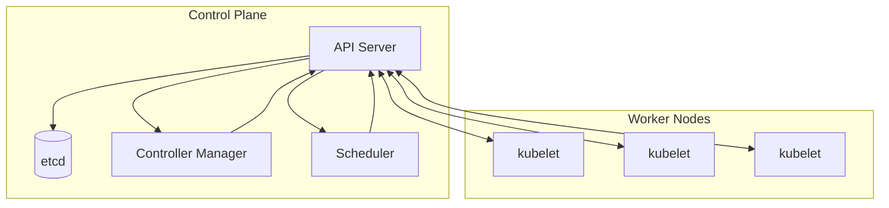
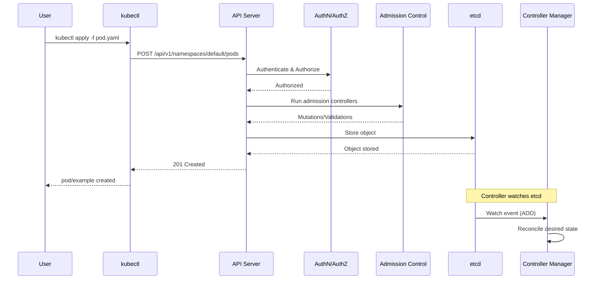
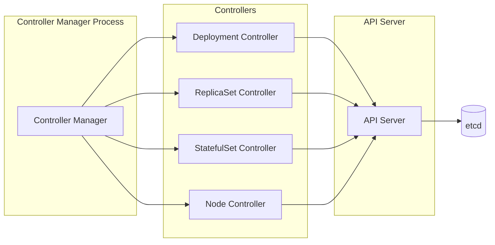

# Lesson 1.1: Kubernetes Control Plane Review

**Navigation:** [Module Overview](../README.md) | [Next Lesson: API Machinery →](02-api-machinery.md)

## Introduction

The Kubernetes control plane is the brain of your cluster. Understanding its components and how they interact is crucial for building operators, as operators extend and interact with these same components.

## Control Plane Components

The Kubernetes control plane consists of several key components that work together to manage your cluster:



### API Server

The API Server is the central hub of the Kubernetes cluster. All communication flows through it.

**Key Responsibilities:**
- Validates and processes all API requests
- Serves as the front-end to etcd
- Implements authentication, authorization, and admission control
- Provides API versioning and resource discovery

### etcd

etcd is the distributed key-value store that holds the entire cluster state.

**Key Characteristics:**
- Single source of truth for cluster state
- Highly available and consistent
- Stores all Kubernetes objects
- Watches and change notifications

### Controller Manager

The Controller Manager runs built-in controllers that implement core Kubernetes functionality.

**Built-in Controllers Include:**
- Deployment Controller
- ReplicaSet Controller
- StatefulSet Controller
- DaemonSet Controller
- Job Controller
- Namespace Controller
- Node Controller

### Scheduler

The Scheduler assigns Pods to nodes based on resource requirements and constraints.

## API Server Request Flow

When you run `kubectl apply`, here's what happens:



## Controller Manager Architecture

The Controller Manager runs multiple controllers, each watching specific resources:



Each controller:
1. Watches specific resource types
2. Compares desired state (from spec) with actual state
3. Takes actions to reconcile differences
4. Updates status

## Hands-on Exercise: Exploring the Control Plane

Let's explore the control plane components in your kind cluster.

### Step 1: View Control Plane Components

```bash
# View all pods in kube-system namespace (control plane)
kubectl get pods -n kube-system

# Get detailed information about the API server
kubectl get pods -n kube-system -l component=kube-apiserver -o yaml

# View controller manager logs
kubectl logs -n kube-system -l component=kube-controller-manager --tail=50
```

### Step 2: Explore API Server

```bash
# Get API server endpoints
kubectl cluster-info

# View API server configuration
kubectl get --raw /version

# Discover available API groups
kubectl api-versions
```

### Step 3: Observe Controller Behavior

```bash
# Create a deployment
kubectl create deployment nginx --image=nginx:latest

# Watch the deployment being created
kubectl get deployment nginx -w

# In another terminal, watch ReplicaSets
kubectl get replicasets -w

# Observe how the controller creates a ReplicaSet
kubectl get replicasets -l app=nginx
```

### Step 4: Trace a Request Flow

```bash
# Enable verbose logging to see API calls
kubectl apply -f - <<EOF
apiVersion: v1
kind: Pod
metadata:
  name: test-pod
spec:
  containers:
  - name: test
    image: nginx:latest
EOF

# Watch events to see the flow
kubectl get events --sort-by='.lastTimestamp'
```

## Key Takeaways

- **API Server** is the central communication hub
- **etcd** stores all cluster state
- **Controller Manager** runs built-in controllers that implement core functionality
- **Scheduler** assigns Pods to nodes
- All components communicate through the API Server
- Controllers watch resources and reconcile desired vs actual state

## Understanding for Operators

When building operators, you'll:
- Interact with the API Server to read/write resources
- Store your custom resources in etcd
- Implement controllers that follow the same pattern as built-in controllers
- Use the same watch mechanisms that built-in controllers use

## Related Lab

- [Lab 1.1: Exploring the Control Plane](../labs/lab-01-control-plane.md) - Hands-on exercises for this lesson

## Next Steps

In the next lesson, we'll dive deeper into the Kubernetes API machinery to understand how resources are structured and how the API works.

**Navigation:** [← Module Overview](../README.md) | [Next: Lesson 1.2 - API Machinery →](02-api-machinery.md)

