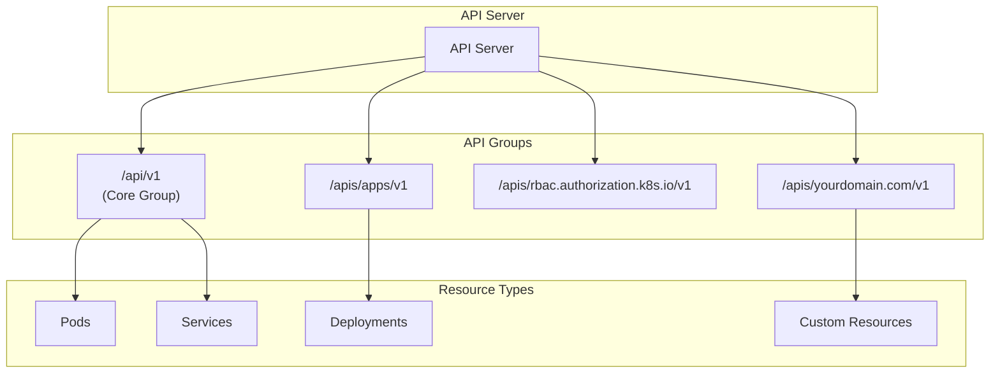
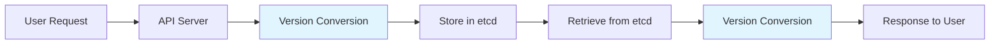
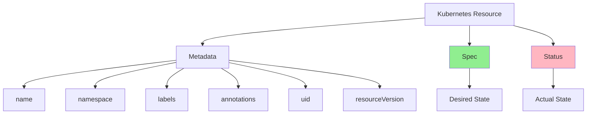
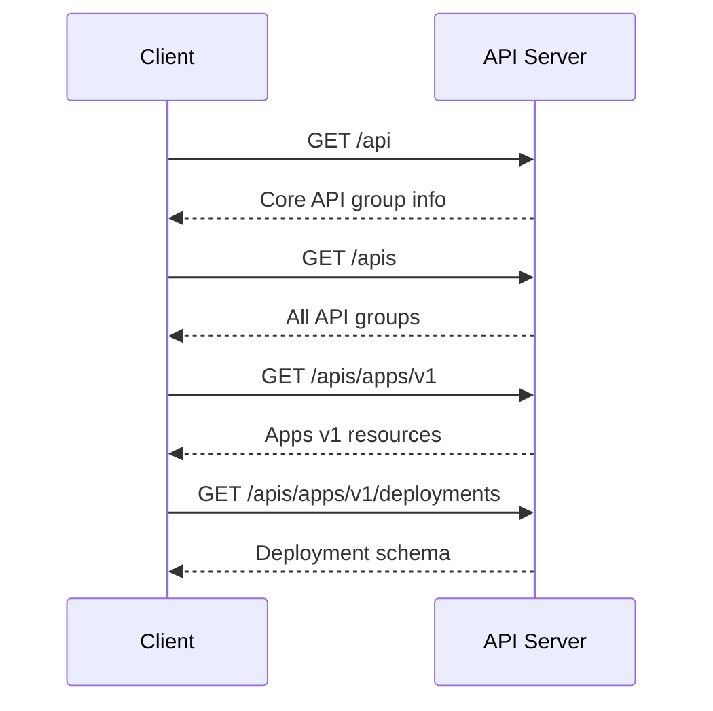
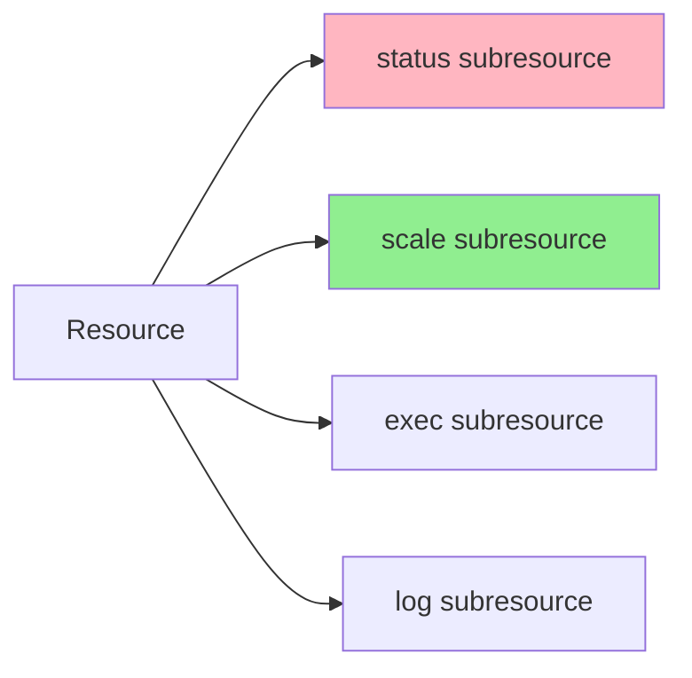
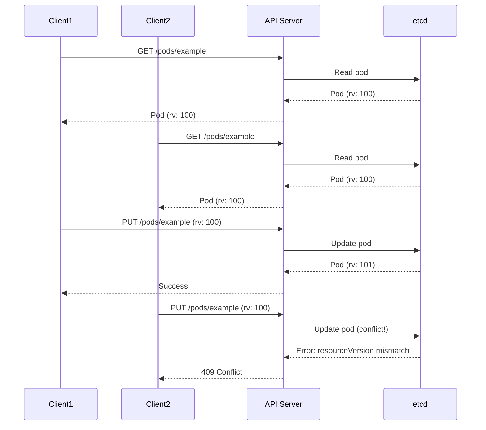

# Lesson 1.2: Kubernetes API Machinery

**Navigation:** [← Previous: Control Plane](01-control-plane.md) | [Module Overview](../README.md) | [Next: Controller Pattern →](03-controller-pattern.md)

## Introduction

The Kubernetes API is RESTful and follows specific conventions. Understanding these conventions is essential for building operators, as you'll be creating and managing resources through this same API.

## Theory: Kubernetes API Design Principles

The Kubernetes API follows RESTful principles but extends them with Kubernetes-specific concepts:

### RESTful Principles
- **Resources** are represented as URLs (e.g., `/api/v1/namespaces/default/pods`)
- **HTTP methods** map to operations (GET, POST, PUT, PATCH, DELETE)
- **Stateless** - each request contains all information needed
- **Uniform interface** - consistent patterns across all resources

### Kubernetes Extensions
- **API Groups** - organize related resources (core, apps, rbac, etc.)
- **API Versions** - support multiple versions of the same resource
- **Subresources** - status, scale, exec (extend resource behavior)
- **Watch** - long-lived connections for change notifications
- **Field Selectors** - filter resources by field values

### Resource Structure
Every Kubernetes resource follows a consistent structure:
- **apiVersion**: API group and version
- **kind**: Resource type
- **metadata**: Identity and labels
- **spec**: Desired state (user-provided)
- **status**: Actual state (system-managed)

Understanding these principles helps you design Custom Resources that feel native to Kubernetes.

## RESTful API Design

Kubernetes uses a RESTful API where resources are represented as URLs:

```
/api/v1/namespaces/{namespace}/pods/{name}
/api/v1/namespaces/{namespace}/services/{name}
/apps/v1/namespaces/{namespace}/deployments/{name}
```

### API Structure



## API Versioning

Kubernetes uses three versioning schemes:

1. **API Version**: The version of the API group (e.g., `v1`, `v1beta1`)
2. **Resource Version**: Internal version for optimistic concurrency
3. **Object Version**: The version stored in etcd



## Resource Types

Kubernetes resources have a consistent structure:



### Spec vs Status

- **Spec**: Describes the desired state (what you want)
- **Status**: Describes the actual state (what exists)

This separation is fundamental to the declarative model and reconciliation pattern.

## API Discovery

Kubernetes provides API discovery endpoints:



## Hands-on Exercise: Working with the Kubernetes API

### Step 1: API Discovery

```bash
# List all API versions
kubectl api-versions

# Get API resources
kubectl api-resources

# Get detailed API resource information
kubectl api-resources -o wide

# Discover a specific API group
kubectl get --raw /apis/apps/v1
```

### Step 2: Direct API Calls

```bash
# Start a proxy to access the API directly
kubectl proxy --port=8001 &

# In another terminal, make direct API calls
curl http://localhost:8001/api/v1/namespaces

# Get pods using the API
curl http://localhost:8001/api/v1/namespaces/default/pods

# Create a pod using the API
cat <<EOF | curl -X POST \
  -H "Content-Type: application/json" \
  -d @- \
  http://localhost:8001/api/v1/namespaces/default/pods
{
  "apiVersion": "v1",
  "kind": "Pod",
  "metadata": {
    "name": "api-pod",
    "namespace": "default"
  },
  "spec": {
    "containers": [{
      "name": "nginx",
      "image": "nginx:latest"
    }]
  }
}
EOF

# Verify the pod was created
kubectl get pod api-pod

# Stop the proxy
pkill -f "kubectl proxy"
```

### Step 3: Understanding Resource Structure

```bash
# Get a pod and examine its structure
kubectl get pod api-pod -o yaml

# Notice the structure:
# - apiVersion
# - kind
# - metadata (name, namespace, labels, etc.)
# - spec (desired state)
# - status (actual state)

# Get only the spec
kubectl get pod api-pod -o jsonpath='{.spec}'

# Get only the status
kubectl get pod api-pod -o jsonpath='{.status}'
```

### Step 4: API Groups and Versions

```bash
# See which API groups are available
kubectl get --raw /apis | jq '.groups[].name'

# Explore a specific API group
kubectl get --raw /apis/apps/v1 | jq '.'

# See what resources are in the apps/v1 group
kubectl get --raw /apis/apps/v1 | jq '.resources[].name'
```

### Step 5: Subresources



Some resources have subresources:

```bash
# create nginx deployment
kubectl create deployment nginx --image=nginx

# Scale a deployment (uses scale subresource)
kubectl scale deployment nginx --replicas=3

# Get status subresource
kubectl get deployment nginx -o jsonpath='{.status}'

# Execute into a pod (uses exec subresource)
kubectl exec -it api-pod -- /bin/sh
```

## Resource Version and Optimistic Concurrency

Every resource has a `resourceVersion` that changes on each update:



This prevents lost updates and ensures consistency.

## Hands-on: Resource Version

```bash
# Get a resource and note its resourceVersion
kubectl get pod api-pod -o jsonpath='{.metadata.resourceVersion}'

# Update the resource
kubectl label pod api-pod test=value

# Check the resourceVersion again (it changed!)
kubectl get pod api-pod -o jsonpath='{.metadata.resourceVersion}'
```

## Key Takeaways

- Kubernetes API is RESTful with consistent URL patterns
- Resources are organized into API groups and versions
- Every resource has: apiVersion, kind, metadata, spec, status
- **Spec** = desired state, **Status** = actual state
- `resourceVersion` enables optimistic concurrency control
- Subresources extend resource functionality (status, scale, exec, etc.)

## Understanding for Operators

When building operators:
- Your CRDs will follow the same API structure
- You'll use the same spec/status pattern
- Resource versions help prevent conflicts
- API discovery helps clients understand your resources
- Subresources (like status) are useful for your custom resources

## Related Lab

- [Lab 1.2: Working with the Kubernetes API](../labs/lab-02-api-machinery.md) - Hands-on exercises for this lesson

## References

### Official Documentation
- [Kubernetes API Overview](https://kubernetes.io/docs/reference/using-api/)
- [API Concepts](https://kubernetes.io/docs/reference/using-api/api-concepts/)
- [API Versioning](https://kubernetes.io/docs/reference/using-api/api-concepts/#versioning)
- [Custom Resources](https://kubernetes.io/docs/concepts/extend-kubernetes/api-extension/custom-resources/)

### Further Reading
- **Kubernetes in Action** by Marko Lukša - Chapter 3: Understanding Kubernetes API
- **Programming Kubernetes** by Michael Hausenblas and Stefan Schimanski - Deep dive into API machinery
- [Kubernetes API Reference](https://kubernetes.io/docs/reference/kubernetes-api/)

### Related Topics
- [Resource Versioning and Concurrency](https://kubernetes.io/docs/reference/using-api/api-concepts/#resource-versions)
- [Field Selectors](https://kubernetes.io/docs/concepts/overview/working-with-objects/field-selectors/)
- [API Discovery](https://kubernetes.io/docs/reference/using-api/api-concepts/#api-discovery)

## Next Steps

In the next lesson, we'll explore the controller pattern - the foundation of how operators work.

**Navigation:** [← Previous: Control Plane](01-control-plane.md) | [Module Overview](../README.md) | [Next: Controller Pattern →](03-controller-pattern.md)

