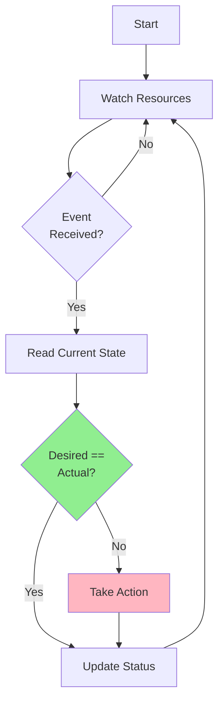
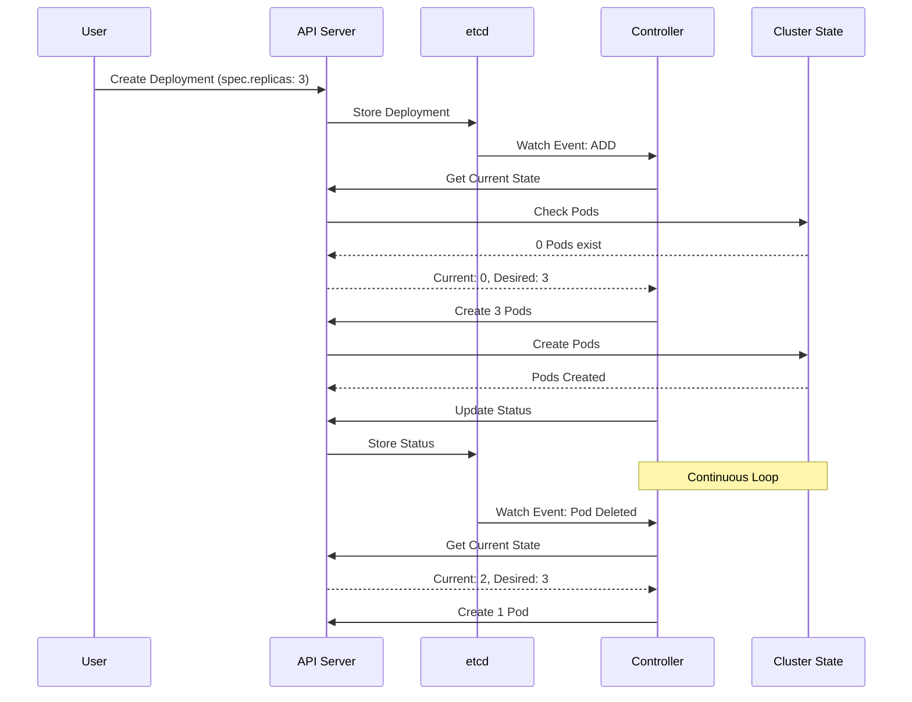
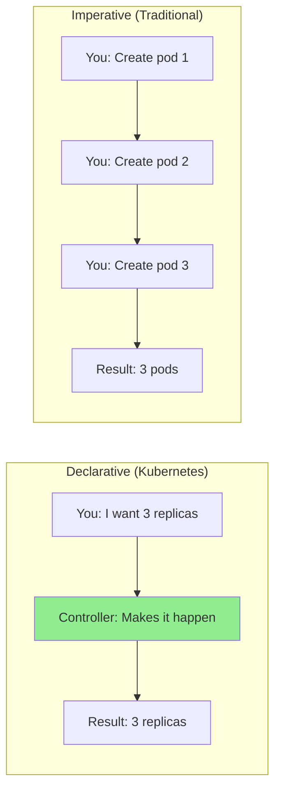
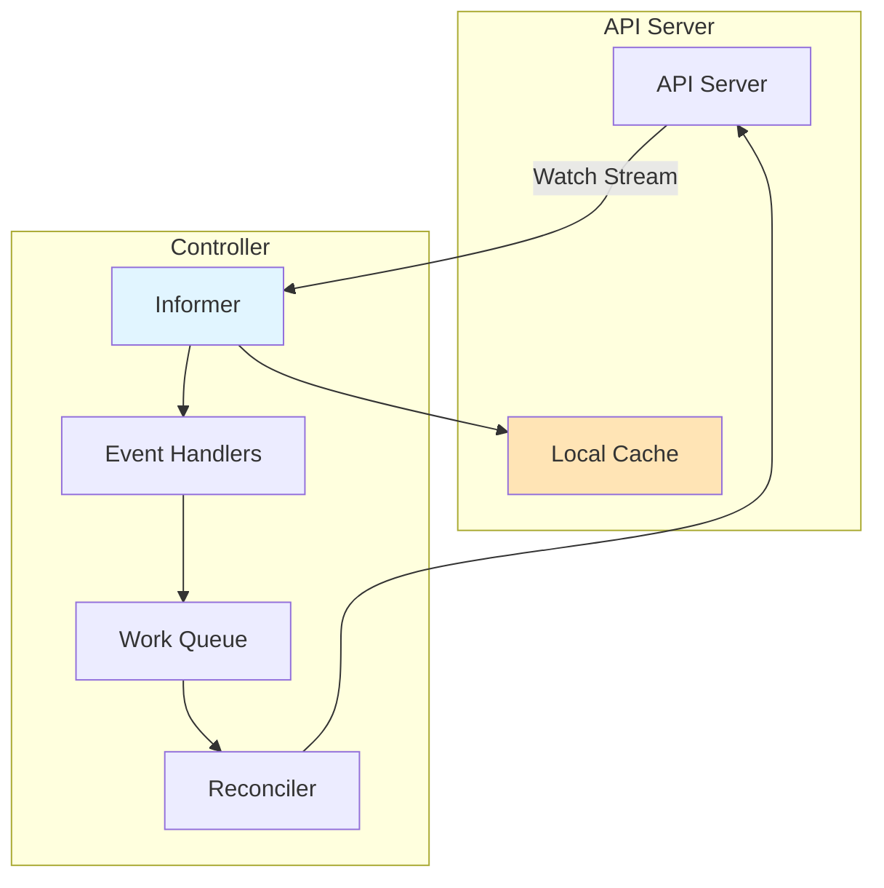
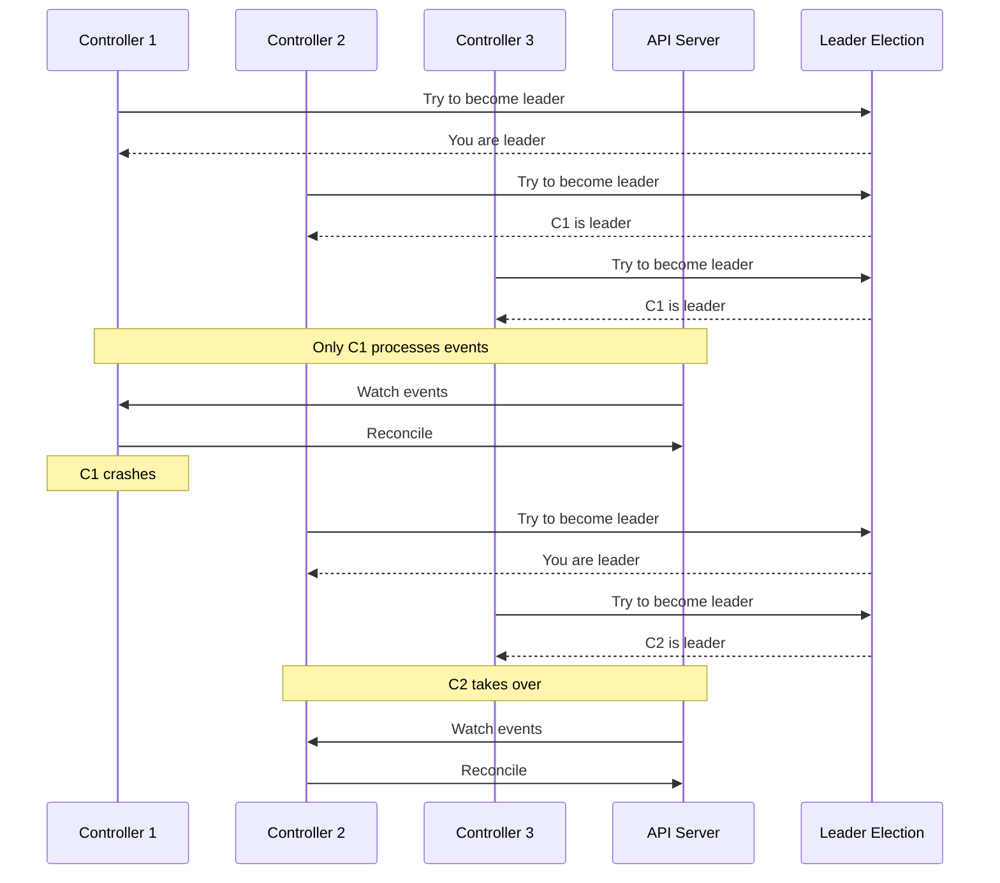
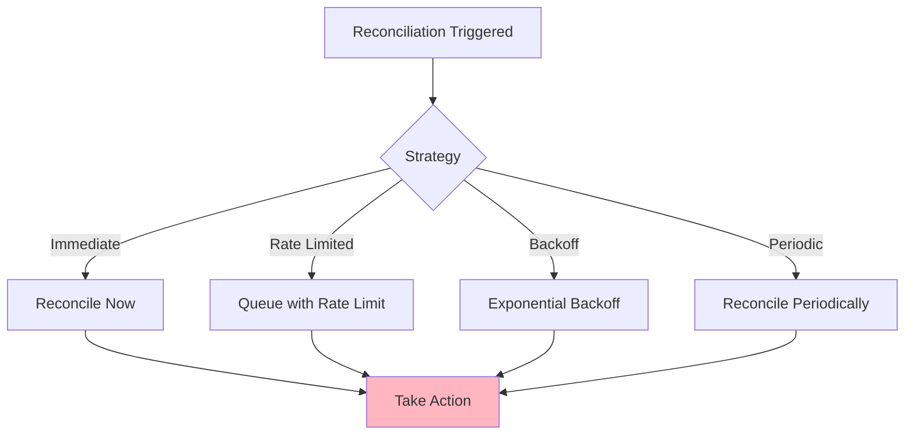
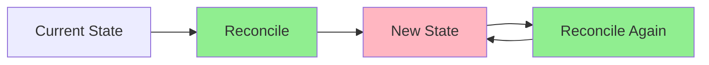

# Lesson 1.3: The Controller Pattern

**Navigation:** [← Previous: API Machinery](02-api-machinery.md) | [Module Overview](../README.md) | [Next: Custom Resources →](04-custom-resources.md)

## Introduction

The controller pattern is the foundation of Kubernetes and operators. Understanding how controllers work is essential for building effective operators. Controllers continuously watch resources and reconcile the desired state with the actual state.

## Theory: The Controller Pattern

The controller pattern is a **reactive programming model** that maintains desired state through continuous reconciliation.

### Core Concepts

**Reconciliation Loop:**
- Controllers continuously compare desired state (spec) with actual state
- When they differ, controllers take corrective action
- This happens in a loop, ensuring eventual consistency

**Declarative Management:**
- Users declare desired state, not how to achieve it
- Controllers figure out the "how"
- This separates concerns: users specify what, controllers handle how

**Idempotency:**
- Controllers must be idempotent (safe to run multiple times)
- Same desired state + same actual state = no action needed
- This enables safe retries and recovery from failures

**Watch Mechanism:**
- Controllers watch resources for changes
- Changes trigger reconciliation
- This is more efficient than polling

### Why This Pattern Works

1. **Resilience**: If a controller crashes, it resumes and reconciles
2. **Scalability**: Controllers handle many resources efficiently
3. **Consistency**: Continuous reconciliation ensures state matches desired
4. **Extensibility**: You can add new controllers for new resources

Understanding this pattern is crucial for building operators, as operators are controllers that manage Custom Resources.

## What is a Controller?

A controller is a control loop that:
1. Watches resources
2. Compares desired state (spec) with actual state
3. Takes actions to make actual match desired
4. Updates status



## Control Loop and Reconciliation

The reconciliation loop is the heart of a controller:



## Declarative vs Imperative

Kubernetes uses a **declarative** model:



**Declarative**: You describe what you want, the system figures out how to achieve it.  
**Imperative**: You specify exactly what actions to take.

## Watch Mechanisms and Informers

Controllers use **watches** to be notified of changes:



### How Watches Work

1. **Initial List**: Controller lists all resources
2. **Watch Stream**: API Server streams change events
3. **Local Cache**: Controller maintains a local cache
4. **Event Handlers**: Process events and queue work
5. **Reconciliation**: Process queued items

## Leader Election

In high-availability setups, multiple controller replicas run, but only one is active:



## Hands-on Exercise: Observing Controllers in Action

### Step 1: Create a Deployment and Observe

```bash
# Create a deployment
kubectl create deployment nginx --image=nginx:latest --replicas=3

# Immediately watch what happens
kubectl get deployment nginx -w

# In another terminal, watch ReplicaSets
kubectl get replicasets -w

# In another terminal, watch Pods
kubectl get pods -w
```

**What you'll observe:**
1. Deployment is created
2. Deployment controller creates a ReplicaSet
3. ReplicaSet controller creates Pods
4. Status updates as resources are created

### Step 2: Observe Reconciliation

```bash
# Delete a pod manually
kubectl delete pod -l app=nginx

# Watch the ReplicaSet controller recreate it
kubectl get pods -w

# The controller noticed the discrepancy and fixed it!
```

### Step 3: Change Desired State

```bash
# Scale the deployment
kubectl scale deployment nginx --replicas=5

# Watch the controller create new pods
kubectl get pods -w

# The controller reconciled: desired (5) vs actual (3) → created 2 more
```

### Step 4: View Controller Logs

```bash
# View controller manager logs to see reconciliation
kubectl logs -n kube-system -l component=kube-controller-manager --tail=100 | grep nginx
```

### Step 5: Understand the Control Loop

```bash
# Get the deployment
kubectl get deployment nginx -o yaml

# Notice:
# - spec.replicas: 5 (desired state)
# - status.replicas: 5 (actual state)
# - status.readyReplicas: 5 (ready pods)

# The controller continuously ensures these match
```

## Reconciliation Strategies

Controllers use different reconciliation strategies:



### Requeue Strategies

When reconciliation needs to happen again:

- **Immediate**: Requeue immediately (for errors)
- **After Duration**: Requeue after a delay (for retries)
- **Never**: Don't requeue (success)

## Idempotency

Controllers must be **idempotent** - running the same reconciliation multiple times should have the same effect:



**Example**: If a Pod already exists, creating it again should be a no-op, not create a duplicate.

## Hands-on: Testing Idempotency

```bash
# Apply the same deployment multiple times
kubectl apply -f - <<EOF
apiVersion: apps/v1
kind: Deployment
metadata:
  name: test-deployment
spec:
  replicas: 2
  selector:
    matchLabels:
      app: test
  template:
    metadata:
      labels:
        app: test
    spec:
      containers:
      - name: nginx
        image: nginx:latest
EOF

# Apply it again (should be idempotent)
kubectl apply -f - <<EOF
apiVersion: apps/v1
kind: Deployment
metadata:
  name: test-deployment
spec:
  replicas: 2
  selector:
    matchLabels:
      app: test
  template:
    metadata:
      labels:
        app: test
    spec:
      containers:
      - name: nginx
        image: nginx:latest
EOF

# Check - should still have 2 replicas, not 4
kubectl get deployment test-deployment
kubectl get pods -l app=test
```

## Key Takeaways

- Controllers implement **control loops** that continuously reconcile state
- **Reconciliation** = making actual state match desired state
- Controllers use **watches/informers** to be notified of changes
- **Declarative model**: describe what you want, not how to do it
- Controllers must be **idempotent**
- **Leader election** ensures only one controller instance is active
- Controllers update **status** to reflect actual state

## Understanding for Operators

When building operators:
- You'll implement the same controller pattern
- Your reconciler will compare spec vs status
- You'll use informers to watch your custom resources
- You'll need to handle idempotency
- You'll implement leader election for HA
- You'll update status to reflect progress

## Related Lab

- [Lab 1.3: Observing Controllers in Action](../labs/lab-03-controller-pattern.md) - Hands-on exercises for this lesson

## References

### Official Documentation
- [Kubernetes Controllers](https://kubernetes.io/docs/concepts/architecture/controller/)
- [Client Libraries](https://kubernetes.io/docs/reference/using-api/client-libraries/)
- [Informer Pattern](https://github.com/kubernetes/client-go/blob/master/examples/workqueue/main.go)

### Further Reading
- **Kubernetes: Up and Running** by Kelsey Hightower, Brendan Burns, and Joe Beda - Chapter 4: Common kubectl Commands (controller concepts)
- **Programming Kubernetes** by Michael Hausenblas and Stefan Schimanski - Chapter 2: The Kubernetes API
- [Kubernetes Controller Pattern](https://kubernetes.io/docs/concepts/architecture/controller/)

### Related Topics
- [Reconciliation in Kubernetes](https://kubernetes.io/docs/concepts/architecture/controller/#reconciliation)
- [Watch Mechanism](https://kubernetes.io/docs/reference/using-api/api-concepts/#efficient-detection-of-changes)
- [Informer and Workqueue Pattern](https://github.com/kubernetes/community/blob/master/contributors/devel/sig-api-machinery/controllers.md)

## Next Steps

In the next lesson, we'll learn about Custom Resources and CRDs - the foundation for building operators.

**Navigation:** [← Previous: API Machinery](02-api-machinery.md) | [Module Overview](../README.md) | [Next: Custom Resources →](04-custom-resources.md)

