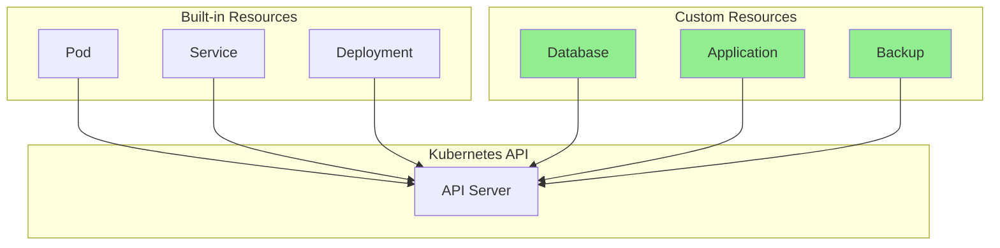
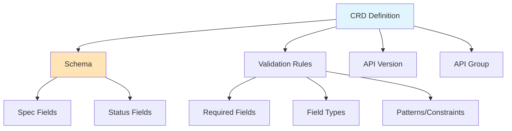
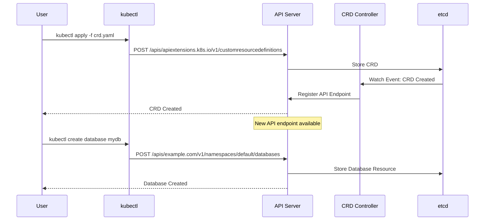
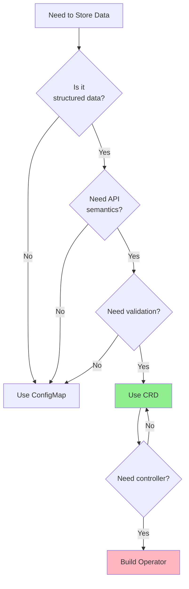
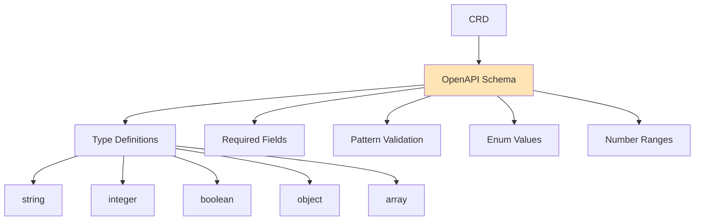
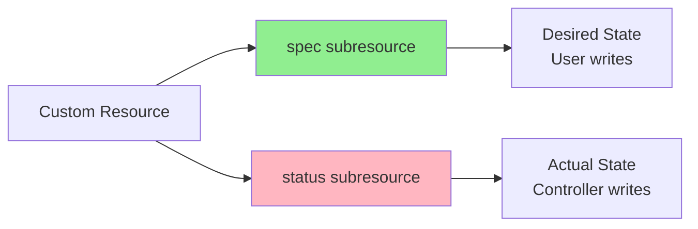
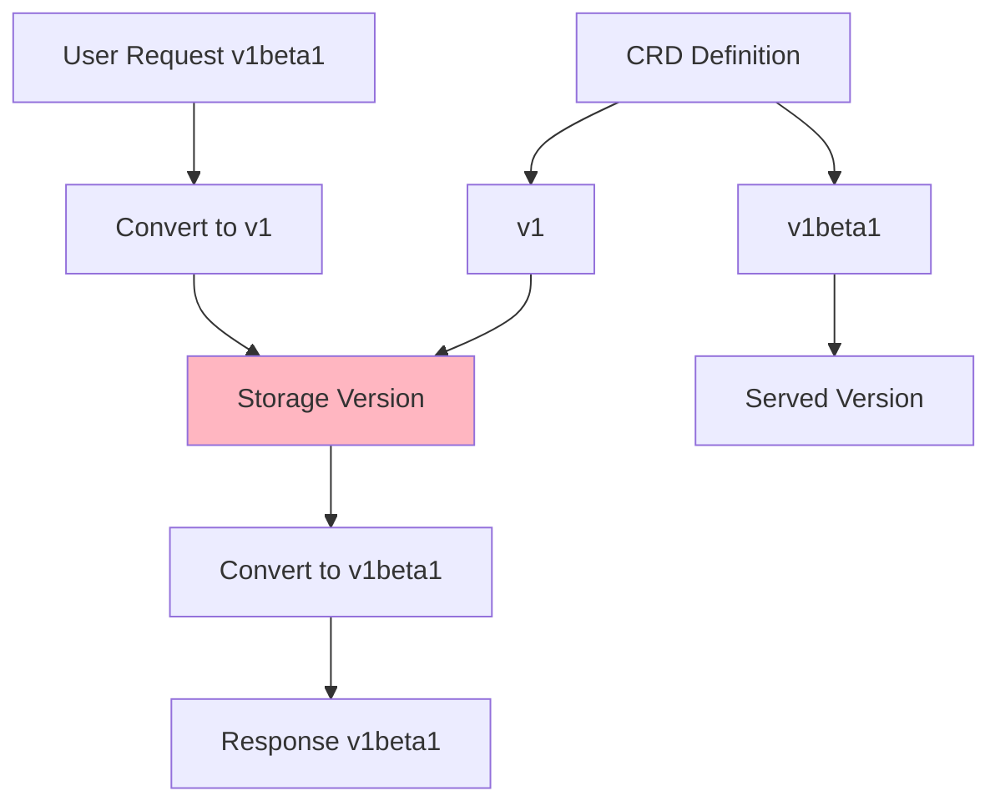

# Lesson 1.4: Custom Resources

## Introduction

Custom Resources extend Kubernetes with domain-specific objects. Custom Resource Definitions (CRDs) define the schema for these resources. Understanding CRDs is essential for building operators, as operators manage Custom Resources.

## What are Custom Resources?

Custom Resources are extensions to the Kubernetes API that store structured data. They follow the same patterns as built-in resources but are defined by you.



## Custom Resource Definitions (CRDs)

A CRD defines:
- The resource name and API group
- The schema (structure) of the resource
- Validation rules
- Subresources (like status)



## CRD Structure

A CRD has a specific structure:

```yaml
apiVersion: apiextensions.k8s.io/v1
kind: CustomResourceDefinition
metadata:
  name: databases.example.com
spec:
  group: example.com
  versions:
  - name: v1
    served: true
    storage: true
    schema:
      openAPIV3Schema:
        type: object
        properties:
          spec:
            type: object
            properties:
              image:
                type: string
              replicas:
                type: integer
          status:
            type: object
  scope: Namespaced
  names:
    plural: databases
    singular: database
    kind: Database
```

## CRD Registration Flow

When you create a CRD, here's what happens:



## When to Use CRDs vs ConfigMaps



**Use ConfigMaps when:**
- Simple key-value data
- No validation needed
- No API semantics required

**Use CRDs when:**
- Structured data with schema
- Validation required
- API semantics needed
- Building an operator

## CRD Schema and Validation

CRDs use OpenAPI v3 schema for validation:



## Status Subresource

CRDs can have a status subresource, separating spec (desired) from status (actual):



Benefits:
- Users can't accidentally modify status
- Status updates don't trigger spec validation
- Clear separation of concerns

## Hands-on Exercise: Creating Your First CRD

### Step 1: Create a Simple CRD

```bash
# Create a CRD for a simple "Website" resource
cat <<EOF | kubectl apply -f -
apiVersion: apiextensions.k8s.io/v1
kind: CustomResourceDefinition
metadata:
  name: websites.example.com
spec:
  group: example.com
  versions:
  - name: v1
    served: true
    storage: true
    schema:
      openAPIV3Schema:
        type: object
        properties:
          spec:
            type: object
            properties:
              url:
                type: string
                pattern: '^https?://'
              replicas:
                type: integer
                minimum: 1
                maximum: 10
            required:
            - url
            - replicas
          status:
            type: object
            properties:
              phase:
                type: string
                enum: [Pending, Running, Failed]
              readyReplicas:
                type: integer
  scope: Namespaced
  names:
    plural: websites
    singular: website
    kind: Website
    shortNames:
    - ws
EOF

# Verify the CRD was created
kubectl get crd websites.example.com

# Check the API endpoint is available
kubectl api-resources | grep websites
```

### Step 2: Create a Custom Resource

```bash
# Create a Website resource
cat <<EOF | kubectl apply -f -
apiVersion: example.com/v1
kind: Website
metadata:
  name: my-website
spec:
  url: https://example.com
  replicas: 3
EOF

# Verify it was created
kubectl get websites
kubectl get website my-website
kubectl get ws my-website  # Using short name

# View the full resource
kubectl get website my-website -o yaml
```

### Step 3: Test Validation

```bash
# Try to create an invalid resource (missing required field)
cat <<EOF | kubectl apply -f -
apiVersion: example.com/v1
kind: Website
metadata:
  name: invalid-website
spec:
  url: https://example.com
  # Missing replicas field
EOF

# You should see a validation error

# Try invalid URL pattern
cat <<EOF | kubectl apply -f -
apiVersion: example.com/v1
kind: Website
metadata:
  name: invalid-url
spec:
  url: not-a-url
  replicas: 2
EOF

# You should see a validation error about the URL pattern

# Try invalid replica count
cat <<EOF | kubectl apply -f -
apiVersion: example.com/v1
kind: Website
metadata:
  name: invalid-replicas
spec:
  url: https://example.com
  replicas: 20  # Exceeds maximum
EOF

# You should see a validation error
```

### Step 4: Update Status

```bash
# Update the status (if status subresource is enabled)
# Note: This requires a controller, but we can see the structure
kubectl get website my-website -o yaml

# The status field exists but is empty
# In a real operator, the controller would update this
```

### Step 5: Explore CRD Details

```bash
# Get detailed CRD information
kubectl get crd websites.example.com -o yaml

# See the schema
kubectl get crd websites.example.com -o jsonpath='{.spec.versions[0].schema}'

# Check API discovery
kubectl get --raw /apis/example.com/v1
```

### Step 6: Clean Up

```bash
# Delete the custom resources
kubectl delete website my-website

# Delete the CRD (this will also delete all resources of this type)
kubectl delete crd websites.example.com
```

## CRD Versioning

CRDs support multiple versions with conversion:



## Key Takeaways

- **Custom Resources** extend Kubernetes with domain-specific objects
- **CRDs** define the schema and validation for Custom Resources
- CRDs use **OpenAPI v3 schema** for validation
- **Status subresource** separates desired (spec) from actual (status) state
- CRDs provide **API semantics** (GET, POST, PUT, DELETE, WATCH)
- Use CRDs when you need structured data with validation
- CRDs are the foundation for building operators

## Understanding for Operators

When building operators:
- You'll create CRDs for your domain objects
- Your operator will watch and reconcile Custom Resources
- You'll use spec for desired state, status for actual state
- Validation in CRD schema prevents invalid resources
- CRDs enable declarative management of your applications

## Next Steps

Congratulations! You've completed Module 1. You now understand:
- Kubernetes control plane architecture
- API machinery and resource structure
- The controller pattern and reconciliation
- Custom Resources and CRDs

In Module 2, you'll build your first operator using Kubebuilder!

