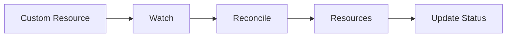
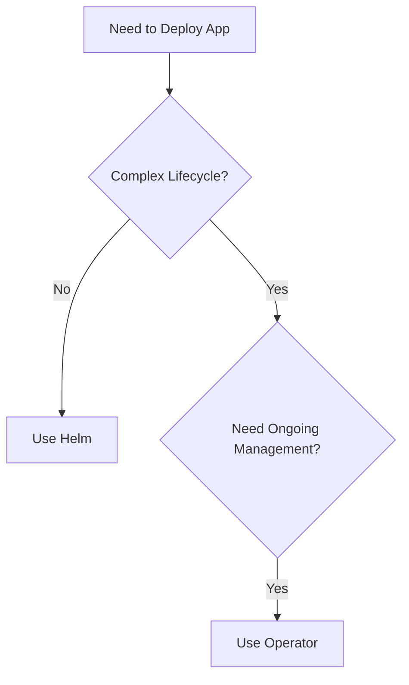

# Lab 2.1: Exploring Existing Operators

**Related Lesson:** [Lesson 2.1: The Operator Pattern](../lessons/01-operator-pattern.md)  
**Navigation:** [Module Overview](../README.md) | [Next Lab: Kubebuilder Fundamentals →](lab-02-kubebuilder-fundamentals.md)

## Objectives

- Explore existing operators in the Kubernetes ecosystem
- Understand operator structure and behavior
- Compare operator vs Helm deployments
- Identify use cases for operators

## Prerequisites

- Kind cluster running
- kubectl configured
- Understanding of CRDs from [Module 1](../module-01/README.md)

## Exercise 1: Explore OperatorHub

### Task 1.1: Browse OperatorHub

1. Visit [OperatorHub.io](https://operatorhub.io/)
2. Browse available operators
3. Look for operators you recognize (Prometheus, PostgreSQL, etc.)

**Questions to Answer:**
1. What categories of operators exist?
2. What are some popular operators?
3. What problems do they solve?

### Task 1.2: Examine Operator Structure

Pick an operator (e.g., Prometheus Operator) and examine:

```bash
# Search for operator documentation
# Look at:
# - CRD definitions
# - Operator capabilities
# - Use cases
```

## Exercise 2: Install and Explore an Operator

### Task 2.1: Install Prometheus Operator (Optional)

If you want to explore a real operator:

```bash
# Install using Helm (for exploration)
helm repo add prometheus-community https://prometheus-community.github.io/helm-charts
helm repo update

# Install Prometheus Operator
helm install prometheus prometheus-community/kube-prometheus-stack
```

**Note:** This is just for exploration. We'll build our own operators in this course.

### Task 2.2: Examine Operator Resources

```bash
# List CRDs created by operator
kubectl get crds | grep prometheus

# Examine a CRD
kubectl get crd prometheuses.monitoring.coreos.com -o yaml | head -50

# See operator deployment
kubectl get deployments -n default | grep prometheus
```

## Exercise 3: Compare Operator vs Helm

### Task 3.1: Understand the Difference

**Helm Deployment:**
```bash
# Helm installs once
helm install my-app ./chart
# No ongoing management
```

**Operator Deployment:**
```bash
# Operator continuously manages
kubectl apply -f custom-resource.yaml
# Operator reconciles continuously
```

### Task 3.2: Identify Use Cases

For each scenario, decide: Operator or Helm?

1. **Simple web application deployment**
   - Answer: Helm (one-time setup)

2. **PostgreSQL database with backups**
   - Answer: Operator (complex lifecycle)

3. **Redis cache cluster**
   - Answer: Operator (stateful, needs management)

4. **Static website**
   - Answer: Helm (simple deployment)

## Exercise 4: Analyze Operator Patterns

### Task 4.1: Operator Components

Based on what you learned in [Module 1](../module-01/README.md), operators have:

1. **CRD** - Custom Resource Definition
2. **Controller** - Reconciliation logic
3. **RBAC** - Permissions

```bash
# If you installed an operator, examine these:
kubectl get crds
kubectl get deployments
kubectl get clusterroles | grep <operator-name>
```

### Task 4.2: Reconciliation Pattern

Operators follow the same pattern you learned:



This is the same pattern from [Lesson 1.3](../../module-01/lessons/03-controller-pattern.md)!

## Exercise 5: Operator Capability Levels

### Task 5.1: Identify Capability Levels

For each operator you explored, identify its capability level:

- **Level 1**: Basic Install
- **Level 2**: Seamless Upgrades
- **Level 3**: Full Lifecycle
- **Level 4**: Deep Insights
- **Level 5**: Auto Pilot

### Task 5.2: Document Findings

Create a simple comparison:

| Operator | Capability Level | Key Features |
|----------|-----------------|--------------|
| Example  | Level 3         | Backup, Restore |

## Exercise 6: When to Build an Operator

### Task 6.1: Decision Tree

Use the decision tree from the lesson:



### Task 6.2: Your Use Cases

Think of applications you manage. Which would benefit from operators?

**Examples:**
- Database with automated backups → Operator
- Simple API service → Helm
- Message queue cluster → Operator

## Cleanup

If you installed operators for exploration:

```bash
# Remove Helm releases
helm list
helm uninstall <release-name>

# Remove CRDs
kubectl delete crd --all
```

## Lab Summary

In this lab, you:
- Explored existing operators in the ecosystem
- Understood operator structure and components
- Compared operators vs Helm charts
- Identified when to use operators
- Analyzed operator capability levels

## Key Learnings

1. Operators are controllers that manage Custom Resources
2. Operators encode domain knowledge for application management
3. Use operators for complex, stateful applications
4. Operators follow the same reconciliation pattern as built-in controllers
5. Operators provide continuous management vs one-time deployment

## Next Steps

Now that you understand what operators are, let's learn about Kubebuilder - the tool we'll use to build them!

**Navigation:** [← Module Overview](../README.md) | [Related Lesson](../lessons/01-operator-pattern.md) | [Next Lab: Kubebuilder Fundamentals →](lab-02-kubebuilder-fundamentals.md)
