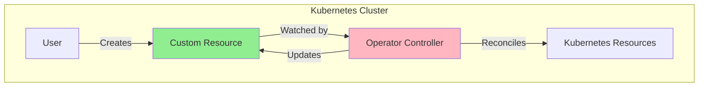
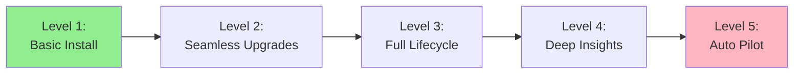
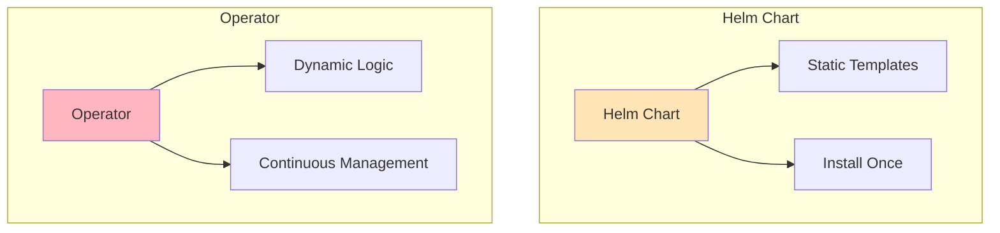
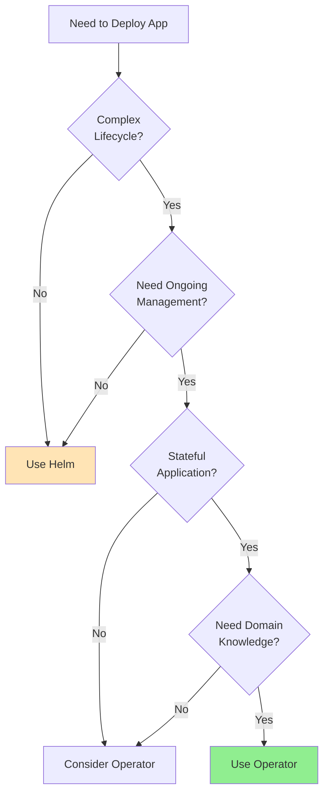
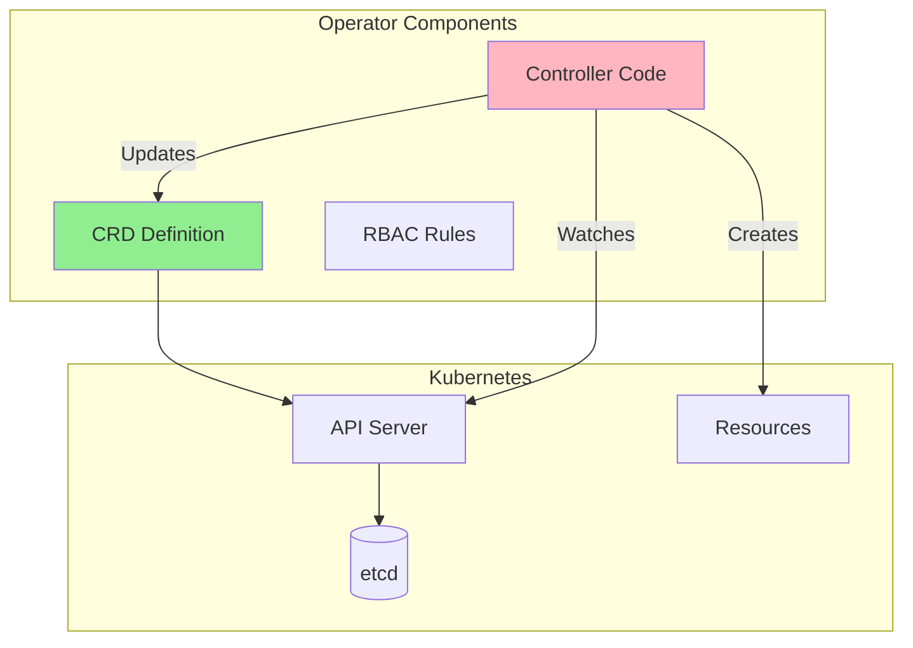
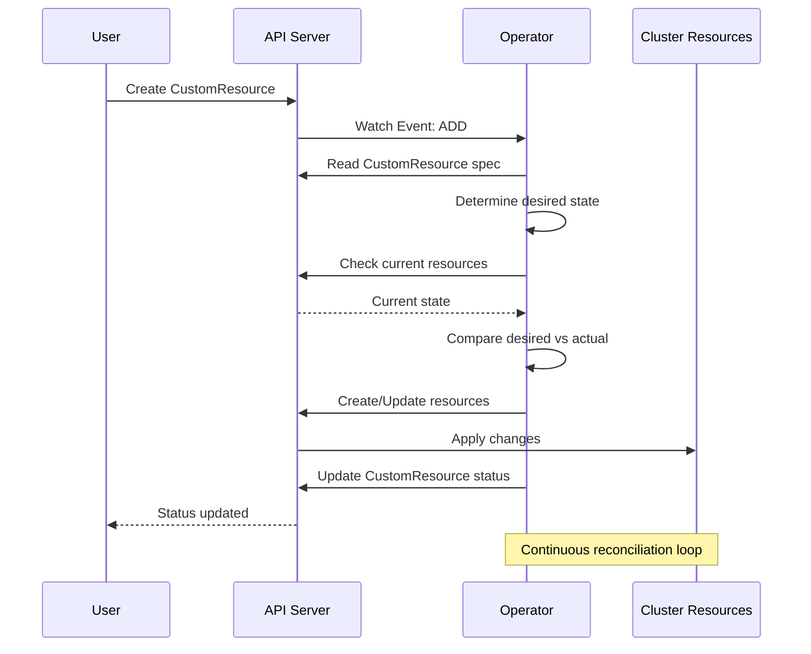

# Lesson 2.1: The Operator Pattern

**Navigation:** [Module Overview](../README.md) | [Next Lesson: Kubebuilder Fundamentals →](02-kubebuilder-fundamentals.md)

## Introduction

In [Module 1](../module-01/README.md), you learned about Kubernetes controllers, Custom Resources, and the reconciliation pattern. Operators are controllers that manage Custom Resources using domain-specific knowledge. This lesson explains what operators are, when to use them, and how they differ from other Kubernetes tools.

## What is an Operator?

An operator is a Kubernetes controller that:
- Manages Custom Resources (CRDs) you define
- Encodes operational knowledge (how to deploy, scale, backup, etc.)
- Automates complex application management tasks
- Extends Kubernetes with domain-specific behavior

## Operator Philosophy

Operators follow the same pattern you learned in [Lesson 1.3](../module-01/lessons/03-controller-pattern.md):

1. **Watch** Custom Resources
2. **Compare** desired state (spec) vs actual state
3. **Reconcile** by creating/updating Kubernetes resources
4. **Update** status to reflect actual state

The difference: operators encode **domain knowledge** about how to manage specific applications.

## Operator Capability Levels

Operators can have different levels of sophistication:

### Level 1: Basic Install
- Deploys application
- Basic configuration

### Level 2: Seamless Upgrades
- Handles version upgrades
- Rolling updates

### Level 3: Full Lifecycle
- Backup and restore
- Disaster recovery

### Level 4: Deep Insights
- Metrics and monitoring
- Performance tuning

### Level 5: Auto Pilot
- Self-healing
- Automatic optimization

## Operators vs Other Tools

### Operators vs Helm Charts

**Helm Charts:**
- Template-based deployment
- Install and forget
- No ongoing management
- Good for: Simple applications, one-time setup

**Operators:**
- Code-based logic
- Continuous reconciliation
- Ongoing management
- Good for: Complex applications, stateful services, databases

### When to Use Operators

**Use Operators When:**
- Application has complex lifecycle (backup, restore, scaling)
- Need continuous management and monitoring
- Stateful applications (databases, message queues)
- Domain-specific knowledge required
- Want declarative management of operational tasks

**Use Helm When:**
- Simple application deployment
- One-time setup sufficient
- No ongoing operational complexity

## Real-World Operator Examples

### Prometheus Operator

Manages Prometheus monitoring stack:
- Deploys Prometheus servers
- Configures service discovery
- Manages alerting rules
- Handles storage

### PostgreSQL Operator

Manages PostgreSQL databases:
- Creates database clusters
- Handles backups
- Manages replication
- Performs upgrades

### Elasticsearch Operator

Manages Elasticsearch clusters:
- Deploys cluster nodes
- Manages sharding
- Handles scaling
- Manages indices

## Operator Architecture

An operator consists of:

1. **CRD**: Defines your Custom Resource (from [Lesson 1.4](../module-01/lessons/04-custom-resources.md))
2. **Controller**: Reconciliation logic (from [Lesson 1.3](../module-01/lessons/03-controller-pattern.md))
3. **RBAC**: Permissions for the operator

## Operator Workflow

Here's how an operator works:

This is the same reconciliation pattern from [Lesson 1.3](../module-01/lessons/03-controller-pattern.md), but applied to your Custom Resources!

## Key Takeaways

- **Operators** are controllers that manage Custom Resources
- Operators encode **domain knowledge** about application management
- Follow the same **reconciliation pattern** as built-in controllers
- Use operators for **complex, stateful applications** that need ongoing management
- Operators provide **declarative management** of operational tasks

## Understanding for Building Operators

When building operators:
- You'll create CRDs (like in [Lesson 1.4](../module-01/lessons/04-custom-resources.md))
- You'll implement controllers (using the pattern from [Lesson 1.3](../module-01/lessons/03-controller-pattern.md))
- You'll encode operational knowledge in code
- You'll reconcile desired vs actual state continuously

## Related Lab

- [Lab 2.1: Exploring Existing Operators](../labs/lab-01-operator-pattern.md) - Hands-on exercises for this lesson

## Next Steps

Now that you understand what operators are, let's learn about Kubebuilder - the framework that makes building operators easier.

**Navigation:** [← Module Overview](../README.md) | [Next: Kubebuilder Fundamentals →](02-kubebuilder-fundamentals.md)

