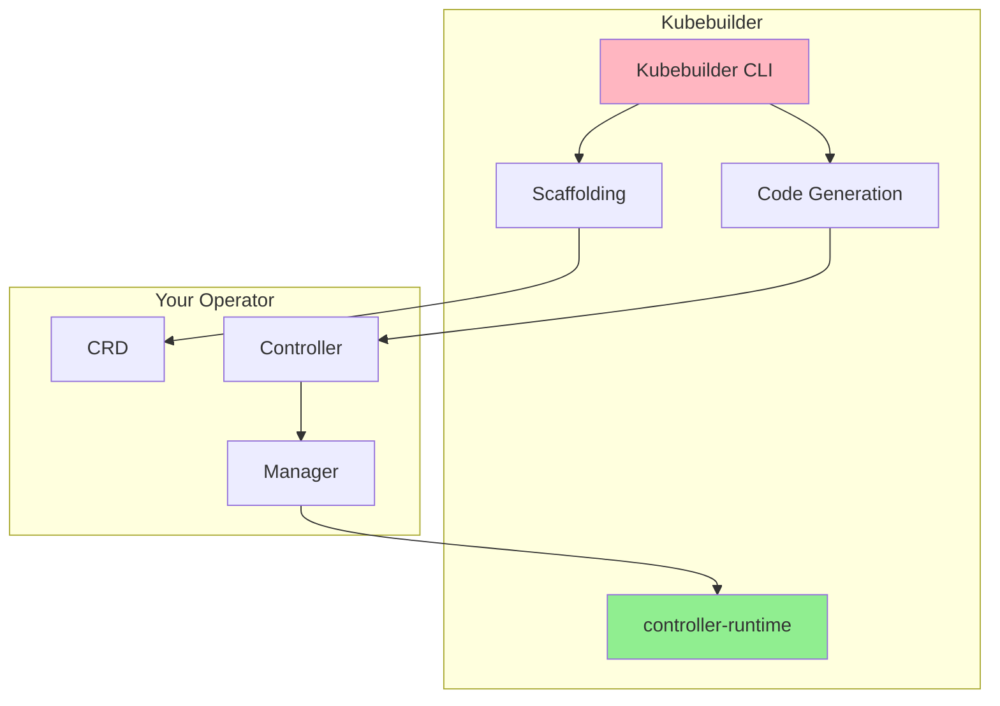
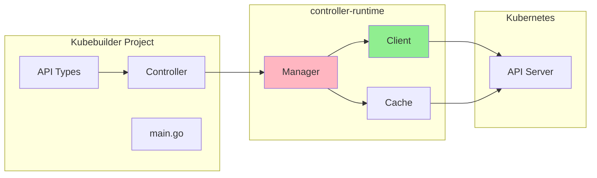
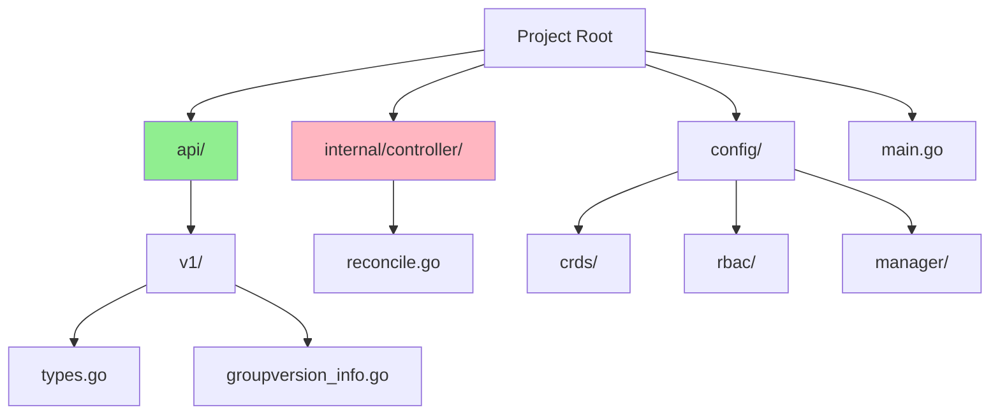
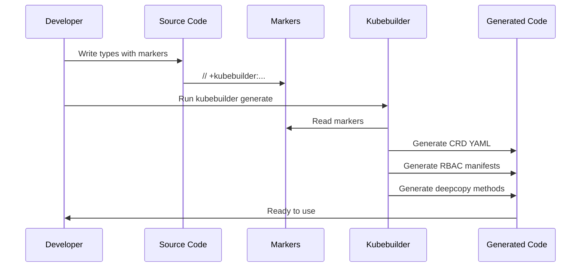
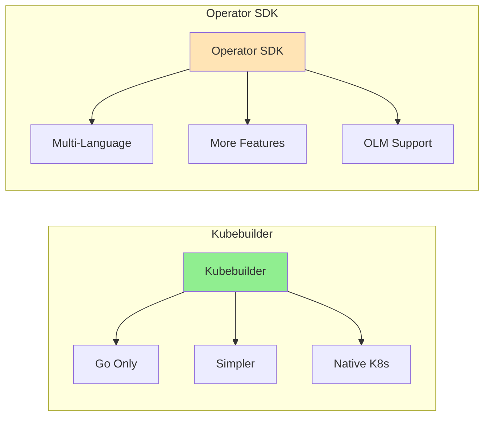

# Lesson 2.2: Kubebuilder Fundamentals

**Navigation:** [← Previous: Operator Pattern](01-operator-pattern.md) | [Module Overview](../README.md) | [Next: Dev Environment →](03-dev-environment.md)

## Introduction

Kubebuilder is a framework for building Kubernetes operators using the controller-runtime library. It provides scaffolding, code generation, and best practices to make operator development easier. In this lesson, you'll learn how Kubebuilder works and its architecture.

## Theory: Kubebuilder Framework

Kubebuilder is a SDK and framework that simplifies operator development by providing code generation, project scaffolding, and best practices.

### Core Concepts

**Code Generation:**
- Generates boilerplate code (CRDs, controllers, RBAC)
- Reduces manual coding and errors
- Ensures consistency with Kubernetes patterns

**Project Structure:**
- Standardized layout for operator projects
- Separates API definitions from controller logic
- Makes projects maintainable and scalable

**Controller-Runtime Integration:**
- Built on controller-runtime (same library Kubernetes uses)
- Provides Manager, Reconciler, Client abstractions
- Handles caching, watching, and leader election

**Why Kubebuilder:**
- **Productivity**: Generates boilerplate, focuses on business logic
- **Best Practices**: Enforces Kubernetes patterns
- **Community**: Widely used, well-documented
- **Tooling**: Rich CLI for common tasks

Understanding Kubebuilder helps you build operators efficiently and correctly.

## What is Kubebuilder?

Kubebuilder is:
- A **SDK** for building operators in Go
- A **scaffolding tool** that generates project structure
- A **code generator** for CRDs and controllers
- Built on **controller-runtime** (the library used by Kubernetes itself)

## Kubebuilder Architecture

Kubebuilder uses controller-runtime, the same library that powers Kubernetes controllers:

## Kubebuilder Project Structure

When you scaffold a project, Kubebuilder creates this structure:

### Key Directories

- **`api/`**: Your API definitions (CRD types)
- **`internal/controller/`**: Your controller logic
- **`config/`**: Kubernetes manifests (CRDs, RBAC, etc.)
- **`main.go`**: Entry point that sets up the manager

## Code Generation Flow

Kubebuilder uses markers (comments) to generate code:

### Common Markers

- `// +kubebuilder:object:root=true` - Marks root type
- `// +kubebuilder:subresource:status` - Enables status subresource
- `// +kubebuilder:resource:path=...` - Defines resource path
- `// +kubebuilder:validation:...` - Adds validation rules

## Kubebuilder CLI Commands

Kubebuilder provides several commands:

### `kubebuilder init`

Initializes a new project:
- Creates project structure
- Sets up Go modules
- Configures Makefile
- Sets up controller-runtime

### `kubebuilder create api`

Creates a new API (CRD):
- Generates API types
- Creates controller skeleton
- Generates CRD manifests
- Sets up RBAC

### `kubebuilder create webhook`

Creates webhooks:
- Validating webhooks
- Mutating webhooks
- Certificate management

### `make generate`

Generates code:
- CRD manifests
- Deep copy methods
- Client code

### `make manifests`

Generates manifests:
- CRD YAML files
- RBAC manifests
- Webhook configurations

## Kubebuilder vs Operator SDK

**Kubebuilder:**
- Go-only
- Simpler, more focused
- Native Kubernetes patterns
- Used by Kubernetes project itself
- Better for learning

**Operator SDK:**
- Multiple languages (Go, Ansible, Helm)
- More features (OLM, scorecard)
- Larger ecosystem
- More complex

**For this course:** We use Kubebuilder because it's simpler, follows Kubernetes patterns closely, and is excellent for learning.

## Understanding Generated Code

When Kubebuilder generates code, it creates:

1. **API Types** (`api/v1/`):
   - Your Custom Resource Go structs
   - Spec and Status definitions
   - Deep copy methods

2. **Controller** (`internal/controller/`):
   - Reconciler struct
   - Reconcile function skeleton
   - Setup with manager

3. **Manifests** (`config/`):
   - CRD YAML files
   - RBAC rules
   - Manager deployment

## Key Takeaways

- **Kubebuilder** is a framework for building operators in Go
- Uses **controller-runtime** (same as Kubernetes)
- Provides **scaffolding** and **code generation**
- Project structure is **standardized** and **organized**
- Uses **markers** (comments) to generate code
- Simpler than Operator SDK, better for learning

## Understanding for Building Operators

When using Kubebuilder:
- You'll define API types with markers
- Kubebuilder generates CRDs automatically
- You'll implement the Reconcile function
- Kubebuilder handles the boilerplate
- You focus on business logic

## Related Lab

- [Lab 2.2: Kubebuilder CLI and Project Structure](../labs/lab-02-kubebuilder-fundamentals.md) - Hands-on exercises for this lesson

## References

### Official Documentation
- [Kubebuilder Documentation](https://book.kubebuilder.io/)
- [Kubebuilder Quick Start](https://book.kubebuilder.io/quick-start.html)
- [Controller Runtime](https://pkg.go.dev/sigs.k8s.io/controller-runtime)

### Further Reading
- **Kubebuilder Book** - Official comprehensive guide
- **Programming Kubernetes** by Michael Hausenblas and Stefan Schimanski - Chapter 4: Working with Client Libraries
- [Kubebuilder GitHub](https://github.com/kubernetes-sigs/kubebuilder) - Source code and examples

### Related Topics
- [Kubebuilder vs Operator SDK](https://book.kubebuilder.io/faq.html#kubebuilder-vs-operator-sdk)
- [Project Layout](https://book.kubebuilder.io/migration/manually_migration_guide_v1_to_v2.html#project-layout)
- [Code Generation](https://book.kubebuilder.io/reference/generating-crd.html)

## Next Steps

Now that you understand Kubebuilder, let's set up your development environment and create your first operator!

**Navigation:** [← Previous: Operator Pattern](01-operator-pattern.md) | [Module Overview](../README.md) | [Next: Dev Environment →](03-dev-environment.md)
