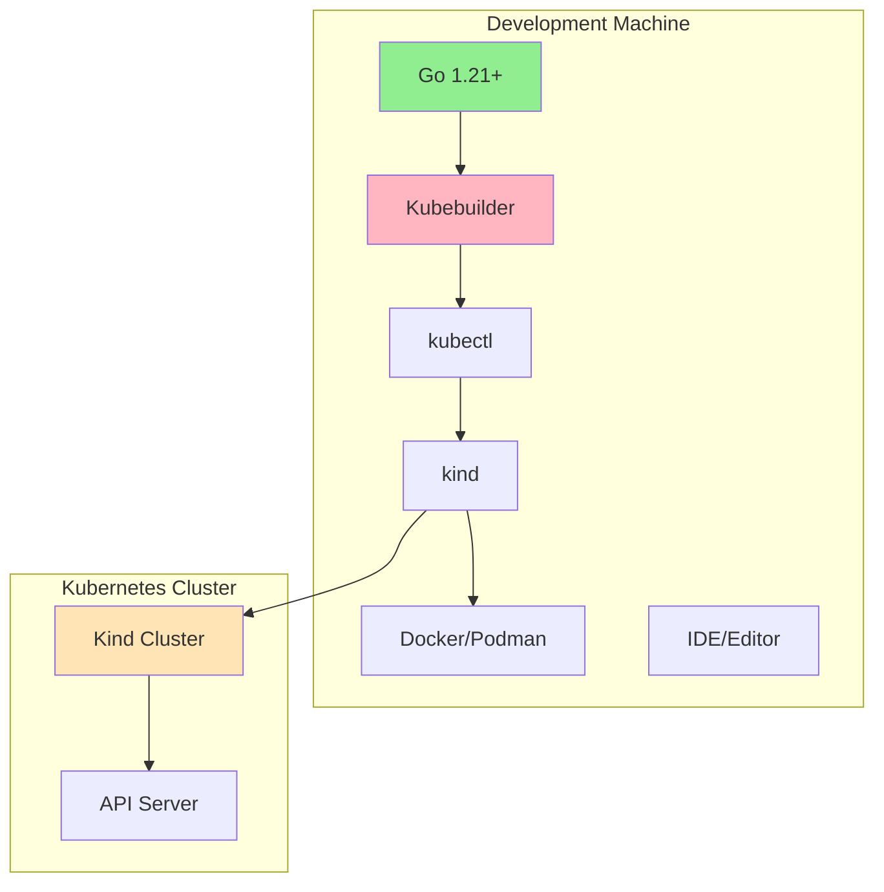
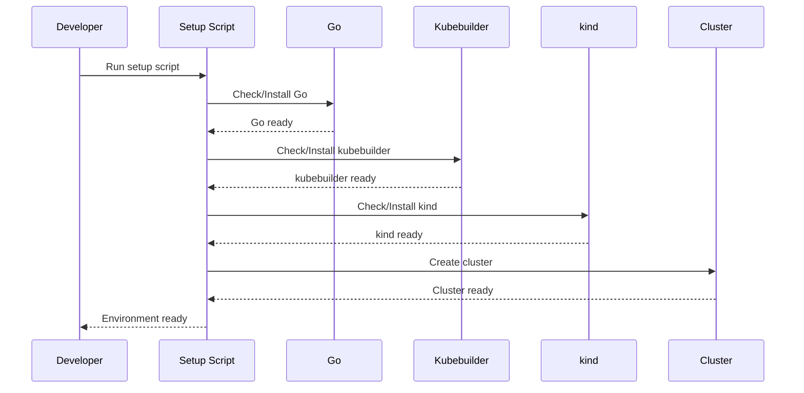
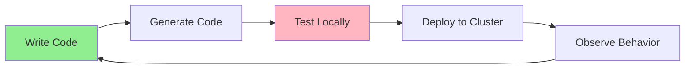
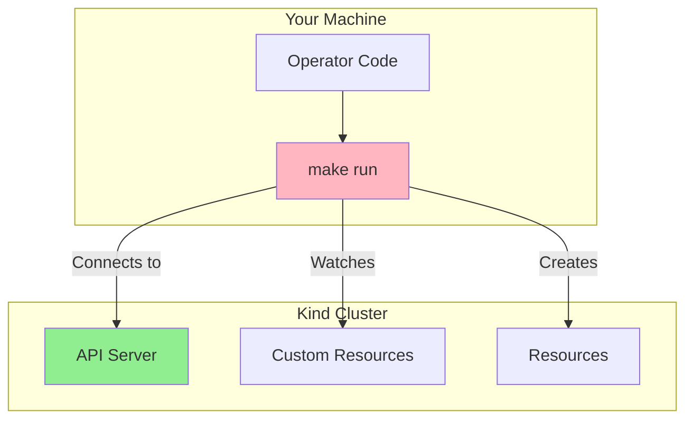

# Lesson 2.3: Development Environment Setup

**Navigation:** [← Previous: Kubebuilder Fundamentals](02-kubebuilder-fundamentals.md) | [Module Overview](../README.md) | [Next: First Operator →](04-first-operator.md)

## Introduction

Before building your first operator, you need a complete development environment. This lesson covers setting up everything you need: Go, kubebuilder, kind cluster, and your IDE. We'll verify everything works together.

## Development Environment Components

Your operator development environment consists of:



## Setup Process

The setup follows this flow:



## Required Tools

### 1. Go 1.21+

Go is the programming language for kubebuilder operators.

**Installation:**
- Download from [golang.org](https://go.dev/dl/)
- Or use package manager: `brew install go` (macOS)

**Verification:**
```bash
go version
# Should show: go version go1.21.x or higher
```

### 2. Kubebuilder

Kubebuilder CLI for scaffolding and code generation.

**Installation:**
```bash
# macOS/Linux
curl -L -o kubebuilder https://go.kubebuilder.io/dl/latest/$(go env GOOS)/$(go env GOARCH)
chmod +x kubebuilder
sudo mv kubebuilder /usr/local/bin/
```

**Verification:**
```bash
kubebuilder version
```

### 3. kubectl

Kubernetes command-line tool.

**Installation:**
- Already covered in Module 1 setup
- Verify: `kubectl version --client`

### 4. kind

Kubernetes in Docker for local clusters.

**Installation:**
```bash
go install sigs.k8s.io/kind@latest
```

**Verification:**
```bash
kind version
```

### 5. Docker or Podman

Container runtime for kind.

**Installation:**
- Docker: [docker.com](https://www.docker.com/)
- Podman: [podman.io](https://podman.io/)

**Verification:**
```bash
docker --version
# or
podman --version
```

## Using the Setup Script

We provide a setup script that checks and installs everything:

```bash
# Run the setup script
./scripts/setup-dev-environment.sh
```

The script:
1. Checks each tool
2. Installs missing tools
3. Verifies installations
4. Reports status

## Kind Cluster Setup

After setting up tools, create a kind cluster:

```bash
# Use the provided script
./scripts/setup-kind-cluster.sh
```

Or manually:
```bash
kind create cluster --name k8s-operators-course
kubectl cluster-info --context kind-k8s-operators-course
```

## Development Workflow

Here's how you'll develop operators:



1. **Write Code**: Define API types, implement controller
2. **Generate Code**: Run `make generate` and `make manifests`
3. **Test Locally**: Run operator with `make run`
4. **Deploy to Cluster**: Apply CRDs, create Custom Resources
5. **Observe**: Watch logs, check resources, verify behavior

## Local Development Setup

For local development, you'll run the operator on your machine:



The operator runs locally but connects to your kind cluster.

## IDE Setup

### VS Code

Recommended extensions:
- Go extension
- Kubernetes extension
- YAML extension

### GoLand

Built-in support for:
- Go development
- Kubernetes resources
- Debugging

## Environment Verification Checklist

Before starting Module 2, verify:

- [ ] Go 1.21+ installed and working
- [ ] kubebuilder installed and in PATH
- [ ] kubectl configured and working
- [ ] kind installed
- [ ] Docker/Podman running
- [ ] Kind cluster created and accessible
- [ ] kubectl context points to kind cluster

## Troubleshooting

### kubebuilder not found
```bash
# Add to PATH
export PATH=$PATH:/usr/local/bin
# Or reinstall
```

### kind cluster issues
```bash
# Delete and recreate
kind delete cluster --name k8s-operators-course
./scripts/setup-kind-cluster.sh
```

### Go module issues
```bash
# Enable Go modules
export GO111MODULE=on
```

## Key Takeaways

- Complete development environment includes: Go, kubebuilder, kubectl, kind, Docker/Podman
- Use provided setup scripts for easy installation
- Kind cluster provides local Kubernetes for testing
- Local development: operator runs on your machine, connects to cluster
- Verify all tools before starting operator development

## Related Lab

- [Lab 2.3: Setting Up Your Environment](../labs/lab-03-dev-environment.md) - Hands-on exercises for this lesson

## Next Steps

Now that your environment is ready, let's build your first operator!

**Navigation:** [← Previous: Kubebuilder Fundamentals](02-kubebuilder-fundamentals.md) | [Module Overview](../README.md) | [Next: First Operator →](04-first-operator.md)

