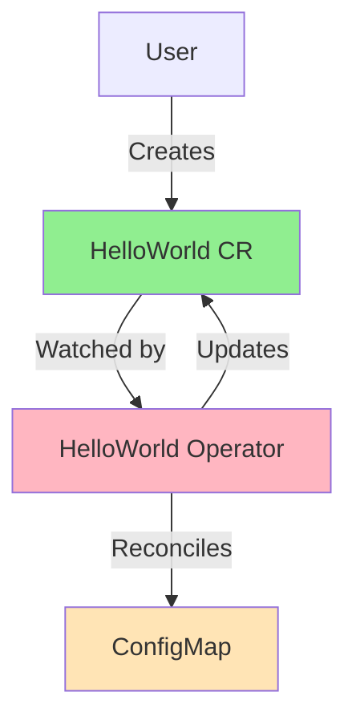

# Lesson 2.4: Your First Operator

**Navigation:** [← Previous: Dev Environment](03-dev-environment.md) | [Module Overview](../README.md)

## Introduction

Now you're ready to build your first operator! We'll create a "Hello World" operator that manages a simple Custom Resource. This operator will demonstrate all the concepts from [Module 1](../module-01/README.md): CRDs, controllers, and reconciliation.

## Theory: Your First Operator

Building your first operator helps you understand the complete operator lifecycle and structure.

### Core Concepts

**Operator Components:**
- **CRD**: Defines your custom resource
- **Controller**: Reconciliation logic
- **Manager**: Coordinates controllers and clients
- **RBAC**: Permissions for the operator

**Generated Code Structure:**
- API types (spec/status)
- Controller reconciliation logic
- Manager setup
- RBAC manifests

**Operator Lifecycle:**
1. User creates Custom Resource
2. Controller watches and reconciles
3. Controller creates/manages Kubernetes resources
4. Controller updates status
5. Continuous reconciliation loop

**Why Start Simple:**
- Understand fundamentals before complexity
- Learn generated code structure
- Build confidence with working example
- Foundation for more complex operators

Starting with a simple operator helps you understand the pattern before building complex ones.

## What We'll Build

A simple operator that:
- Defines a `HelloWorld` Custom Resource
- Watches for HelloWorld resources
- Creates a ConfigMap when a HelloWorld is created
- Updates status to reflect the current state



## Step 1: Initialize Project

Create a new directory and initialize the kubebuilder project:

```bash
# Create project directory
mkdir hello-world-operator
cd hello-world-operator

# Initialize kubebuilder project
kubebuilder init --domain example.com --repo github.com/example/hello-world-operator
```

This creates the basic project structure you learned about in [Lesson 2.2](02-kubebuilder-fundamentals.md).

## Step 2: Create API

Create the HelloWorld API (CRD):

```bash
# Create API with kubebuilder
kubebuilder create api --group hello --version v1 --kind HelloWorld
```

When prompted:
- Create Resource [y/n]: **y**
- Create Controller [y/n]: **y**

This generates:
- API types in `api/v1/`
- Controller in `controllers/`
- CRD manifests in `config/crd/`

## Step 3: Define API Types

Edit `api/v1/helloworld_types.go`:

```go
package v1

import (
    metav1 "k8s.io/apimachinery/pkg/apis/meta/v1"
)

// HelloWorldSpec defines the desired state of HelloWorld
type HelloWorldSpec struct {
    // Message is the message to display
    Message string `json:"message,omitempty"`
    
    // Count is the number of times to display the message
    Count int32 `json:"count,omitempty"`
}

// HelloWorldStatus defines the observed state of HelloWorld
type HelloWorldStatus struct {
    // Phase represents the current phase
    Phase string `json:"phase,omitempty"`
    
    // ConfigMapCreated indicates if the ConfigMap was created
    ConfigMapCreated bool `json:"configMapCreated,omitempty"`
}

//+kubebuilder:object:root=true
//+kubebuilder:subresource:status

// HelloWorld is the Schema for the helloworlds API
type HelloWorld struct {
    metav1.TypeMeta   `json:",inline"`
    metav1.ObjectMeta `json:"metadata,omitempty"`

    Spec   HelloWorldSpec   `json:"spec,omitempty"`
    Status HelloWorldStatus `json:"status,omitempty"`
}

//+kubebuilder:object:root=true

// HelloWorldList contains a list of HelloWorld
type HelloWorldList struct {
    metav1.TypeMeta `json:",inline"`
    metav1.ListMeta `json:"metadata,omitempty"`
    Items           []HelloWorld `json:"items"`
}

func init() {
    SchemeBuilder.Register(&HelloWorld{}, &HelloWorldList{})
}
```

## Step 4: Generate Code

Generate CRD manifests and deep copy methods:

```bash
# Generate code
make generate

# Generate manifests
make manifests
```

This creates:
- CRD YAML in `config/crd/bases/`
- RBAC manifests in `config/rbac/`

## Step 5: Implement Controller

Edit `controllers/helloworld_controller.go`:

```go
package controllers

import (
    "context"
    "fmt"
    
    "k8s.io/apimachinery/pkg/api/errors"
    "k8s.io/apimachinery/pkg/runtime"
    ctrl "sigs.k8s.io/controller-runtime"
    "sigs.k8s.io/controller-runtime/pkg/client"
    "sigs.k8s.io/controller-runtime/pkg/log"
    
    hellov1 "github.com/example/hello-world-operator/api/v1"
    corev1 "k8s.io/api/core/v1"
    metav1 "k8s.io/apimachinery/pkg/apis/meta/v1"
)

// HelloWorldReconciler reconciles a HelloWorld object
type HelloWorldReconciler struct {
    client.Client
    Scheme *runtime.Scheme
}

//+kubebuilder:rbac:groups=hello.example.com,resources=helloworlds,verbs=get;list;watch;create;update;patch;delete
//+kubebuilder:rbac:groups=hello.example.com,resources=helloworlds/status,verbs=get;update;patch
//+kubebuilder:rbac:groups=hello.example.com,resources=helloworlds/finalizers,verbs=update
//+kubebuilder:rbac:groups=core,resources=configmaps,verbs=get;list;watch;create;update;patch;delete

// Reconcile is part of the main kubernetes reconciliation loop
func (r *HelloWorldReconciler) Reconcile(ctx context.Context, req ctrl.Request) (ctrl.Result, error) {
    log := log.FromContext(ctx)
    
    // Fetch the HelloWorld instance
    helloWorld := &hellov1.HelloWorld{}
    if err := r.Get(ctx, req.NamespacedName, helloWorld); err != nil {
        if errors.IsNotFound(err) {
            // Object not found, return
            return ctrl.Result{}, nil
        }
        // Error reading the object
        return ctrl.Result{}, err
    }
    
    // Define the ConfigMap
    configMap := &corev1.ConfigMap{
        ObjectMeta: metav1.ObjectMeta{
            Name:      helloWorld.Name + "-config",
            Namespace: helloWorld.Namespace,
        },
        Data: map[string]string{
            "message": helloWorld.Spec.Message,
            "count":   fmt.Sprintf("%d", helloWorld.Spec.Count),
        },
    }
    
    // Set owner reference (from Lesson 1.3)
    if err := ctrl.SetControllerReference(helloWorld, configMap, r.Scheme); err != nil {
        return ctrl.Result{}, err
    }
    
    // Check if ConfigMap already exists
    existingConfigMap := &corev1.ConfigMap{}
    err := r.Get(ctx, client.ObjectKey{
        Name:      configMap.Name,
        Namespace: configMap.Namespace,
    }, existingConfigMap)
    
    if err != nil && errors.IsNotFound(err) {
        // ConfigMap doesn't exist, create it
        log.Info("Creating ConfigMap", "name", configMap.Name)
        if err := r.Create(ctx, configMap); err != nil {
            return ctrl.Result{}, err
        }
    } else if err != nil {
        return ctrl.Result{}, err
    } else {
        // ConfigMap exists, update it
        log.Info("Updating ConfigMap", "name", configMap.Name)
        existingConfigMap.Data = configMap.Data
        if err := r.Update(ctx, existingConfigMap); err != nil {
            return ctrl.Result{}, err
        }
    }
    
    // Update status
    helloWorld.Status.Phase = "Ready"
    helloWorld.Status.ConfigMapCreated = true
    if err := r.Status().Update(ctx, helloWorld); err != nil {
        return ctrl.Result{}, err
    }
    
    return ctrl.Result{}, nil
}

// SetupWithManager sets up the controller with the Manager.
func (r *HelloWorldReconciler) SetupWithManager(mgr ctrl.Manager) error {
    return ctrl.NewControllerManagedBy(mgr).
        For(&hellov1.HelloWorld{}).
        Complete(r)
}
```

## Step 6: Install CRD

Install the CRD to your cluster:

```bash
# Install CRD
make install

# Verify CRD was created
kubectl get crd helloworlds.hello.example.com
```

## Step 7: Run Operator Locally

Run the operator on your machine (connects to kind cluster):

```bash
# Run operator
make run
```

The operator is now running and watching for HelloWorld resources!

## Step 8: Create a HelloWorld Resource

In another terminal, create a HelloWorld Custom Resource:

```bash
# Create HelloWorld resource
cat <<EOF | kubectl apply -f -
apiVersion: hello.example.com/v1
kind: HelloWorld
metadata:
  name: hello-example
spec:
  message: "Hello from my first operator!"
  count: 5
EOF
```

## Step 9: Observe Reconciliation

Watch what happens:

```bash
# Check HelloWorld resource
kubectl get helloworld hello-example -o yaml

# Check ConfigMap was created
kubectl get configmap hello-example-config -o yaml

# Watch operator logs (in the terminal running make run)
# You should see reconciliation logs
```

## Understanding the Code

### Reconcile Function

The `Reconcile` function implements the pattern from [Lesson 1.3](../module-01/lessons/03-controller-pattern.md):

1. **Read** the Custom Resource
2. **Compare** desired vs actual state
3. **Take action** (create/update ConfigMap)
4. **Update status**

### Owner References

We set an owner reference (from [Lesson 1.3](../module-01/lessons/03-controller-pattern.md)) so the ConfigMap is automatically deleted when HelloWorld is deleted.

### Status Updates

We update the status subresource (from [Lesson 1.4](../module-01/lessons/04-custom-resources.md)) to reflect the current state.

## Project Structure

Your project now looks like:

```
hello-world-operator/
├── api/
│   └── v1/
│       ├── helloworld_types.go
│       └── groupversion_info.go
├── controllers/
│   └── helloworld_controller.go
├── config/
│   ├── crd/
│   ├── rbac/
│   └── manager/
├── main.go
├── Makefile
└── go.mod
```

## Key Takeaways

- Kubebuilder scaffolds the project structure
- You define API types (spec and status)
- You implement the Reconcile function
- The operator follows the reconciliation pattern from Module 1
- Owner references manage resource lifecycle
- Status updates reflect actual state

## What You've Learned

You've now built an operator that:
- ✅ Defines a Custom Resource (CRD)
- ✅ Watches for Custom Resources
- ✅ Reconciles desired vs actual state
- ✅ Creates Kubernetes resources
- ✅ Updates status
- ✅ Uses owner references

This is the foundation for all operators!

## Related Lab

- [Lab 2.4: Building Hello World Operator](../labs/lab-04-first-operator.md) - Complete step-by-step guide

## References

### Official Documentation
- [Kubebuilder Tutorial](https://book.kubebuilder.io/cronjob-tutorial/tutorial.html)
- [Creating a New Project](https://book.kubebuilder.io/quick-start.html#create-a-project)
- [Implementing a Controller](https://book.kubebuilder.io/cronjob-tutorial/controller-implementation.html)

### Further Reading
- **Kubebuilder Book** - Complete tutorial and reference
- **Kubernetes Operators** by Jason Dobies and Joshua Wood - Chapter 3: Your First Operator
- [Kubebuilder Examples](https://github.com/kubernetes-sigs/kubebuilder/tree/master/docs/book/src/cronjob-tutorial/testdata)

### Related Topics
- [Controller Runtime Patterns](https://pkg.go.dev/sigs.k8s.io/controller-runtime/pkg)
- [Reconciliation Best Practices](https://book.kubebuilder.io/reference/controller-tips.html)
- [Generated Code Explanation](https://book.kubebuilder.io/quick-start.html#what-was-created)

## Next Steps

Congratulations! You've built your first operator. In [Module 3](../../module-03/README.md), you'll learn to build more sophisticated controllers with advanced patterns.

**Navigation:** [← Previous: Dev Environment](03-dev-environment.md) | [Module Overview](../README.md) | [Next: Module 3 →](../../module-03/README.md)

