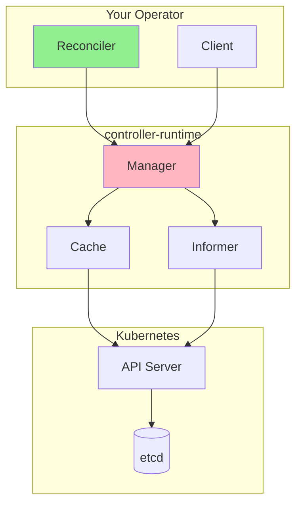
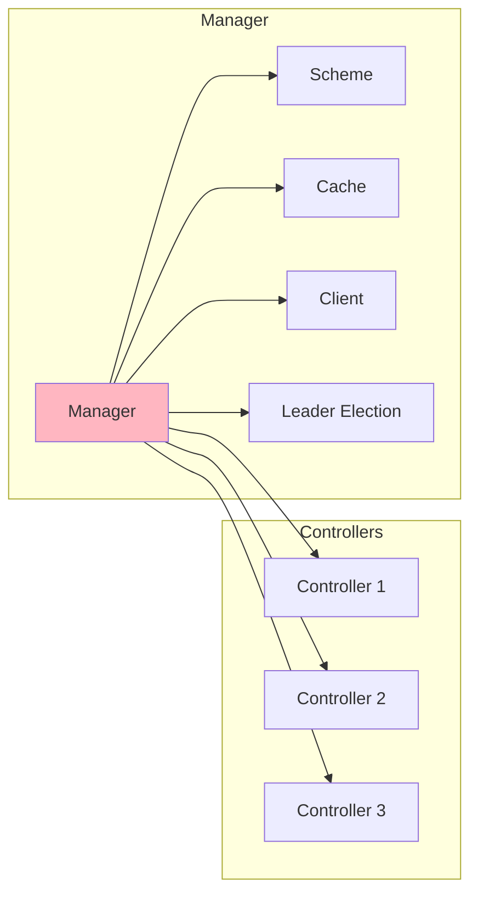
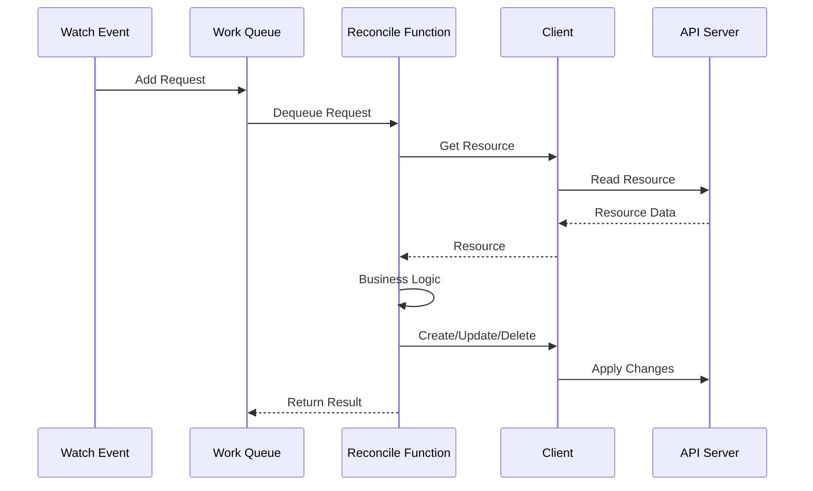
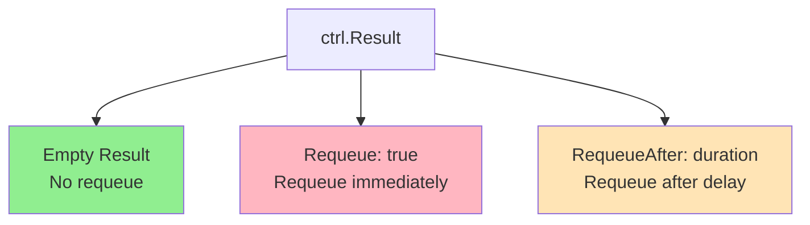
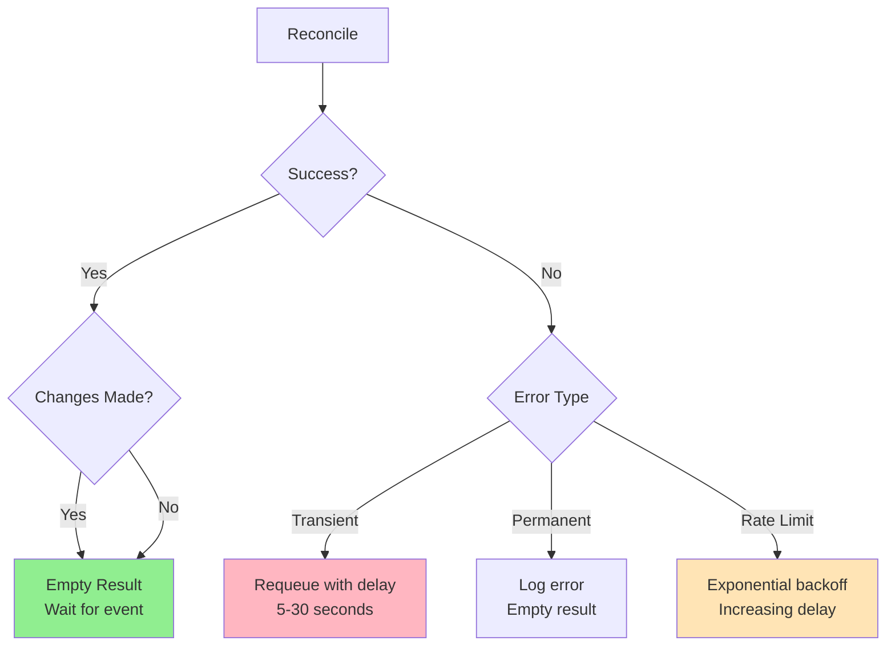
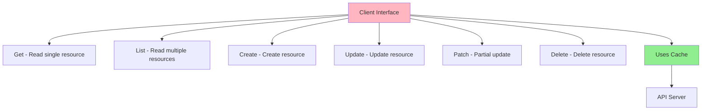

# Lesson 3.1: Controller Runtime Deep Dive

**Navigation:** [Module Overview](../README.md) | [Next Lesson: Designing Your API →](02-designing-api.md)

## Introduction

In [Module 2](../../module-02/README.md), you built your first operator using kubebuilder. The operator used controller-runtime under the hood, but you didn't need to understand the details. Now, to build more sophisticated operators, you need to understand how controller-runtime works - the same library that powers Kubernetes itself.

## Theory: Controller-Runtime Deep Dive

Controller-runtime is the foundational library that implements the controller pattern in Kubernetes. Understanding it is essential for building sophisticated operators.

### Core Concepts

**Manager:**
- Coordinates multiple controllers
- Manages client connections and caching
- Handles leader election
- Provides unified entry point

**Reconciler:**
- Implements reconciliation logic
- Receives reconcile requests
- Returns reconcile results
- Must be idempotent

**Client:**
- Typed client for Kubernetes resources
- Uses informers for caching
- Handles optimistic concurrency
- Provides CRUD operations

**Why Controller-Runtime:**
- **Standardization**: Same library Kubernetes uses
- **Efficiency**: Built-in caching and watching
- **Reliability**: Battle-tested patterns
- **Abstraction**: Hides complexity of direct API calls

Understanding controller-runtime helps you build efficient, reliable operators.

## What is Controller-Runtime?

Controller-runtime is:
- The **library** that implements the controller pattern
- Used by **Kubernetes itself** for built-in controllers
- The **foundation** for kubebuilder
- Provides **Manager**, **Reconciler**, and **Client** abstractions



## Manager Architecture

The Manager is the central component that coordinates everything:



### Manager Responsibilities

1. **Manages Controllers**: Registers and runs controllers
2. **Manages Cache**: Maintains local cache of resources
3. **Manages Client**: Provides client for API access
4. **Manages Scheme**: Handles API type registration
5. **Leader Election**: Ensures only one instance runs

## Reconcile Function Deep Dive

The Reconcile function is the heart of your controller. Let's understand it better:



### Reconcile Function Signature

```go
func (r *MyReconciler) Reconcile(ctx context.Context, req ctrl.Request) (ctrl.Result, error)
```

**Parameters:**
- `ctx`: Context for cancellation and timeouts
- `req`: Request containing namespace and name

**Returns:**
- `ctrl.Result`: What to do next (requeue, delay, etc.)
- `error`: Error if reconciliation failed

## Result and Error Handling

### ctrl.Result Options



**Empty Result (`ctrl.Result{}`):**
- Reconciliation succeeded
- No requeue needed
- Controller will wait for next event

**Requeue (`ctrl.Result{Requeue: true}`):**
- Reconciliation needs to run again
- Requeues immediately
- Use when you need to retry

**RequeueAfter (`ctrl.Result{RequeueAfter: time.Duration}`):**
- Requeue after a delay
- Useful for rate limiting
- Example: `ctrl.Result{RequeueAfter: 30 * time.Second}`

### Error Handling

```go
// Return error to requeue
if err != nil {
    return ctrl.Result{}, err  // Will be requeued
}

// Return error with result
if err != nil {
    return ctrl.Result{RequeueAfter: 5 * time.Second}, err
}

// Success - no requeue
return ctrl.Result{}, nil
```

## Requeue Strategies

Different scenarios require different requeue strategies:



### Common Patterns

**Pattern 1: Success with Changes**
```go
// Created/updated resources successfully
return ctrl.Result{}, nil
```

**Pattern 2: Transient Error**
```go
// Temporary failure, retry soon
return ctrl.Result{RequeueAfter: 10 * time.Second}, err
```

**Pattern 3: Rate Limiting**
```go
// External API rate limit, back off
return ctrl.Result{RequeueAfter: 30 * time.Second}, nil
```

**Pattern 4: Dependency Not Ready**
```go
// Waiting for dependency, check again soon
return ctrl.Result{RequeueAfter: 5 * time.Second}, nil
```

## Client Architecture

The Client provides access to Kubernetes resources:



### Client vs Direct API Calls

**Client (controller-runtime):**
- Uses local cache (faster)
- Handles watch events
- Automatic retries
- Type-safe

**Direct API calls:**
- Always hits API server
- No caching
- Manual retry logic
- More control

## Manager Setup

Here's how the Manager is set up in your operator:

```go
func main() {
    // Create manager
    mgr, err := ctrl.NewManager(ctrl.GetConfigOrDie(), ctrl.Options{
        Scheme:                 scheme,
        MetricsBindAddress:     metricsAddr,
        Port:                   9443,
        HealthProbeBindAddress: probeAddr,
        LeaderElection:          enableLeaderElection,
    })
    
    // Setup reconciler
    if err := (&controllers.MyReconciler{
        Client: mgr.GetClient(),
        Scheme: mgr.GetScheme(),
    }).SetupWithManager(mgr); err != nil {
        // Handle error
    }
    
    // Start manager
    mgr.Start(ctrl.SetupSignalHandler())
}
```

## Key Takeaways

- **Manager** coordinates controllers, cache, and client
- **Reconcile function** is called for each resource
- **ctrl.Result** controls when to requeue
- **Client** provides type-safe access to resources
- **Cache** improves performance by reducing API calls
- **Error handling** determines requeue strategy

## Understanding for Building Operators

When building operators:
- Manager handles the infrastructure
- You implement the Reconcile function
- Choose appropriate requeue strategies
- Use Client for all resource operations
- Leverage cache for performance
- Handle errors appropriately

## Related Lab

- [Lab 3.1: Exploring Controller Runtime](../labs/lab-01-controller-runtime.md) - Hands-on exercises for this lesson

## References

### Official Documentation
- [Controller Runtime](https://pkg.go.dev/sigs.k8s.io/controller-runtime)
- [Manager Package](https://pkg.go.dev/sigs.k8s.io/controller-runtime/pkg/manager)
- [Client Package](https://pkg.go.dev/sigs.k8s.io/controller-runtime/pkg/client)

### Further Reading
- **Programming Kubernetes** by Michael Hausenblas and Stefan Schimanski - Chapter 2: The Kubernetes API
- [Controller Runtime Source](https://github.com/kubernetes-sigs/controller-runtime)
- [Kubebuilder Book - Controller Runtime](https://book.kubebuilder.io/architecture.html)

### Related Topics
- [Informer Pattern](https://github.com/kubernetes/client-go/blob/master/examples/workqueue/main.go)
- [Leader Election](https://pkg.go.dev/sigs.k8s.io/controller-runtime/pkg/leaderelection)
- [Cache and Informers](https://pkg.go.dev/sigs.k8s.io/controller-runtime/pkg/cache)

## Next Steps

Now that you understand controller-runtime, let's design a proper API for a more complex operator.

**Navigation:** [← Module Overview](../README.md) | [Next: Designing Your API →](02-designing-api.md)
