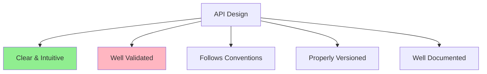
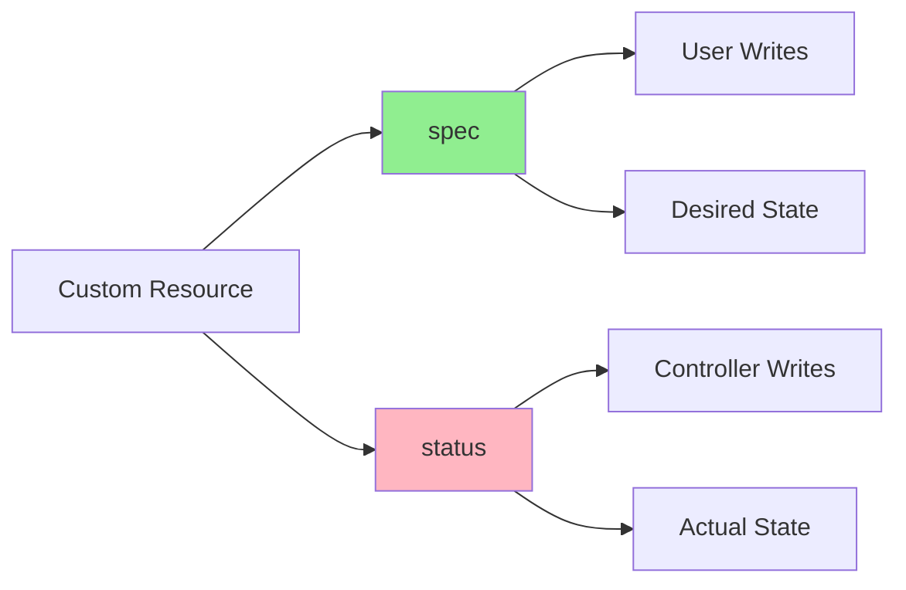
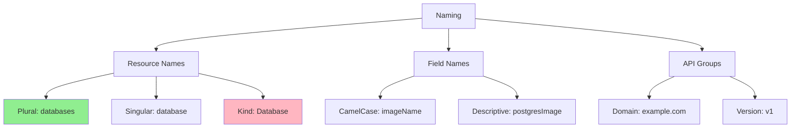
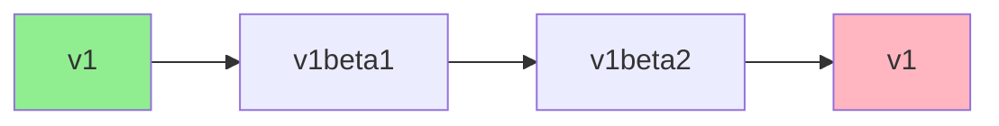
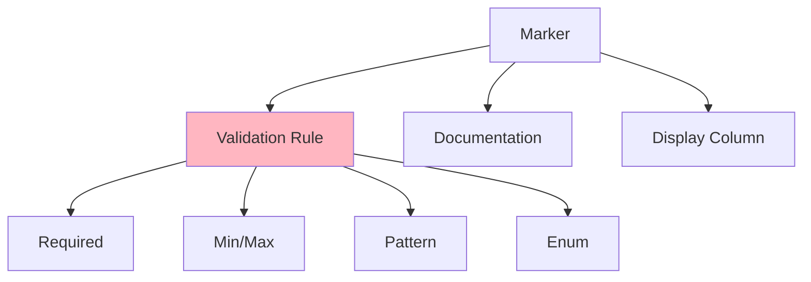
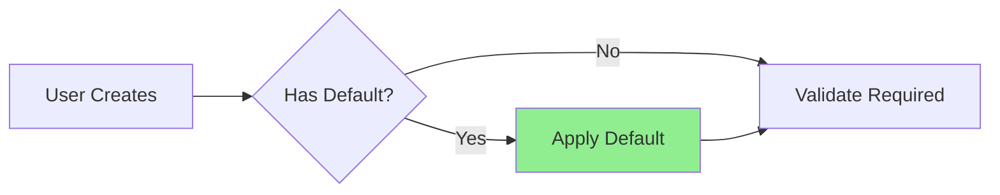
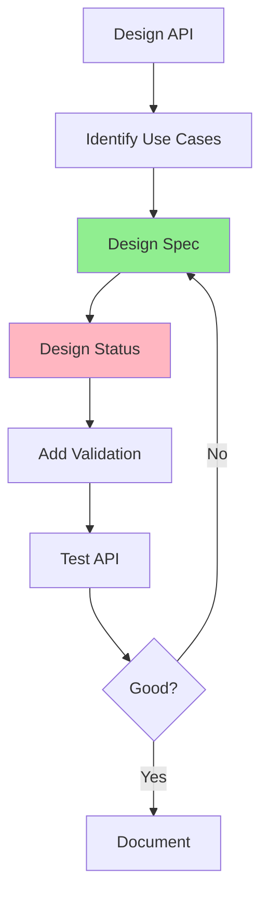

# Lesson 3.2: Designing Your API

**Navigation:** [← Previous: Controller Runtime](01-controller-runtime.md) | [Module Overview](../README.md) | [Next: Reconciliation Logic →](03-reconciliation-logic.md)

## Introduction

A well-designed API is crucial for a good operator. Your Custom Resource API is what users interact with - it should be intuitive, validated, and follow Kubernetes conventions. In this lesson, you'll learn how to design APIs that are both powerful and user-friendly.

## Theory: API Design Principles

Good API design makes operators intuitive to use and maintain. Following Kubernetes conventions ensures consistency and tool compatibility.

### Core Concepts

**Spec vs Status Separation:**
- **Spec**: User-provided desired state (immutable after creation)
- **Status**: System-managed actual state (read-only for users)
- Clear separation prevents conflicts and confusion

**API Versioning:**
- Support multiple API versions simultaneously
- Enable smooth migrations
- Follow Kubernetes versioning conventions

**Validation:**
- Validate at API level (CRD schema)
- Provide clear error messages
- Prevent invalid states early

**Why Good API Design Matters:**
- **Usability**: Intuitive APIs are easier to use
- **Maintainability**: Well-designed APIs are easier to evolve
- **Compatibility**: Following conventions ensures tool compatibility
- **Reliability**: Validation prevents runtime errors

Good API design is the foundation of a successful operator.

## API Design Principles

Good API design follows these principles:



## Spec vs Status Separation

Remember from [Module 1](../../module-01/lessons/04-custom-resources.md) and [Module 2](../../module-02/lessons/04-first-operator.md): **Spec** is desired state, **Status** is actual state.



### Spec Guidelines

**What goes in Spec:**
- User-configurable settings
- Desired configuration
- Resource requirements
- Deployment settings

**Example:**
```go
type DatabaseSpec struct {
    // Image is the PostgreSQL image to use
    Image string `json:"image"`
    
    // Replicas is the number of database replicas
    Replicas int32 `json:"replicas"`
    
    // Storage is the storage configuration
    Storage StorageSpec `json:"storage"`
}
```

### Status Guidelines

**What goes in Status:**
- Current state information
- Progress indicators
- Conditions
- Observed generation

**Example:**
```go
type DatabaseStatus struct {
    // Phase is the current phase
    Phase string `json:"phase,omitempty"`
    
    // Ready indicates if the database is ready
    Ready bool `json:"ready,omitempty"`
    
    // Conditions represent the latest observations
    Conditions []Condition `json:"conditions,omitempty"`
}
```

## Naming Conventions

Follow Kubernetes naming conventions:



### Resource Naming

- **Plural**: `databases` (lowercase, plural)
- **Singular**: `database` (lowercase, singular)
- **Kind**: `Database` (PascalCase, singular)
- **Short name**: `db` (optional, lowercase)

### Field Naming

- Use **camelCase**: `imageName`, `replicaCount`
- Be **descriptive**: `postgresImage` not `img`
- Use **consistent** naming across resources

## API Versioning

APIs should be versioned properly:



### Version Strategy

- **v1**: Stable, production-ready
- **v1beta1**: Beta, may change
- **v1alpha1**: Alpha, experimental

### Versioning Rules

1. Start with `v1alpha1` for new APIs
2. Promote to `v1beta1` when stable
3. Promote to `v1` when production-ready
4. Support multiple versions during transition

## Validation with Markers

Kubebuilder markers provide validation:



### Common Validation Markers

**Required Fields:**
```go
// +kubebuilder:validation:Required
Message string `json:"message"`
```

**Numeric Ranges:**
```go
// +kubebuilder:validation:Minimum=1
// +kubebuilder:validation:Maximum=10
Replicas int32 `json:"replicas"`
```

**String Patterns:**
```go
// +kubebuilder:validation:Pattern=`^[a-z0-9]([-a-z0-9]*[a-z0-9])?$`
Name string `json:"name"`
```

**Enums:**
```go
// +kubebuilder:validation:Enum=small;medium;large
Size string `json:"size"`
```

## Default Values

Provide sensible defaults:



### Setting Defaults

**In Go code:**
```go
// Set defaults in webhook (Module 5)
func (r *Database) Default() {
    if r.Spec.Image == "" {
        r.Spec.Image = "postgres:14"
    }
    if r.Spec.Replicas == 0 {
        r.Spec.Replicas = 1
    }
}
```

**With markers:**
```go
// +kubebuilder:default=postgres:14
Image string `json:"image,omitempty"`
```

## Example: Database API Design

Let's design an API for a PostgreSQL operator:

```go
// DatabaseSpec defines the desired state of Database
type DatabaseSpec struct {
    // Image is the PostgreSQL image to use
    // +kubebuilder:validation:Required
    // +kubebuilder:default=postgres:14
    Image string `json:"image"`
    
    // Replicas is the number of database replicas
    // +kubebuilder:validation:Minimum=1
    // +kubebuilder:validation:Maximum=10
    // +kubebuilder:default=1
    Replicas int32 `json:"replicas,omitempty"`
    
    // Storage is the storage configuration
    Storage StorageSpec `json:"storage"`
    
    // Resources are the resource requirements
    Resources corev1.ResourceRequirements `json:"resources,omitempty"`
}

// StorageSpec defines storage configuration
type StorageSpec struct {
    // Size is the storage size
    // +kubebuilder:validation:Required
    Size string `json:"size"`
    
    // StorageClass is the storage class to use
    StorageClass string `json:"storageClass,omitempty"`
}

// DatabaseStatus defines the observed state of Database
type DatabaseStatus struct {
    // Phase is the current phase
    // +kubebuilder:validation:Enum=Pending;Creating;Ready;Failed
    Phase string `json:"phase,omitempty"`
    
    // Ready indicates if the database is ready
    Ready bool `json:"ready,omitempty"`
    
    // Conditions represent the latest observations
    Conditions []metav1.Condition `json:"conditions,omitempty"`
    
    // Endpoint is the database endpoint
    Endpoint string `json:"endpoint,omitempty"`
}
```

## Print Columns

Add print columns for better `kubectl get` output:

```go
// +kubebuilder:printcolumn:name="Phase",type="string",JSONPath=".status.phase"
// +kubebuilder:printcolumn:name="Replicas",type="integer",JSONPath=".spec.replicas"
// +kubebuilder:printcolumn:name="Ready",type="boolean",JSONPath=".status.ready"
// +kubebuilder:printcolumn:name="Age",type="date",JSONPath=".metadata.creationTimestamp"
type Database struct {
    // ...
}
```

This makes `kubectl get databases` show useful columns!

## API Design Process



## Key Takeaways

- **Spec** = desired state (user writes)
- **Status** = actual state (controller writes)
- Follow Kubernetes **naming conventions**
- Use **proper versioning** (v1alpha1 → v1beta1 → v1)
- Add **validation markers** for safety
- Provide **sensible defaults**
- Add **print columns** for better UX
- **Document** your API well

## Understanding for Building Operators

When designing APIs:
- Think about user experience
- Validate everything possible
- Separate spec and status clearly
- Version your APIs properly
- Follow Kubernetes conventions
- Make it intuitive

## Related Lab

- [Lab 3.2: API Design for Database Operator](../labs/lab-02-designing-api.md) - Hands-on exercises for this lesson

## References

### Official Documentation
- [API Conventions](https://github.com/kubernetes/community/blob/master/contributors/devel/sig-architecture/api-conventions.md)
- [CRD Best Practices](https://kubernetes.io/docs/tasks/extend-kubernetes/custom-resources/custom-resource-definitions/#best-practices)
- [API Versioning](https://kubernetes.io/docs/reference/using-api/api-concepts/#versioning)

### Further Reading
- **Programming Kubernetes** by Michael Hausenblas and Stefan Schimanski - Chapter 3: Custom Resources
- **Kubernetes: Up and Running** by Kelsey Hightower, Brendan Burns, and Joe Beda - Chapter 15: Extending Kubernetes
- [Kubernetes API Design Principles](https://github.com/kubernetes/community/blob/master/contributors/devel/sig-architecture/api-conventions.md)

### Related Topics
- [OpenAPI Schema](https://kubernetes.io/docs/tasks/extend-kubernetes/custom-resources/custom-resource-definitions/#specifying-a-structural-schema)
- [Default Values](https://kubernetes.io/docs/tasks/extend-kubernetes/custom-resources/custom-resource-definitions/#defaulting)
- [Validation Rules](https://kubernetes.io/docs/tasks/extend-kubernetes/custom-resources/custom-resource-definitions/#validation-rules)

## Next Steps

Now that you know how to design APIs, let's implement the reconciliation logic that uses them.

**Navigation:** [← Previous: Controller Runtime](01-controller-runtime.md) | [Module Overview](../README.md) | [Next: Reconciliation Logic →](03-reconciliation-logic.md)

