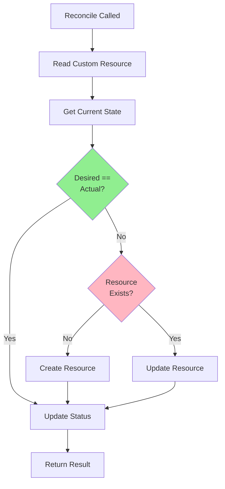
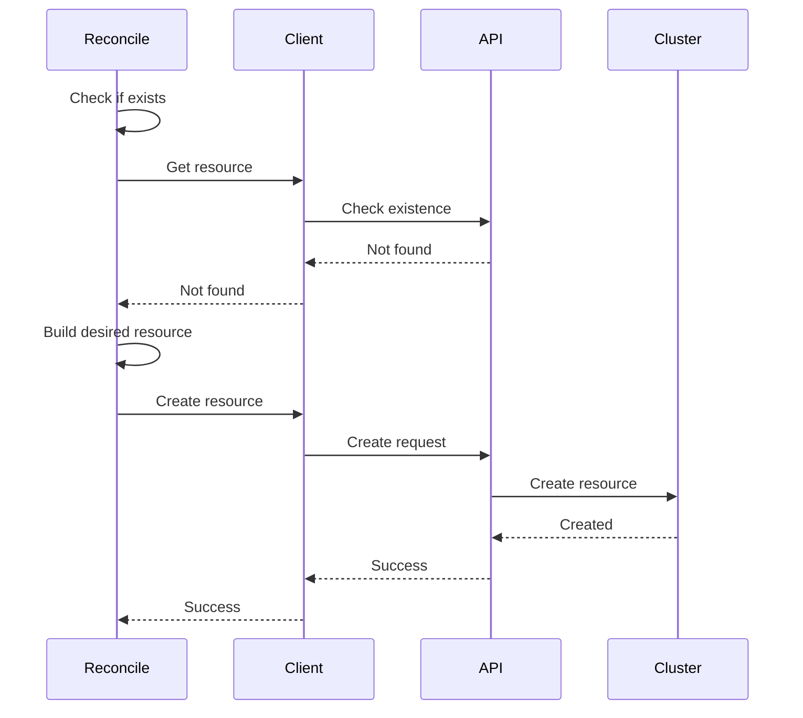
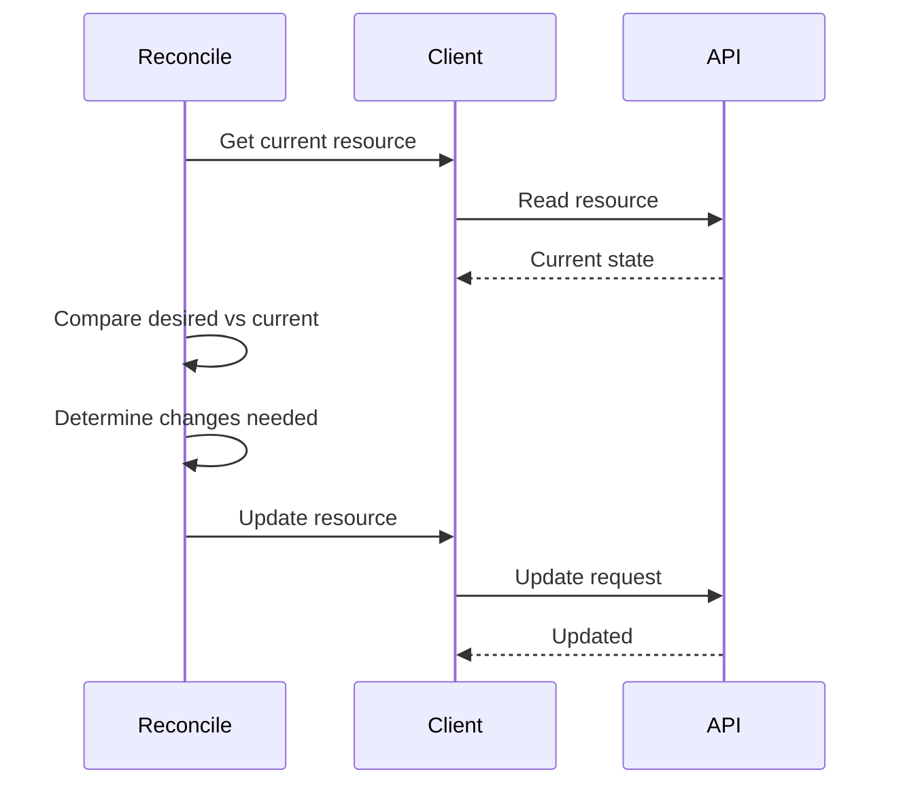
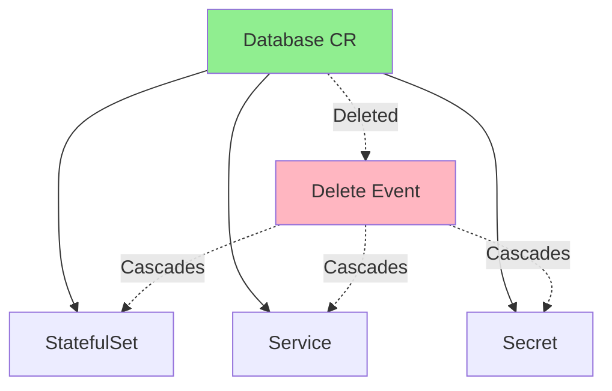
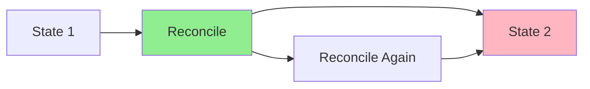

# Lesson 3.3: Implementing Reconciliation Logic

**Navigation:** [← Previous: Designing Your API](02-designing-api.md) | [Module Overview](../README.md) | [Next: Working with Client-Go →](04-client-go.md)

## Introduction

Now that you understand controller-runtime ([Lesson 3.1](01-controller-runtime.md)) and API design ([Lesson 3.2](02-designing-api.md)), it's time to implement robust reconciliation logic. This is where your operator's business logic lives - the code that makes desired state match actual state.

## Theory: Reconciliation Logic

Reconciliation is the process of continuously ensuring actual state matches desired state. It's the heart of every controller and operator.

### Core Concepts

**Reconciliation Loop:**
- Continuously compares desired vs actual
- Takes corrective actions when they differ
- Updates status to reflect current state
- Runs until desired == actual

**Idempotency:**
- Same input → same output
- Safe to run multiple times
- Enables retries and recovery
- Critical for reliability

**Owner References:**
- Link child resources to parent
- Enable garbage collection
- Track resource relationships
- Maintain resource hierarchy

**Why Reconciliation Matters:**
- **Reliability**: Handles failures and retries
- **Consistency**: Ensures state matches desired
- **Resilience**: Recovers from partial failures
- **Simplicity**: Single pattern for all operations

Understanding reconciliation helps you build robust, reliable operators.

## Reconciliation Loop Lifecycle

The reconciliation loop follows this lifecycle:



## Reading Cluster State

First, you need to read the current state:

```go
func (r *DatabaseReconciler) Reconcile(ctx context.Context, req ctrl.Request) (ctrl.Result, error) {
    // 1. Read the Custom Resource
    db := &databasev1.Database{}
    if err := r.Get(ctx, req.NamespacedName, db); err != nil {
        if errors.IsNotFound(err) {
            // Resource was deleted
            return ctrl.Result{}, nil
        }
        return ctrl.Result{}, err
    }
    
    // 2. Read dependent resources
    statefulSet := &appsv1.StatefulSet{}
    err := r.Get(ctx, client.ObjectKey{
        Name:      db.Name,
        Namespace: db.Namespace,
    }, statefulSet)
    
    // Handle not found
    if errors.IsNotFound(err) {
        // Need to create
    }
}
```

## Creating Resources

When resources don't exist, create them:



### Creation Pattern

```go
// Check if StatefulSet exists
statefulSet := &appsv1.StatefulSet{}
err := r.Get(ctx, client.ObjectKey{
    Name:      db.Name,
    Namespace: db.Namespace,
}, statefulSet)

if errors.IsNotFound(err) {
    // Build desired StatefulSet
    desiredStatefulSet := r.buildStatefulSet(db)
    
    // Set owner reference
    if err := ctrl.SetControllerReference(db, desiredStatefulSet, r.Scheme); err != nil {
        return ctrl.Result{}, err
    }
    
    // Create it
    if err := r.Create(ctx, desiredStatefulSet); err != nil {
        return ctrl.Result{}, err
    }
    
    // Created successfully
    return ctrl.Result{Requeue: true}, nil
}
```

## Updating Resources

When resources exist but differ, update them:



### Update Pattern

```go
// Get current StatefulSet
currentStatefulSet := &appsv1.StatefulSet{}
if err := r.Get(ctx, client.ObjectKey{
    Name:      db.Name,
    Namespace: db.Namespace,
}, currentStatefulSet); err != nil {
    return ctrl.Result{}, err
}

// Build desired StatefulSet
desiredStatefulSet := r.buildStatefulSet(db)

// Compare and update if needed
if !reflect.DeepEqual(currentStatefulSet.Spec, desiredStatefulSet.Spec) {
    currentStatefulSet.Spec = desiredStatefulSet.Spec
    if err := r.Update(ctx, currentStatefulSet); err != nil {
        return ctrl.Result{}, err
    }
    // Updated, requeue to verify
    return ctrl.Result{Requeue: true}, nil
}
```

## Owner References

Owner references ensure resources are deleted when the parent is deleted:



### Setting Owner References

```go
// Set owner reference on child resource
if err := ctrl.SetControllerReference(db, statefulSet, r.Scheme); err != nil {
    return ctrl.Result{}, err
}

// Now when Database is deleted, StatefulSet is automatically deleted
```

## Idempotency

Reconciliation must be **idempotent** - running it multiple times should have the same effect:



### Ensuring Idempotency

```go
// Always check current state before acting
current := &appsv1.StatefulSet{}
err := r.Get(ctx, key, current)

if errors.IsNotFound(err) {
    // Create only if doesn't exist
    r.Create(ctx, desired)
} else {
    // Update only if different
    if !reflect.DeepEqual(current.Spec, desired.Spec) {
        r.Update(ctx, desired)
    }
}
```

## Complete Reconciliation Example

Here's a complete reconciliation function for a Database operator:

```go
func (r *DatabaseReconciler) Reconcile(ctx context.Context, req ctrl.Request) (ctrl.Result, error) {
    log := log.FromContext(ctx)
    
    // 1. Read the Database Custom Resource
    db := &databasev1.Database{}
    if err := r.Get(ctx, req.NamespacedName, db); err != nil {
        if errors.IsNotFound(err) {
            // Resource was deleted, nothing to do
            return ctrl.Result{}, nil
        }
        return ctrl.Result{}, err
    }
    
    // 2. Reconcile StatefulSet
    if err := r.reconcileStatefulSet(ctx, db); err != nil {
        return ctrl.Result{}, err
    }
    
    // 3. Reconcile Service
    if err := r.reconcileService(ctx, db); err != nil {
        return ctrl.Result{}, err
    }
    
    // 4. Reconcile Secret
    if err := r.reconcileSecret(ctx, db); err != nil {
        return ctrl.Result{}, err
    }
    
    // 5. Update status
    if err := r.updateStatus(ctx, db); err != nil {
        return ctrl.Result{}, err
    }
    
    return ctrl.Result{}, nil
}

func (r *DatabaseReconciler) reconcileStatefulSet(ctx context.Context, db *databasev1.Database) error {
    // Get current StatefulSet
    statefulSet := &appsv1.StatefulSet{}
    err := r.Get(ctx, client.ObjectKey{
        Name:      db.Name,
        Namespace: db.Namespace,
    }, statefulSet)
    
    desiredStatefulSet := r.buildStatefulSet(db)
    
    if errors.IsNotFound(err) {
        // Create
        if err := ctrl.SetControllerReference(db, desiredStatefulSet, r.Scheme); err != nil {
            return err
        }
        return r.Create(ctx, desiredStatefulSet)
    } else if err != nil {
        return err
    }
    
    // Update if needed
    if !reflect.DeepEqual(statefulSet.Spec, desiredStatefulSet.Spec) {
        statefulSet.Spec = desiredStatefulSet.Spec
        return r.Update(ctx, statefulSet)
    }
    
    return nil
}
```

## Error Handling

Handle errors appropriately:

```go
// Transient error - retry
if isTransientError(err) {
    return ctrl.Result{RequeueAfter: 10 * time.Second}, err
}

// Permanent error - log and don't retry
if isPermanentError(err) {
    log.Error(err, "Permanent error, not retrying")
    return ctrl.Result{}, nil
}

// Unknown error - retry with backoff
return ctrl.Result{RequeueAfter: 5 * time.Second}, err
```

## Key Takeaways

- **Read** current state before acting
- **Compare** desired vs actual
- **Create** if missing
- **Update** if different
- Use **owner references** for lifecycle
- Ensure **idempotency**
- Handle **errors** appropriately
- **Update status** to reflect state

## Understanding for Building Operators

When implementing reconciliation:
- Always check current state first
- Build desired state from spec
- Compare before updating
- Set owner references
- Make it idempotent
- Handle errors gracefully
- Update status

## Related Lab

- [Lab 3.3: Building PostgreSQL Operator](../labs/lab-03-reconciliation-logic.md) - Hands-on exercises for this lesson

## References

### Official Documentation
- [Controller Pattern](https://kubernetes.io/docs/concepts/architecture/controller/)
- [Owner References](https://kubernetes.io/docs/concepts/overview/working-with-objects/owners-dependents/)
- [Garbage Collection](https://kubernetes.io/docs/concepts/architecture/garbage-collection/)

### Further Reading
- **Kubernetes: Up and Running** by Kelsey Hightower, Brendan Burns, and Joe Beda - Chapter 4: Common kubectl Commands
- **Programming Kubernetes** by Michael Hausenblas and Stefan Schimanski - Chapter 2: The Kubernetes API
- [Reconciliation in Kubernetes](https://kubernetes.io/docs/concepts/architecture/controller/#reconciliation)

### Related Topics
- [Idempotency Patterns](https://kubernetes.io/docs/concepts/architecture/controller/#reconciliation)
- [Resource Lifecycle](https://kubernetes.io/docs/concepts/overview/working-with-objects/)
- [Finalizers](https://kubernetes.io/docs/concepts/overview/working-with-objects/finalizers/)

## Next Steps

Now that you understand reconciliation logic, let's learn advanced client operations for more sophisticated controllers.

**Navigation:** [← Previous: Designing Your API](02-designing-api.md) | [Module Overview](../README.md) | [Next: Working with Client-Go →](04-client-go.md)
