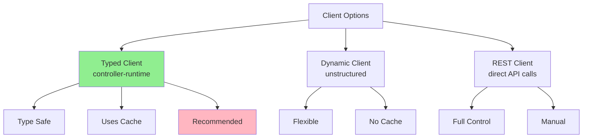
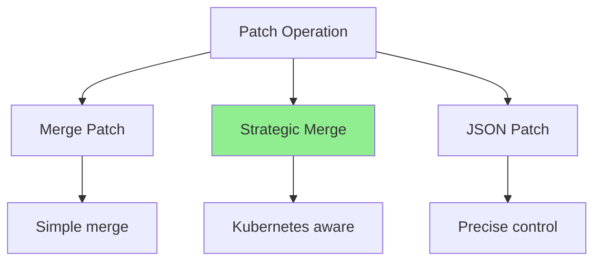
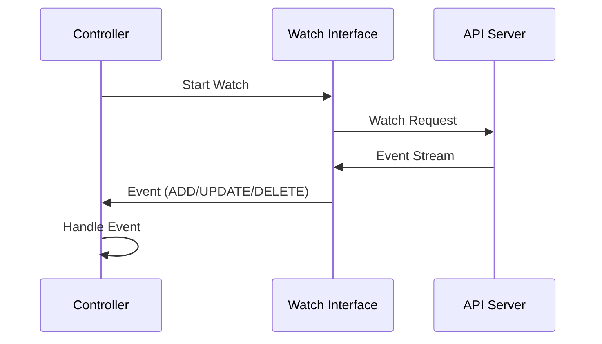
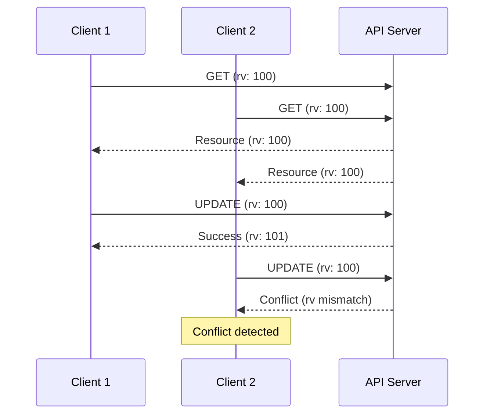

# Lesson 3.4: Working with Client-Go

**Navigation:** [← Previous: Reconciliation Logic](03-reconciliation-logic.md) | [Module Overview](../README.md)

## Introduction

The Kubernetes client is your interface to the API server. Understanding how to use it effectively is crucial for building efficient operators. In this lesson, you'll learn advanced client operations, patching strategies, and how to handle concurrency.

## Client Types

There are different ways to interact with the Kubernetes API:



## Typed Client (Recommended)

The typed client from controller-runtime is what you've been using:

```go
type DatabaseReconciler struct {
    client.Client  // Typed client
    Scheme *runtime.Scheme
}
```

**Advantages:**
- Type-safe
- Uses cache (faster)
- Handles watch events
- Automatic retries

## Reading Resources

### Get Single Resource

```go
// Get a specific resource
statefulSet := &appsv1.StatefulSet{}
err := r.Get(ctx, client.ObjectKey{
    Name:      "my-db",
    Namespace: "default",
}, statefulSet)

if errors.IsNotFound(err) {
    // Resource doesn't exist
}
```

### List Multiple Resources

```go
// List all StatefulSets in namespace
statefulSetList := &appsv1.StatefulSetList{}
err := r.List(ctx, statefulSetList, client.InNamespace("default"))

// Filter by labels
err := r.List(ctx, statefulSetList, 
    client.InNamespace("default"),
    client.MatchingLabels{"app": "database"})
```

## Creating Resources

```go
// Create a resource
statefulSet := &appsv1.StatefulSet{
    ObjectMeta: metav1.ObjectMeta{
        Name:      "my-db",
        Namespace: "default",
    },
    Spec: appsv1.StatefulSetSpec{
        // ... spec
    },
}

err := r.Create(ctx, statefulSet)
```

## Updating Resources

### Full Update

```go
// Update entire resource
statefulSet.Spec.Replicas = &replicas
err := r.Update(ctx, statefulSet)
```

### Status Update

```go
// Update only status (uses status subresource)
db.Status.Phase = "Ready"
err := r.Status().Update(ctx, db)
```

## Patch Strategies

Sometimes you only want to update specific fields. Use patches:



### Strategic Merge Patch

```go
// Patch specific fields
patch := client.MergeFrom(statefulSet.DeepCopy())
statefulSet.Spec.Replicas = &newReplicas

err := r.Patch(ctx, statefulSet, patch)
```

### JSON Patch

```go
// More precise control
patch := []byte(`[
    {"op": "replace", "path": "/spec/replicas", "value": 3}
]`)

err := r.Patch(ctx, statefulSet, client.RawPatch(types.JSONPatchType, patch))
```

## Watching Resources

Watch for changes to resources:



### Setting Up Watches

```go
func (r *DatabaseReconciler) SetupWithManager(mgr ctrl.Manager) error {
    return ctrl.NewControllerManagedBy(mgr).
        For(&databasev1.Database{}).
        Owns(&appsv1.StatefulSet{}).  // Watch owned StatefulSets
        Watches(
            &source.Kind{Type: &corev1.Secret{}},
            &handler.EnqueueRequestForObject{},
        ).
        Complete(r)
}
```

## Optimistic Concurrency Control

Kubernetes uses resource versions to prevent conflicts:



### Handling Conflicts

```go
// Retry on conflict
for retries := 0; retries < 3; retries++ {
    err := r.Get(ctx, key, resource)
    if err != nil {
        return err
    }
    
    // Modify resource
    resource.Spec.Replicas = &newReplicas
    
    err = r.Update(ctx, resource)
    if err == nil {
        return nil  // Success
    }
    
    if !errors.IsConflict(err) {
        return err  // Non-conflict error
    }
    
    // Conflict - retry
    time.Sleep(100 * time.Millisecond)
}
```

## Filtering and Searching

### By Namespace

```go
// List resources in namespace
r.List(ctx, list, client.InNamespace("production"))
```

### By Labels

```go
// Match labels
r.List(ctx, list, client.MatchingLabels{
    "app": "database",
    "env": "prod",
})

// Match label selector
selector := labels.SelectorFromSet(labels.Set{"app": "database"})
r.List(ctx, list, client.MatchingLabelsSelector{Selector: selector})
```

### By Fields

```go
// Match specific field
r.List(ctx, list, client.MatchingFields{
    "metadata.name": "my-db",
})
```

## Field Selectors

Use field selectors for efficient queries:

```go
// Find StatefulSets owned by Database
r.List(ctx, &appsv1.StatefulSetList{},
    client.InNamespace("default"),
    client.MatchingFields{
        ".metadata.ownerReferences[0].kind": "Database",
        ".metadata.ownerReferences[0].name": db.Name,
    })
```

## Best Practices

### 1. Use Typed Client

```go
// Good: Type-safe
r.Get(ctx, key, &appsv1.StatefulSet{})

// Avoid: Dynamic client unless necessary
```

### 2. Leverage Cache

```go
// Client uses cache automatically
// No need to worry about it
r.Get(ctx, key, resource)  // Uses cache
```

### 3. Handle Errors Properly

```go
if errors.IsNotFound(err) {
    // Handle not found
} else if errors.IsConflict(err) {
    // Handle conflict
} else {
    // Handle other errors
}
```

### 4. Use Context

```go
// Always use context for cancellation
ctx, cancel := context.WithTimeout(context.Background(), 30*time.Second)
defer cancel()

r.Get(ctx, key, resource)
```

## Key Takeaways

- **Typed client** is recommended (type-safe, cached)
- **Get** for single resources, **List** for multiple
- Use **Patch** for partial updates
- **Watch** for real-time updates
- Handle **conflicts** with retries
- Use **filters** for efficient queries
- Always use **context** for cancellation

## Understanding for Building Operators

When working with clients:
- Prefer typed client over dynamic
- Use List with filters for efficiency
- Handle conflicts gracefully
- Use patches for partial updates
- Set up watches for dependent resources
- Always handle errors properly

## Related Lab

- [Lab 3.4: Advanced Client Operations](../labs/lab-04-client-go.md) - Hands-on exercises for this lesson

## Next Steps

Congratulations! You've completed Module 3. You now understand:
- Controller-runtime architecture
- API design principles
- Reconciliation logic
- Advanced client operations

In [Module 4](../module-04/README.md), you'll learn advanced reconciliation patterns like conditions, finalizers, and multi-phase reconciliation.

**Navigation:** [← Previous: Reconciliation Logic](03-reconciliation-logic.md) | [Module Overview](../README.md) | [Next: Module 4 →](../module-04/README.md)

