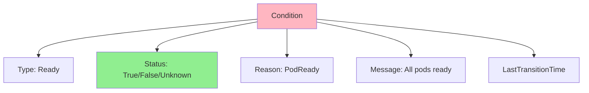
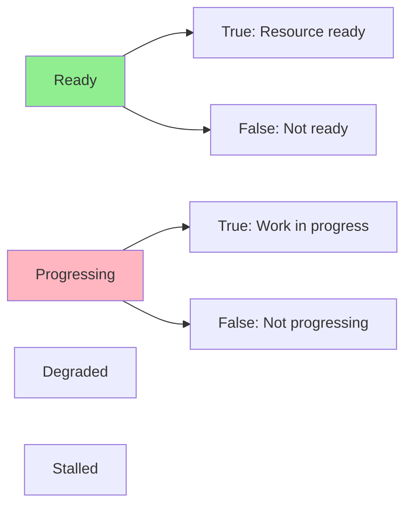
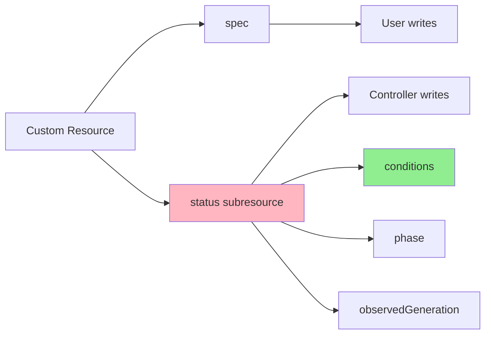
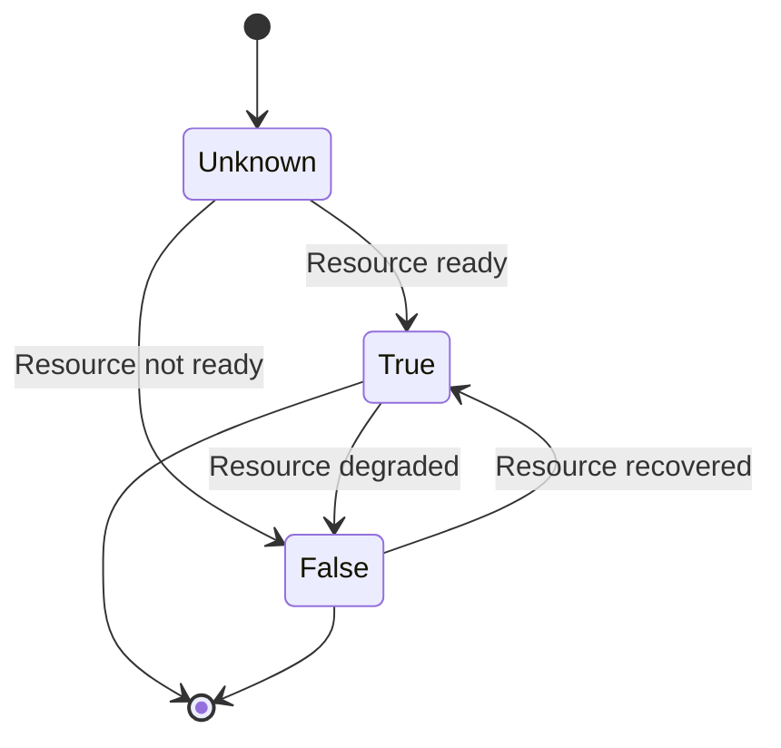
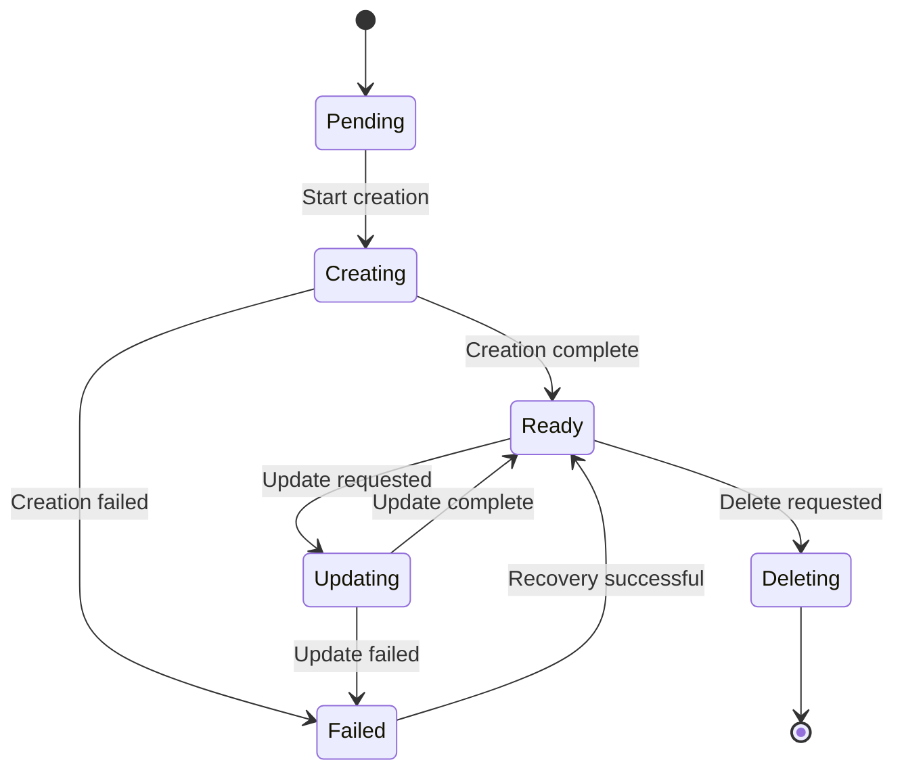

# Lesson 4.1: Conditions and Status Management

**Navigation:** [Module Overview](../README.md) | [Next Lesson: Finalizers and Cleanup →](02-finalizers-cleanup.md)

## Introduction

In [Module 3](../module-03/README.md), you learned basic status updates. Now let's implement proper status management using **conditions** - the Kubernetes-standard way to report resource state. Conditions provide structured, machine-readable status that both humans and automation can understand.

## What are Conditions?

Conditions are structured status information that follows a standard pattern:



### Condition Structure

```go
type Condition struct {
    Type               string    // e.g., "Ready", "Progressing"
    Status             string    // "True", "False", "Unknown"
    Reason             string    // Short reason code
    Message            string    // Human-readable message
    LastTransitionTime time.Time // When status changed
    ObservedGeneration int64     // Generation this applies to
}
```

## Common Condition Types

Kubernetes defines standard condition types:



- **Ready**: Resource is ready to serve traffic/work
- **Progressing**: Work is actively being done
- **Degraded**: Resource is working but in degraded state
- **Stalled**: Progress has stopped

## Status Subresource

Remember from [Module 1](../module-01/lessons/04-custom-resources.md) and [Module 3](../module-03/lessons/02-designing-api.md): status is a subresource.



## Condition Lifecycle

Conditions transition through states:



## Implementing Conditions

### Step 1: Add Conditions to Status

```go
// DatabaseStatus defines the observed state of Database
type DatabaseStatus struct {
    // Conditions represent the latest observations
    Conditions []metav1.Condition `json:"conditions,omitempty"`
    
    // Phase is a simple status indicator
    Phase string `json:"phase,omitempty"`
    
    // ObservedGeneration tracks the generation this status applies to
    ObservedGeneration int64 `json:"observedGeneration,omitempty"`
}
```

### Step 2: Helper Functions

```go
import (
    "k8s.io/apimachinery/pkg/api/meta"
    metav1 "k8s.io/apimachinery/pkg/apis/meta/v1"
)

// setCondition sets a condition on the Database
func (r *DatabaseReconciler) setCondition(db *databasev1.Database, conditionType string, status metav1.ConditionStatus, reason, message string) {
    condition := metav1.Condition{
        Type:               conditionType,
        Status:             status,
        Reason:             reason,
        Message:            message,
        LastTransitionTime: metav1.Now(),
        ObservedGeneration: db.Generation,
    }
    
    meta.SetStatusCondition(&db.Status.Conditions, condition)
}

// getCondition gets a condition by type
func (r *DatabaseReconciler) getCondition(db *databasev1.Database, conditionType string) *metav1.Condition {
    return meta.FindStatusCondition(db.Status.Conditions, conditionType)
}
```

### Step 3: Update Conditions in Reconcile

```go
func (r *DatabaseReconciler) Reconcile(ctx context.Context, req ctrl.Request) (ctrl.Result, error) {
    // ... read Database ...
    
    // Check StatefulSet status
    statefulSet := &appsv1.StatefulSet{}
    err := r.Get(ctx, client.ObjectKey{
        Name:      db.Name,
        Namespace: db.Namespace,
    }, statefulSet)
    
    if errors.IsNotFound(err) {
        r.setCondition(db, "Ready", metav1.ConditionFalse, "StatefulSetNotFound", "StatefulSet not found")
        r.setCondition(db, "Progressing", metav1.ConditionTrue, "Creating", "Creating StatefulSet")
        return ctrl.Result{}, r.Status().Update(ctx, db)
    }
    
    // Check if ready
    if statefulSet.Status.ReadyReplicas == *statefulSet.Spec.Replicas {
        r.setCondition(db, "Ready", metav1.ConditionTrue, "AllReplicasReady", "All replicas are ready")
        r.setCondition(db, "Progressing", metav1.ConditionFalse, "ReconciliationComplete", "Reconciliation complete")
    } else {
        r.setCondition(db, "Ready", metav1.ConditionFalse, "ReplicasNotReady", 
            fmt.Sprintf("%d/%d replicas ready", statefulSet.Status.ReadyReplicas, *statefulSet.Spec.Replicas))
        r.setCondition(db, "Progressing", metav1.ConditionTrue, "Scaling", "Waiting for replicas to be ready")
    }
    
    // Update status
    db.Status.ObservedGeneration = db.Generation
    return ctrl.Result{}, r.Status().Update(ctx, db)
}
```

## Status Update Strategies

### Strategy 1: Update on Every Reconcile

```go
// Update status every time
return ctrl.Result{}, r.Status().Update(ctx, db)
```

**Pros:** Always current  
**Cons:** Can cause conflicts with rapid updates

### Strategy 2: Update Only on Changes

```go
// Only update if conditions changed
if conditionsChanged {
    return ctrl.Result{}, r.Status().Update(ctx, db)
}
```

**Pros:** Reduces conflicts  
**Cons:** More complex logic

### Strategy 3: Periodic Updates

```go
// Update status periodically
if time.Since(lastStatusUpdate) > 30*time.Second {
    return ctrl.Result{}, r.Status().Update(ctx, db)
}
```

**Pros:** Reduces API calls  
**Cons:** Status may be slightly stale

## Condition State Machine

For complex resources, use a state machine:



## Reporting Progress

Use Progressing condition to show progress:

```go
// During creation
r.setCondition(db, "Progressing", metav1.ConditionTrue, "CreatingStatefulSet", "Creating StatefulSet")

// After StatefulSet created
r.setCondition(db, "Progressing", metav1.ConditionTrue, "WaitingForPods", "Waiting for pods to be ready")

// When complete
r.setCondition(db, "Progressing", metav1.ConditionFalse, "ReconciliationComplete", "Reconciliation complete")
```

## Error Reporting

Report errors with conditions:

```go
if err != nil {
    r.setCondition(db, "Ready", metav1.ConditionFalse, "Error", err.Error())
    r.setCondition(db, "Progressing", metav1.ConditionFalse, "Error", "Reconciliation failed")
    return ctrl.Result{}, r.Status().Update(ctx, db)
}
```

## Key Takeaways

- **Conditions** provide structured, standard status reporting
- Use **standard condition types** (Ready, Progressing, etc.)
- **LastTransitionTime** tracks when status changed
- **ObservedGeneration** tracks which spec generation status applies to
- Update conditions based on **actual resource state**
- Use **state machines** for complex workflows
- **Report progress** with Progressing condition
- **Report errors** clearly with conditions

## Understanding for Building Operators

When implementing conditions:
- Use `meta.SetStatusCondition` for updates
- Track observed generation
- Update on state changes
- Use standard condition types
- Provide clear reasons and messages
- Handle conflicts gracefully

## Related Lab

- [Lab 4.1: Implementing Status Conditions](../labs/lab-01-conditions-status.md) - Hands-on exercises for this lesson

## Next Steps

Now that you understand status management, let's learn about finalizers for graceful cleanup.

**Navigation:** [← Module Overview](../README.md) | [Next: Finalizers and Cleanup →](02-finalizers-cleanup.md)

