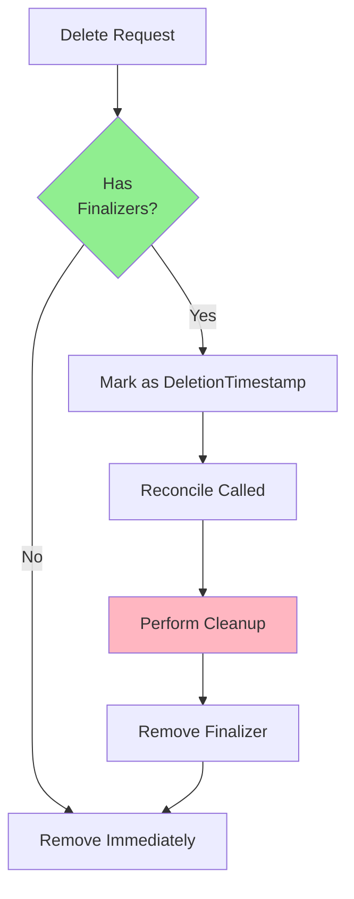
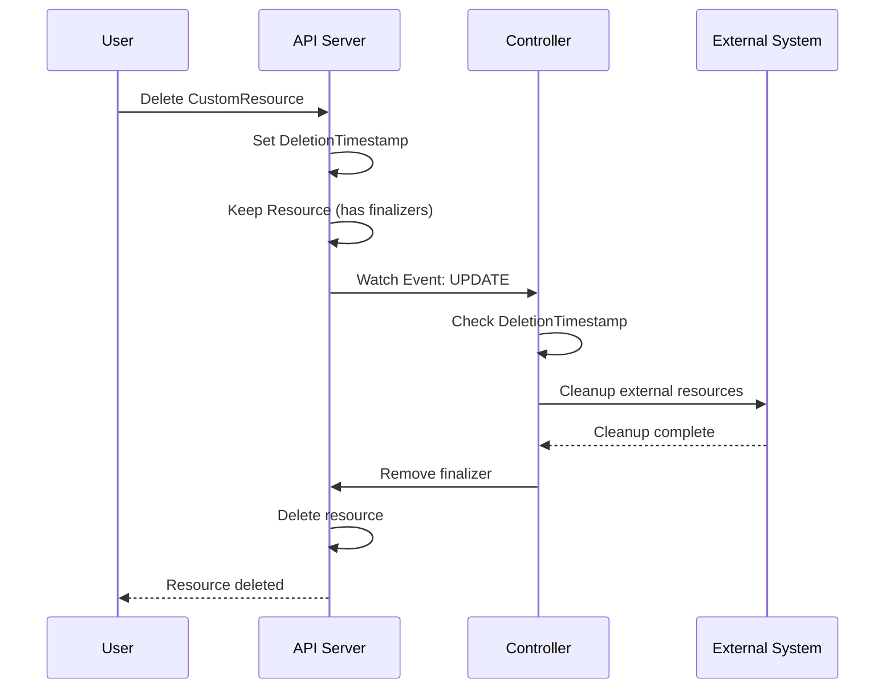
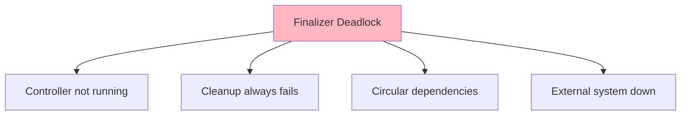

# Lesson 4.2: Finalizers and Cleanup

**Navigation:** [← Previous: Conditions and Status](01-conditions-status.md) | [Module Overview](../README.md) | [Next: Watching and Indexing →](03-watching-indexing.md)

## Introduction

When a user deletes a Custom Resource, you often need to perform cleanup before the resource is actually removed. **Finalizers** allow you to intercept deletion and perform necessary cleanup operations like deleting external resources, backing up data, or notifying external systems.

## What are Finalizers?

Finalizers are keys in `metadata.finalizers` that prevent resource deletion until they're removed:



## Deletion Flow with Finalizers

Here's what happens when a resource with finalizers is deleted:



## Implementing Finalizers

### Step 1: Add Finalizer on Creation

```go
func (r *DatabaseReconciler) Reconcile(ctx context.Context, req ctrl.Request) (ctrl.Result, error) {
    db := &databasev1.Database{}
    if err := r.Get(ctx, req.NamespacedName, db); err != nil {
        return ctrl.Result{}, err
    }
    
    // Add finalizer if not present
    finalizerName := "database.example.com/finalizer"
    if !controllerutil.ContainsFinalizer(db, finalizerName) {
        controllerutil.AddFinalizer(db, finalizerName)
        if err := r.Update(ctx, db); err != nil {
            return ctrl.Result{}, err
        }
    }
    
    // ... rest of reconciliation ...
}
```

### Step 2: Handle Deletion

```go
// Check if resource is being deleted
if !db.DeletionTimestamp.IsZero() {
    // Resource is being deleted
    return r.handleDeletion(ctx, db)
}

// Normal reconciliation
// ...
```

### Step 3: Implement Cleanup

```go
func (r *DatabaseReconciler) handleDeletion(ctx context.Context, db *databasev1.Database) (ctrl.Result, error) {
    log := log.FromContext(ctx)
    finalizerName := "database.example.com/finalizer"
    
    // Check if finalizer exists
    if !controllerutil.ContainsFinalizer(db, finalizerName) {
        // Finalizer already removed, nothing to do
        return ctrl.Result{}, nil
    }
    
    log.Info("Handling deletion", "name", db.Name)
    
    // Perform cleanup operations
    if err := r.cleanupExternalResources(ctx, db); err != nil {
        log.Error(err, "Failed to cleanup external resources")
        // Return error to retry
        return ctrl.Result{RequeueAfter: 10 * time.Second}, err
    }
    
    // Cleanup successful, remove finalizer
    controllerutil.RemoveFinalizer(db, finalizerName)
    if err := r.Update(ctx, db); err != nil {
        return ctrl.Result{}, err
    }
    
    log.Info("Finalizer removed, resource will be deleted")
    return ctrl.Result{}, nil
}
```

## Cleanup Patterns

### Pattern 1: Delete Owned Resources

```go
func (r *DatabaseReconciler) cleanupExternalResources(ctx context.Context, db *databasev1.Database) error {
    // Owner references handle most cleanup automatically
    // But you might need to delete external resources
    
    // Delete backup in external system
    if err := r.deleteBackup(ctx, db); err != nil {
        return err
    }
    
    return nil
}
```

### Pattern 2: Wait for Dependencies

```go
func (r *DatabaseReconciler) cleanupExternalResources(ctx context.Context, db *databasev1.Database) error {
    // Wait for StatefulSet to be fully deleted
    statefulSet := &appsv1.StatefulSet{}
    err := r.Get(ctx, client.ObjectKey{
        Name:      db.Name,
        Namespace: db.Namespace,
    }, statefulSet)
    
    if !errors.IsNotFound(err) {
        // Still exists, wait
        return fmt.Errorf("StatefulSet still exists, waiting")
    }
    
    // StatefulSet deleted, continue cleanup
    return nil
}
```

### Pattern 3: External API Cleanup

```go
func (r *DatabaseReconciler) cleanupExternalResources(ctx context.Context, db *databasev1.Database) error {
    // Call external API to delete resource
    if err := r.externalAPIClient.DeleteDatabase(db.Name); err != nil {
        return err
    }
    
    return nil
}
```

## Avoiding Finalizer Deadlocks

Finalizer deadlocks can occur when:



### Prevention Strategies

1. **Idempotent Cleanup**: Cleanup should be safe to retry
2. **Timeout**: Set maximum time for cleanup
3. **Force Removal**: Allow manual finalizer removal in emergencies
4. **Health Checks**: Ensure controller is running before cleanup

### Example: Timeout Protection

```go
func (r *DatabaseReconciler) handleDeletion(ctx context.Context, db *databasev1.Database) (ctrl.Result, error) {
    // Check if deletion is taking too long
    if time.Since(db.DeletionTimestamp.Time) > 5*time.Minute {
        log.Info("Deletion timeout, forcing cleanup")
        // Force cleanup or remove finalizer
    }
    
    // ... cleanup ...
}
```

## Multiple Finalizers

Resources can have multiple finalizers:

```go
// Add multiple finalizers
controllerutil.AddFinalizer(db, "database.example.com/finalizer")
controllerutil.AddFinalizer(db, "backup.example.com/finalizer")

// Each controller removes its own finalizer
// Resource is deleted when all finalizers are removed
```

## Key Takeaways

- **Finalizers** prevent deletion until cleanup is complete
- Add finalizer on **resource creation**
- Check **DeletionTimestamp** to detect deletion
- Perform **cleanup operations** before removing finalizer
- Remove finalizer **only after cleanup succeeds**
- Make cleanup **idempotent** (safe to retry)
- Avoid **finalizer deadlocks** with timeouts and health checks

## Understanding for Building Operators

When implementing finalizers:
- Add finalizer early in reconciliation
- Check DeletionTimestamp for deletion
- Perform all cleanup before removing finalizer
- Handle cleanup failures gracefully
- Make cleanup idempotent
- Set timeouts to prevent deadlocks

## Related Lab

- [Lab 4.2: Implementing Finalizers](../labs/lab-02-finalizers-cleanup.md) - Hands-on exercises for this lesson

## References

### Official Documentation
- [Finalizers](https://kubernetes.io/docs/concepts/overview/working-with-objects/finalizers/)
- [Garbage Collection](https://kubernetes.io/docs/concepts/architecture/garbage-collection/)
- [Owner References](https://kubernetes.io/docs/concepts/overview/working-with-objects/owners-dependents/)

### Further Reading
- **Kubernetes Operators** by Jason Dobies and Joshua Wood - Chapter 6: Finalizers and Cleanup
- **Programming Kubernetes** by Michael Hausenblas and Stefan Schimanski - Chapter 7: Resource Lifecycle
- [Kubernetes Finalizers Explained](https://kubernetes.io/docs/concepts/overview/working-with-objects/finalizers/)

### Related Topics
- [Owner References Pattern](https://kubernetes.io/docs/concepts/overview/working-with-objects/owners-dependents/)
- [Garbage Collection](https://kubernetes.io/docs/concepts/architecture/garbage-collection/)
- [Deletion Propagation](https://kubernetes.io/docs/concepts/overview/working-with-objects/owners-dependents/#controlling-how-the-garbage-collector-deletes-dependents)

## Next Steps

Now that you understand finalizers, let's learn about watching and indexing for efficient controllers.

**Navigation:** [← Previous: Conditions and Status](01-conditions-status.md) | [Module Overview](../README.md) | [Next: Watching and Indexing →](03-watching-indexing.md)

