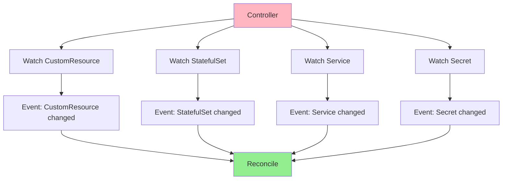
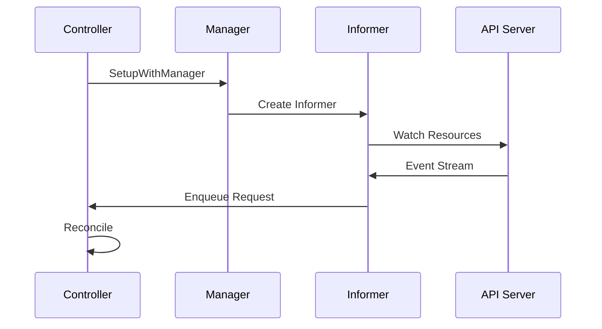
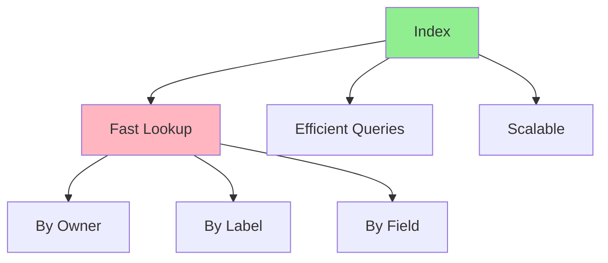
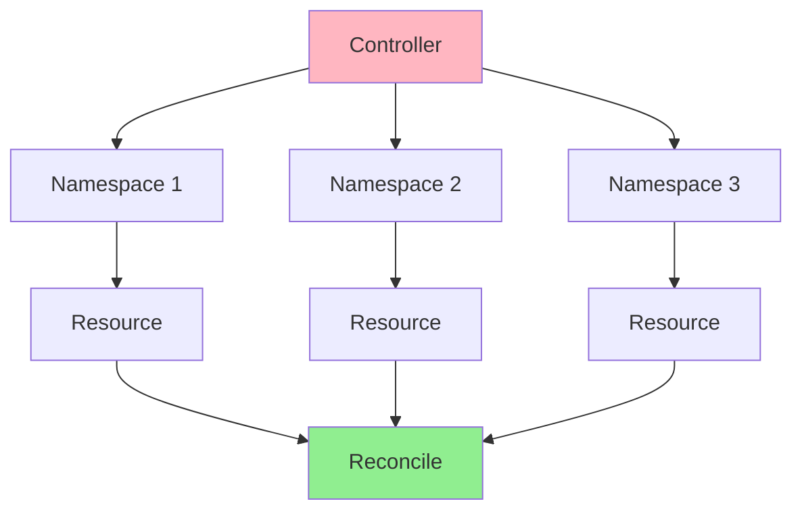
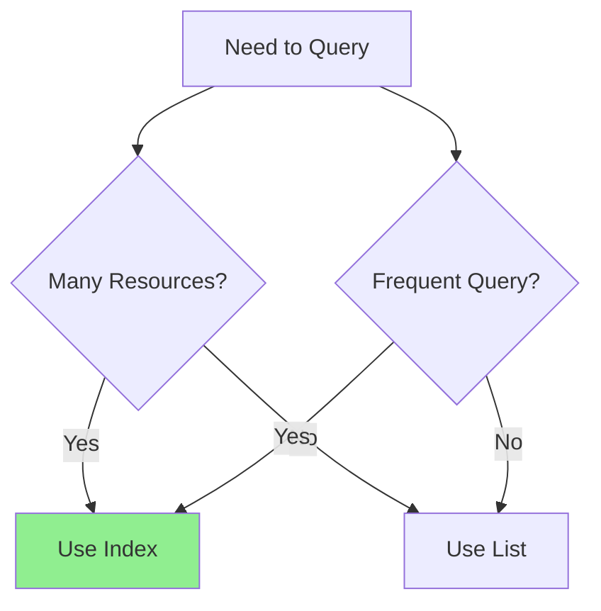

# Lesson 4.3: Watching and Indexing

**Navigation:** [← Previous: Finalizers and Cleanup](02-finalizers-cleanup.md) | [Module Overview](../README.md) | [Next: Advanced Patterns →](04-advanced-patterns.md)

## Introduction

In [Module 3](../../module-03/README.md), you learned basic reconciliation. Now let's optimize controllers by watching dependent resources and using indexes for efficient lookups. This makes controllers more reactive and performant.

## Watching Dependent Resources

Controllers can watch resources they don't own:



## Watch Setup Flow

Here's how watches are set up:



## Setting Up Watches

### Watch Owned Resources

```go
func (r *DatabaseReconciler) SetupWithManager(mgr ctrl.Manager) error {
    return ctrl.NewControllerManagedBy(mgr).
        For(&databasev1.Database{}).
        Owns(&appsv1.StatefulSet{}).  // Watch owned StatefulSets
        Owns(&corev1.Service{}).      // Watch owned Services
        Owns(&corev1.Secret{}).       // Watch owned Secrets
        Complete(r)
}
```

When owned resources change, the owner is reconciled automatically.

### Watch Non-Owned Resources

```go
func (r *DatabaseReconciler) SetupWithManager(mgr ctrl.Manager) error {
    return ctrl.NewControllerManagedBy(mgr).
        For(&databasev1.Database{}).
        Watches(
            &source.Kind{Type: &corev1.Secret{}},
            handler.EnqueueRequestsFromMapFunc(r.findDatabasesForSecret),
        ).
        Complete(r)
}

func (r *DatabaseReconciler) findDatabasesForSecret(secret client.Object) []reconcile.Request {
    // Find all Databases that reference this Secret
    databases := &databasev1.DatabaseList{}
    r.List(context.Background(), databases)
    
    var requests []reconcile.Request
    for _, db := range databases.Items {
        if db.Spec.SecretName == secret.GetName() {
            requests = append(requests, reconcile.Request{
                NamespacedName: types.NamespacedName{
                    Name:      db.Name,
                    Namespace: db.Namespace,
                },
            })
        }
    }
    return requests
}
```

## Indexes for Efficient Lookups

Indexes allow fast lookups without listing all resources:



## Setting Up Indexes

### Step 1: Define Index Function

```go
// Index function: map Secret to Databases that use it
func indexSecretName(obj client.Object) []string {
    secret, ok := obj.(*corev1.Secret)
    if !ok {
        return nil
    }
    
    // Return the secret name as index key
    return []string{secret.Name}
}
```

### Step 2: Register Index

```go
func (r *DatabaseReconciler) SetupWithManager(mgr ctrl.Manager) error {
    // Create index for Secret name
    if err := mgr.GetFieldIndexer().IndexField(
        context.Background(),
        &corev1.Secret{},
        "metadata.name",
        indexSecretName,
    ); err != nil {
        return err
    }
    
    return ctrl.NewControllerManagedBy(mgr).
        For(&databasev1.Database{}).
        Complete(r)
}
```

### Step 3: Use Index in Queries

```go
// Find all Secrets with a specific name using index
secrets := &corev1.SecretList{}
err := r.List(ctx, secrets, client.MatchingFields{
    "metadata.name": secretName,
})
```

## Cross-Namespace Watching

Watch resources across namespaces:



### Cluster-Scoped Watching

```go
func (r *DatabaseReconciler) SetupWithManager(mgr ctrl.Manager) error {
    return ctrl.NewControllerManagedBy(mgr).
        For(&databasev1.Database{}).
        Watches(
            &source.Kind{Type: &corev1.Namespace{}},
            handler.EnqueueRequestsFromMapFunc(r.findDatabasesForNamespace),
        ).
        Complete(r)
}

func (r *DatabaseReconciler) findDatabasesForNamespace(namespace client.Object) []reconcile.Request {
    // Reconcile all Databases in this namespace
    databases := &databasev1.DatabaseList{}
    r.List(context.Background(), databases, client.InNamespace(namespace.GetName()))
    
    var requests []reconcile.Request
    for _, db := range databases.Items {
        requests = append(requests, reconcile.Request{
            NamespacedName: types.NamespacedName{
                Name:      db.Name,
                Namespace: db.Namespace,
            },
        })
    }
    return requests
}
```

## Event Handling

Handle different event types:

```go
func (r *DatabaseReconciler) SetupWithManager(mgr ctrl.Manager) error {
    return ctrl.NewControllerManagedBy(mgr).
        For(&databasev1.Database{}).
        Watches(
            &source.Kind{Type: &appsv1.StatefulSet{}},
            &handler.EnqueueRequestForOwner{
                OwnerType:    &databasev1.Database{},
                IsController: true,
            },
            builder.WithPredicates(predicate.Funcs{
                UpdateFunc: func(e event.UpdateEvent) bool {
                    // Only reconcile on spec changes
                    return e.ObjectOld.GetGeneration() != e.ObjectNew.GetGeneration()
                },
                CreateFunc: func(e event.CreateEvent) bool {
                    return true
                },
                DeleteFunc: func(e event.DeleteEvent) bool {
                    return true
                },
            }),
        ).
        Complete(r)
}
```

## Performance Considerations

### When to Use Indexes



**Use indexes when:**
- Querying many resources frequently
- Need fast lookups
- Resources scale to hundreds/thousands

**Use List when:**
- Few resources
- Infrequent queries
- Simple filtering

## Key Takeaways

- **Watch owned resources** with `Owns()`
- **Watch non-owned resources** with `Watches()`
- **Indexes** enable fast lookups
- **Cross-namespace watching** for cluster-scoped controllers
- **Event predicates** filter which events trigger reconciliation
- **Performance** improves with proper watching and indexing

## Understanding for Building Operators

When setting up watches:
- Watch resources that affect your Custom Resource
- Use indexes for frequent queries
- Filter events with predicates
- Watch across namespaces if needed
- Balance performance with complexity

## Related Lab

- [Lab 4.3: Setting Up Watches and Indexes](../labs/lab-03-watching-indexing.md) - Hands-on exercises for this lesson

## References

### Official Documentation
- [Informers](https://github.com/kubernetes/client-go/blob/master/tools/cache/shared_informer.go)
- [Field Selectors](https://kubernetes.io/docs/concepts/overview/working-with-objects/field-selectors/)
- [Indexers](https://pkg.go.dev/k8s.io/client-go/tools/cache#Indexer)

### Further Reading
- **Programming Kubernetes** by Michael Hausenblas and Stefan Schimanski - Chapter 4: Working with Client Libraries
- **Kubernetes Operators** by Jason Dobies and Joshua Wood - Chapter 7: Advanced Patterns
- [client-go Informers](https://github.com/kubernetes/client-go/tree/master/examples/workqueue)

### Related Topics
- [Informer Pattern](https://github.com/kubernetes/community/blob/master/contributors/devel/sig-api-machinery/controllers.md)
- [Workqueue Pattern](https://github.com/kubernetes/client-go/blob/master/util/workqueue/)
- [Controller Performance](https://kubernetes.io/docs/concepts/architecture/controller/#controller-performance)

## Next Steps

Now that you understand watching and indexing, let's learn advanced patterns like multi-phase reconciliation and state machines.

**Navigation:** [← Previous: Finalizers and Cleanup](02-finalizers-cleanup.md) | [Module Overview](../README.md) | [Next: Advanced Patterns →](04-advanced-patterns.md)

