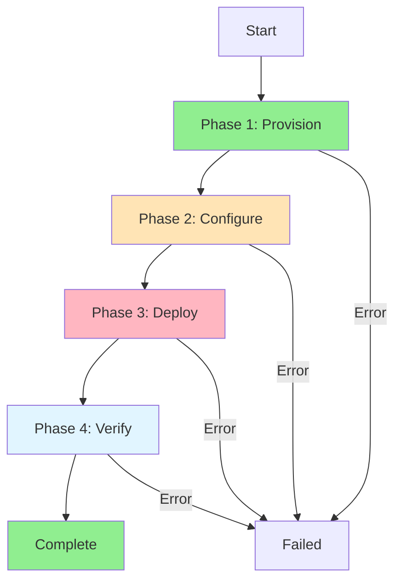
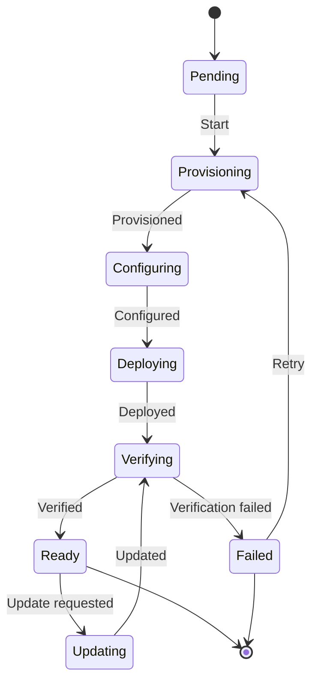
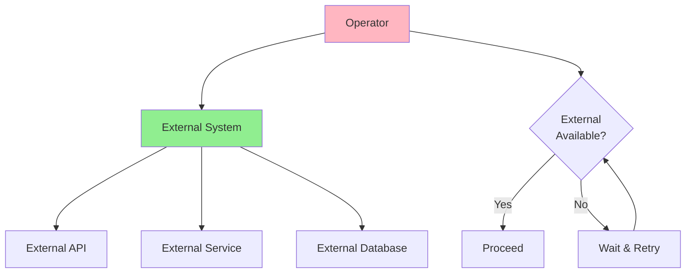
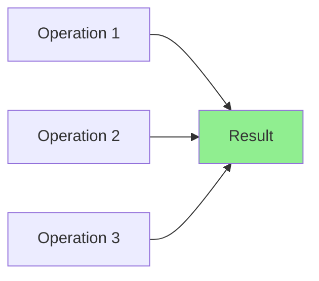
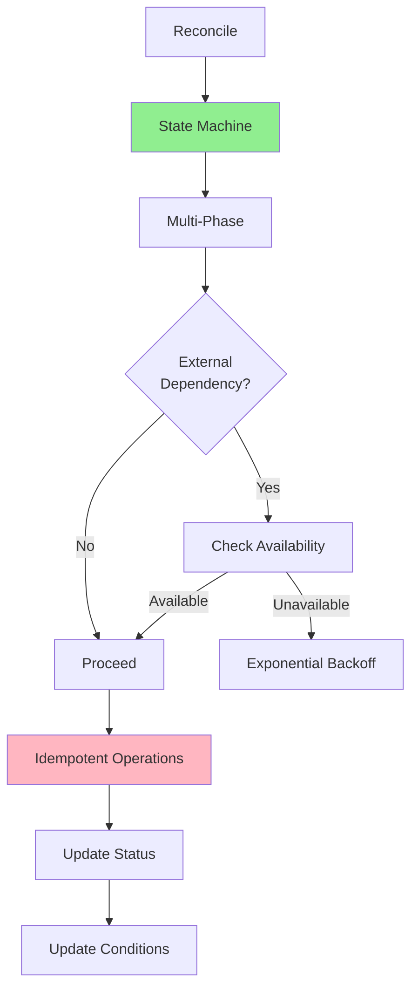

# Lesson 4.4: Advanced Patterns

**Navigation:** [← Previous: Watching and Indexing](03-watching-indexing.md) | [Module Overview](../README.md)

## Introduction

Real-world operators often need to handle complex scenarios: multi-phase deployments, state machines, external dependencies, and ensuring idempotency. This lesson covers advanced patterns that make operators robust and production-ready.

## Multi-Phase Reconciliation

Complex resources often need multiple phases:



### Implementing Multi-Phase

```go
func (r *DatabaseReconciler) Reconcile(ctx context.Context, req ctrl.Request) (ctrl.Result, error) {
    db := &databasev1.Database{}
    if err := r.Get(ctx, req.NamespacedName, db); err != nil {
        return ctrl.Result{}, err
    }
    
    // Determine current phase
    phase := r.getCurrentPhase(db)
    
    switch phase {
    case "Provisioning":
        return r.reconcileProvisioning(ctx, db)
    case "Configuring":
        return r.reconcileConfiguring(ctx, db)
    case "Deploying":
        return r.reconcileDeploying(ctx, db)
    case "Verifying":
        return r.reconcileVerifying(ctx, db)
    case "Ready":
        return r.reconcileReady(ctx, db)
    default:
        return ctrl.Result{}, nil
    }
}

func (r *DatabaseReconciler) getCurrentPhase(db *databasev1.Database) string {
    // Check conditions to determine phase
    ready := meta.FindStatusCondition(db.Status.Conditions, "Ready")
    if ready != nil && ready.Status == metav1.ConditionTrue {
        return "Ready"
    }
    
    // Check resource states to determine phase
    // ...
    
    return "Provisioning"
}
```

## State Machines

State machines provide structured state transitions:



### State Machine Implementation

```go
type DatabaseState string

const (
    StatePending     DatabaseState = "Pending"
    StateProvisioning DatabaseState = "Provisioning"
    StateConfiguring  DatabaseState = "Configuring"
    StateDeploying    DatabaseState = "Deploying"
    StateVerifying    DatabaseState = "Verifying"
    StateReady        DatabaseState = "Ready"
    StateFailed       DatabaseState = "Failed"
)

func (r *DatabaseReconciler) reconcileWithStateMachine(ctx context.Context, db *databasev1.Database) (ctrl.Result, error) {
    currentState := DatabaseState(db.Status.Phase)
    if currentState == "" {
        currentState = StatePending
    }
    
    // State machine transitions
    switch currentState {
    case StatePending:
        return r.transitionToProvisioning(ctx, db)
    case StateProvisioning:
        return r.handleProvisioning(ctx, db)
    case StateConfiguring:
        return r.handleConfiguring(ctx, db)
    case StateDeploying:
        return r.handleDeploying(ctx, db)
    case StateVerifying:
        return r.handleVerifying(ctx, db)
    case StateReady:
        return r.handleReady(ctx, db)
    case StateFailed:
        return r.handleFailed(ctx, db)
    default:
        return ctrl.Result{}, nil
    }
}
```

## Handling External Dependencies

Operators often depend on external systems:



### External Dependency Pattern

```go
func (r *DatabaseReconciler) checkExternalDependency(ctx context.Context, db *databasev1.Database) error {
    // Check if external system is available
    if err := r.externalClient.HealthCheck(ctx); err != nil {
        r.setCondition(db, "Ready", metav1.ConditionFalse, "ExternalSystemUnavailable", 
            "External system is not available")
        return err
    }
    
    return nil
}

func (r *DatabaseReconciler) Reconcile(ctx context.Context, req ctrl.Request) (ctrl.Result, error) {
    // ... read Database ...
    
    // Check external dependency
    if err := r.checkExternalDependency(ctx, db); err != nil {
        // Retry after delay
        return ctrl.Result{RequeueAfter: 30 * time.Second}, nil
    }
    
    // Proceed with reconciliation
    // ...
}
```

## Idempotency Guarantees

Operations must be idempotent - safe to repeat:



### Ensuring Idempotency

```go
// Bad: Not idempotent
func (r *DatabaseReconciler) createSecret(ctx context.Context, db *databasev1.Database) error {
    secret := &corev1.Secret{
        // ... create secret ...
    }
    return r.Create(ctx, secret)  // Will fail if exists
}

// Good: Idempotent
func (r *DatabaseReconciler) ensureSecret(ctx context.Context, db *databasev1.Database) error {
    secret := &corev1.Secret{}
    err := r.Get(ctx, client.ObjectKey{
        Name:      db.Name + "-secret",
        Namespace: db.Namespace,
    }, secret)
    
    if errors.IsNotFound(err) {
        // Create if doesn't exist
        secret = r.buildSecret(db)
        return r.Create(ctx, secret)
    } else if err != nil {
        return err
    }
    
    // Already exists, check if update needed
    desiredSecret := r.buildSecret(db)
    if !reflect.DeepEqual(secret.Data, desiredSecret.Data) {
        secret.Data = desiredSecret.Data
        return r.Update(ctx, secret)
    }
    
    // Already in desired state
    return nil
}
```

## Stability Patterns

### Pattern 1: Rate Limiting

```go
func (r *DatabaseReconciler) Reconcile(ctx context.Context, req ctrl.Request) (ctrl.Result, error) {
    // ... reconciliation ...
    
    // Rate limit external API calls
    if time.Since(r.lastAPICall) < 1*time.Second {
        return ctrl.Result{RequeueAfter: 1 * time.Second}, nil
    }
    
    r.lastAPICall = time.Now()
    // Make API call
    // ...
}
```

### Pattern 2: Exponential Backoff

```go
func (r *DatabaseReconciler) handleError(ctx context.Context, db *databasev1.Database, err error) (ctrl.Result, error) {
    // Get retry count from annotation
    retryCount := getRetryCount(db)
    
    // Exponential backoff: 5s, 10s, 20s, 40s, max 5min
    backoff := time.Duration(math.Min(float64(5*time.Second*math.Pow(2, float64(retryCount))), 
        float64(5*time.Minute)))
    
    // Increment retry count
    setRetryCount(db, retryCount+1)
    r.Update(ctx, db)
    
    return ctrl.Result{RequeueAfter: backoff}, err
}
```

### Pattern 3: Circuit Breaker

```go
type CircuitBreaker struct {
    failures     int
    lastFailure time.Time
    state       string // "closed", "open", "half-open"
}

func (cb *CircuitBreaker) Call(fn func() error) error {
    if cb.state == "open" {
        if time.Since(cb.lastFailure) > 1*time.Minute {
            cb.state = "half-open"
        } else {
            return fmt.Errorf("circuit breaker open")
        }
    }
    
    err := fn()
    if err != nil {
        cb.failures++
        cb.lastFailure = time.Now()
        if cb.failures > 5 {
            cb.state = "open"
        }
        return err
    }
    
    // Success
    cb.failures = 0
    cb.state = "closed"
    return nil
}
```

## Combining Patterns

Real operators combine multiple patterns:



## Key Takeaways

- **Multi-phase reconciliation** handles complex deployments
- **State machines** provide structured state transitions
- **External dependencies** need availability checks and retries
- **Idempotency** is crucial - operations must be safe to repeat
- **Rate limiting** prevents overwhelming external systems
- **Exponential backoff** handles transient failures
- **Circuit breakers** protect against cascading failures
- **Combine patterns** for robust operators

## Understanding for Building Operators

When implementing advanced patterns:
- Use state machines for complex workflows
- Break complex operations into phases
- Always check external dependencies
- Ensure all operations are idempotent
- Implement rate limiting and backoff
- Use circuit breakers for resilience
- Combine patterns as needed

## Related Lab

- [Lab 4.4: Multi-Phase Reconciliation](../labs/lab-04-advanced-patterns.md) - Hands-on exercises for this lesson

## Next Steps

Congratulations! You've completed Module 4. You now understand:
- Status management with conditions
- Finalizers for cleanup
- Watching and indexing
- Advanced reconciliation patterns

In [Module 5](../module-05/README.md), you'll learn about webhooks for validation and mutation.

**Navigation:** [← Previous: Watching and Indexing](03-watching-indexing.md) | [Module Overview](../README.md) | [Next: Module 5 →](../module-05/README.md)

