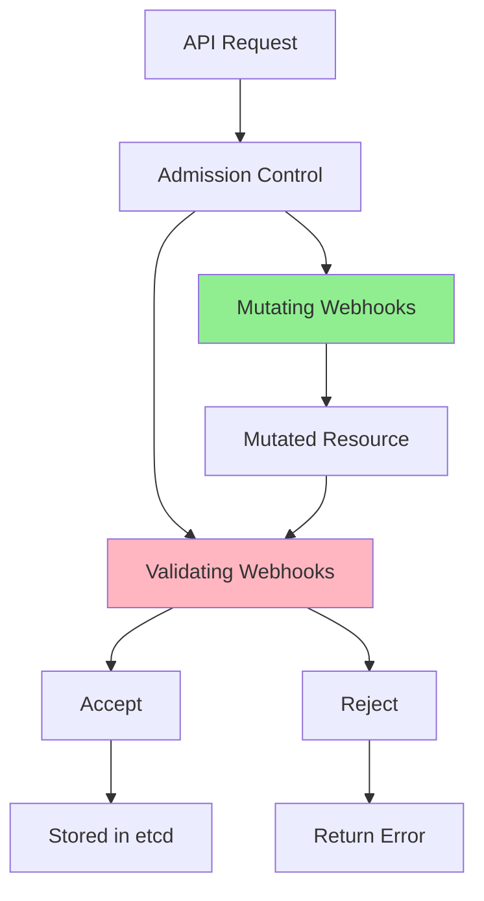
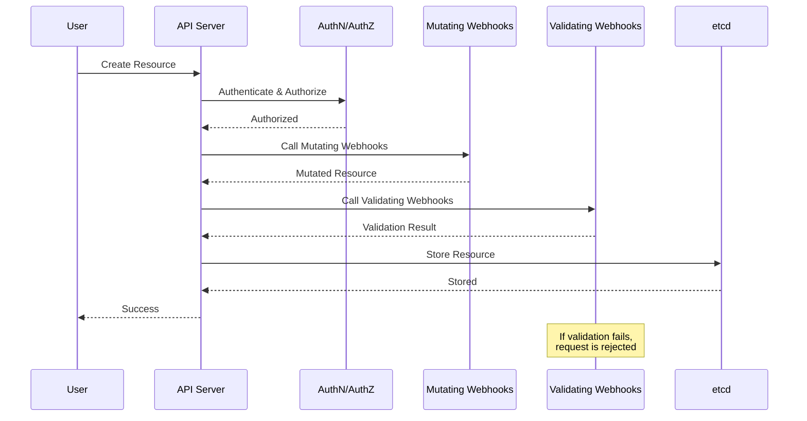
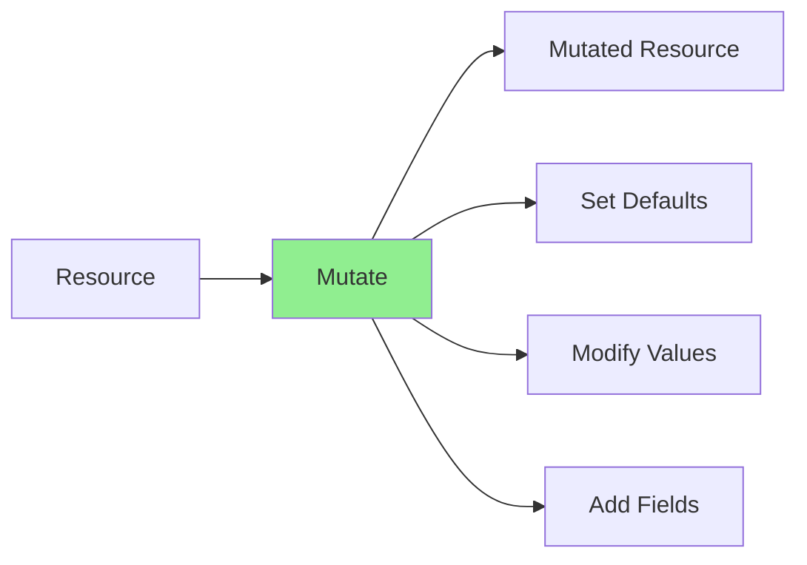
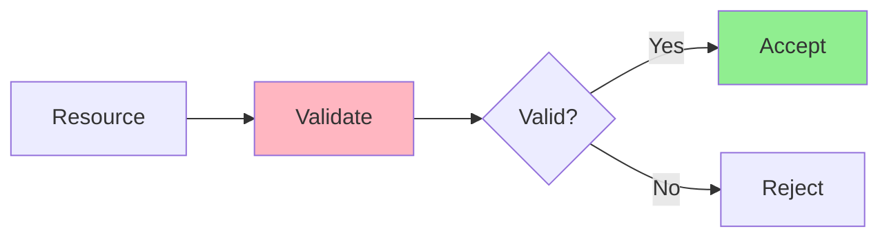
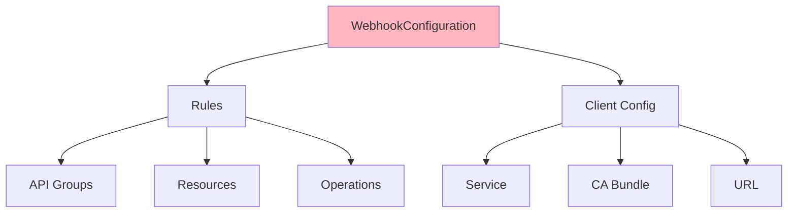
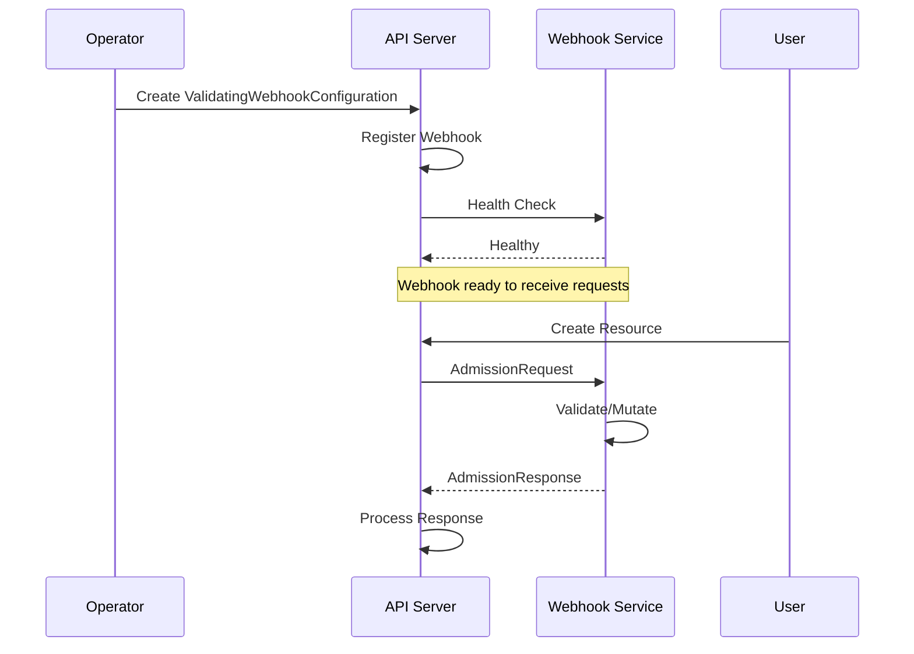
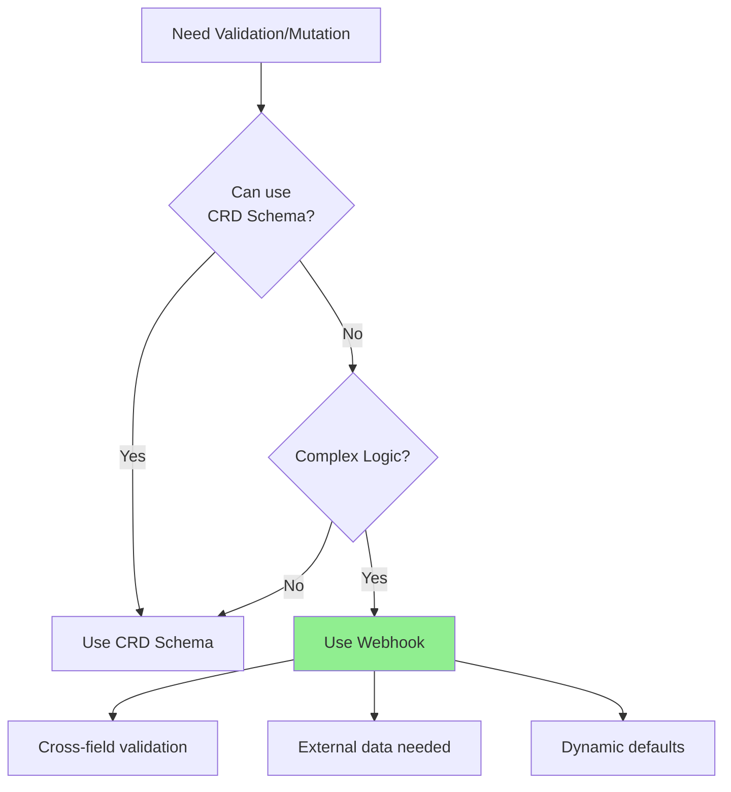

# Lesson 5.1: Kubernetes Admission Control

**Navigation:** [Module Overview](../README.md) | [Next Lesson: Validating Webhooks →](02-validating-webhooks.md)

## Introduction

In [Module 1](../../module-01/lessons/04-custom-resources.md) and [Module 3](../../module-03/lessons/02-designing-api.md), you learned about CRD schema validation. But sometimes you need more complex validation or want to set defaults dynamically. **Admission webhooks** allow you to intercept resource creation/updates and validate or mutate them before they're stored.

## What is Admission Control?

Admission control is a Kubernetes feature that intercepts requests to the API server:



## Admission Control Flow

Here's the complete flow when a resource is created:



## Mutating vs Validating Webhooks

### Mutating Webhooks

**Purpose:** Modify resources before validation



**Use cases:**
- Set default values
- Add required fields
- Modify resource structure
- Inject sidecar containers

**Order:** Run **before** validating webhooks

### Validating Webhooks

**Purpose:** Validate resources and accept/reject



**Use cases:**
- Complex validation rules
- Cross-field validation
- Business logic validation
- Policy enforcement

**Order:** Run **after** mutating webhooks

## Webhook Configuration

Webhooks are configured via `ValidatingWebhookConfiguration` or `MutatingWebhookConfiguration`:



### Webhook Rules

Rules define when webhooks are called:

```yaml
rules:
- apiGroups: ["database.example.com"]
  apiVersions: ["v1"]
  resources: ["databases"]
  operations: ["CREATE", "UPDATE"]
```

### Client Configuration

Defines how to reach the webhook:

```yaml
clientConfig:
  service:
    name: database-webhook-service
    namespace: default
    path: "/validate-database"
  caBundle: <base64-encoded-ca-cert>
```

## Admission Request/Response

### Request Structure

```go
type AdmissionRequest struct {
    UID      string
    Kind     metav1.GroupVersionKind
    Resource metav1.GroupVersionResource
    Object   runtime.RawExtension  // The resource being created/updated
    OldObject runtime.RawExtension // Previous version (for updates)
    Operation string               // CREATE, UPDATE, DELETE
    UserInfo  authenticationv1.UserInfo
}
```

### Response Structure

```go
type AdmissionResponse struct {
    UID     string
    Allowed bool
    Result  *metav1.Status  // Error details if not allowed
    Patch   []byte          // JSON patch for mutations
    PatchType *PatchType    // JSONPatch or StrategicMergePatch
}
```

## Webhook Registration Process

Here's how webhooks are registered:



## When to Use Webhooks

### Use Webhooks When:



**Use webhooks for:**
- Cross-field validation (field A depends on field B)
- External data validation (check against external API)
- Complex business rules
- Dynamic defaulting based on context
- Policy enforcement

**Use CRD schema for:**
- Simple field validation
- Type checking
- Required fields
- Pattern matching
- Enum values

## Key Takeaways

- **Admission control** intercepts API requests
- **Mutating webhooks** modify resources (run first)
- **Validating webhooks** validate resources (run after mutation)
- **Webhook configuration** defines when and how webhooks are called
- **Admission request/response** structures define the interface
- Use webhooks for **complex validation** that CRD schema can't handle
- Use CRD schema for **simple validation**

## Understanding for Building Operators

When implementing webhooks:
- Mutating webhooks run before validating
- Both can reject requests
- Mutating webhooks return patches
- Validating webhooks return allow/deny
- Webhooks need certificates for TLS
- Webhooks must be fast (affects API latency)

## Related Lab

- [Lab 5.1: Exploring Admission Control](../labs/lab-01-admission-control.md) - Hands-on exercises for this lesson

## References

### Official Documentation
- [Dynamic Admission Control](https://kubernetes.io/docs/reference/access-authn-authz/extensible-admission-controllers/)
- [Admission Controllers](https://kubernetes.io/docs/reference/access-authn-authz/admission-controllers/)
- [Webhook Configuration](https://kubernetes.io/docs/reference/access-authn-authz/extensible-admission-controllers/#webhook-configuration)

### Further Reading
- **Kubernetes Operators** by Jason Dobies and Joshua Wood - Chapter 9: Webhooks
- **Programming Kubernetes** by Michael Hausenblas and Stefan Schimanski - Chapter 9: Admission Control
- [Kubernetes Admission Control Guide](https://kubernetes.io/docs/reference/access-authn-authz/extensible-admission-controllers/)

### Related Topics
- [Validating Admission Webhooks](https://kubernetes.io/docs/reference/access-authn-authz/admission-controllers/#validatingadmissionwebhook)
- [Mutating Admission Webhooks](https://kubernetes.io/docs/reference/access-authn-authz/admission-controllers/#validatingadmissionwebhook)
- [Webhook Best Practices](https://kubernetes.io/docs/concepts/cluster-administration/admission-webhooks-good-practices/)

## Next Steps

Now that you understand admission control, let's implement a validating webhook for your operator.

**Navigation:** [← Module Overview](../README.md) | [Next: Validating Webhooks →](02-validating-webhooks.md)

