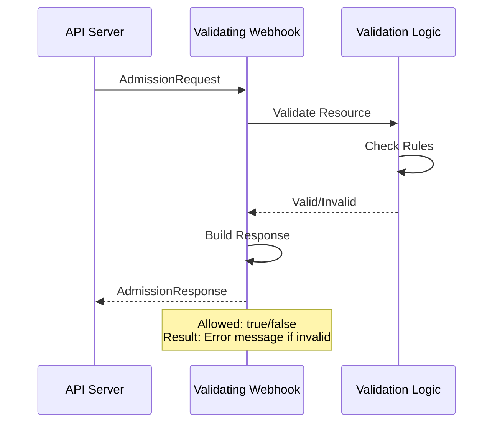
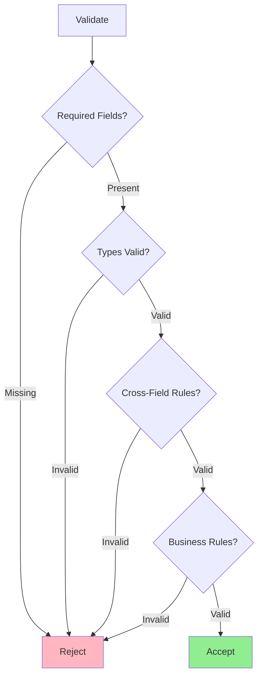
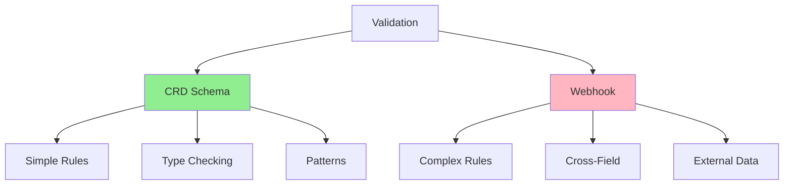
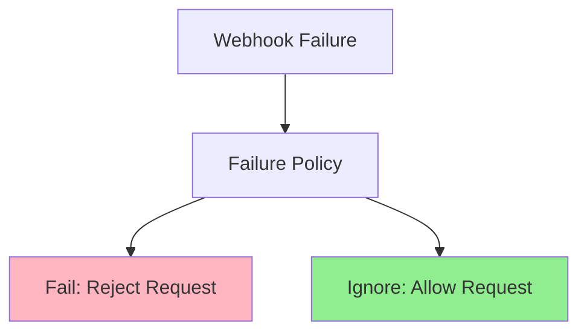

# Lesson 5.2: Implementing Validating Webhooks

**Navigation:** [← Previous: Admission Control](01-admission-control.md) | [Module Overview](../README.md) | [Next: Mutating Webhooks →](03-mutating-webhooks.md)

## Introduction

Validating webhooks allow you to implement custom validation logic that goes beyond CRD schema validation. You can validate cross-field relationships, check against external systems, and enforce complex business rules. In this lesson, you'll learn how to implement validating webhooks using kubebuilder.

## Validating Webhook Flow

Here's how a validating webhook works:



## Creating Validating Webhook with Kubebuilder

Kubebuilder makes it easy to scaffold webhooks:

```bash
# Create validating webhook
kubebuilder create webhook --group database --version v1 --kind Database --programmatic-validation
```

This generates:
- Webhook handler code
- Webhook configuration manifests
- Certificate setup

## Webhook Handler Structure

The generated webhook handler in `internal/webhook/v1/database_webhook.go` looks like this:

```go
package v1

import (
    "context"
    "fmt"

    "k8s.io/apimachinery/pkg/runtime"
    ctrl "sigs.k8s.io/controller-runtime"
    logf "sigs.k8s.io/controller-runtime/pkg/log"
    "sigs.k8s.io/controller-runtime/pkg/webhook"
    "sigs.k8s.io/controller-runtime/pkg/webhook/admission"

    databasev1 "github.com/example/postgres-operator/api/v1"
)

var databaselog = logf.Log.WithName("database-resource")

// SetupDatabaseWebhookWithManager registers the webhook for Database in the manager.
func SetupDatabaseWebhookWithManager(mgr ctrl.Manager) error {
    return ctrl.NewWebhookManagedBy(mgr).For(&databasev1.Database{}).
        WithValidator(&DatabaseCustomValidator{}).
        Complete()
}

// +kubebuilder:webhook:path=/validate-database-example-com-v1-database,mutating=false,failurePolicy=fail,sideEffects=None,groups=database.example.com,resources=databases,verbs=create;update,versions=v1,name=vdatabase-v1.kb.io,admissionReviewVersions=v1

// DatabaseCustomValidator struct is responsible for validating the Database resource
// when it is created, updated, or deleted.
type DatabaseCustomValidator struct {
    // Add more fields as needed for validation
}

var _ webhook.CustomValidator = &DatabaseCustomValidator{}

// ValidateCreate implements webhook.CustomValidator so a webhook will be registered for the type Database.
func (v *DatabaseCustomValidator) ValidateCreate(ctx context.Context, obj runtime.Object) (admission.Warnings, error) {
    database, ok := obj.(*databasev1.Database)
    if !ok {
        return nil, fmt.Errorf("expected a Database object but got %T", obj)
    }
    databaselog.Info("Validation for Database upon creation", "name", database.GetName())

    // Validation logic for CREATE
    return nil, nil
}

// ValidateUpdate implements webhook.CustomValidator so a webhook will be registered for the type Database.
func (v *DatabaseCustomValidator) ValidateUpdate(ctx context.Context, oldObj, newObj runtime.Object) (admission.Warnings, error) {
    database, ok := newObj.(*databasev1.Database)
    if !ok {
        return nil, fmt.Errorf("expected a Database object for the newObj but got %T", newObj)
    }
    databaselog.Info("Validation for Database upon update", "name", database.GetName())

    // Validation logic for UPDATE
    return nil, nil
}

// ValidateDelete implements webhook.CustomValidator so a webhook will be registered for the type Database.
func (v *DatabaseCustomValidator) ValidateDelete(ctx context.Context, obj runtime.Object) (admission.Warnings, error) {
    database, ok := obj.(*databasev1.Database)
    if !ok {
        return nil, fmt.Errorf("expected a Database object but got %T", obj)
    }
    databaselog.Info("Validation for Database upon deletion", "name", database.GetName())

    // Validation logic for DELETE
    return nil, nil
}
```

**Key points about the structure:**
- Webhook code is in `internal/webhook/v1/` directory, not in `api/v1/`
- Uses a separate `DatabaseCustomValidator` struct (not methods on Database type)
- Implements `webhook.CustomValidator` interface
- All methods receive `context.Context` as first parameter
- `ValidateUpdate` receives both `oldObj` and `newObj` as `runtime.Object`
- Objects must be type-asserted to the actual Database type

## Implementing Validation Logic

### Example: Cross-Field Validation

```go
func (v *DatabaseCustomValidator) ValidateCreate(ctx context.Context, obj runtime.Object) (admission.Warnings, error) {
    database, ok := obj.(*databasev1.Database)
    if !ok {
        return nil, fmt.Errorf("expected a Database object but got %T", obj)
    }
    databaselog.Info("Validation for Database upon creation", "name", database.GetName())

    // Example: Validate that replicas match storage size
    if database.Spec.Replicas != nil && *database.Spec.Replicas > 5 {
        if database.Spec.Storage.Size == "10Gi" {
            return nil, fmt.Errorf("replicas > 5 requires storage >= 50Gi, got %s", database.Spec.Storage.Size)
        }
    }
    
    // Example: Validate image version
    if !strings.Contains(database.Spec.Image, "postgres") {
        return nil, fmt.Errorf("image must be a PostgreSQL image, got %s", database.Spec.Image)
    }
    
    return nil, nil
}
```

### Example: Update Validation

```go
func (v *DatabaseCustomValidator) ValidateUpdate(ctx context.Context, oldObj, newObj runtime.Object) (admission.Warnings, error) {
    database, ok := newObj.(*databasev1.Database)
    if !ok {
        return nil, fmt.Errorf("expected a Database object for the newObj but got %T", newObj)
    }
    oldDB, ok := oldObj.(*databasev1.Database)
    if !ok {
        return nil, fmt.Errorf("expected a Database object for the oldObj but got %T", oldObj)
    }
    databaselog.Info("Validation for Database upon update", "name", database.GetName())
    
    // Prevent downgrading image version
    oldVersion := extractVersion(oldDB.Spec.Image)
    newVersion := extractVersion(database.Spec.Image)
    
    if compareVersions(oldVersion, newVersion) < 0 {
        return nil, fmt.Errorf("cannot downgrade from %s to %s", oldDB.Spec.Image, database.Spec.Image)
    }
    
    // Prevent reducing storage size
    oldSize := parseSize(oldDB.Spec.Storage.Size)
    newSize := parseSize(database.Spec.Storage.Size)
    
    if newSize < oldSize {
        return nil, fmt.Errorf("cannot reduce storage from %s to %s", oldDB.Spec.Storage.Size, database.Spec.Storage.Size)
    }
    
    return nil, nil
}
```

## Validation Decision Tree



## Error Messages

Provide clear, actionable error messages:

```go
func (v *DatabaseCustomValidator) ValidateCreate(ctx context.Context, obj runtime.Object) (admission.Warnings, error) {
    database, ok := obj.(*databasev1.Database)
    if !ok {
        return nil, fmt.Errorf("expected a Database object but got %T", obj)
    }

    // Bad: Generic error
    // return nil, fmt.Errorf("invalid")
    
    // Good: Specific error with context
    if database.Spec.Replicas != nil && *database.Spec.Replicas < 1 {
        return nil, fmt.Errorf("spec.replicas must be >= 1, got %d", *database.Spec.Replicas)
    }
    
    // Good: Error with field path
    if database.Spec.DatabaseName == "" {
        return nil, fmt.Errorf("spec.databaseName is required")
    }
    
    return nil, nil
}
```

## Schema Validation vs Webhook Validation



**CRD Schema:**
- Fast (no network call)
- Simple validation
- Type checking
- Pattern matching

**Webhook:**
- More flexible
- Complex logic
- External data
- Cross-field validation

**Best Practice:** Use schema for simple validation, webhook for complex validation.

## Webhook Markers

Kubebuilder uses markers to configure webhooks:

```go
// +kubebuilder:webhook:path=/validate-database-example-com-v1-database,mutating=false,failurePolicy=fail,sideEffects=None,groups=database.example.com,resources=databases,verbs=create;update,versions=v1,name=vdatabase-v1.kb.io,admissionReviewVersions=v1
```

**Parameters:**
- `path`: Webhook endpoint path
- `mutating`: false for validating webhook
- `failurePolicy`: fail or ignore
- `sideEffects`: None, NoneOnDryRun, or Some
- `groups`, `resources`, `verbs`, `versions`: What to validate
- `name`: Unique webhook name (format: `vdatabase-v1.kb.io`)
- `admissionReviewVersions`: API versions for admission review (e.g., `v1`)

## Failure Policies



**Fail Policy:**
- If webhook fails, reject the request
- Safer, but can block operations if webhook is down

**Ignore Policy:**
- If webhook fails, allow the request
- Less safe, but more resilient

## Key Takeaways

- **Validating webhooks** check resources and accept/reject
- Use kubebuilder to **scaffold webhooks** easily
- Implement `webhook.CustomValidator` interface with a separate validator struct
- Methods receive `context.Context` as first parameter
- `ValidateUpdate` receives both old and new objects as `runtime.Object`
- Type-assert `runtime.Object` to your actual resource type
- Provide **clear error messages** for users
- Use for **complex validation** beyond CRD schema
- Choose appropriate **failure policy** (fail vs ignore)
- **Schema validation** runs first, then webhook validation

## Understanding for Building Operators

When implementing validating webhooks:
- Use a separate validator struct implementing `webhook.CustomValidator`
- Webhook code goes in `internal/webhook/v1/` directory
- Type-assert `runtime.Object` parameters to your actual resource type
- Use for complex validation logic
- Provide clear, actionable error messages
- Handle all operations (create, update, delete)
- Consider failure policy carefully
- Keep validation fast (affects API latency)
- Test thoroughly with valid and invalid resources

## Related Lab

- [Lab 5.2: Building Validating Webhook](../labs/lab-02-validating-webhooks.md) - Hands-on exercises for this lesson

## References

### Official Documentation
- [Validating Admission Webhooks](https://kubernetes.io/docs/reference/access-authn-authz/admission-controllers/#validatingadmissionwebhook)
- [AdmissionReview API](https://kubernetes.io/docs/reference/access-authn-authz/extensible-admission-controllers/#webhook-request-and-response)
- [Webhook Configuration](https://kubernetes.io/docs/reference/access-authn-authz/extensible-admission-controllers/#webhook-configuration)

### Further Reading
- **Kubernetes Operators** by Jason Dobies and Joshua Wood - Chapter 9: Webhooks
- **Programming Kubernetes** by Michael Hausenblas and Stefan Schimanski - Chapter 9: Admission Control
- [Kubebuilder Webhooks](https://book.kubebuilder.io/cronjob-tutorial/webhook-implementation.html)

### Related Topics
- [AdmissionReview Request/Response](https://kubernetes.io/docs/reference/access-authn-authz/extensible-admission-controllers/#webhook-request-and-response)
- [Webhook Failure Policy](https://kubernetes.io/docs/reference/access-authn-authz/extensible-admission-controllers/#failure-policy)
- [Webhook Timeouts](https://kubernetes.io/docs/reference/access-authn-authz/extensible-admission-controllers/#timeouts)

## Next Steps

Now that you understand validating webhooks, let's learn about mutating webhooks for defaulting and mutation.

**Navigation:** [← Previous: Admission Control](01-admission-control.md) | [Module Overview](../README.md) | [Next: Mutating Webhooks →](03-mutating-webhooks.md)
