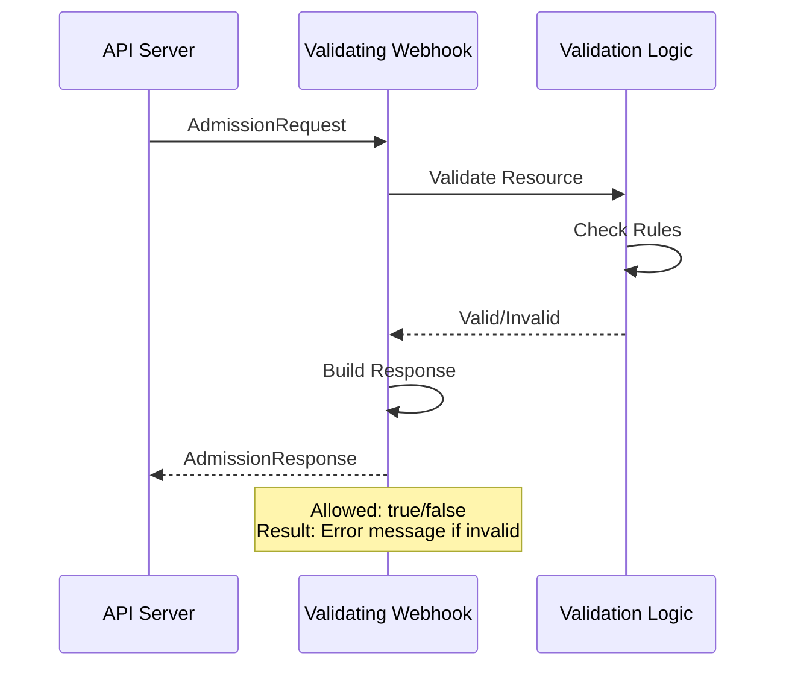
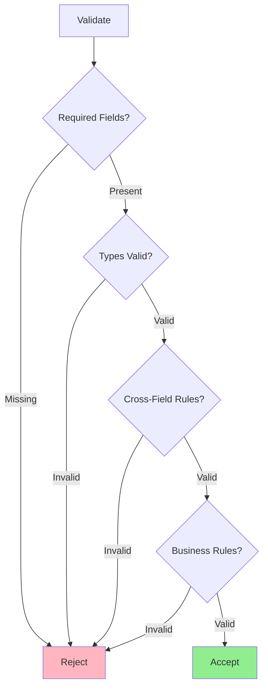
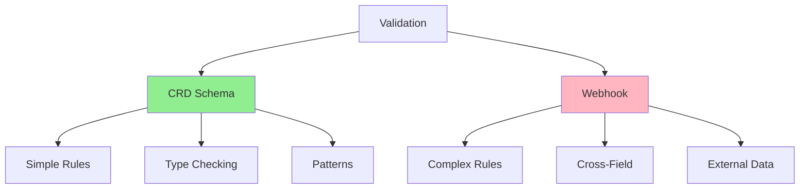
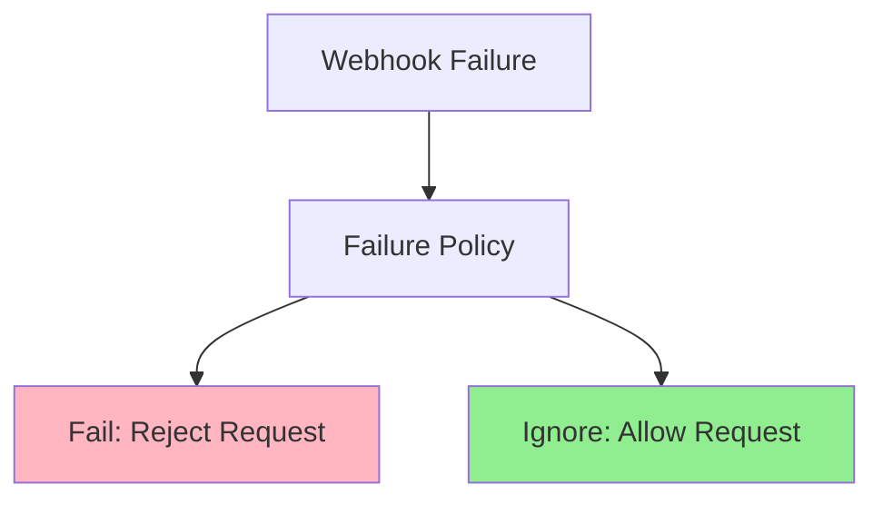

# Lesson 5.2: Implementing Validating Webhooks

**Navigation:** [← Previous: Admission Control](01-admission-control.md) | [Module Overview](../README.md) | [Next: Mutating Webhooks →](03-mutating-webhooks.md)

## Introduction

Validating webhooks allow you to implement custom validation logic that goes beyond CRD schema validation. You can validate cross-field relationships, check against external systems, and enforce complex business rules. In this lesson, you'll learn how to implement validating webhooks using kubebuilder.

## Validating Webhook Flow

Here's how a validating webhook works:



## Creating Validating Webhook with Kubebuilder

Kubebuilder makes it easy to scaffold webhooks:

```bash
# Create validating webhook
kubebuilder create webhook --group database --version v1 --kind Database --programmatic-validation
```

This generates:
- Webhook handler code
- Webhook configuration manifests
- Certificate setup

## Webhook Handler Structure

The generated webhook handler looks like this:

```go
// +kubebuilder:webhook:path=/validate-database-example-com-v1-database,mutating=false,failurePolicy=fail,sideEffects=None,groups=database.example.com,resources=databases,verbs=create;update,versions=v1,name=vdatabase.kb.io

var _ webhook.Validator = &Database{}

// ValidateCreate implements webhook.Validator so a webhook will be registered for the type
func (r *Database) ValidateCreate() (admission.Warnings, error) {
    // Validation logic for CREATE
    return nil, nil
}

// ValidateUpdate implements webhook.Validator so a webhook will be registered for the type
func (r *Database) ValidateUpdate(old runtime.Object) (admission.Warnings, error) {
    // Validation logic for UPDATE
    return nil, nil
}

// ValidateDelete implements webhook.Validator so a webhook will be registered for the type
func (r *Database) ValidateDelete() (admission.Warnings, error) {
    // Validation logic for DELETE
    return nil, nil
}
```

## Implementing Validation Logic

### Example: Cross-Field Validation

```go
func (r *Database) ValidateCreate() (admission.Warnings, error) {
    // Example: Validate that replicas match storage size
    if r.Spec.Replicas != nil && *r.Spec.Replicas > 5 {
        if r.Spec.Storage.Size == "10Gi" {
            return nil, fmt.Errorf("replicas > 5 requires storage >= 50Gi, got %s", r.Spec.Storage.Size)
        }
    }
    
    // Example: Validate image version
    if !strings.Contains(r.Spec.Image, "postgres:") {
        return nil, fmt.Errorf("image must be a PostgreSQL image, got %s", r.Spec.Image)
    }
    
    return nil, nil
}
```

### Example: Update Validation

```go
func (r *Database) ValidateUpdate(old runtime.Object) (admission.Warnings, error) {
    oldDB := old.(*Database)
    
    // Prevent downgrading image version
    oldVersion := extractVersion(oldDB.Spec.Image)
    newVersion := extractVersion(r.Spec.Image)
    
    if compareVersions(oldVersion, newVersion) < 0 {
        return nil, fmt.Errorf("cannot downgrade from %s to %s", oldDB.Spec.Image, r.Spec.Image)
    }
    
    // Prevent reducing storage size
    oldSize := parseSize(oldDB.Spec.Storage.Size)
    newSize := parseSize(r.Spec.Storage.Size)
    
    if newSize < oldSize {
        return nil, fmt.Errorf("cannot reduce storage from %s to %s", oldDB.Spec.Storage.Size, r.Spec.Storage.Size)
    }
    
    return nil, nil
}
```

## Validation Decision Tree



## Error Messages

Provide clear, actionable error messages:

```go
func (r *Database) ValidateCreate() (admission.Warnings, error) {
    // Bad: Generic error
    // return nil, fmt.Errorf("invalid")
    
    // Good: Specific error with context
    if r.Spec.Replicas != nil && *r.Spec.Replicas < 1 {
        return nil, fmt.Errorf("spec.replicas must be >= 1, got %d", *r.Spec.Replicas)
    }
    
    // Good: Error with field path
    if r.Spec.DatabaseName == "" {
        return nil, fmt.Errorf("spec.databaseName is required")
    }
    
    return nil, nil
}
```

## Schema Validation vs Webhook Validation



**CRD Schema:**
- Fast (no network call)
- Simple validation
- Type checking
- Pattern matching

**Webhook:**
- More flexible
- Complex logic
- External data
- Cross-field validation

**Best Practice:** Use schema for simple validation, webhook for complex validation.

## Webhook Markers

Kubebuilder uses markers to configure webhooks:

```go
// +kubebuilder:webhook:path=/validate-database-example-com-v1-database,mutating=false,failurePolicy=fail,sideEffects=None,groups=database.example.com,resources=databases,verbs=create;update,versions=v1,name=vdatabase.kb.io
```

**Parameters:**
- `path`: Webhook endpoint path
- `mutating`: false for validating webhook
- `failurePolicy`: fail or ignore
- `sideEffects`: None, NoneOnDryRun, or Some
- `groups`, `resources`, `verbs`, `versions`: What to validate

## Failure Policies



**Fail Policy:**
- If webhook fails, reject the request
- Safer, but can block operations if webhook is down

**Ignore Policy:**
- If webhook fails, allow the request
- Less safe, but more resilient

## Key Takeaways

- **Validating webhooks** check resources and accept/reject
- Use kubebuilder to **scaffold webhooks** easily
- Implement **ValidateCreate**, **ValidateUpdate**, **ValidateDelete**
- Provide **clear error messages** for users
- Use for **complex validation** beyond CRD schema
- Choose appropriate **failure policy** (fail vs ignore)
- **Schema validation** runs first, then webhook validation

## Understanding for Building Operators

When implementing validating webhooks:
- Use for complex validation logic
- Provide clear, actionable error messages
- Handle all operations (create, update, delete)
- Consider failure policy carefully
- Keep validation fast (affects API latency)
- Test thoroughly with valid and invalid resources

## Related Lab

- [Lab 5.2: Building Validating Webhook](../labs/lab-02-validating-webhooks.md) - Hands-on exercises for this lesson

## Next Steps

Now that you understand validating webhooks, let's learn about mutating webhooks for defaulting and mutation.

**Navigation:** [← Previous: Admission Control](01-admission-control.md) | [Module Overview](../README.md) | [Next: Mutating Webhooks →](03-mutating-webhooks.md)

