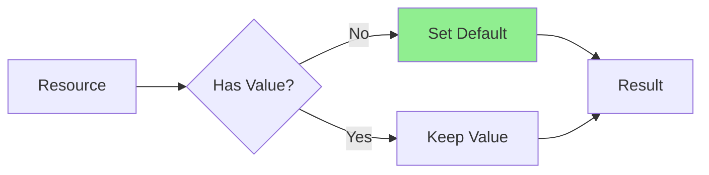
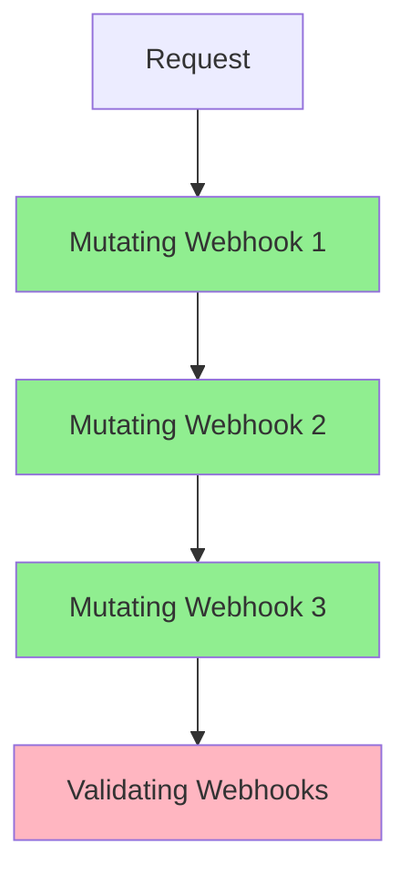
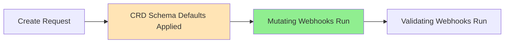

# Lesson 5.3: Implementing Mutating Webhooks

**Navigation:** [← Previous: Validating Webhooks](02-validating-webhooks.md) | [Module Overview](../README.md) | [Next: Webhook Deployment →](04-webhook-deployment.md)

## Introduction

Mutating webhooks allow you to modify resources before they're validated and stored. This is perfect for setting defaults, adding required fields, or modifying resource structure. Mutating webhooks run before validating webhooks, so they can prepare resources for validation.

## Mutating Webhook Flow

Here's how a mutating webhook works:


## Creating Mutating Webhook

If starting fresh, create mutating webhook with kubebuilder:

```bash
# Create mutating webhook
kubebuilder create webhook --group database --version v1 --kind Database --defaulting
```

If you already have a validating webhook (from Lab 5.2), add the defaulter to your existing webhook file manually.

## Webhook Handler Structure

The generated mutating webhook in `internal/webhook/v1/database_webhook.go` uses the `CustomDefaulter` interface:

```go
package v1

import (
    "context"
    "fmt"

    "k8s.io/apimachinery/pkg/runtime"
    ctrl "sigs.k8s.io/controller-runtime"
    logf "sigs.k8s.io/controller-runtime/pkg/log"
    "sigs.k8s.io/controller-runtime/pkg/webhook"

    databasev1 "github.com/example/postgres-operator/api/v1"
)

var databaselog = logf.Log.WithName("database-resource")

// SetupDatabaseWebhookWithManager registers the webhook for Database in the manager.
func SetupDatabaseWebhookWithManager(mgr ctrl.Manager) error {
    return ctrl.NewWebhookManagedBy(mgr).For(&databasev1.Database{}).
        WithValidator(&DatabaseCustomValidator{}).
        WithDefaulter(&DatabaseCustomDefaulter{}).
        Complete()
}

// +kubebuilder:webhook:path=/mutate-database-example-com-v1-database,mutating=true,failurePolicy=fail,sideEffects=None,groups=database.example.com,resources=databases,verbs=create;update,versions=v1,name=mdatabase-v1.kb.io,admissionReviewVersions=v1

// DatabaseCustomDefaulter struct is responsible for setting default values.
type DatabaseCustomDefaulter struct {}

var _ webhook.CustomDefaulter = &DatabaseCustomDefaulter{}

// Default implements webhook.CustomDefaulter so a webhook will be registered for the type Database.
func (d *DatabaseCustomDefaulter) Default(ctx context.Context, obj runtime.Object) error {
    database, ok := obj.(*databasev1.Database)
    if !ok {
        return fmt.Errorf("expected a Database object but got %T", obj)
    }
    databaselog.Info("Defaulting for Database", "name", database.GetName())

    // Defaulting logic here
    return nil
}
```

**Key points:**
- Uses `webhook.CustomDefaulter` interface with a separate struct
- `Default` method receives `context.Context` and `runtime.Object`
- Type-assert `runtime.Object` to your actual resource type
- Register with `.WithDefaulter(&DatabaseCustomDefaulter{})`

## Implementing Defaulting

### Example: Set Default Values

```go
func (d *DatabaseCustomDefaulter) Default(ctx context.Context, obj runtime.Object) error {
    database, ok := obj.(*databasev1.Database)
    if !ok {
        return fmt.Errorf("expected a Database object but got %T", obj)
    }
    databaselog.Info("Defaulting for Database", "name", database.GetName())

    // Set default image if not specified
    if database.Spec.Image == "" {
        database.Spec.Image = "postgres:14"
    }

    // Set default replicas if not specified
    if database.Spec.Replicas == nil {
        replicas := int32(1)
        database.Spec.Replicas = &replicas
    }

    // Set default storage class if not specified
    if database.Spec.Storage.StorageClass == "" {
        database.Spec.Storage.StorageClass = "standard"
    }

    return nil
}
```

### Example: Context-Aware Defaults

```go
func (d *DatabaseCustomDefaulter) Default(ctx context.Context, obj runtime.Object) error {
    database, ok := obj.(*databasev1.Database)
    if !ok {
        return fmt.Errorf("expected a Database object but got %T", obj)
    }

    // Set defaults based on namespace
    if database.Namespace == "production" {
        if database.Spec.Replicas == nil {
            replicas := int32(3)  // More replicas in production
            database.Spec.Replicas = &replicas
        }
    } else {
        if database.Spec.Replicas == nil {
            replicas := int32(1)  // Single replica in dev
            database.Spec.Replicas = &replicas
        }
    }

    // Set image based on environment
    if database.Spec.Image == "" {
        if database.Namespace == "production" {
            database.Spec.Image = "postgres:14"  // Stable version
        } else {
            database.Spec.Image = "postgres:latest"  // Latest in dev
        }
    }

    return nil
}
```

## Common Mutation Patterns

### Pattern 1: Set Defaults



### Pattern 2: Add Required Fields

```go
func (d *DatabaseCustomDefaulter) Default(ctx context.Context, obj runtime.Object) error {
    database, ok := obj.(*databasev1.Database)
    if !ok {
        return fmt.Errorf("expected a Database object but got %T", obj)
    }

    // Add labels if missing
    if database.Labels == nil {
        database.Labels = make(map[string]string)
    }
    if _, exists := database.Labels["managed-by"]; !exists {
        database.Labels["managed-by"] = "database-operator"
    }

    // Add annotations
    if database.Annotations == nil {
        database.Annotations = make(map[string]string)
    }
    if _, exists := database.Annotations["database.example.com/version"]; !exists {
        database.Annotations["database.example.com/version"] = "v1"
    }

    return nil
}
```

## Mutation Order

Mutating webhooks run in a specific order:



**Important:** Mutations are applied sequentially, so order matters!

## Idempotent Mutations

Mutations must be **idempotent** - applying them multiple times should have the same effect:

```go
func (d *DatabaseCustomDefaulter) Default(ctx context.Context, obj runtime.Object) error {
    database, ok := obj.(*databasev1.Database)
    if !ok {
        return fmt.Errorf("expected a Database object but got %T", obj)
    }

    // Idempotent: Safe to call multiple times
    if database.Spec.Image == "" {
        database.Spec.Image = "postgres:14"
    }
    // If already set, doesn't change

    // NOT idempotent: Would keep appending
    // database.Spec.Tags = append(database.Spec.Tags, "default")  // BAD!

    // Idempotent: Check before adding
    if !contains(database.Spec.Tags, "default") {
        database.Spec.Tags = append(database.Spec.Tags, "default")
    }

    return nil
}
```

## CRD Schema Defaults vs Webhook Defaults

An important consideration when implementing defaulting:



**CRD schema defaults** (via `+kubebuilder:default` markers) are applied **before** mutating webhooks:

```go
// In api/v1/database_types.go
// +kubebuilder:default=1
Replicas *int32 `json:"replicas,omitempty"`
```

This means when your webhook runs, `Replicas` is already `1`, not `nil`. To override:

```go
// Check for the default value, not just nil
if database.Namespace == "production" {
    if database.Spec.Replicas == nil || *database.Spec.Replicas < 3 {
        replicas := int32(3)
        database.Spec.Replicas = &replicas
    }
}
```

**Best Practice:** Use CRD schema defaults for simple static defaults, webhooks for context-aware defaults.

## Key Takeaways

- **Mutating webhooks** modify resources before validation
- Run **before** validating webhooks, but **after** CRD schema defaults
- Use `webhook.CustomDefaulter` interface with separate struct
- `Default` method receives `context.Context` and `runtime.Object`
- Register with `.WithDefaulter(&DatabaseCustomDefaulter{})`
- Mutations must be **idempotent**
- Provide **sensible defaults** based on context
- Check for default values, not just `nil`, when overriding CRD schema defaults

## Understanding for Building Operators

When implementing mutating webhooks:
- Add to existing webhook file in `internal/webhook/v1/`
- Use separate `CustomDefaulter` struct
- Set defaults for optional fields
- Add required fields automatically
- Make mutations idempotent
- Consider context (namespace, labels, etc.)
- Keep mutations simple and predictable

## Related Lab

- [Lab 5.3: Building Mutating Webhook](../labs/lab-03-mutating-webhooks.md) - Hands-on exercises for this lesson

## References

### Official Documentation
- [Mutating Admission Webhooks](https://kubernetes.io/docs/reference/access-authn-authz/admission-controllers/#mutatingadmissionwebhook)
- [JSON Patch](https://datatracker.ietf.org/doc/html/rfc6902)
- [AdmissionReview API](https://kubernetes.io/docs/reference/access-authn-authz/extensible-admission-controllers/#webhook-request-and-response)

### Further Reading
- **Kubernetes Operators** by Jason Dobies and Joshua Wood - Chapter 9: Webhooks
- **Programming Kubernetes** by Michael Hausenblas and Stefan Schimanski - Chapter 9: Admission Control
- [Kubebuilder Defaulting Webhooks](https://book.kubebuilder.io/cronjob-tutorial/webhook-implementation.html#defaulting)

### Related Topics
- [JSON Patch Specification](https://datatracker.ietf.org/doc/html/rfc6902)
- [Webhook Mutation Best Practices](https://kubernetes.io/docs/reference/access-authn-authz/extensible-admission-controllers/#best-practices-and-warnings)
- [Idempotent Mutations](https://kubernetes.io/docs/reference/access-authn-authz/extensible-admission-controllers/#idempotency)

## Next Steps

Now that you understand mutating webhooks, let's learn about deploying webhooks and managing certificates.

**Navigation:** [← Previous: Validating Webhooks](02-validating-webhooks.md) | [Module Overview](../README.md) | [Next: Webhook Deployment →](04-webhook-deployment.md)
