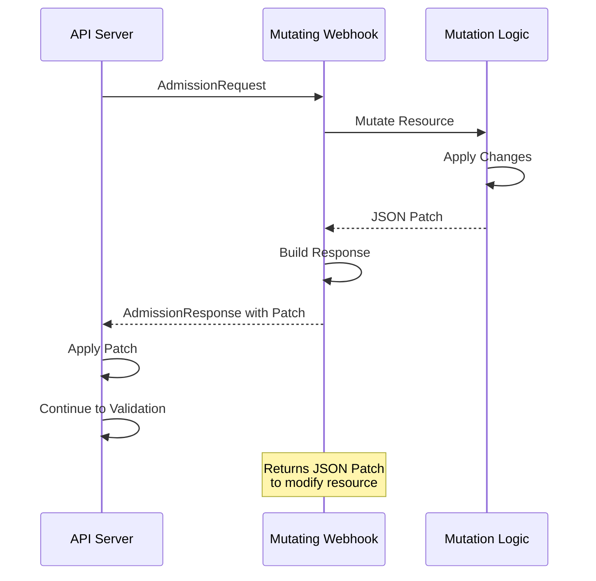
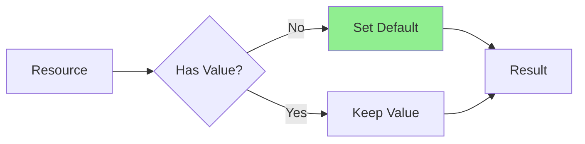
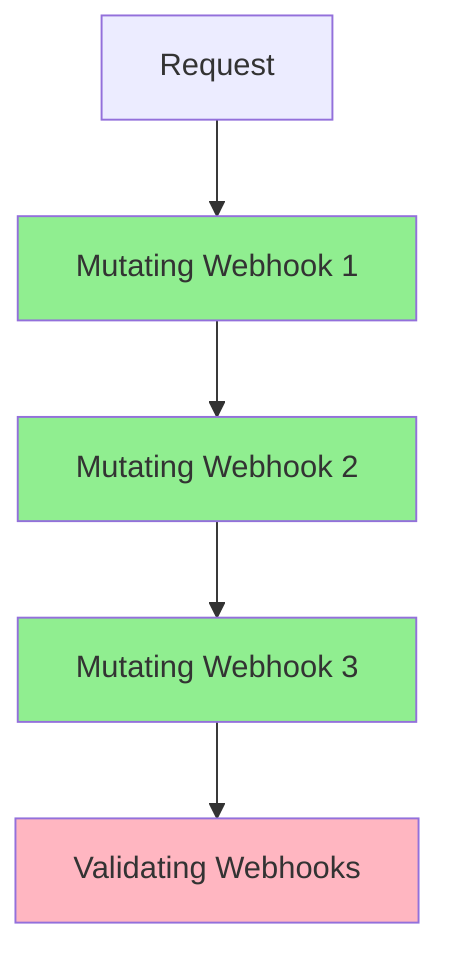

# Lesson 5.3: Implementing Mutating Webhooks

**Navigation:** [← Previous: Validating Webhooks](02-validating-webhooks.md) | [Module Overview](../README.md) | [Next: Webhook Deployment →](04-webhook-deployment.md)

## Introduction

Mutating webhooks allow you to modify resources before they're validated and stored. This is perfect for setting defaults, adding required fields, or modifying resource structure. Mutating webhooks run before validating webhooks, so they can prepare resources for validation.

## Mutating Webhook Flow

Here's how a mutating webhook works:



## Creating Mutating Webhook

Create mutating webhook with kubebuilder:

```bash
# Create mutating webhook
kubebuilder create webhook --group database --version v1 --kind Database --defaulting
```

This generates the mutating webhook handler.

## Webhook Handler Structure

The generated mutating webhook handler:

```go
// +kubebuilder:webhook:path=/mutate-database-example-com-v1-database,mutating=true,failurePolicy=fail,sideEffects=None,groups=database.example.com,resources=databases,verbs=create;update,versions=v1,name=mdatabase.kb.io

var _ webhook.Defaulter = &Database{}

// Default implements webhook.Defaulter so a webhook will be registered for the type
func (r *Database) Default() {
    // Defaulting logic
}
```

## Implementing Defaulting

### Example: Set Default Values

```go
func (r *Database) Default() {
    // Set default image if not specified
    if r.Spec.Image == "" {
        r.Spec.Image = "postgres:14"
    }
    
    // Set default replicas if not specified
    if r.Spec.Replicas == nil {
        replicas := int32(1)
        r.Spec.Replicas = &replicas
    }
    
    // Set default storage class if not specified
    if r.Spec.Storage.StorageClass == "" {
        r.Spec.Storage.StorageClass = "standard"
    }
}
```

### Example: Context-Aware Defaults

```go
func (r *Database) Default() {
    // Set defaults based on namespace
    if r.Namespace == "production" {
        if r.Spec.Replicas == nil {
            replicas := int32(3)  // More replicas in production
            r.Spec.Replicas = &replicas
        }
    } else {
        if r.Spec.Replicas == nil {
            replicas := int32(1)  // Single replica in dev
            r.Spec.Replicas = &replicas
        }
    }
    
    // Set image based on environment
    if r.Spec.Image == "" {
        if r.Namespace == "production" {
            r.Spec.Image = "postgres:14"  // Stable version
        } else {
            r.Spec.Image = "postgres:latest"  // Latest in dev
        }
    }
}
```

## Mutation Strategies

### Strategy 1: Direct Modification

Kubebuilder handles patching automatically when you modify the object:

```go
func (r *Database) Default() {
    // Just modify the object
    if r.Spec.Image == "" {
        r.Spec.Image = "postgres:14"
    }
    // Kubebuilder creates the patch automatically
}
```

### Strategy 2: JSON Patch

For more control, you can return JSON patches directly:

```go
func (r *Database) Default() (admission.Warnings, error) {
    patches := []jsonpatch.Operation{}
    
    if r.Spec.Image == "" {
        patches = append(patches, jsonpatch.Operation{
            Operation: "add",
            Path:      "/spec/image",
            Value:     "postgres:14",
        })
    }
    
    patchBytes, _ := json.Marshal(patches)
    return nil, &admission.Response{
        Patches: patchBytes,
        PatchType: &[]admissionv1.PatchType{admissionv1.PatchTypeJSONPatch}[0],
    }
}
```

## Common Mutation Patterns

### Pattern 1: Set Defaults



### Pattern 2: Add Required Fields

```go
func (r *Database) Default() {
    // Add labels if missing
    if r.Labels == nil {
        r.Labels = make(map[string]string)
    }
    r.Labels["managed-by"] = "database-operator"
    
    // Add annotations
    if r.Annotations == nil {
        r.Annotations = make(map[string]string)
    }
    r.Annotations["database.example.com/version"] = "v1"
}
```

### Pattern 3: Normalize Values

```go
func (r *Database) Default() {
    // Normalize image tag
    if strings.HasSuffix(r.Spec.Image, ":latest") {
        r.Spec.Image = strings.Replace(r.Spec.Image, ":latest", ":14", 1)
    }
    
    // Normalize storage size (ensure uppercase)
    r.Spec.Storage.Size = strings.ToUpper(r.Spec.Storage.Size)
}
```

## Mutation Order

Mutating webhooks run in a specific order:



**Important:** Mutations are applied sequentially, so order matters!

## Idempotent Mutations

Mutations must be **idempotent** - applying them multiple times should have the same effect:

```go
func (r *Database) Default() {
    // Idempotent: Safe to call multiple times
    if r.Spec.Image == "" {
        r.Spec.Image = "postgres:14"
    }
    // If already set, doesn't change
    
    // NOT idempotent: Would keep appending
    // r.Spec.Tags = append(r.Spec.Tags, "default")  // BAD!
    
    // Idempotent: Check before adding
    if !contains(r.Spec.Tags, "default") {
        r.Spec.Tags = append(r.Spec.Tags, "default")
    }
}
```

## Key Takeaways

- **Mutating webhooks** modify resources before validation
- Run **before** validating webhooks
- Use for **setting defaults** and **adding fields**
- Kubebuilder **automatically creates patches** from object modifications
- Mutations must be **idempotent**
- Provide **sensible defaults** based on context
- **Normalize values** for consistency

## Understanding for Building Operators

When implementing mutating webhooks:
- Set defaults for optional fields
- Add required fields automatically
- Normalize values for consistency
- Make mutations idempotent
- Consider context (namespace, labels, etc.)
- Keep mutations simple and predictable

## Related Lab

- [Lab 5.3: Building Mutating Webhook](../labs/lab-03-mutating-webhooks.md) - Hands-on exercises for this lesson

## References

### Official Documentation
- [Mutating Admission Webhooks](https://kubernetes.io/docs/reference/access-authn-authz/admission-controllers/#mutatingadmissionwebhook)
- [JSON Patch](https://datatracker.ietf.org/doc/html/rfc6902)
- [AdmissionReview API](https://kubernetes.io/docs/reference/access-authn-authz/extensible-admission-controllers/#webhook-request-and-response)

### Further Reading
- **Kubernetes Operators** by Jason Dobies and Joshua Wood - Chapter 9: Webhooks
- **Programming Kubernetes** by Michael Hausenblas and Stefan Schimanski - Chapter 9: Admission Control
- [Kubebuilder Defaulting Webhooks](https://book.kubebuilder.io/cronjob-tutorial/webhook-implementation.html#defaulting)

### Related Topics
- [JSON Patch Specification](https://datatracker.ietf.org/doc/html/rfc6902)
- [Webhook Mutation Best Practices](https://kubernetes.io/docs/reference/access-authn-authz/extensible-admission-controllers/#best-practices-and-warnings)
- [Idempotent Mutations](https://kubernetes.io/docs/reference/access-authn-authz/extensible-admission-controllers/#idempotency)

## Next Steps

Now that you understand mutating webhooks, let's learn about deploying webhooks and managing certificates.

**Navigation:** [← Previous: Validating Webhooks](02-validating-webhooks.md) | [Module Overview](../README.md) | [Next: Webhook Deployment →](04-webhook-deployment.md)

