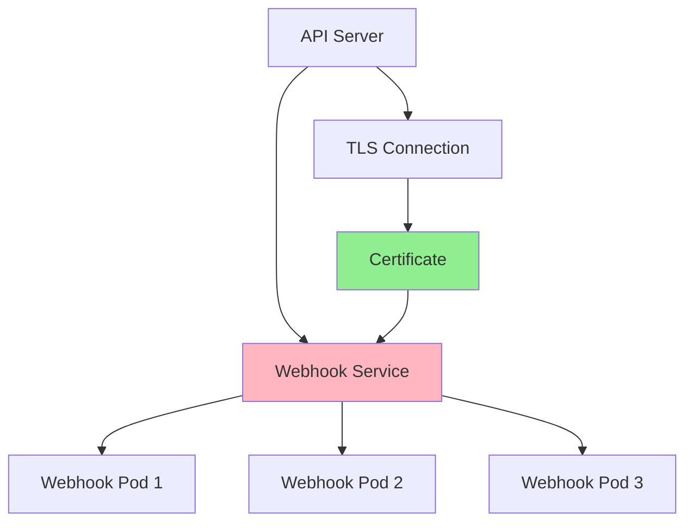
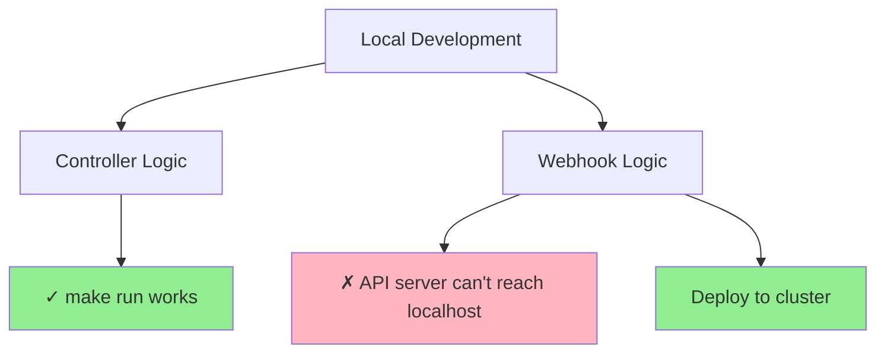
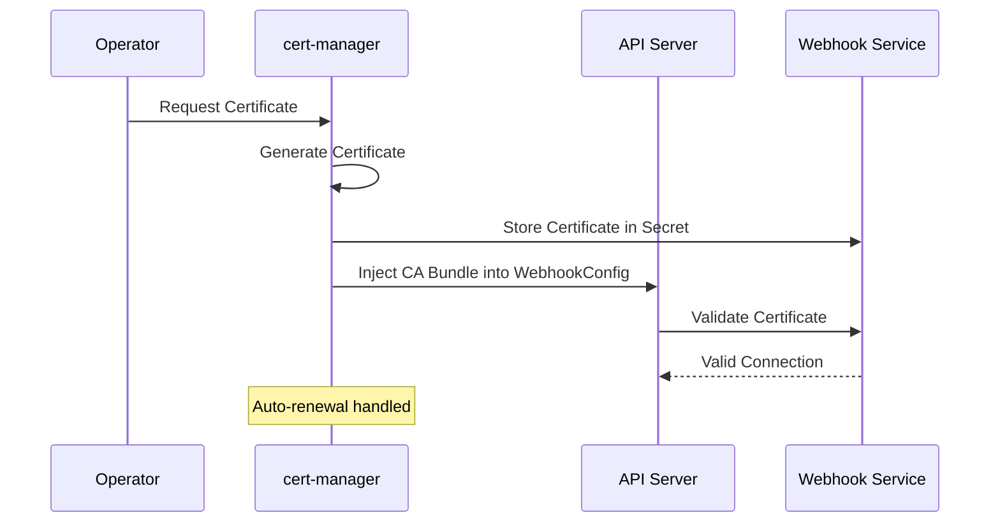
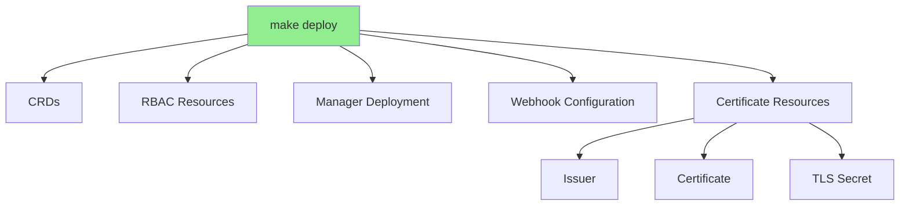
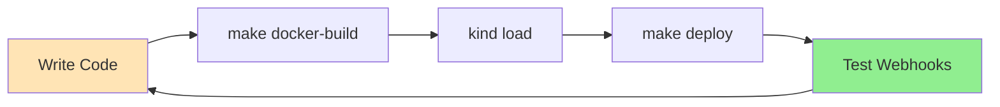
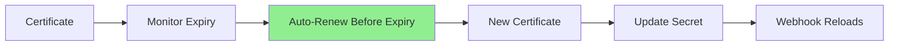

# Lesson 5.4: Webhook Deployment and Certificates

**Navigation:** [← Previous: Mutating Webhooks](03-mutating-webhooks.md) | [Module Overview](../README.md)

## Introduction

Webhooks require TLS certificates to secure communication with the API server. Managing these certificates can be complex, but kubebuilder and cert-manager make it easier. In this lesson, you'll learn how to deploy webhooks and manage certificates.

## Webhook Service Architecture

Webhooks run as services in your cluster:



## Why Webhooks Require In-Cluster Deployment

Unlike controller logic, webhooks cannot easily run locally with `make run`:



**The issue:** The Kubernetes API server needs to call your webhook over HTTPS. When running locally, the API server (inside the cluster) cannot reach your localhost.

**The solution:** Deploy the operator to the cluster where the API server can reach it.

## Certificate Management with cert-manager

cert-manager is the recommended solution for webhook certificates:



## Setting Up cert-manager

### Step 1: Install cert-manager

```bash
# Install cert-manager
kubectl apply -f https://github.com/cert-manager/cert-manager/releases/download/v1.14.0/cert-manager.yaml

# Wait for cert-manager to be ready
kubectl wait --for=condition=Available deployment/cert-manager -n cert-manager --timeout=120s
kubectl wait --for=condition=Available deployment/cert-manager-webhook -n cert-manager --timeout=120s
kubectl wait --for=condition=Available deployment/cert-manager-cainjector -n cert-manager --timeout=120s
```

> **Note:** The course's `scripts/setup-kind-cluster.sh` installs cert-manager automatically.

### Step 2: Kubebuilder Integration

Kubebuilder projects come pre-configured for cert-manager. Check `config/default/kustomization.yaml`:

```yaml
resources:
- ../crd
- ../rbac
- ../manager
- ../webhook
- ../certmanager  # Enables cert-manager integration
```

The `config/certmanager/` directory contains:
- Certificate resources
- Issuer configuration
- CA injection annotations

## Deploying Webhooks

### Step 1: Build the Image

```bash
# Build container image
make docker-build IMG=postgres-operator:latest

# For Podman:
# make docker-build IMG=postgres-operator:latest CONTAINER_TOOL=podman
```

### Step 2: Load into Kind

```bash
# For Docker:
kind load docker-image postgres-operator:latest --name k8s-operators-course

# For Podman:
podman save localhost/postgres-operator:latest -o /tmp/postgres-operator.tar
kind load image-archive /tmp/postgres-operator.tar --name k8s-operators-course
rm /tmp/postgres-operator.tar
```

### Step 3: Deploy

```bash
# Deploy to cluster
make deploy IMG=postgres-operator:latest

# For Podman:
# make deploy IMG=localhost/postgres-operator:latest
```

## What Gets Deployed

When you run `make deploy`, kustomize creates:



## Verifying Deployment

### Check Pods

```bash
kubectl get pods -n postgres-operator-system
```

### Check Webhooks

```bash
kubectl get validatingwebhookconfigurations
kubectl get mutatingwebhookconfigurations
```

### Check Certificates

```bash
kubectl get certificate -n postgres-operator-system
kubectl get secret -n postgres-operator-system | grep tls
```

## Development Workflow



For rapid iteration:

```bash
# After code changes, redeploy
make docker-build IMG=postgres-operator:latest
kind load docker-image postgres-operator:latest --name k8s-operators-course
kubectl rollout restart deployment/postgres-operator-controller-manager -n postgres-operator-system
```

## Troubleshooting Webhooks

### Common Issues

1. **Certificate not ready:**
   ```bash
   # Check certificate status
   kubectl get certificate -n postgres-operator-system
   kubectl describe certificate -n postgres-operator-system
   
   # Check cert-manager logs
   kubectl logs -n cert-manager deployment/cert-manager
   ```

2. **Webhook not called:**
   ```bash
   # Check webhook configuration
   kubectl get validatingwebhookconfiguration
   kubectl get mutatingwebhookconfiguration
   
   # Check if CA bundle is injected
   kubectl get validatingwebhookconfiguration -o yaml | grep caBundle
   ```

3. **Connection refused:**
   ```bash
   # Check webhook pod logs
   kubectl logs -n postgres-operator-system deployment/postgres-operator-controller-manager
   
   # Check service endpoints
   kubectl get endpoints -n postgres-operator-system
   ```

4. **Image pull errors:**
   ```bash
   # Check pod events
   kubectl describe pod -n postgres-operator-system -l control-plane=controller-manager
   
   # Ensure imagePullPolicy is IfNotPresent for local images
   ```

## Certificate Rotation

cert-manager handles certificate rotation automatically:



Default renewal is 30 days before expiry.

## Key Takeaways

- **Webhooks require TLS certificates** for secure communication
- **Webhooks need in-cluster deployment** - `make run` doesn't work for webhooks
- **cert-manager** provides automatic certificate management
- **Kubebuilder projects** come pre-configured for cert-manager
- Use `make deploy` workflow: build → load → deploy
- **Certificate rotation** is handled automatically by cert-manager

## Understanding for Building Operators

When deploying webhooks:
- Use cert-manager for automatic certificate management
- Deploy to cluster for webhook testing (not `make run`)
- Ensure cert-manager is installed before deploying
- Check certificate status when troubleshooting
- Use `kubectl rollout restart` for quick redeployments

## Related Lab

- [Lab 5.4: Webhook Deployment and Certificates](../labs/lab-04-webhook-deployment.md) - Hands-on exercises for this lesson

## References

### Official Documentation
- [Webhook Configuration](https://kubernetes.io/docs/reference/access-authn-authz/extensible-admission-controllers/#webhook-configuration)
- [cert-manager](https://cert-manager.io/docs/)
- [TLS in Kubernetes](https://kubernetes.io/docs/tasks/tls/managing-tls-in-a-cluster/)

### Further Reading
- **Kubernetes Operators** by Jason Dobies and Joshua Wood - Chapter 9: Webhooks
- **Programming Kubernetes** by Michael Hausenblas and Stefan Schimanski - Chapter 9: Admission Control
- [cert-manager Documentation](https://cert-manager.io/docs/)

### Related Topics
- [Webhook Failure Policy](https://kubernetes.io/docs/reference/access-authn-authz/extensible-admission-controllers/#failure-policy)
- [Webhook Timeouts](https://kubernetes.io/docs/reference/access-authn-authz/extensible-admission-controllers/#timeouts)
- [cert-manager Installation](https://cert-manager.io/docs/installation/)

## Next Steps

Congratulations! You've completed Module 5. You now understand:
- Admission control and webhooks
- Validating webhooks for custom validation
- Mutating webhooks for defaulting
- Certificate management and deployment

In [Module 6](../../module-06/README.md), you'll learn about testing and debugging operators.

**Navigation:** [← Previous: Mutating Webhooks](03-mutating-webhooks.md) | [Module Overview](../README.md) | [Next: Module 6 →](../../module-06/README.md)
