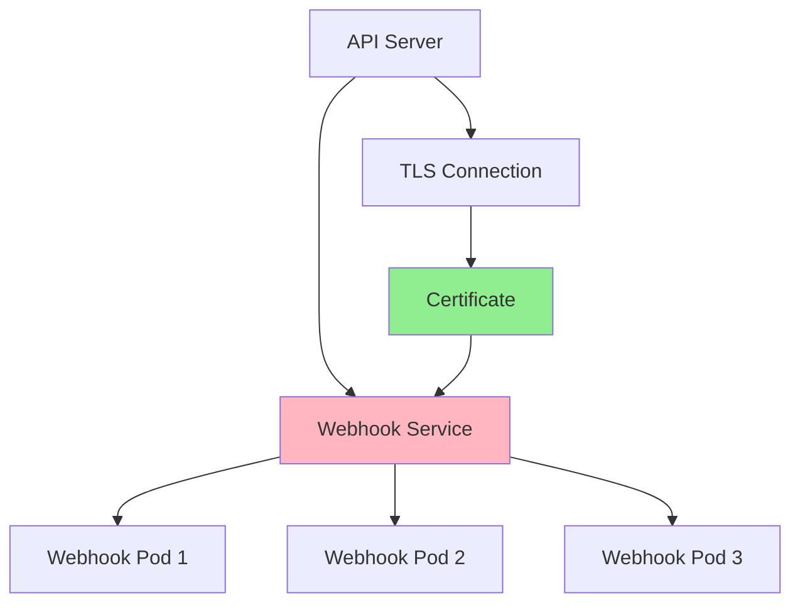
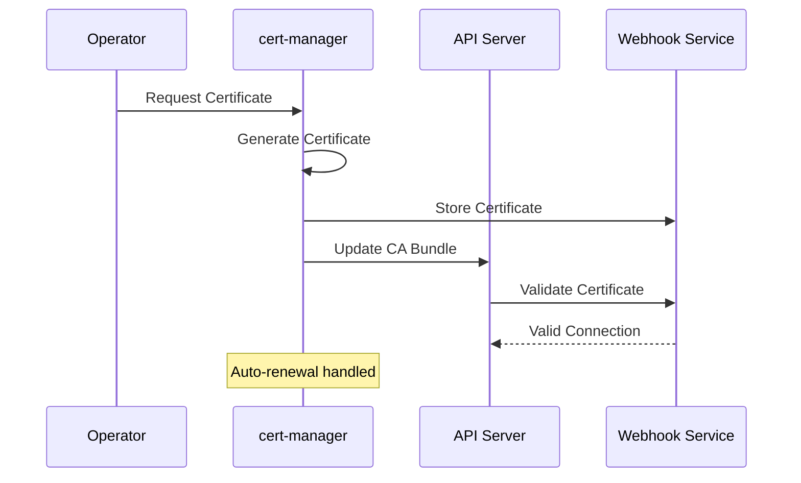
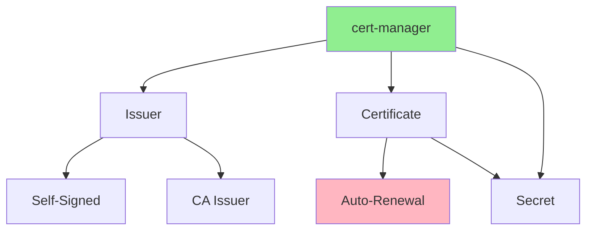
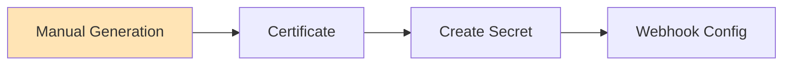
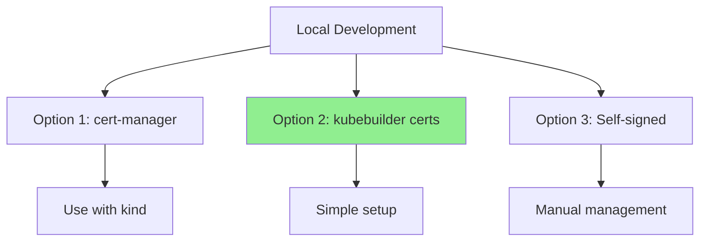
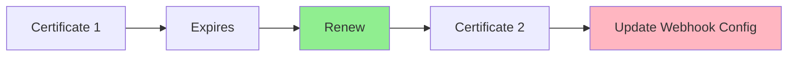

# Lesson 5.4: Webhook Deployment and Certificates

**Navigation:** [← Previous: Mutating Webhooks](03-mutating-webhooks.md) | [Module Overview](../README.md)

## Introduction

Webhooks require TLS certificates to secure communication with the API server. Managing these certificates can be complex, but kubebuilder and cert-manager make it easier. In this lesson, you'll learn how to deploy webhooks and manage certificates for both local development and production.

## Webhook Service Architecture

Webhooks run as services in your cluster:



## Certificate Management Flow

Here's how certificates are managed:



## Certificate Management Strategies

### Strategy 1: cert-manager (Production)



**Advantages:**
- Automatic certificate generation
- Auto-renewal
- Production-ready
- Supports various issuers

### Strategy 2: Manual Certificates (Development)



**Advantages:**
- Simple for development
- No dependencies
- Full control

**Disadvantages:**
- Manual renewal
- Not production-ready

### Strategy 3: Kubebuilder Certificates (Local Dev)

Kubebuilder provides tools for local development:

```bash
# Generate certificates
make certs

# Install certs
make install-cert
```

## Setting Up cert-manager

### Step 1: Install cert-manager

```bash
# Install cert-manager
kubectl apply -f https://github.com/cert-manager/cert-manager/releases/download/v1.13.0/cert-manager.yaml

# Wait for cert-manager to be ready
kubectl wait --for=condition=ready pod -l app.kubernetes.io/instance=cert-manager -n cert-manager --timeout=300s
```

### Step 2: Create Issuer

```yaml
apiVersion: cert-manager.io/v1
kind: Issuer
metadata:
  name: selfsigned-issuer
  namespace: default
spec:
  selfSigned: {}
```

### Step 3: Create Certificate

```yaml
apiVersion: cert-manager.io/v1
kind: Certificate
metadata:
  name: database-webhook-cert
  namespace: default
spec:
  secretName: database-webhook-cert
  issuerRef:
    name: selfsigned-issuer
    kind: Issuer
  dnsNames:
  - database-webhook-service.default.svc
  - database-webhook-service.default.svc.cluster.local
```

## Webhook Service Setup

### Step 1: Create Service

```yaml
apiVersion: v1
kind: Service
metadata:
  name: database-webhook-service
  namespace: default
spec:
  ports:
  - port: 443
    targetPort: 9443
  selector:
    control-plane: controller-manager
```

### Step 2: Update Webhook Configuration

The webhook configuration references the service:

```yaml
apiVersion: admissionregistration.k8s.io/v1
kind: ValidatingWebhookConfiguration
metadata:
  name: database-validating-webhook-configuration
webhooks:
- name: vdatabase.kb.io
  clientConfig:
    service:
      name: database-webhook-service
      namespace: default
      path: /validate-database-example-com-v1-database
    caBundle: <CA_BUNDLE>
```

## Local Development Setup

For local development, you need to handle certificates differently:



### Using Kubebuilder for Local Dev

```bash
# Generate certificates
make certs

# This creates:
# - certs/cert-manager/certificates/
# - certs/cert-manager/webhookcerts.yaml

# Install certificates
make install-cert

# Run webhook server
make run
```

## Webhook Deployment

### Deployment Manifest

```yaml
apiVersion: apps/v1
kind: Deployment
metadata:
  name: database-controller-manager
spec:
  replicas: 1
  selector:
    matchLabels:
      control-plane: controller-manager
  template:
    metadata:
      labels:
        control-plane: controller-manager
    spec:
      containers:
      - name: manager
        image: database-operator:latest
        ports:
        - containerPort: 9443
          name: webhook-server
        volumeMounts:
        - name: cert
          mountPath: /tmp/k8s-webhook-server/serving-certs
          readOnly: true
      volumes:
      - name: cert
        secret:
          secretName: database-webhook-cert
```

## Testing Webhooks Locally

### Option 1: Run with make run

```bash
# Generate certs
make certs

# Install certs
make install-cert

# Run operator (webhook runs in same process)
make run
```

### Option 2: Deploy to Cluster

```bash
# Build and deploy
make docker-build docker-push
make deploy

# Webhook runs in cluster
```

## Certificate Rotation

Certificates need to be rotated periodically:



**cert-manager** handles this automatically!

## Troubleshooting Webhooks

### Common Issues

1. **Certificate errors:**
   ```bash
   # Check certificate
   kubectl get certificate database-webhook-cert
   
   # Check secret
   kubectl get secret database-webhook-cert
   ```

2. **Webhook not called:**
   ```bash
   # Check webhook configuration
   kubectl get validatingwebhookconfiguration
   kubectl get mutatingwebhookconfiguration
   
   # Check service
   kubectl get service database-webhook-service
   ```

3. **Connection refused:**
   ```bash
   # Check webhook pod logs
   kubectl logs -l control-plane=controller-manager
   
   # Check service endpoints
   kubectl get endpoints database-webhook-service
   ```

## Key Takeaways

- **Webhooks require TLS certificates** for security
- **cert-manager** provides automatic certificate management
- **Kubebuilder** simplifies local development
- **Webhook service** must be accessible from API server
- **CA bundle** must match the certificate
- **Certificate rotation** is handled automatically by cert-manager
- **Local development** uses different certificate strategies

## Understanding for Building Operators

When deploying webhooks:
- Use cert-manager for production
- Use kubebuilder certs for local dev
- Ensure service is accessible
- Keep certificates up to date
- Test webhook connectivity
- Monitor certificate expiration

## Related Lab

- [Lab 5.4: Certificate Management](../labs/lab-04-webhook-deployment.md) - Hands-on exercises for this lesson

## Next Steps

Congratulations! You've completed Module 5. You now understand:
- Admission control and webhooks
- Validating webhooks for custom validation
- Mutating webhooks for defaulting
- Certificate management and deployment

In [Module 6](../module-06/README.md), you'll learn about testing and debugging operators.

**Navigation:** [← Previous: Mutating Webhooks](03-mutating-webhooks.md) | [Module Overview](../README.md) | [Next: Module 6 →](../module-06/README.md)

