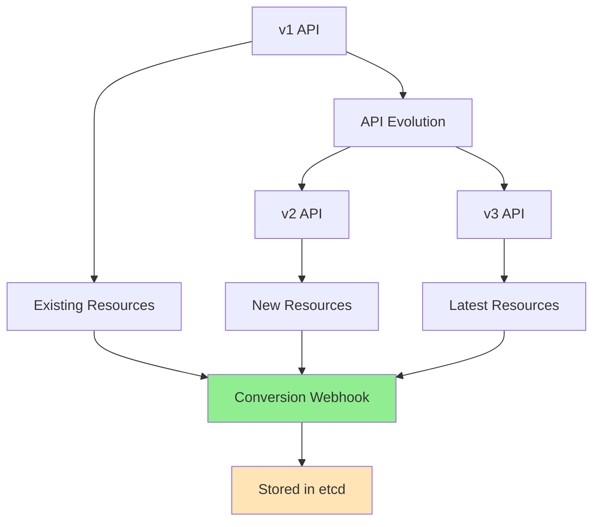
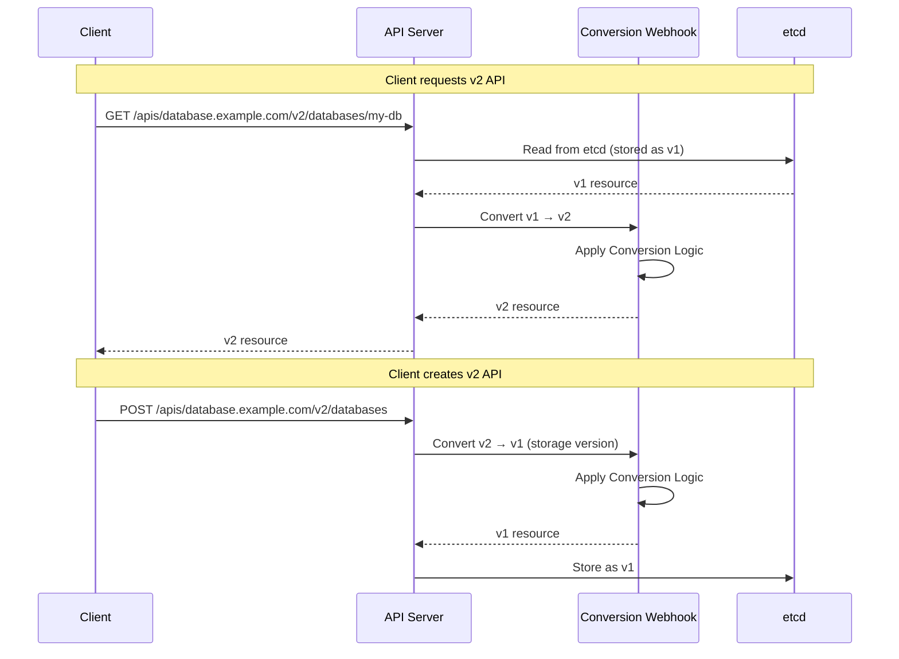
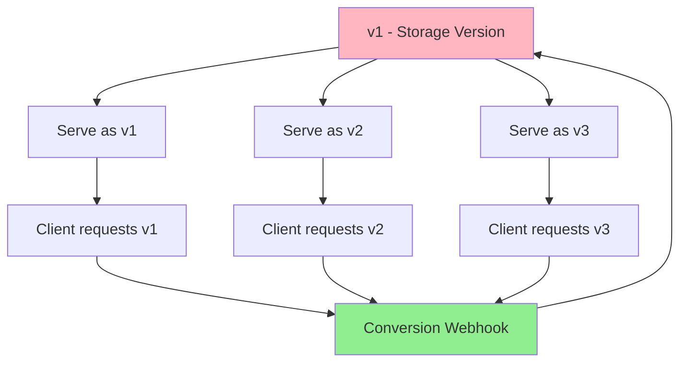
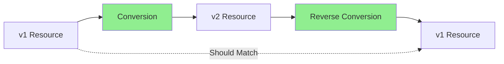
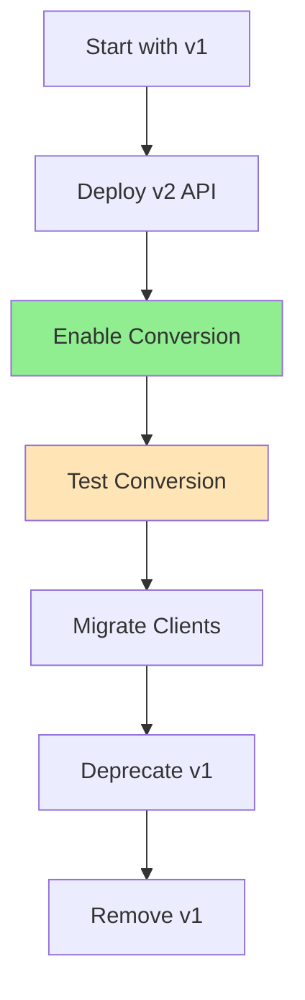

# Lesson 5.5: Conversion Webhooks and API Versioning

**Navigation:** [← Previous: Webhook Deployment](04-webhook-deployment.md) | [Module Overview](../README.md)

## Introduction

As your operator evolves, you'll need to change your API. Kubernetes supports multiple versions of Custom Resources through version conversion. Conversion webhooks allow you to convert resources between different API versions, enabling smooth API evolution without breaking existing resources.

## Why API Versioning Matters



**Key reasons for versioning:**
- **API Evolution:** Add new fields, deprecate old ones
- **Breaking Changes:** Restructure your API safely
- **Backward Compatibility:** Support old resources alongside new ones
- **Gradual Migration:** Migrate resources at your own pace

## Conversion Webhook Flow

Here's how conversion webhooks work:



## Storage Version vs Served Versions

Kubernetes stores resources in **one storage version** but can serve them in **multiple versions**:



**Key concepts:**
- **Storage Version:** The version stored in etcd (typically the oldest stable version)
- **Served Versions:** Versions that can be requested by clients
- **Conversion:** Automatic conversion between storage and served versions

## Creating Multiple API Versions

### Step 1: Create v2 API Version

```bash
# Create v2 API version
kubebuilder create api --group database --version v2 --kind Database
```

This creates:
- `api/v2/database_types.go` - v2 API types
- `api/v2/groupversion_info.go` - Version metadata
- `api/v2/zz_generated.deepcopy.go` - Deep copy methods

### Step 2: Define v2 API Structure

Example evolution from v1 to v2. Note that **v1 remains the storage version** and continues to be used throughout the course for consistency.

**v1 API (current, from Module 3):**
```go
type DatabaseSpec struct {
    Image        string                        `json:"image"`
    Replicas     *int32                        `json:"replicas,omitempty"`
    Storage      StorageSpec                   `json:"storage"`
    Resources    corev1.ResourceRequirements   `json:"resources,omitempty"`
    DatabaseName string                        `json:"databaseName"`
    Username     string                        `json:"username"`
}

type StorageSpec struct {
    Size        string `json:"size"`
    StorageClass string `json:"storageClass,omitempty"`
}
```

**v2 API (evolved - adds replication mode and backup configuration):**
```go
type DatabaseSpec struct {
    Image        string                        `json:"image"`
    DatabaseName string                        `json:"databaseName"`
    Username     string                        `json:"username"`
    
    // Replication configuration (enhanced from v1)
    Replication *ReplicationConfig            `json:"replication,omitempty"`
    
    // Storage configuration (same structure as v1)
    Storage      StorageSpec                   `json:"storage"`
    
    // Resources (same as v1)
    Resources    corev1.ResourceRequirements   `json:"resources,omitempty"`
    
    // Backup configuration (new in v2)
    Backup       *BackupConfig                 `json:"backup,omitempty"`
}

type ReplicationConfig struct {
    Replicas *int32 `json:"replicas,omitempty"`
    Mode     string `json:"mode,omitempty"` // "async" or "sync"
}

type BackupConfig struct {
    Enabled      bool   `json:"enabled"`
    Schedule     string `json:"schedule,omitempty"` // Cron expression
    RetentionDays int32 `json:"retentionDays,omitempty"`
}
```

> **Important:** v1 remains the **storage version** (what's stored in etcd). All subsequent modules (6, 7, 8) continue using v1 for consistency. Conversion webhooks allow both versions to coexist - clients can request either v1 or v2, but everything is stored as v1.

## Conversion Webhook Implementation

### Step 1: Enable Conversion in CRD

Add conversion strategy to your CRD:

```yaml
apiVersion: apiextensions.k8s.io/v1
kind: CustomResourceDefinition
metadata:
  name: databases.database.example.com
spec:
  group: database.example.com
  versions:
  - name: v1
    served: true
    storage: true  # Storage version
    schema:
      openAPIV3Schema:
        # ... schema ...
  - name: v2
    served: true
    storage: false  # Not storage version
    schema:
      openAPIV3Schema:
        # ... schema ...
  conversion:
    strategy: Webhook
    webhook:
      clientConfig:
        service:
          namespace: postgres-operator-system
          name: postgres-operator-webhook-service
          path: /convert
      conversionReviewVersions:
      - v1
```

### Step 2: Implement Conversion Functions

Create conversion functions in `api/v1/database_conversion.go`:

```go
package v1

import (
    "fmt"
    "sigs.k8s.io/controller-runtime/pkg/conversion"
    databasev2 "github.com/example/postgres-operator/api/v2"
)

// ConvertTo converts this Database to the Hub version (v2)
func (src *Database) ConvertTo(dstRaw conversion.Hub) error {
    dst, ok := dstRaw.(*databasev2.Database)
    if !ok {
        return fmt.Errorf("expected *v2.Database, got %T", dstRaw)
    }

    // Convert metadata
    dst.ObjectMeta = src.ObjectMeta

    // Convert spec: v1 → v2
    dst.Spec.Image = src.Spec.Image
    dst.Spec.DatabaseName = src.Spec.DatabaseName
    dst.Spec.Username = src.Spec.Username
    dst.Spec.Storage = src.Spec.Storage // Same structure in both versions
    dst.Spec.Resources = src.Spec.Resources
    
    // Convert replication: v1 has Replicas at top level, v2 has ReplicationConfig
    if src.Spec.Replicas != nil {
        if dst.Spec.Replication == nil {
            dst.Spec.Replication = &databasev2.ReplicationConfig{}
        }
        dst.Spec.Replication.Replicas = src.Spec.Replicas
        // Default mode if not set
        if dst.Spec.Replication.Mode == "" {
            dst.Spec.Replication.Mode = "async"
        }
    }
    
    // Backup config is new in v2, leave nil (no v1 equivalent)

    // Convert status
    dst.Status.Phase = src.Status.Phase
    dst.Status.Ready = src.Status.Ready
    dst.Status.Endpoint = src.Status.Endpoint
    dst.Status.SecretName = src.Status.SecretName
    dst.Status.Conditions = src.Status.Conditions

    return nil
}

// ConvertFrom converts from the Hub version (v2) to this version (v1)
func (dst *Database) ConvertFrom(srcRaw conversion.Hub) error {
    src, ok := srcRaw.(*databasev2.Database)
    if !ok {
        return fmt.Errorf("expected *v2.Database, got %T", srcRaw)
    }

    // Convert metadata
    dst.ObjectMeta = src.ObjectMeta

    // Convert spec: v2 → v1
    dst.Spec.Image = src.Spec.Image
    dst.Spec.DatabaseName = src.Spec.DatabaseName
    dst.Spec.Username = src.Spec.Username
    dst.Spec.Storage = src.Spec.Storage // Same structure in both versions
    dst.Spec.Resources = src.Spec.Resources
    
    // Convert replication: v2 has ReplicationConfig, v1 has Replicas at top level
    if src.Spec.Replication != nil {
        dst.Spec.Replicas = src.Spec.Replication.Replicas
    }
    // Note: Replication.Mode is lost in v1 conversion (acceptable - v1 doesn't support it)
    
    // Note: Backup config is lost in v1 conversion (v1 doesn't support backups)

    // Convert status
    dst.Status.Phase = src.Status.Phase
    dst.Status.Ready = src.Status.Ready
    dst.Status.Endpoint = src.Status.Endpoint
    dst.Status.SecretName = src.Status.SecretName
    dst.Status.Conditions = src.Status.Conditions

    return nil
}
```

### Step 3: Implement Hub Interface

One version must be the "Hub" (typically the newest):

```go
// api/v2/database_types.go

// Hub marks this type as a conversion hub.
func (*Database) Hub() {}
```

### Step 4: Register Conversion Webhook

In `main.go` or your webhook setup:

```go
import (
    databasev1 "github.com/example/postgres-operator/api/v1"
    databasev2 "github.com/example/postgres-operator/api/v2"
    "sigs.k8s.io/controller-runtime/pkg/conversion"
)

func setupConversion(mgr ctrl.Manager) error {
    // Register conversion functions
    if err := databasev1.Scheme.AddConversionFunc(&databasev1.Database{}, &databasev2.Database{}, 
        func(a, b interface{}, scope conversion.Scope) error {
            return a.(*databasev1.Database).ConvertTo(b.(*databasev2.Database))
        }); err != nil {
        return err
    }
    
    if err := databasev1.Scheme.AddConversionFunc(&databasev2.Database{}, &databasev1.Database{},
        func(a, b interface{}, scope conversion.Scope) error {
            return b.(*databasev1.Database).ConvertFrom(a.(*databasev2.Database))
        }); err != nil {
        return err
    }
    
    return nil
}
```

## Conversion Webhook Handler

The webhook handler receives conversion requests:

```go
package webhook

import (
    "context"
    "net/http"
    
    apiextensionsv1 "k8s.io/apiextensions-apiserver/pkg/apis/apiextensions/v1"
    "k8s.io/apimachinery/pkg/runtime"
    "sigs.k8s.io/controller-runtime/pkg/conversion"
    "sigs.k8s.io/controller-runtime/pkg/webhook/conversion"
    ctrl "sigs.k8s.io/controller-runtime"
)

// SetupConversionWebhook sets up the conversion webhook
func SetupConversionWebhook(mgr ctrl.Manager) error {
    return conversion.NewWebhookHandler(mgr.GetScheme()).SetupWebhookWithManager(mgr)
}
```

## Testing Conversion

> **Note on Consistency:** Throughout this course, **v1 remains the storage version** and is used in all subsequent modules (6, 7, 8) for consistency. Conversion webhooks allow both v1 and v2 to coexist - clients can request either version, but everything is stored as v1 in etcd. This demonstrates how API versioning works without breaking existing code.

### Test v1 → v2 Conversion

```bash
# Create resource using v1 API (matches Module 3 structure)
kubectl apply -f - <<EOF
apiVersion: database.example.com/v1
kind: Database
metadata:
  name: test-db
spec:
  image: postgres:14
  databaseName: mydatabase
  username: admin
  replicas: 3
  storage:
    size: 100Gi
    storageClass: standard
EOF

# Read using v2 API - conversion happens automatically
kubectl get database.v2.database.example.com test-db -o yaml

# Verify conversion:
# - spec.databaseName should be "mydatabase"
# - spec.replication.replicas should be 3
# - spec.replication.mode should be "async" (default)
# - spec.storage should have size and storageClass
```

### Test v2 → v1 Conversion

```bash
# Create resource using v2 API
kubectl apply -f - <<EOF
apiVersion: database.example.com/v2
kind: Database
metadata:
  name: test-db-v2
spec:
  image: postgres:14
  databaseName: mydatabase-v2
  username: admin
  replication:
    replicas: 5
    mode: sync
  storage:
    size: 200Gi
    storageClass: ssd
  backup:
    enabled: true
    schedule: "0 2 * * *"
    retentionDays: 30
EOF

# Read using v1 API - conversion happens automatically
kubectl get database.v1.database.example.com test-db-v2 -o yaml

# Verify conversion:
# - spec.databaseName should be "mydatabase-v2"
# - spec.replicas should be 5
# - spec.storage should have size and storageClass
# - Note: backup config and replication.mode are lost (v1 doesn't support them)
```

## Conversion Best Practices

### 1. Lossless Conversion



**Round-trip conversion should preserve data:**
- Convert v1 → v2 → v1 should result in the same v1 resource
- Test round-trip conversions thoroughly

### 2. Handle Missing Fields

```go
// When converting v2 → v1, handle new v2 fields
func (dst *Database) ConvertFrom(src *databasev2.Database) error {
    // Required fields
    dst.Spec.Name = src.Spec.DatabaseName
    
    // Optional fields with defaults
    if src.Spec.Replication != nil {
        dst.Spec.Replicas = src.Spec.Replication.Replicas
    } else {
        // Default if not set in v2
        replicas := int32(1)
        dst.Spec.Replicas = &replicas
    }
    
    return nil
}
```

### 3. Preserve Unknown Fields

```go
// Preserve fields that don't map directly
func (src *Database) ConvertTo(dst *databasev2.Database) error {
    // Convert known fields
    dst.Spec.DatabaseName = src.Spec.Name
    
    // Preserve unknown fields in annotations if needed
    if src.Annotations == nil {
        src.Annotations = make(map[string]string)
    }
    src.Annotations["database.example.com/v1-original-spec"] = 
        serializeUnknownFields(src.Spec)
    
    return nil
}
```

### 4. Version Migration Strategy



**Migration steps:**
1. Deploy v2 API alongside v1
2. Enable conversion webhook
3. Test conversion thoroughly
4. Migrate clients to v2 gradually
5. Deprecate v1 (mark as not served)
6. Eventually remove v1 support

## Common Conversion Scenarios

### Scenario 1: Field Rename

```go
// v1: Name
// v2: DatabaseName
dst.Spec.DatabaseName = src.Spec.Name
```

### Scenario 2: Field Restructuring

```go
// v1: Flat structure
// v2: Nested structure
if src.Spec.Replicas != nil {
    dst.Spec.Replication = &ReplicationConfig{
        Replicas: src.Spec.Replicas,
        Mode:     "async", // Default
    }
}
```

### Scenario 3: Field Removal

```go
// v1: Has deprecated field
// v2: Field removed
// Store in annotations for potential recovery
if src.Spec.DeprecatedField != "" {
    if dst.Annotations == nil {
        dst.Annotations = make(map[string]string)
    }
    dst.Annotations["database.example.com/deprecated-field"] = 
        src.Spec.DeprecatedField
}
```

### Scenario 4: Type Changes

```go
// v1: string
// v2: structured type
dst.Spec.Storage = &StorageConfig{
    Size:  src.Spec.Storage, // Extract from string
    Class: parseStorageClass(src.Spec.Storage),
}
```

## Troubleshooting Conversion

### Issue: Conversion Not Working

```bash
# Check CRD conversion configuration
kubectl get crd databases.database.example.com -o yaml | grep -A 10 conversion

# Check webhook service
kubectl get svc -n postgres-operator-system | grep webhook

# Check webhook logs
kubectl logs -n postgres-operator-system deployment/postgres-operator-controller-manager
```

### Issue: Data Loss During Conversion

- Test round-trip conversions
- Check conversion functions handle all fields
- Verify default values are appropriate

### Issue: Conversion Errors

```bash
# Check conversion webhook status
kubectl get crd databases.database.example.com -o jsonpath='{.status.conditions}'

# Test conversion manually
kubectl get database.v1.database.example.com test-db -o yaml | \
  kubectl convert --to-version=v2 -f -
```

## Key Takeaways

- **Conversion webhooks enable API versioning** for Custom Resources
- **Storage version** is what's stored in etcd (v1 in this course)
- **Served versions** are what clients can request (both v1 and v2)
- **Conversion functions** handle bidirectional conversion
- **Hub pattern** designates one version as the conversion hub
- **Round-trip conversion** should preserve data (where possible)
- **Gradual migration** allows safe API evolution
- **v1 remains primary** - All subsequent modules (6, 7, 8) continue using v1 for consistency; conversion webhooks allow both versions to coexist without breaking existing code

## Understanding for Building Operators

When implementing conversion webhooks:
- Plan API evolution carefully
- Design conversion functions to be lossless
- Test round-trip conversions thoroughly
- Use the Hub pattern for conversion
- Handle missing and unknown fields gracefully
- Migrate clients gradually
- Monitor conversion webhook performance

## Related Lab

- [Lab 5.5: Conversion Webhooks](../labs/lab-05-conversion-webhooks.md) - Hands-on exercises for this lesson

## References

### Official Documentation
- [CRD Versioning](https://kubernetes.io/docs/tasks/extend-kubernetes/custom-resources/custom-resource-definition-versioning/)
- [Webhook Conversion](https://kubernetes.io/docs/tasks/extend-kubernetes/custom-resources/custom-resource-definition-versioning/#webhook-conversion)
- [API Versioning](https://kubernetes.io/docs/reference/using-api/api-concepts/#api-versioning)

### Further Reading
- **Kubernetes Operators** by Jason Dobies and Joshua Wood - Chapter 10: API Versioning
- **Programming Kubernetes** by Michael Hausenblas and Stefan Schimanski - Chapter 8: Custom Resources
- [Kubebuilder Conversion Tutorial](https://book.kubebuilder.io/multiversion-tutorial/conversion-concepts)

### Related Topics
- [CRD Storage Version](https://kubernetes.io/docs/tasks/extend-kubernetes/custom-resources/custom-resource-definition-versioning/#storage-version)
- [API Deprecation](https://kubernetes.io/docs/reference/using-api/deprecation-policy/)
- [Conversion Webhook Testing](https://book.kubebuilder.io/multiversion-tutorial/conversion-webhook)

## Next Steps

Congratulations! You've completed Module 5. You now understand:
- Admission control and webhooks
- Validating webhooks for custom validation
- Mutating webhooks for defaulting
- Certificate management and deployment
- Conversion webhooks for API versioning

In [Module 6](../../module-06/README.md), you'll learn about testing and debugging operators.

**Navigation:** [← Previous: Webhook Deployment](04-webhook-deployment.md) | [Module Overview](../README.md) | [Next: Module 6 →](../../module-06/README.md)

