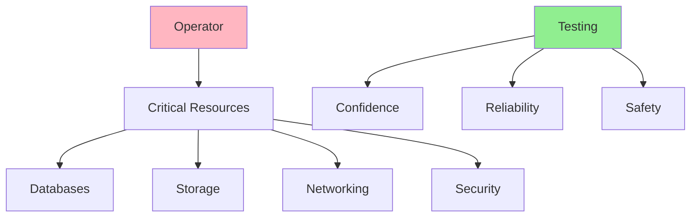
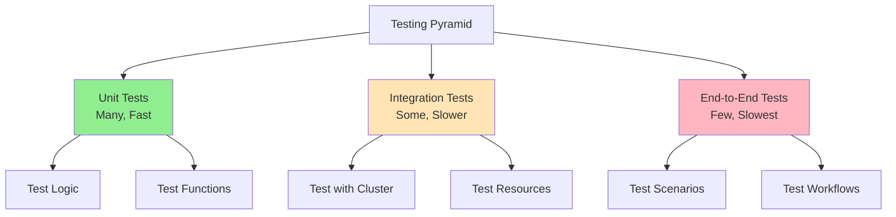
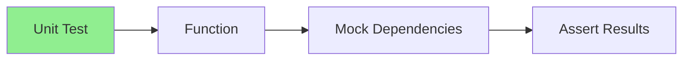
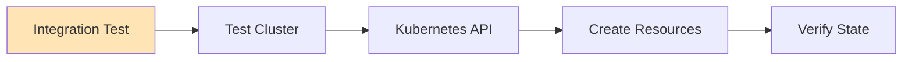
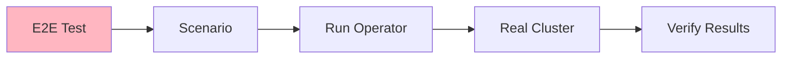
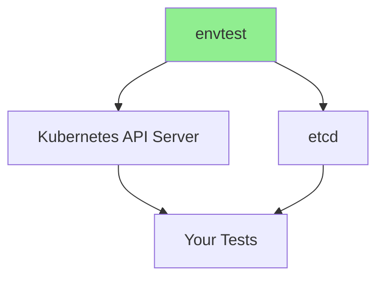
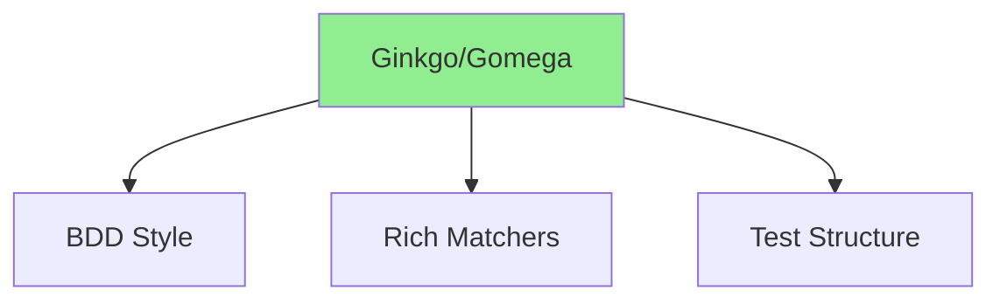
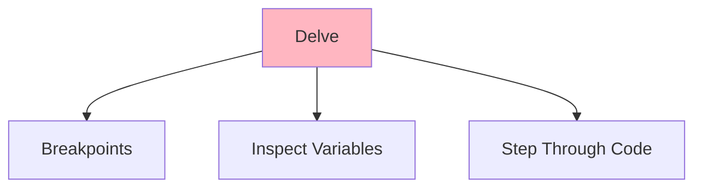
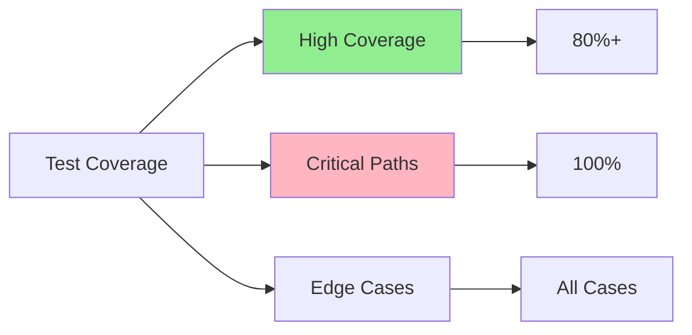

# Lesson 6.1: Testing Fundamentals

**Navigation:** [Module Overview](../README.md) | [Next Lesson: Unit Testing with envtest →](02-unit-testing-envtest.md)

## Introduction

Testing operators is crucial for reliability and confidence in production. Operators manage critical infrastructure, so comprehensive testing is essential. This lesson covers testing fundamentals, testing strategies, and the tools you'll use to test Kubernetes operators.

## Why Test Operators?

Operators manage critical resources:



**Benefits:**
- Catch bugs before production
- Ensure correctness of reconciliation
- Validate edge cases
- Enable safe refactoring
- Document expected behavior

## Testing Pyramid for Operators



## Testing Strategies

### Strategy 1: Unit Testing

Test individual functions and logic:



**Use for:**
- Reconciliation logic
- Helper functions
- Validation logic
- Transformation functions

### Strategy 2: Integration Testing

Test with real Kubernetes API:



**Use for:**
- End-to-end workflows
- Resource creation/updates
- Webhook behavior
- Controller interactions

### Strategy 3: End-to-End Testing

Test complete scenarios:



**Use for:**
- Complete user workflows
- Production-like scenarios
- Performance testing
- Regression testing

## Testing Tools

### envtest

**Purpose:** Lightweight Kubernetes API server for unit testing



**Features:**
- No full cluster needed
- Fast test execution
- Isolated test environment
- Real Kubernetes API

### Ginkgo and Gomega

**Purpose:** BDD-style testing framework



**Features:**
- Descriptive test structure
- Rich assertion library
- Parallel test execution
- Test organization

### Delve Debugger

**Purpose:** Go debugger for operators



**Features:**
- Set breakpoints
- Inspect variables
- Step through code
- Debug running operators

## Test Structure

### Basic Test Structure

```go
func TestReconcile(t *testing.T) {
    // Arrange: Set up test environment
    // Act: Execute the function
    // Assert: Verify results
}
```

### Table-Driven Tests

```go
func TestReconcile(t *testing.T) {
    tests := []struct {
        name    string
        input   *Database
        want    ctrl.Result
        wantErr bool
    }{
        {
            name: "successful reconciliation",
            input: &Database{...},
            want: ctrl.Result{},
            wantErr: false,
        },
        // More test cases...
    }
    
    for _, tt := range tests {
        t.Run(tt.name, func(t *testing.T) {
            // Test logic
        })
    }
}
```

## Test Coverage Goals



**Targets:**
- Overall: 80%+ coverage
- Critical paths: 100% coverage
- Edge cases: All covered
- Error paths: All tested

## Key Takeaways

- **Testing is essential** for operator reliability
- **Unit tests** are fast and test logic
- **Integration tests** test with real Kubernetes API
- **E2E tests** test complete scenarios
- **envtest** provides lightweight Kubernetes API
- **Ginkgo/Gomega** provide BDD-style testing
- **Delve** enables debugging operators
- **Table-driven tests** organize test cases
- **Aim for 80%+ coverage** with 100% on critical paths

## Understanding for Building Operators

When testing operators:
- Write unit tests for all logic
- Use integration tests for workflows
- Test error cases and edge cases
- Use table-driven tests for multiple scenarios
- Aim for high coverage
- Test in isolation when possible
- Use real Kubernetes API for integration tests

## Related Lab

- [Lab 6.1: Setting Up Testing Environment](../labs/lab-01-testing-fundamentals.md) - Hands-on exercises for this lesson

## Next Steps

Now that you understand testing fundamentals, let's set up envtest and write unit tests.

**Navigation:** [← Module Overview](../README.md) | [Next: Unit Testing with envtest →](02-unit-testing-envtest.md)

