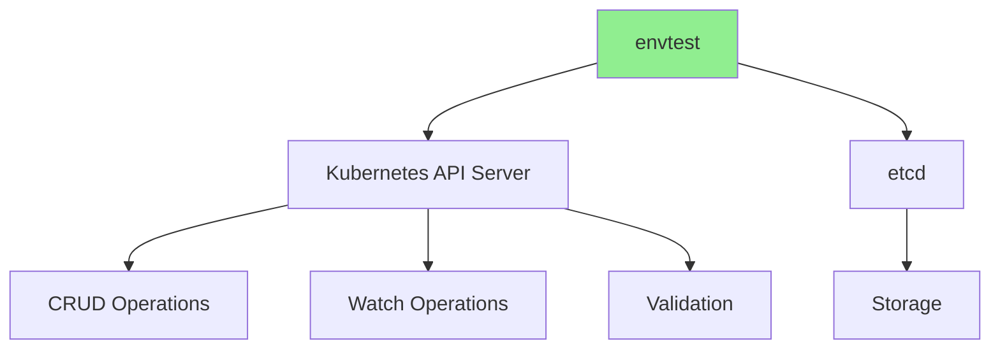
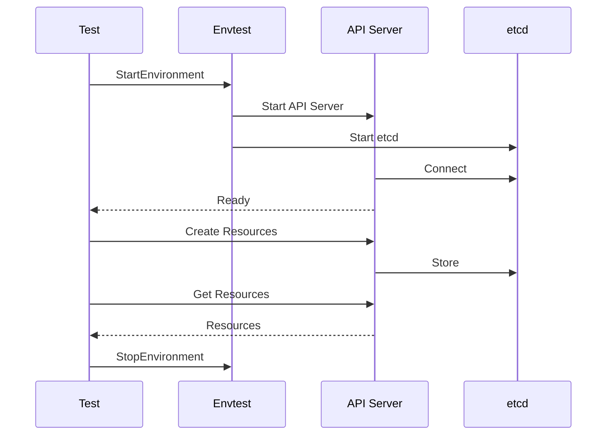

# Lesson 6.2: Unit Testing with envtest

**Navigation:** [← Previous: Testing Fundamentals](01-testing-fundamentals.md) | [Module Overview](../README.md) | [Next: Integration Testing →](03-integration-testing.md)

## Introduction

Unit testing operators requires a Kubernetes API server, but you don't need a full cluster. **envtest** provides a lightweight Kubernetes API server specifically designed for testing. This lesson teaches you how to use envtest to write comprehensive unit tests for your operators.

## What is envtest?

envtest provides a minimal Kubernetes API server:



**Features:**
- No kubelet, no scheduler
- Real Kubernetes API
- Fast startup
- Isolated environment

## envtest Setup Flow

Here's how envtest works:



## Setting Up envtest

### Step 1: Install Dependencies

```bash
# Install envtest binaries
go install sigs.k8s.io/controller-runtime/tools/setup-envtest@latest

# Download envtest binaries
setup-envtest use
```

### Step 2: Create Test Setup

```go
package controller

import (
    "path/filepath"
    "testing"
    
    . "github.com/onsi/ginkgo/v2"
    . "github.com/onsi/gomega"
    
    "k8s.io/client-go/kubernetes/scheme"
    "sigs.k8s.io/controller-runtime/pkg/client"
    "sigs.k8s.io/controller-runtime/pkg/envtest"
    
    databasev1 "github.com/example/postgres-operator/api/v1"
)

var (
    k8sClient client.Client
    testEnv   *envtest.Environment
)

func TestControllers(t *testing.T) {
    RegisterFailHandler(Fail)
    RunSpecs(t, "Controller Suite")
}

var _ = BeforeSuite(func() {
    By("bootstrapping test environment")
    testEnv = &envtest.Environment{
        CRDDirectoryPaths:     []string{filepath.Join("..", "..", "config", "crd", "bases")},
        ErrorIfCRDPathMissing: true,
    }
    
    cfg, err := testEnv.Start()
    Expect(err).NotTo(HaveOccurred())
    Expect(cfg).NotTo(BeNil())
    
    err = databasev1.AddToScheme(scheme.Scheme)
    Expect(err).NotTo(HaveOccurred())
    
    k8sClient, err = client.New(cfg, client.Options{Scheme: scheme.Scheme})
    Expect(err).NotTo(HaveOccurred())
    Expect(k8sClient).NotTo(BeNil())
})

var _ = AfterSuite(func() {
    By("tearing down the test environment")
    err := testEnv.Stop()
    Expect(err).NotTo(HaveOccurred())
})
```

## Writing Unit Tests

### Example: Test Reconciliation

```go
var _ = Describe("DatabaseReconciler", func() {
    var (
        ctx    context.Context
        cancel context.CancelFunc
    )
    
    BeforeEach(func() {
        ctx, cancel = context.WithCancel(context.Background())
    })
    
    AfterEach(func() {
        cancel()
    })
    
    Context("When reconciling a Database", func() {
        It("should create a StatefulSet", func() {
            // Arrange
            db := &databasev1.Database{
                ObjectMeta: metav1.ObjectMeta{
                    Name:      "test-db",
                    Namespace: "default",
                },
                Spec: databasev1.DatabaseSpec{
                    Image:       "postgres:14",
                    Replicas:    pointer.Int32(1),
                    DatabaseName: "mydb",
                    Username:    "admin",
                    Storage: databasev1.StorageSpec{
                        Size: "10Gi",
                    },
                },
            }
            Expect(k8sClient.Create(ctx, db)).To(Succeed())
            
            // Act
            reconciler := &DatabaseReconciler{
                Client: k8sClient,
                Scheme: scheme.Scheme,
            }
            _, err := reconciler.Reconcile(ctx, ctrl.Request{
                NamespacedName: types.NamespacedName{
                    Name:      "test-db",
                    Namespace: "default",
                },
            })
            
            // Assert
            Expect(err).NotTo(HaveOccurred())
            
            statefulSet := &appsv1.StatefulSet{}
            Expect(k8sClient.Get(ctx, types.NamespacedName{
                Name:      "test-db",
                Namespace: "default",
            }, statefulSet)).To(Succeed())
            
            Expect(statefulSet.Spec.Replicas).To(Equal(pointer.Int32(1)))
            Expect(statefulSet.Spec.Template.Spec.Containers[0].Image).To(Equal("postgres:14"))
        })
    })
})
```

## Table-Driven Tests with envtest

```go
Describe("Database validation", func() {
    tests := []struct {
        name    string
        db      *databasev1.Database
        wantErr bool
    }{
        {
            name: "valid database",
            db: &databasev1.Database{
                Spec: databasev1.DatabaseSpec{
                    Image:       "postgres:14",
                    DatabaseName: "mydb",
                    Username:    "admin",
                    Storage: databasev1.StorageSpec{
                        Size: "10Gi",
                    },
                },
            },
            wantErr: false,
        },
        {
            name: "missing image",
            db: &databasev1.Database{
                Spec: databasev1.DatabaseSpec{
                    DatabaseName: "mydb",
                    Username:    "admin",
                    Storage: databasev1.StorageSpec{
                        Size: "10Gi",
                    },
                },
            },
            wantErr: true,
        },
    }
    
    for _, tt := range tests {
        It(tt.name, func() {
            err := k8sClient.Create(ctx, tt.db)
            if tt.wantErr {
                Expect(err).To(HaveOccurred())
            } else {
                Expect(err).NotTo(HaveOccurred())
            }
        })
    }
})
```

## Testing Error Cases

```go
Context("When StatefulSet creation fails", func() {
    It("should return an error", func() {
        // Create Database with invalid spec
        db := &databasev1.Database{
            Spec: databasev1.DatabaseSpec{
                // Invalid: missing required fields
            },
        }
        
        reconciler := &DatabaseReconciler{
            Client: k8sClient,
            Scheme: scheme.Scheme,
        }
        
        _, err := reconciler.Reconcile(ctx, ctrl.Request{
            NamespacedName: types.NamespacedName{
                Name:      "test-db",
                Namespace: "default",
            },
        })
        
        Expect(err).To(HaveOccurred())
    })
})
```

## Testing Updates

```go
Context("When updating a Database", func() {
    It("should update the StatefulSet", func() {
        // Create initial Database
        db := &databasev1.Database{...}
        Expect(k8sClient.Create(ctx, db)).To(Succeed())
        
        // Reconcile to create StatefulSet
        reconciler.Reconcile(ctx, req)
        
        // Update Database
        Expect(k8sClient.Get(ctx, key, db)).To(Succeed())
        db.Spec.Replicas = pointer.Int32(3)
        Expect(k8sClient.Update(ctx, db)).To(Succeed())
        
        // Reconcile again
        reconciler.Reconcile(ctx, req)
        
        // Verify StatefulSet updated
        statefulSet := &appsv1.StatefulSet{}
        Expect(k8sClient.Get(ctx, key, statefulSet)).To(Succeed())
        Expect(statefulSet.Spec.Replicas).To(Equal(pointer.Int32(3)))
    })
})
```

## Key Takeaways

- **envtest** provides lightweight Kubernetes API for testing
- **Setup** involves starting test environment and creating client
- **Write tests** using Ginkgo/Gomega for structure
- **Test reconciliation** logic with real API
- **Use table-driven tests** for multiple scenarios
- **Test error cases** and edge cases
- **Test updates** and state changes
- **Clean up** resources in AfterEach

## Understanding for Building Operators

When writing unit tests:
- Use envtest for Kubernetes API
- Set up test environment in BeforeSuite
- Clean up in AfterSuite
- Test all reconciliation paths
- Test error cases
- Use table-driven tests for multiple scenarios
- Verify resource creation/updates
- Test state transitions

## Related Lab

- [Lab 6.2: Writing Unit Tests](../labs/lab-02-unit-testing-envtest.md) - Hands-on exercises for this lesson

## References

### Official Documentation
- [envtest Documentation](https://pkg.go.dev/sigs.k8s.io/controller-runtime/pkg/envtest)
- [Kubebuilder Testing Guide](https://book.kubebuilder.io/cronjob-tutorial/writing-tests.html)
- [Go Testing Package](https://pkg.go.dev/testing)

### Further Reading
- **Kubernetes Operators** by Jason Dobies and Joshua Wood - Chapter 10: Testing
- **Programming Kubernetes** by Michael Hausenblas and Stefan Schimanski - Chapter 10: Testing
- [Go Testing Best Practices](https://golang.org/doc/effective_go#testing)

### Related Topics
- [Table-Driven Tests](https://go.dev/wiki/TableDrivenTests)
- [Test Coverage](https://go.dev/blog/cover)
- [Benchmarking in Go](https://golang.org/pkg/testing/#hdr-Benchmarks)

## Next Steps

Now that you understand unit testing, let's learn about integration testing with real clusters.

**Navigation:** [← Previous: Testing Fundamentals](01-testing-fundamentals.md) | [Module Overview](../README.md) | [Next: Integration Testing →](03-integration-testing.md)

