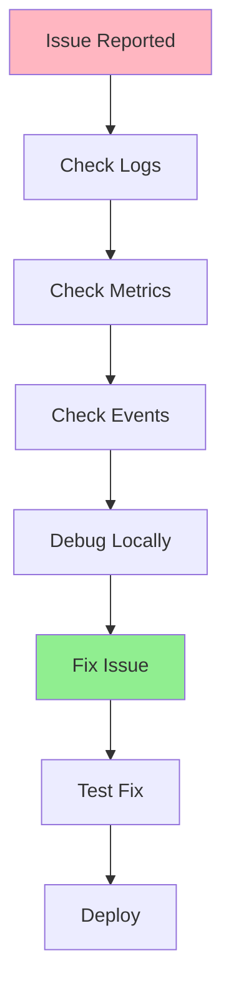
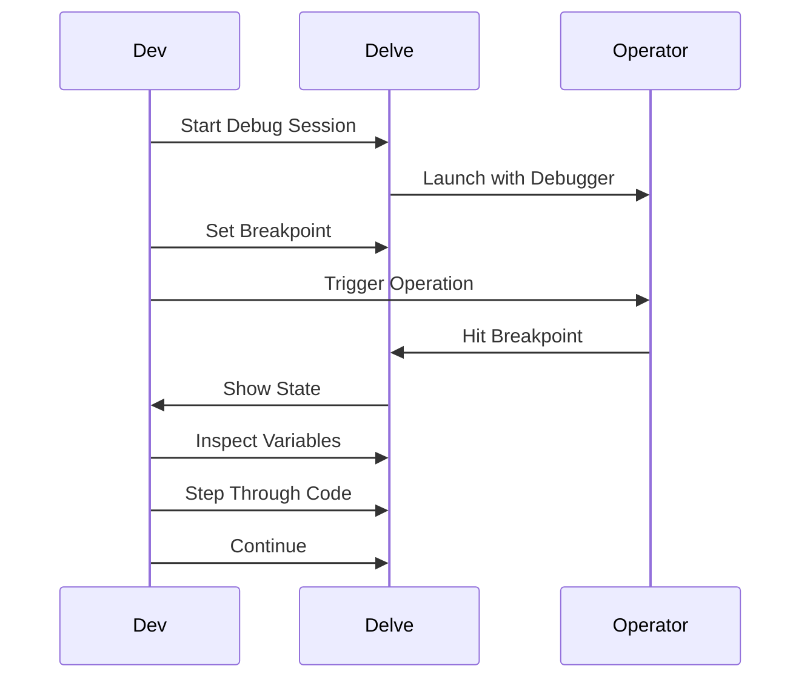
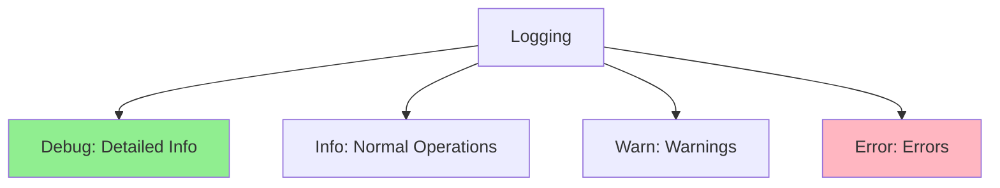
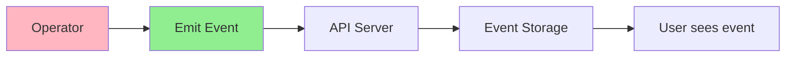
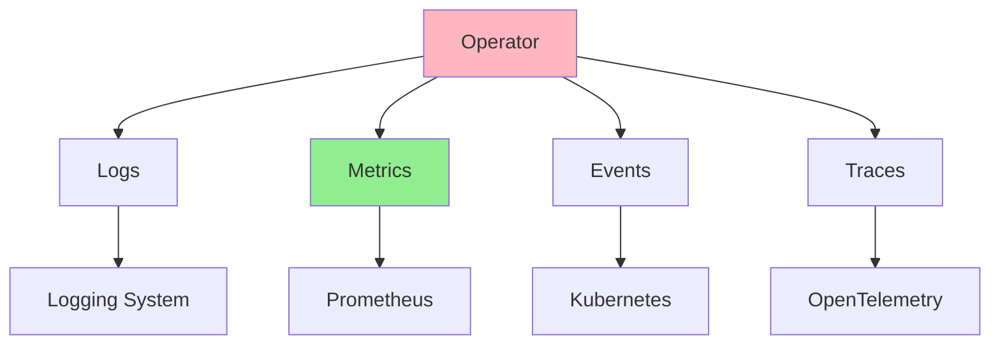

# Lesson 6.4: Debugging and Observability

**Navigation:** [← Previous: Integration Testing](03-integration-testing.md) | [Module Overview](../README.md)

## Introduction

Even with comprehensive tests, operators can fail in production. Debugging and observability are essential for understanding what's happening, diagnosing issues, and ensuring operators run smoothly. This lesson covers debugging techniques and adding observability to operators.

## Debugging Workflow

Here's a typical debugging workflow:



## Debugging with Delve

### Setting Up Delve

```bash
# Install Delve
go install github.com/go-delve/delve/cmd/dlv@latest

# Run operator with Delve
dlv debug ./cmd/manager/main.go
```

### Using Delve



### Example: Debugging Reconcile

```go
// Set breakpoint in Reconcile function
func (r *DatabaseReconciler) Reconcile(ctx context.Context, req ctrl.Request) (ctrl.Result, error) {
    log := log.FromContext(ctx)
    
    // Breakpoint here
    db := &databasev1.Database{}
    if err := r.Get(ctx, req.NamespacedName, db); err != nil {
        return ctrl.Result{}, err
    }
    
    // Inspect db here
    log.Info("Reconciling", "name", db.Name, "spec", db.Spec)
    
    // Continue debugging...
}
```

## Structured Logging

### Adding Structured Logs

```go
import (
    "sigs.k8s.io/controller-runtime/pkg/log"
    "sigs.k8s.io/controller-runtime/pkg/log/zap"
)

func main() {
    // Use structured logging
    ctrl.SetLogger(zap.New(zap.UseDevMode(true)))
    
    // In controller
    log := log.FromContext(ctx)
    log.Info("Reconciling Database",
        "name", db.Name,
        "namespace", db.Namespace,
        "generation", db.Generation,
        "replicas", db.Spec.Replicas,
    )
    
    log.Error(err, "Failed to reconcile",
        "name", db.Name,
        "error", err.Error(),
    )
}
```

### Log Levels



## Metrics with Prometheus

### Exposing Metrics

```go
import (
    "sigs.k8s.io/controller-runtime/pkg/metrics"
    "github.com/prometheus/client_golang/prometheus"
)

var (
    reconcileTotal = prometheus.NewCounterVec(
        prometheus.CounterOpts{
            Name: "database_reconcile_total",
            Help: "Total number of reconciliations",
        },
        []string{"result"}, // success, error
    )
    
    reconcileDuration = prometheus.NewHistogramVec(
        prometheus.HistogramOpts{
            Name: "database_reconcile_duration_seconds",
            Help: "Duration of reconciliations",
        },
        []string{"result"},
    )
)

func init() {
    metrics.Registry.MustRegister(reconcileTotal, reconcileDuration)
}

func (r *DatabaseReconciler) Reconcile(ctx context.Context, req ctrl.Request) (ctrl.Result, error) {
    start := time.Now()
    defer func() {
        duration := time.Since(start).Seconds()
        result := "success"
        if err != nil {
            result = "error"
        }
        reconcileDuration.WithLabelValues(result).Observe(duration)
        reconcileTotal.WithLabelValues(result).Inc()
    }()
    
    // Reconciliation logic...
}
```

## Kubernetes Events

### Emitting Events

```go
import (
    "k8s.io/client-go/tools/record"
)

type DatabaseReconciler struct {
    client.Client
    Scheme   *runtime.Scheme
    Recorder record.EventRecorder
}

func (r *DatabaseReconciler) Reconcile(ctx context.Context, req ctrl.Request) (ctrl.Result, error) {
    // Emit event on success
    r.Recorder.Event(db, "Normal", "Reconciled", "Database reconciled successfully")
    
    // Emit event on error
    if err != nil {
        r.Recorder.Event(db, "Warning", "ReconcileFailed", err.Error())
    }
}
```

### Event Flow



## Observability Stack



## Common Debugging Scenarios

### Scenario 1: Reconcile Not Triggering

```go
// Check if controller is running
kubectl get pods -l control-plane=controller-manager

// Check logs
kubectl logs -l control-plane=controller-manager

// Check if resource exists
kubectl get database test-db

// Check events
kubectl get events --field-selector involvedObject.name=test-db
```

### Scenario 2: Resource Not Created

```go
// Add detailed logging
log.Info("Creating StatefulSet",
    "name", statefulSet.Name,
    "namespace", statefulSet.Namespace,
    "spec", statefulSet.Spec,
)

// Check for errors
if err := r.Create(ctx, statefulSet); err != nil {
    log.Error(err, "Failed to create StatefulSet",
        "name", statefulSet.Name,
        "error", err.Error(),
    )
    return ctrl.Result{}, err
}
```

### Scenario 3: Status Not Updating

```go
// Verify status update
log.Info("Updating status",
    "phase", db.Status.Phase,
    "ready", db.Status.Ready,
)

if err := r.Status().Update(ctx, db); err != nil {
    log.Error(err, "Failed to update status")
    return ctrl.Result{}, err
}

// Verify update succeeded
log.Info("Status updated successfully")
```

## Key Takeaways

- **Delve** enables debugging operators with breakpoints
- **Structured logging** provides context and traceability
- **Metrics** expose operational data to Prometheus
- **Events** communicate state changes to users
- **Observability stack** combines logs, metrics, events, traces
- **Debug systematically** using logs, metrics, and events
- **Add observability** from the start
- **Use appropriate log levels** (Debug, Info, Warn, Error)

## Understanding for Building Operators

When debugging and adding observability:
- Use Delve for local debugging
- Add structured logging throughout
- Expose metrics for monitoring
- Emit events for user feedback
- Use appropriate log levels
- Debug systematically
- Add observability early
- Monitor in production

## Related Lab

- [Lab 6.4: Adding Observability](../labs/lab-04-debugging-observability.md) - Hands-on exercises for this lesson

## References

### Official Documentation
- [Delve Debugger](https://github.com/go-delve/delve)
- [Prometheus Metrics](https://prometheus.io/docs/concepts/metric_types/)
- [Kubernetes Events](https://kubernetes.io/docs/reference/kubernetes-api/cluster-resources/event-v1/)

### Further Reading
- **Kubernetes Operators** by Jason Dobies and Joshua Wood - Chapter 11: Debugging
- **Programming Kubernetes** by Michael Hausenblas and Stefan Schimanski - Chapter 11: Observability
- [Observability Engineering](https://www.oreilly.com/library/view/observability-engineering/9781492076438/)

### Related Topics
- [Logging Best Practices](https://www.cncf.io/blog/2023/07/03/kubernetes-logging-best-practices/)
- [Prometheus Best Practices](https://prometheus.io/docs/practices/)
- [OpenTelemetry](https://opentelemetry.io/)

## Next Steps

Congratulations! You've completed Module 6. You now understand:
- Testing fundamentals and strategies
- Unit testing with envtest
- Integration testing with real clusters
- Debugging and observability

In [Module 7](../../module-07/README.md), you'll learn about production deployment and best practices.

**Navigation:** [← Previous: Integration Testing](03-integration-testing.md) | [Module Overview](../README.md) | [Next: Module 7 →](../../module-07/README.md)
