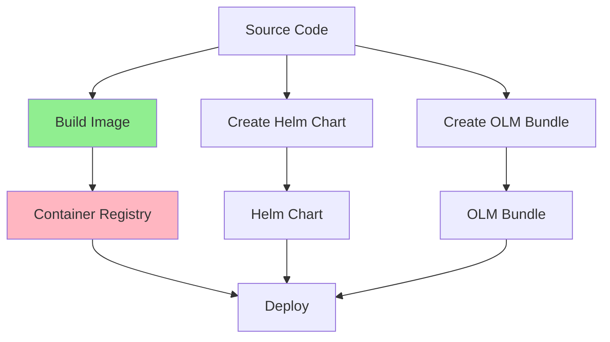
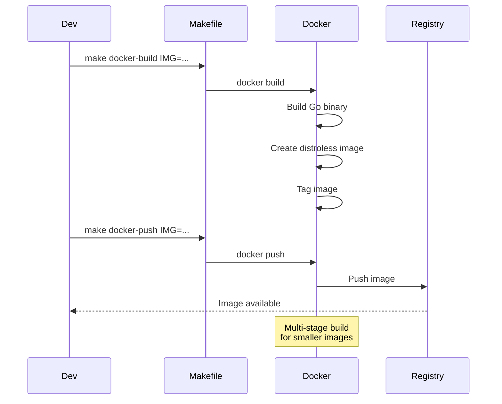
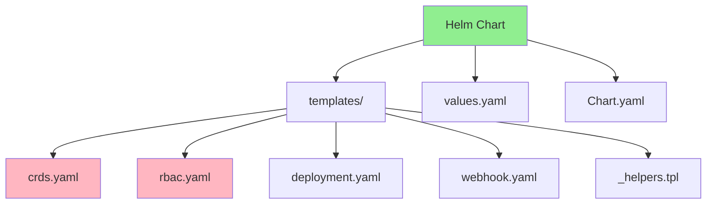
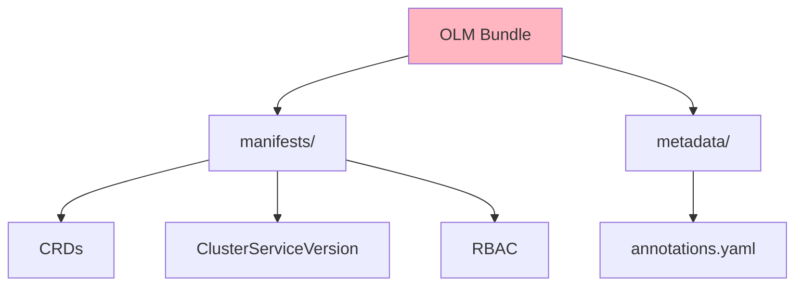
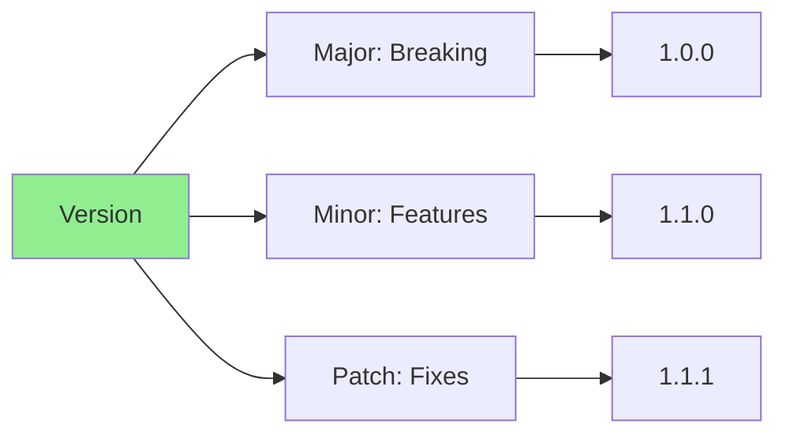
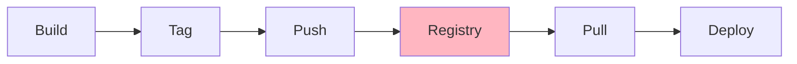
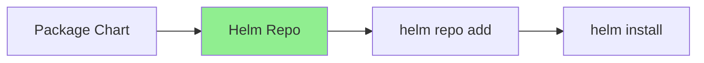
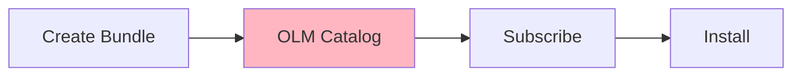
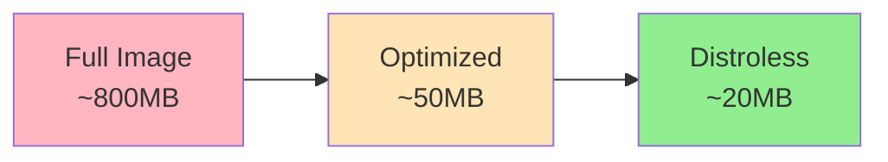

# Lesson 7.1: Packaging and Distribution

**Navigation:** [Module Overview](../README.md) | [Next Lesson: RBAC and Security →](02-rbac-security.md)

## Introduction

Before deploying operators to production, they need to be packaged and distributed. This lesson covers building container images, creating Helm charts, and packaging operators for distribution via OLM (Operator Lifecycle Manager).

## Theory: Packaging and Distribution

Packaging operators enables **reliable, repeatable deployments** across environments.

### Why Packaging Matters

**Reproducibility:**
- Same operator version everywhere
- Consistent deployments
- Version control
- Rollback capability

**Distribution:**
- Share operators with teams
- Deploy to multiple clusters
- Enable operator marketplace
- Simplify installation

**Deployment:**
- Standard deployment methods
- Helm charts for easy install
- OLM for operator marketplace
- Container images for portability

### Packaging Strategies

**Container Images:**
- Standard format
- Works everywhere
- Versioned
- Portable

**Helm Charts:**
- Package operator + dependencies
- Parameterized configuration
- Easy upgrades
- Community standard

**OLM Bundles:**
- Operator marketplace format
- Metadata and manifests
- Version management
- Dependency resolution

### Versioning

**Semantic Versioning:**
- Major: Breaking changes
- Minor: New features
- Patch: Bug fixes

**Version Tags:**
- `latest`: Latest version
- `v1.2.3`: Specific version
- `v1.2`: Latest patch of minor version
- `stable`: Stable release

Understanding packaging helps you distribute operators effectively.

## Operator Packaging Flow

Here's how operators are packaged and distributed:



## Building Container Images

Kubebuilder generates a `Dockerfile` for you when you scaffold a project. It uses multi-stage builds for optimal image size and security.

### Kubebuilder-Generated Dockerfile

When you run `kubebuilder init`, it creates a Dockerfile in your project root:

```dockerfile
# Build stage
FROM golang:1.24 as builder
ARG TARGETOS
ARG TARGETARCH

WORKDIR /workspace
# Copy the Go Modules manifests
COPY go.mod go.mod
COPY go.sum go.sum
# Cache deps before building and copying source
RUN go mod download

# Copy the go source
COPY cmd/main.go cmd/main.go
COPY api/ api/
COPY internal/ internal/

# Build
RUN CGO_ENABLED=0 GOOS=${TARGETOS:-linux} GOARCH=${TARGETARCH:-amd64} go build -a -o manager cmd/main.go

# Runtime stage
FROM gcr.io/distroless/static:nonroot
WORKDIR /
COPY --from=builder /workspace/manager .
USER 65532:65532
ENTRYPOINT ["/manager"]
```

**Note:** The `internal/` directory is copied entirely because it contains both:
- `internal/controller/` - Your reconciliation logic
- `internal/webhook/` - Webhook handlers (if you created webhooks in Module 5)

### Building with Kubebuilder's Makefile

Kubebuilder provides Makefile targets for building images:

```bash
# Build the container image
make docker-build IMG=<registry>/database-operator:v0.1.0

# Push to registry
make docker-push IMG=<registry>/database-operator:v0.1.0

# Build and push in one command
make docker-build docker-push IMG=<registry>/database-operator:v0.1.0
```

### Image Build Process



### Loading Images to kind

For local development with kind clusters:

```bash
# Build the image
make docker-build IMG=database-operator:latest

# Load into kind cluster
kind load docker-image database-operator:latest --name k8s-operators-course
```

## Helm Charts for Operators

While kubebuilder uses Kustomize for deployment by default (`config/` directory), you can create Helm charts for wider distribution. The manifests generated by kubebuilder can be used as a basis for Helm templates.

### What an Operator Helm Chart Needs

A complete operator Helm chart must include **all** components from kubebuilder's `config/` directory:

| Component | Source Directory | Purpose |
|-----------|-----------------|---------|
| **CRDs** | `config/crd/` | Custom Resource Definitions |
| **RBAC** | `config/rbac/` | ServiceAccount, ClusterRole, ClusterRoleBinding |
| **Deployment** | `config/manager/` | Controller manager pod |
| **Webhooks** | `config/webhook/` | Validating/Mutating webhooks (if used) |
| **Certificates** | `config/certmanager/` | Webhook certificates (if using cert-manager) |

**Important:** A Helm chart with only the Deployment won't work! The operator needs RBAC permissions to function and CRDs must be installed for the operator to manage custom resources.

### Chart Structure



### Kubebuilder's Kustomize vs Helm

Kubebuilder generates Kustomize manifests in `config/`:

```
config/
├── crd/                    # CRD definitions
│   └── bases/
├── default/                # Default deployment configuration
├── manager/                # Controller deployment
├── rbac/                   # RBAC rules
├── webhook/                # Webhook configuration
└── samples/                # Sample CR manifests
```

**To deploy with Kustomize** (recommended for development):
```bash
# Deploy the operator
make deploy IMG=<registry>/database-operator:v0.1.0

# This runs: kustomize build config/default | kubectl apply -f -
```

**To create a Helm chart** (for distribution):
```bash
# Create Helm chart directory
mkdir -p charts/database-operator/templates

# Export kustomize output as a starting point
kustomize build config/default > charts/database-operator/templates/all.yaml

# Then split into separate files and add templating
```

## OLM Bundles

### OLM Bundle Structure



### Bundle Creation

While kubebuilder focuses on controller development, you can use operator-sdk alongside kubebuilder for OLM bundle generation:

```bash
# Initialize operator-sdk integration (if not already done)
operator-sdk init --plugins=manifests

# Generate OLM bundle from kubebuilder manifests
operator-sdk generate bundle \
  --version 0.1.0 \
  --package database-operator \
  --channels stable

# Creates:
# bundle/
#   manifests/
#     database-operator.clusterserviceversion.yaml
#     database.example.com_databases.yaml
#   metadata/
#     annotations.yaml
```

Note: For most use cases, kubebuilder's built-in `make deploy` with Kustomize is sufficient. OLM bundles are primarily needed when publishing to operator marketplaces like OperatorHub.

## Versioning Strategy

### Semantic Versioning



**Version format:** `v<major>.<minor>.<patch>`

- **Major**: Breaking API changes
- **Minor**: New features, backward compatible
- **Patch**: Bug fixes, backward compatible

## Distribution Strategies

### Strategy 1: Container Registry



### Strategy 2: Helm Repository



### Strategy 3: OLM Catalog



## Image Optimization

### Multi-Stage Builds

```dockerfile
# Stage 1: Build
FROM golang:1.24 AS builder
# ... build steps ...

# Stage 2: Runtime
FROM gcr.io/distroless/static:nonroot
# ... copy binary only ...
```

**Benefits:**
- Smaller final image
- No build tools in production
- Better security (distroless)

### Image Size Comparison



## Automating with CI/CD

### GitHub Actions for Releases

Automate releases with GitHub Actions:

```yaml
# .github/workflows/release.yaml
name: Release
on:
  push:
    tags: ['v*']
jobs:
  release:
    runs-on: ubuntu-latest
    steps:
      - uses: actions/checkout@v4
      - name: Build and push image
        run: make docker-build docker-push IMG=ghcr.io/${{ github.repository }}:${{ github.ref_name }}
      - name: Generate and push Helm chart
        run: |
          make helm-chart helm-package
          helm push dist/*.tgz oci://ghcr.io/${{ github.repository_owner }}/charts
```

### Helm Chart Distribution

Modern approach: Push Helm charts to OCI registries (like GHCR):

```bash
# Push chart to OCI registry
helm push database-operator-0.1.0.tgz oci://ghcr.io/myorg/charts

# Install from OCI registry
helm install my-operator oci://ghcr.io/myorg/charts/database-operator --version 0.1.0
```

## Key Takeaways

- **Kubebuilder generates** a production-ready Dockerfile
- **`make docker-build`** builds container images with proper tagging
- **Kustomize** is the default deployment method in kubebuilder
- **`make helm-chart`** can generate Helm charts from Kustomize
- **OCI registries** can host both images AND Helm charts
- **GitHub Actions** automate releases and chart publishing
- **Semantic versioning** tracks operator versions
- **Multi-stage builds** create smaller, secure images

## Understanding for Building Operators

When packaging kubebuilder operators:
- Use `make docker-build IMG=...` to build images
- Use `make docker-push IMG=...` to push to registry
- Use `make deploy IMG=...` for Kustomize-based deployment
- Use `make helm-chart` to generate Helm charts from Kustomize
- Set up GitHub Actions for automated releases
- Push Helm charts to OCI registries for distribution
- Follow semantic versioning for your operator
- Use kind's image loading for local development

## Related Lab

- [Lab 7.1: Packaging Your Operator](../labs/lab-01-packaging-distribution.md) - Hands-on exercises for this lesson

## References

### Official Documentation
- [Container Images](https://kubernetes.io/docs/concepts/containers/images/)
- [Helm Documentation](https://helm.sh/docs/)
- [OLM Documentation](https://olm.operatorframework.io/)

### Further Reading
- **Kubernetes Operators** by Jason Dobies and Joshua Wood - Chapter 12: Packaging
- **Docker Deep Dive** by Nigel Poulton - Container image best practices
- [Helm Best Practices](https://helm.sh/docs/chart_best_practices/)

### Related Topics
- [Multi-Stage Docker Builds](https://docs.docker.com/build/building/multi-stage/)
- [Semantic Versioning](https://semver.org/)
- [Operator Lifecycle Manager](https://olm.operatorframework.io/)

## Next Steps

Now that you understand packaging, let's learn about RBAC and security.

**Navigation:** [← Module Overview](../README.md) | [Next: RBAC and Security →](02-rbac-security.md)

