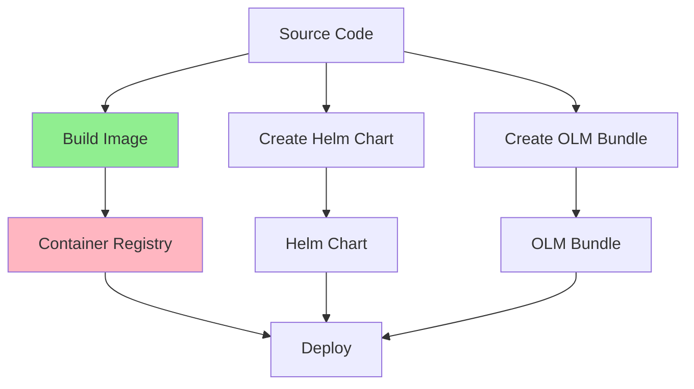
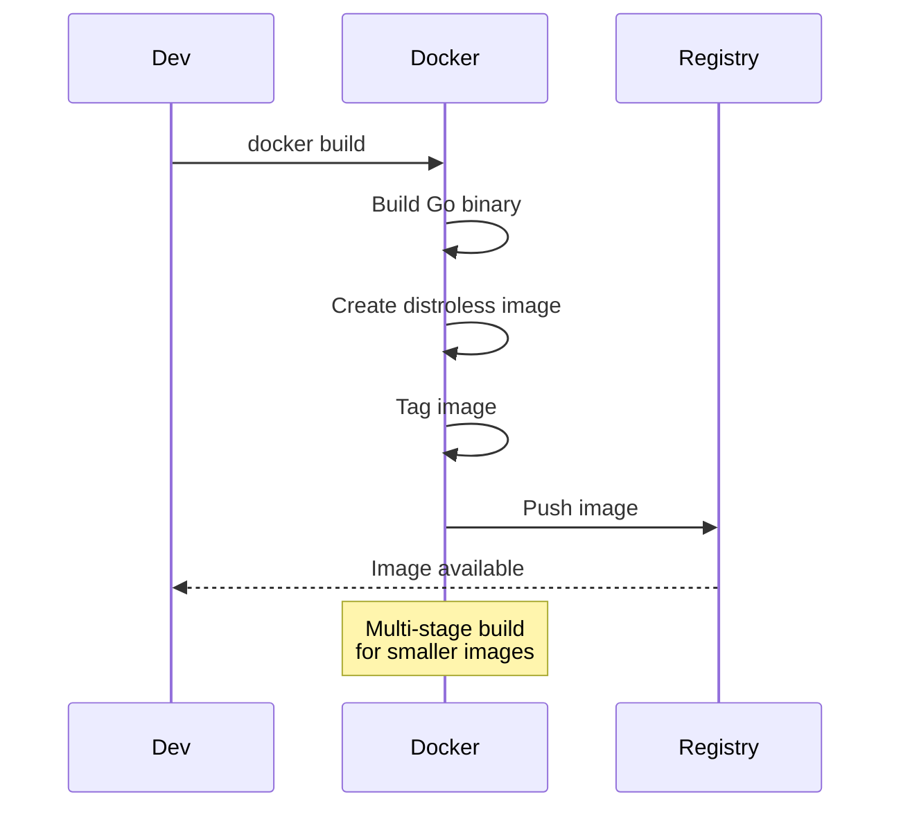
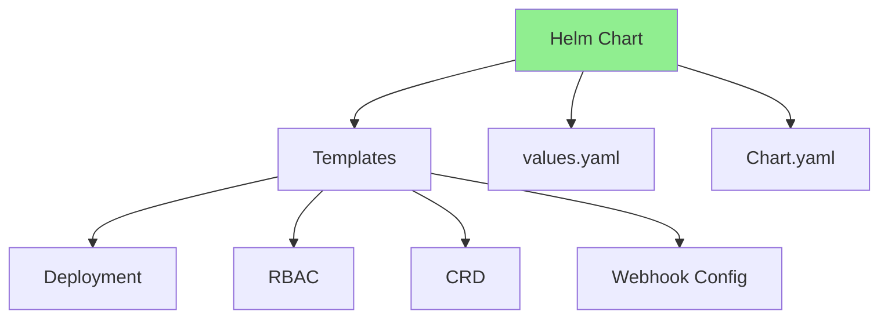
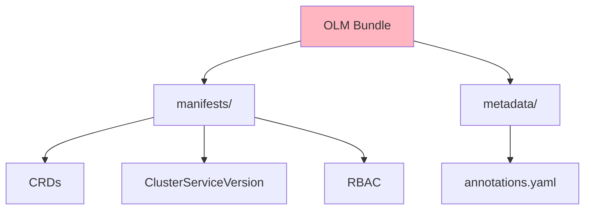
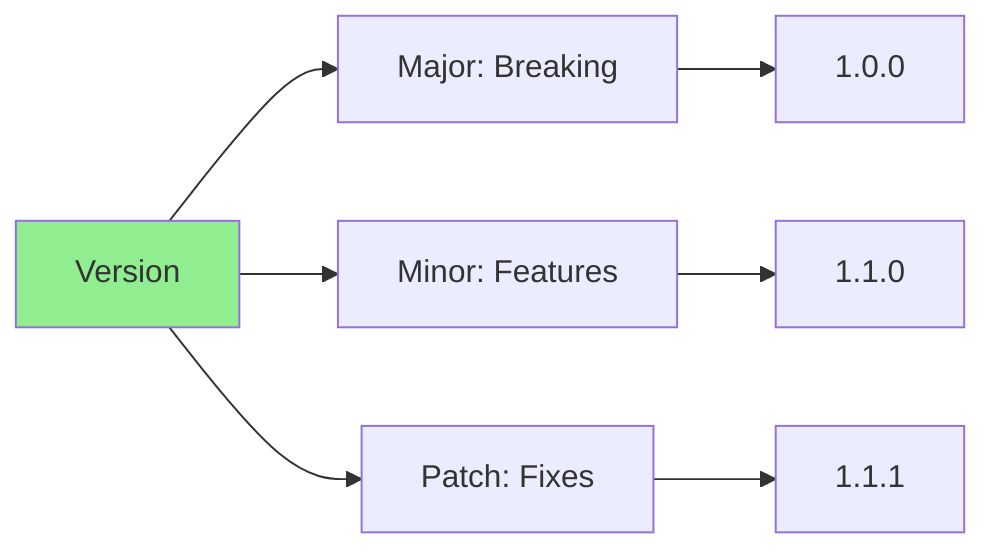
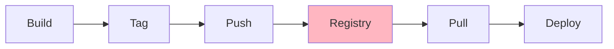
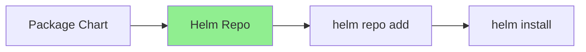
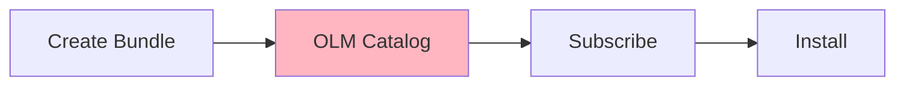
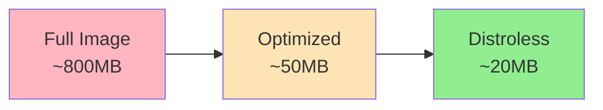

# Lesson 7.1: Packaging and Distribution

**Navigation:** [Module Overview](../README.md) | [Next Lesson: RBAC and Security →](02-rbac-security.md)

## Introduction

Before deploying operators to production, they need to be packaged and distributed. This lesson covers building container images, creating Helm charts, and packaging operators for distribution via OLM (Operator Lifecycle Manager).

## Theory: Packaging and Distribution

Packaging operators enables **reliable, repeatable deployments** across environments.

### Why Packaging Matters

**Reproducibility:**
- Same operator version everywhere
- Consistent deployments
- Version control
- Rollback capability

**Distribution:**
- Share operators with teams
- Deploy to multiple clusters
- Enable operator marketplace
- Simplify installation

**Deployment:**
- Standard deployment methods
- Helm charts for easy install
- OLM for operator marketplace
- Container images for portability

### Packaging Strategies

**Container Images:**
- Standard format
- Works everywhere
- Versioned
- Portable

**Helm Charts:**
- Package operator + dependencies
- Parameterized configuration
- Easy upgrades
- Community standard

**OLM Bundles:**
- Operator marketplace format
- Metadata and manifests
- Version management
- Dependency resolution

### Versioning

**Semantic Versioning:**
- Major: Breaking changes
- Minor: New features
- Patch: Bug fixes

**Version Tags:**
- `latest`: Latest version
- `v1.2.3`: Specific version
- `v1.2`: Latest patch of minor version
- `stable`: Stable release

Understanding packaging helps you distribute operators effectively.

## Operator Packaging Flow

Here's how operators are packaged and distributed:



## Building Container Images

### Dockerfile Structure

```dockerfile
# Build stage
FROM golang:1.21 as builder
WORKDIR /workspace
COPY go.mod go.mod
COPY go.sum go.sum
RUN go mod download
COPY . .
RUN make manager

# Runtime stage
FROM gcr.io/distroless/static:nonroot
WORKDIR /
COPY --from=builder /workspace/bin/manager .
USER 65532:65532
ENTRYPOINT ["/manager"]
```

### Image Build Process



## Helm Charts for Operators

### Chart Structure



### Creating Helm Chart

```bash
# Create Helm chart
helm create database-operator

# Structure:
# database-operator/
#   Chart.yaml
#   values.yaml
#   templates/
#     deployment.yaml
#     rbac.yaml
#     crd.yaml
#     webhook.yaml
```

## OLM Bundles

### OLM Bundle Structure



### Bundle Creation

```bash
# Generate OLM bundle
operator-sdk generate bundle \
  --version 0.1.0 \
  --package database-operator \
  --channels stable

# Creates:
# bundle/
#   manifests/
#     database-operator.clusterserviceversion.yaml
#     database.example.com_databases.yaml
#   metadata/
#     annotations.yaml
```

## Versioning Strategy

### Semantic Versioning



**Version format:** `v<major>.<minor>.<patch>`

- **Major**: Breaking API changes
- **Minor**: New features, backward compatible
- **Patch**: Bug fixes, backward compatible

## Distribution Strategies

### Strategy 1: Container Registry



### Strategy 2: Helm Repository



### Strategy 3: OLM Catalog



## Image Optimization

### Multi-Stage Builds

```dockerfile
# Stage 1: Build
FROM golang:1.21 AS builder
# ... build steps ...

# Stage 2: Runtime
FROM gcr.io/distroless/static:nonroot
# ... copy binary only ...
```

**Benefits:**
- Smaller final image
- No build tools in production
- Better security (distroless)

### Image Size Comparison



## Key Takeaways

- **Container images** package operators for distribution
- **Helm charts** simplify operator deployment
- **OLM bundles** enable operator marketplace distribution
- **Semantic versioning** tracks operator versions
- **Multi-stage builds** create smaller, secure images
- **Multiple distribution** strategies available
- **Version properly** for upgrades and rollbacks

## Understanding for Building Operators

When packaging operators:
- Use multi-stage Docker builds
- Optimize image size (use distroless)
- Create Helm charts for easy deployment
- Consider OLM for operator marketplace
- Follow semantic versioning
- Tag images properly
- Push to container registry

## Related Lab

- [Lab 7.1: Packaging Your Operator](../labs/lab-01-packaging-distribution.md) - Hands-on exercises for this lesson

## References

### Official Documentation
- [Container Images](https://kubernetes.io/docs/concepts/containers/images/)
- [Helm Documentation](https://helm.sh/docs/)
- [OLM Documentation](https://olm.operatorframework.io/)

### Further Reading
- **Kubernetes Operators** by Jason Dobies and Joshua Wood - Chapter 12: Packaging
- **Docker Deep Dive** by Nigel Poulton - Container image best practices
- [Helm Best Practices](https://helm.sh/docs/chart_best_practices/)

### Related Topics
- [Multi-Stage Docker Builds](https://docs.docker.com/build/building/multi-stage/)
- [Semantic Versioning](https://semver.org/)
- [Operator Lifecycle Manager](https://olm.operatorframework.io/)

## Next Steps

Now that you understand packaging, let's learn about RBAC and security.

**Navigation:** [← Module Overview](../README.md) | [Next: RBAC and Security →](02-rbac-security.md)

