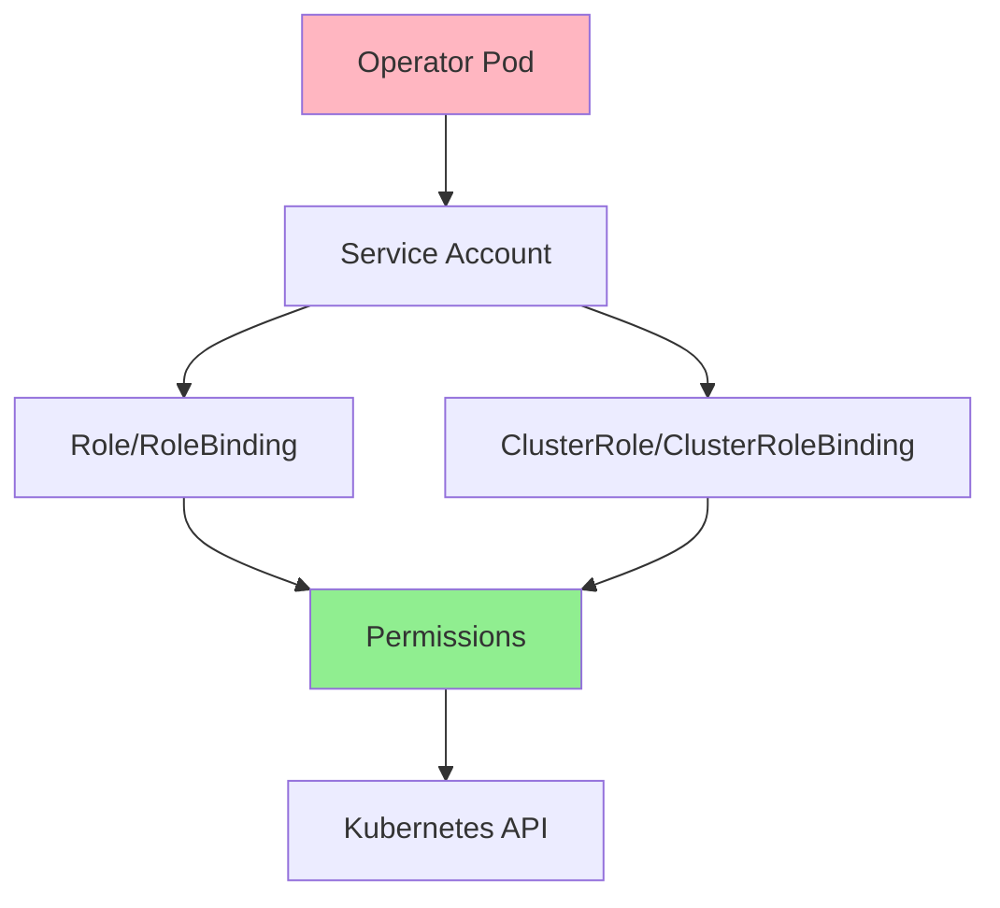
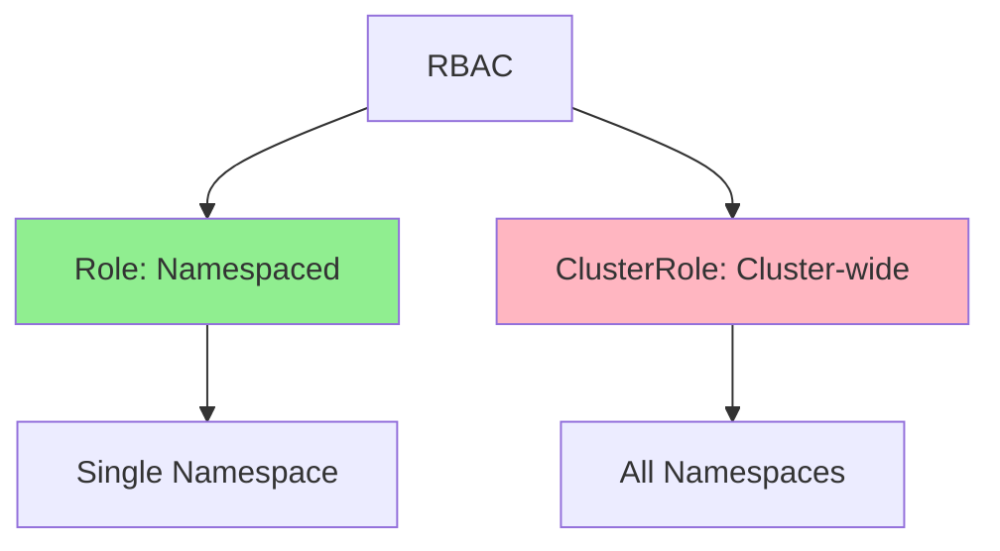
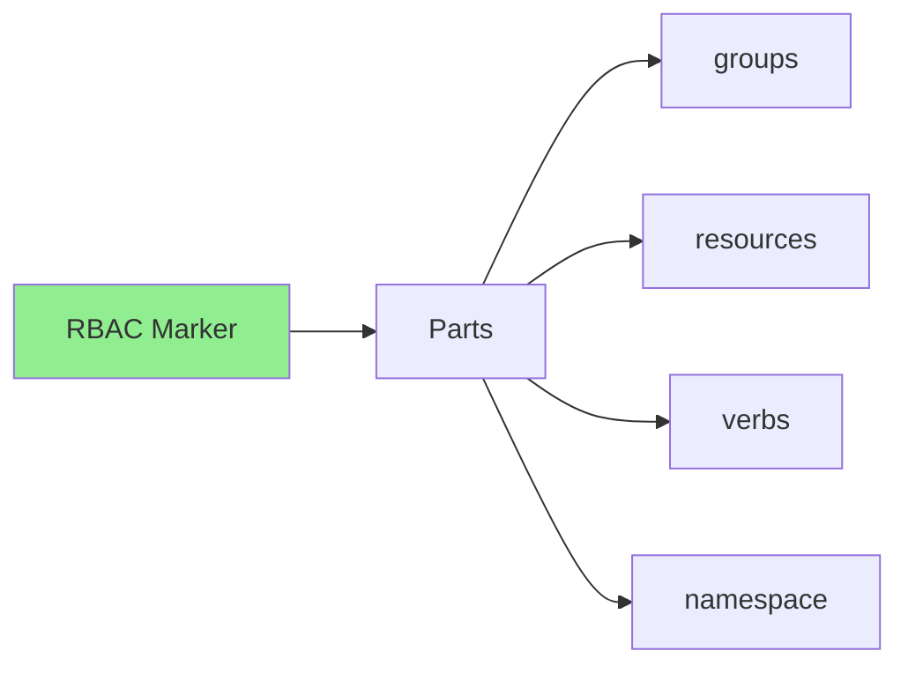
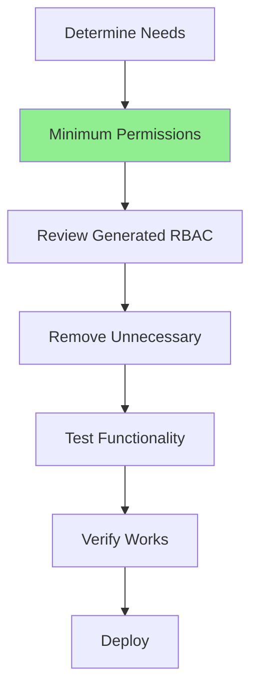
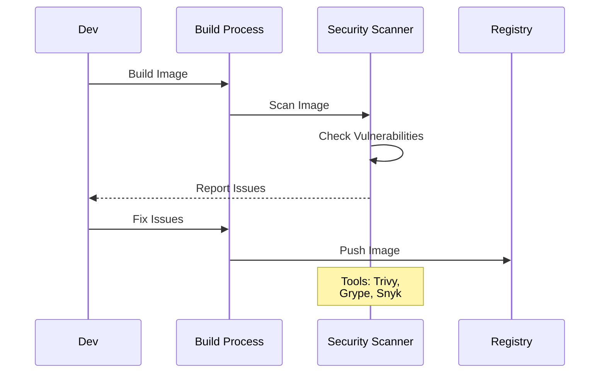

# Lesson 7.2: RBAC and Security

**Navigation:** [← Previous: Packaging and Distribution](01-packaging-distribution.md) | [Module Overview](../README.md) | [Next: High Availability →](03-high-availability.md)

## Introduction

Operators need permissions to manage resources, but they should follow the **principle of least privilege** - only requesting the minimum permissions needed. This lesson covers RBAC (Role-Based Access Control) configuration and security best practices for operators.

## RBAC Architecture

Here's how RBAC works for operators:



## RBAC Components

### Service Account

```yaml
apiVersion: v1
kind: ServiceAccount
metadata:
  name: database-operator
  namespace: default
```

### Role vs ClusterRole



**Role**: Permissions within a namespace  
**ClusterRole**: Permissions across all namespaces

## Kubebuilder RBAC Markers

Kubebuilder generates RBAC from markers:

```go
//+kubebuilder:rbac:groups=database.example.com,resources=databases,verbs=get;list;watch;create;update;patch;delete
//+kubebuilder:rbac:groups=database.example.com,resources=databases/status,verbs=get;update;patch
//+kubebuilder:rbac:groups=database.example.com,resources=databases/finalizers,verbs=update
//+kubebuilder:rbac:groups=apps,resources=statefulsets,verbs=get;list;watch;create;update;patch;delete
//+kubebuilder:rbac:groups=core,resources=services,verbs=get;list;watch;create;update;patch;delete
```

### RBAC Marker Format



## Principle of Least Privilege



**Best Practices:**
- Only request permissions you need
- Use specific verbs (not `*`)
- Use specific resources (not `*`)
- Review generated RBAC
- Test with minimal permissions

## Security Best Practices

### Practice 1: Use Distroless Images

```dockerfile
FROM gcr.io/distroless/static:nonroot
# No shell, no package manager, minimal attack surface
```

### Practice 2: Run as Non-Root

```yaml
securityContext:
  runAsNonRoot: true
  runAsUser: 65532
  allowPrivilegeEscalation: false
  capabilities:
    drop:
    - ALL
```

### Practice 3: Read-Only Root Filesystem

```yaml
securityContext:
  readOnlyRootFilesystem: true
volumeMounts:
- name: tmp
  mountPath: /tmp
volumes:
- name: tmp
  emptyDir: {}
```

### Practice 4: Network Policies

```yaml
apiVersion: networking.k8s.io/v1
kind: NetworkPolicy
metadata:
  name: database-operator
spec:
  podSelector:
    matchLabels:
      app: database-operator
  policyTypes:
  - Ingress
  - Egress
  egress:
  - to:
    - namespaceSelector: {}
    ports:
    - protocol: TCP
      port: 443  # Kubernetes API
```

## Security Scanning

### Scanning Flow



## Key Takeaways

- **RBAC** controls operator permissions
- **Service Accounts** identify the operator
- **Roles** are namespaced, **ClusterRoles** are cluster-wide
- **Kubebuilder markers** generate RBAC automatically
- **Principle of least privilege** minimizes risk
- **Security best practices** harden operators
- **Security scanning** finds vulnerabilities
- **Review and minimize** generated RBAC

## Understanding for Building Operators

When configuring RBAC and security:
- Use kubebuilder markers for RBAC
- Review and minimize permissions
- Use distroless images
- Run as non-root
- Use read-only root filesystem
- Apply network policies
- Scan images for vulnerabilities
- Follow least privilege principle

## Related Lab

- [Lab 7.2: Configuring RBAC](../labs/lab-02-rbac-security.md) - Hands-on exercises for this lesson

## Next Steps

Now that you understand RBAC and security, let's learn about high availability.

**Navigation:** [← Previous: Packaging and Distribution](01-packaging-distribution.md) | [Module Overview](../README.md) | [Next: High Availability →](03-high-availability.md)

