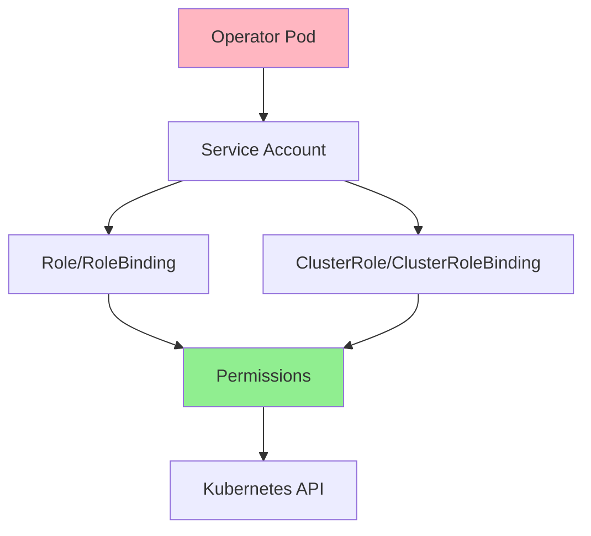
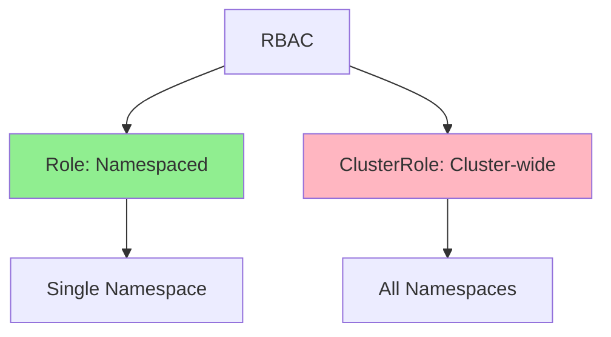
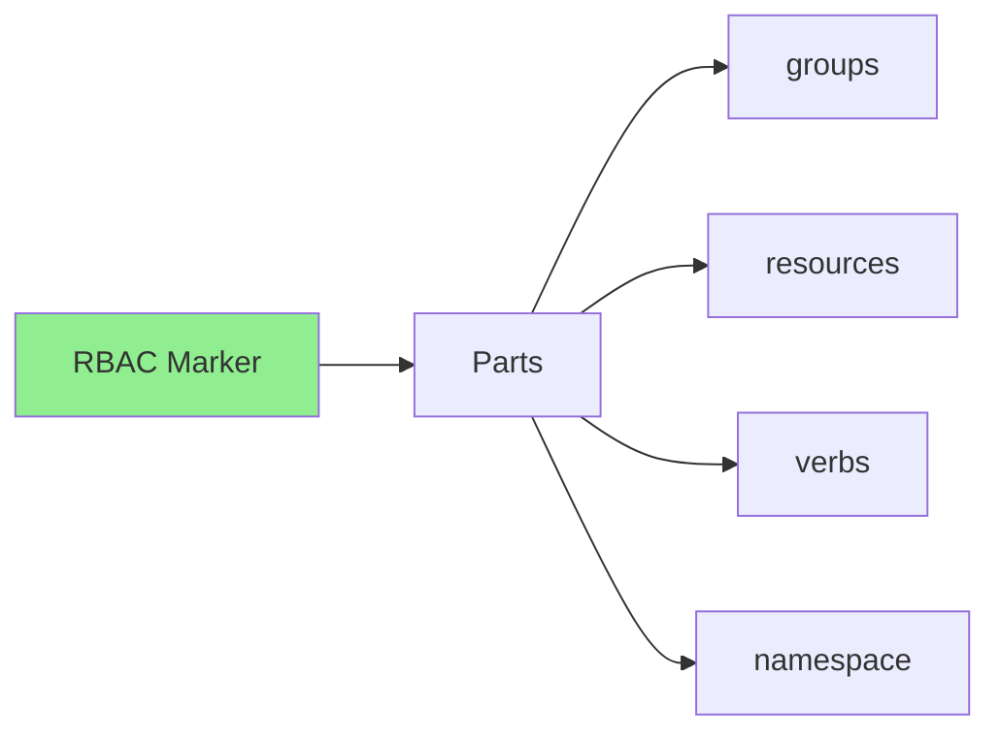
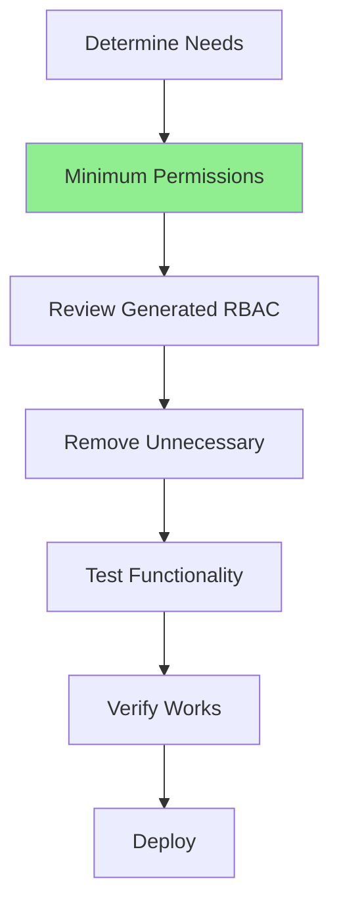
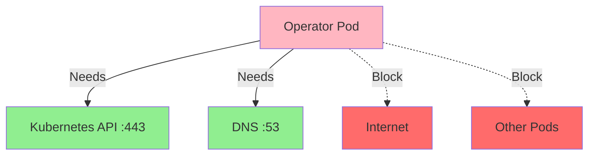
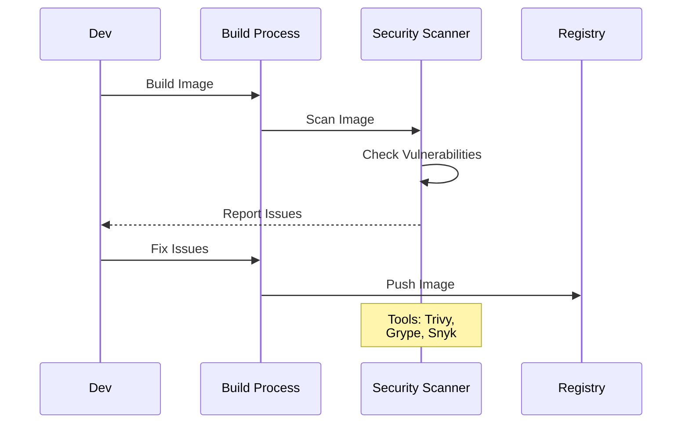

# Lesson 7.2: RBAC and Security

**Navigation:** [← Previous: Packaging and Distribution](01-packaging-distribution.md) | [Module Overview](../README.md) | [Next: High Availability →](03-high-availability.md)

## Introduction

Operators need permissions to manage resources, but they should follow the **principle of least privilege** - only requesting the minimum permissions needed. This lesson covers RBAC (Role-Based Access Control) configuration and security best practices for operators.

## Theory: RBAC and Security

Security is critical for production operators - they have **significant permissions** in your cluster.

### Why Security Matters

**Attack Surface:**
- Operators run with elevated permissions
- Compromised operator = compromised cluster
- Security breaches can be catastrophic
- Compliance requirements

**Principle of Least Privilege:**
- Grant minimum permissions needed
- Reduce attack surface
- Limit blast radius
- Follow security best practices

**Defense in Depth:**
- Multiple security layers
- RBAC for authorization
- Network policies for isolation
- Security contexts for containers

### RBAC Components

**Service Account:**
- Identity for operator pod
- Used for authentication
- Tied to RBAC permissions

**Role/ClusterRole:**
- Defines permissions
- Role: Namespace-scoped
- ClusterRole: Cluster-scoped

**RoleBinding/ClusterRoleBinding:**
- Binds role to service account
- Grants permissions
- RoleBinding: Namespace-scoped
- ClusterRoleBinding: Cluster-scoped

### Security Best Practices

**Image Security:**
- Use distroless images
- Scan for vulnerabilities
- Keep images updated
- Minimal base images

**Container Security:**
- Run as non-root
- Read-only root filesystem
- Drop all capabilities
- Use security contexts

**Network Security:**
- Network policies
- Limit network access
- Isolate operator traffic
- Encrypt communication

Understanding security helps you build secure, production-ready operators.

## RBAC Architecture

Here's how RBAC works for operators:



## RBAC Components

### Service Account

```yaml
apiVersion: v1
kind: ServiceAccount
metadata:
  name: postgres-operator
  namespace: default
```

### Role vs ClusterRole



**Role**: Permissions within a namespace  
**ClusterRole**: Permissions across all namespaces

## Kubebuilder RBAC Markers

Kubebuilder generates RBAC automatically from markers in your controller code. These markers are placed just above your `Reconcile` function:

```go
// +kubebuilder:rbac:groups=database.example.com,resources=databases,verbs=get;list;watch;create;update;patch;delete
// +kubebuilder:rbac:groups=database.example.com,resources=databases/status,verbs=get;update;patch
// +kubebuilder:rbac:groups=database.example.com,resources=databases/finalizers,verbs=update
// +kubebuilder:rbac:groups=apps,resources=statefulsets,verbs=get;list;watch;create;update;patch;delete
// +kubebuilder:rbac:groups=core,resources=services,verbs=get;list;watch;create;update;patch;delete
// +kubebuilder:rbac:groups=core,resources=secrets,verbs=get;list;watch;create;update;patch;delete

func (r *DatabaseReconciler) Reconcile(ctx context.Context, req ctrl.Request) (ctrl.Result, error) {
    // ... reconciliation logic
}
```

### Generating RBAC Manifests

After updating markers, regenerate RBAC manifests:

```bash
# Generate RBAC from markers
make manifests

# View generated RBAC
cat config/rbac/role.yaml
```

The generated manifests are in `config/rbac/`:
- `role.yaml` - ClusterRole with permissions
- `role_binding.yaml` - ClusterRoleBinding
- `service_account.yaml` - ServiceAccount for the operator

### RBAC Marker Format



## Principle of Least Privilege



**Best Practices:**
- Only request permissions you need
- Use specific verbs (not `*`)
- Use specific resources (not `*`)
- Review generated RBAC
- Test with minimal permissions

## Security Best Practices

### Practice 1: Use Distroless Images

```dockerfile
FROM gcr.io/distroless/static:nonroot
# No shell, no package manager, minimal attack surface
```

### Practice 2: Run as Non-Root

```yaml
securityContext:
  runAsNonRoot: true
  runAsUser: 65532
  allowPrivilegeEscalation: false
  capabilities:
    drop:
    - ALL
```

### Practice 3: Read-Only Root Filesystem

```yaml
securityContext:
  readOnlyRootFilesystem: true
volumeMounts:
- name: tmp
  mountPath: /tmp
volumes:
- name: tmp
  emptyDir: {}
```

### Practice 4: Network Policies

Network Policies are essential for **defense in depth** - they control network traffic to and from your operator pods, limiting the blast radius if an attacker compromises your operator.

#### Why Network Policies for Operators?



**Operators typically only need:**
- **Egress to Kubernetes API** (port 443/6443) - to watch and manage resources
- **Egress to DNS** (port 53) - for service discovery
- **No ingress** (unless serving webhooks or metrics)

**Everything else should be blocked!**

#### Network Policy Structure

```yaml
apiVersion: networking.k8s.io/v1
kind: NetworkPolicy
metadata:
  name: controller-manager
  namespace: postgres-operator-system
spec:
  # Select which pods this policy applies to
  podSelector:
    matchLabels:
      control-plane: controller-manager
  
  # What types of traffic to control
  policyTypes:
  - Ingress
  - Egress
  
  # Ingress rules (incoming traffic)
  ingress:
  - from:
    - namespaceSelector:
        matchLabels:
          kubernetes.io/metadata.name: prometheus
    ports:
    - protocol: TCP
      port: 8080  # Metrics port (if enabled)
  
  # Egress rules (outgoing traffic)
  egress:
  # Allow DNS lookups
  - to:
    - namespaceSelector: {}
    ports:
    - protocol: UDP
      port: 53
    - protocol: TCP
      port: 53
  # Allow Kubernetes API access
  - to:
    - namespaceSelector: {}
    ports:
    - protocol: TCP
      port: 443
    - protocol: TCP
      port: 6443
```

#### Key Concepts

| Field | Description |
|-------|-------------|
| `podSelector` | Selects pods the policy applies to (empty = all pods in namespace) |
| `policyTypes` | Which direction to control: `Ingress`, `Egress`, or both |
| `ingress.from` | Who can send traffic TO the selected pods |
| `egress.to` | Where the selected pods can send traffic |
| `namespaceSelector` | Match pods in namespaces with specific labels |
| `podSelector` (in rules) | Match specific pods within allowed namespaces |

#### Default Deny Pattern

For maximum security, start with **deny all** and explicitly allow only what's needed:

```yaml
# Deny all ingress (no incoming traffic allowed)
apiVersion: networking.k8s.io/v1
kind: NetworkPolicy
metadata:
  name: default-deny-ingress
spec:
  podSelector: {}  # Applies to all pods
  policyTypes:
  - Ingress
  # No ingress rules = deny all ingress
```

**Important:** Network Policies require a CNI plugin that supports them (Calico, Cilium, Weave, etc.). The default Kubernetes networking (kubenet) does NOT enforce Network Policies!

## Security Scanning

### Scanning Flow



## Kubebuilder Security Configuration

Kubebuilder's generated deployment in `config/manager/manager.yaml` includes security best practices:

```yaml
spec:
  template:
    spec:
      securityContext:
        runAsNonRoot: true
      containers:
      - name: manager
        securityContext:
          allowPrivilegeEscalation: false
          capabilities:
            drop:
            - ALL
        # Resource limits from config/manager/manager.yaml
        resources:
          limits:
            cpu: 500m
            memory: 128Mi
          requests:
            cpu: 10m
            memory: 64Mi
```

## Key Takeaways

- **RBAC** controls operator permissions
- **Service Accounts** identify the operator
- **Roles** are namespaced, **ClusterRoles** are cluster-wide
- **Kubebuilder markers** generate RBAC automatically via `make manifests`
- **Principle of least privilege** minimizes risk
- **Kubebuilder's Dockerfile** uses distroless images by default
- **Security scanning** finds vulnerabilities
- **Review `config/rbac/`** to verify generated permissions
- **Network Policies** provide defense in depth by restricting network traffic
- Operators typically only need egress to **Kubernetes API (443)** and **DNS (53)**

## Understanding for Building Operators

When configuring RBAC and security with kubebuilder:
- Add RBAC markers above your Reconcile function
- Run `make manifests` to regenerate RBAC
- Review `config/rbac/role.yaml` for generated permissions
- Remove unnecessary markers to minimize permissions
- Use the distroless base image (already in kubebuilder Dockerfile)
- Configure security contexts in `config/manager/manager.yaml`
- **Create `config/network-policy/` directory with NetworkPolicy manifests**
- **Add network-policy to `config/default/kustomization.yaml` resources**
- Scan images for vulnerabilities before deployment
- **Test network policies in a cluster with CNI support (Calico, Cilium)**

## Related Lab

- [Lab 7.2: Configuring RBAC](../labs/lab-02-rbac-security.md) - Hands-on exercises for this lesson

## References

### Official Documentation
- [RBAC Authorization](https://kubernetes.io/docs/reference/access-authn-authz/rbac/)
- [Service Accounts](https://kubernetes.io/docs/concepts/security/service-accounts/)
- [Network Policies](https://kubernetes.io/docs/concepts/services-networking/network-policies/)

### Further Reading
- **Kubernetes Security** by Andrew Martin and Michael Hausenblas - Security best practices
- **Kubernetes Operators** by Jason Dobies and Joshua Wood - Chapter 13: Security
- [Kubernetes Security Best Practices](https://kubernetes.io/docs/concepts/security/)

### Related Topics
- [Pod Security Standards](https://kubernetes.io/docs/concepts/security/pod-security-standards/)
- [Security Contexts](https://kubernetes.io/docs/tasks/configure-pod-container/security-context/)
- [Image Security](https://kubernetes.io/docs/concepts/security/application-security-checklist/#image-security)

## Next Steps

Now that you understand RBAC and security, let's learn about high availability.

**Navigation:** [← Previous: Packaging and Distribution](01-packaging-distribution.md) | [Module Overview](../README.md) | [Next: High Availability →](03-high-availability.md)

