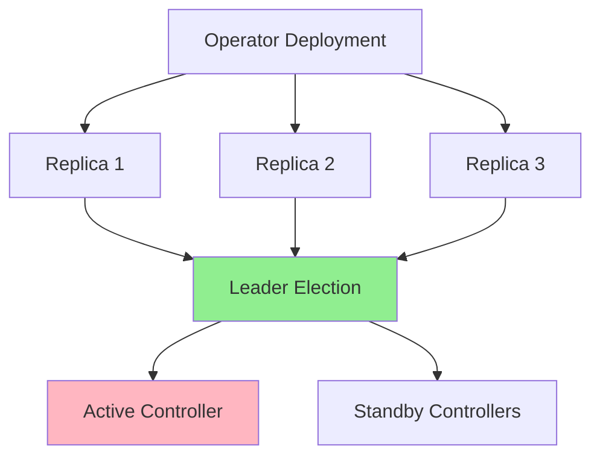
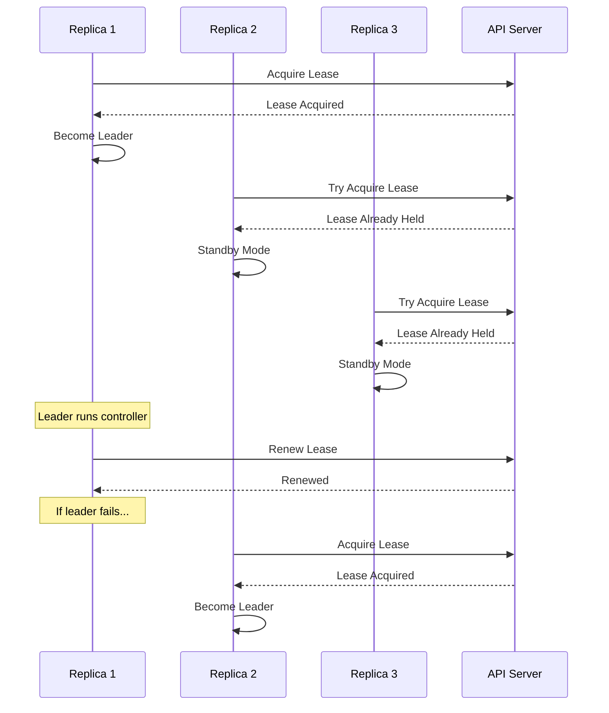
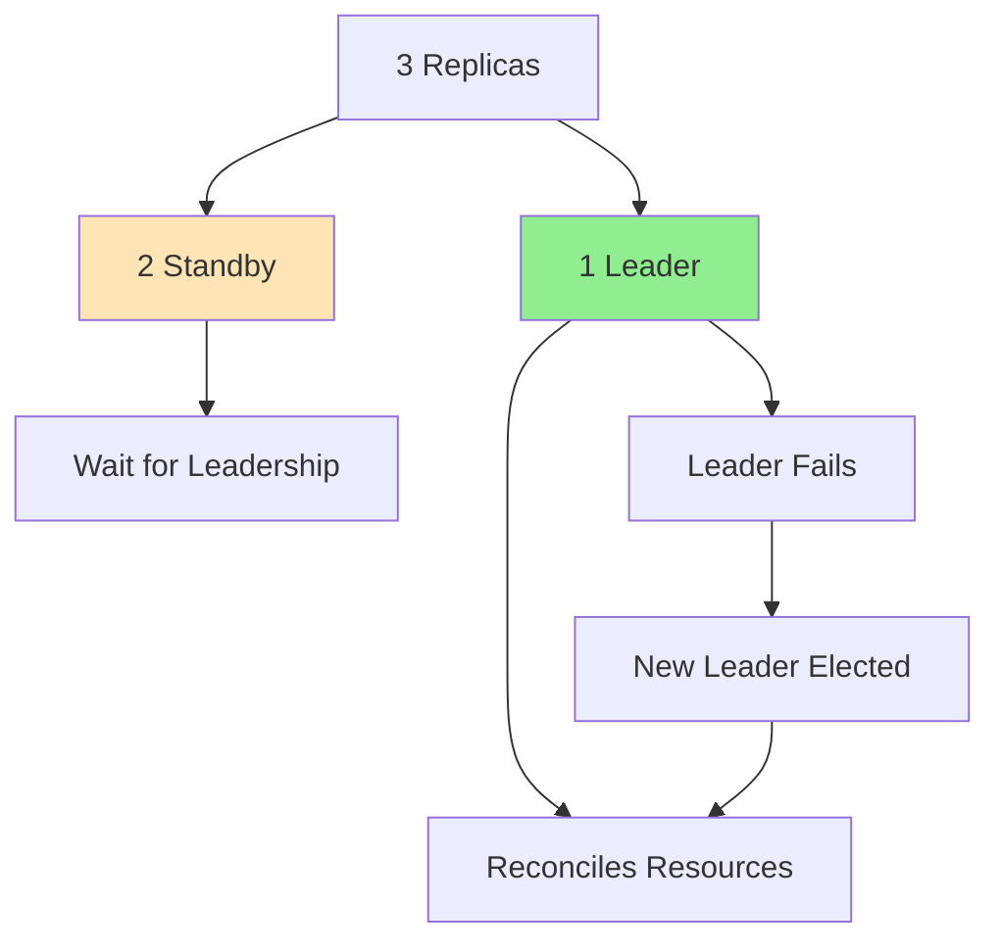
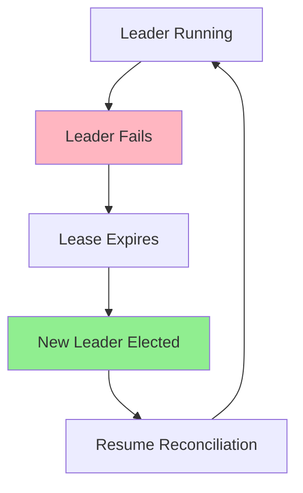
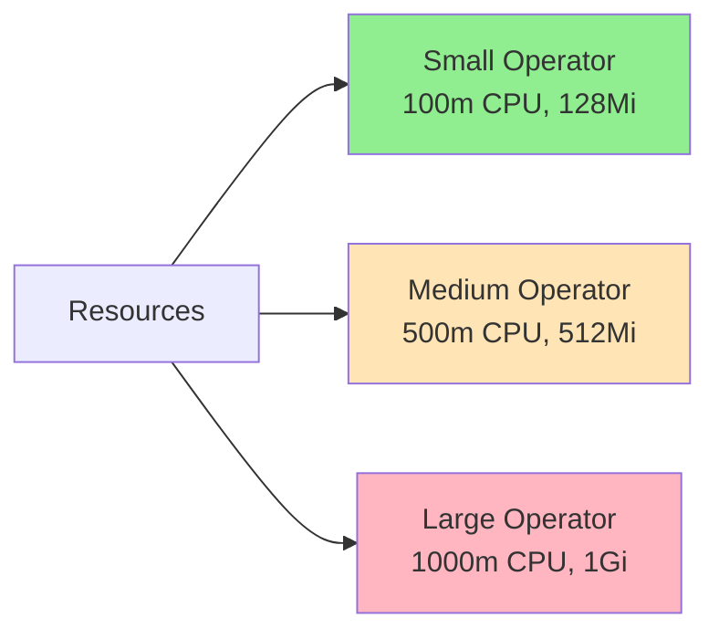
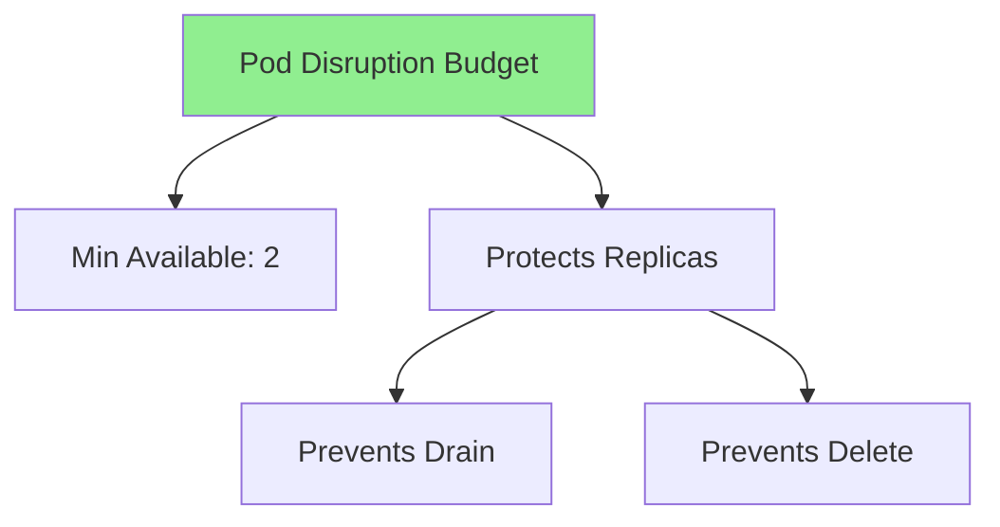

# Lesson 7.3: High Availability

**Navigation:** [← Previous: RBAC and Security](02-rbac-security.md) | [Module Overview](../README.md) | [Next: Performance and Scalability →](04-performance-scalability.md)

## Introduction

Production operators need to be highly available - they should continue operating even if individual pods fail. This lesson covers leader election, multiple replicas, failover handling, and resource management for high availability.

## High Availability Architecture

Here's how HA works for operators:



## Leader Election

### How Leader Election Works



### Leader Election Configuration

```go
mgr, err := ctrl.NewManager(ctrl.GetConfigOrDie(), ctrl.Options{
    Scheme:                  scheme,
    LeaderElection:          true,
    LeaderElectionID:        "database-operator-leader-election",
    LeaderElectionNamespace: "default",
    LeaseDuration:           &metav1.Duration{Duration: 15 * time.Second},
    RenewDeadline:           &metav1.Duration{Duration: 10 * time.Second},
    RetryPeriod:             &metav1.Duration{Duration: 2 * time.Second},
})
```

## Multiple Replicas

### Deployment Configuration

```yaml
apiVersion: apps/v1
kind: Deployment
metadata:
  name: database-operator
spec:
  replicas: 3
  selector:
    matchLabels:
      app: database-operator
  template:
    metadata:
      labels:
        app: database-operator
    spec:
      containers:
      - name: manager
        image: database-operator:latest
```

### Replica Coordination



## Failover Process

### Failover Flow



### Handling Failover

```go
// Leader election handles failover automatically
// When leader fails:
// 1. Lease expires (after LeaseDuration)
// 2. Another replica acquires lease
// 3. New leader starts reconciling
// 4. No reconciliation is lost (idempotent operations)
```

## Resource Management

### Resource Limits

```yaml
resources:
  requests:
    cpu: 100m
    memory: 128Mi
  limits:
    cpu: 500m
    memory: 512Mi
```

### Resource Sizing



## Pod Disruption Budget

### PDB Configuration

```yaml
apiVersion: policy/v1
kind: PodDisruptionBudget
metadata:
  name: database-operator-pdb
spec:
  minAvailable: 2
  selector:
    matchLabels:
      app: database-operator
```

### PDB Protection



## Health Checks

### Liveness and Readiness

```yaml
livenessProbe:
  httpGet:
    path: /healthz
    port: 8081
  initialDelaySeconds: 15
  periodSeconds: 20

readinessProbe:
  httpGet:
    path: /readyz
    port: 8081
  initialDelaySeconds: 5
  periodSeconds: 10
```

## Key Takeaways

- **Leader election** ensures only one active controller
- **Multiple replicas** provide redundancy
- **Failover** is automatic with leader election
- **Resource limits** prevent resource exhaustion
- **Pod Disruption Budgets** protect availability
- **Health checks** ensure operator health
- **Idempotent operations** handle failover gracefully

## Understanding for Building Operators

When implementing high availability:
- Enable leader election
- Deploy multiple replicas
- Set appropriate resource limits
- Configure Pod Disruption Budgets
- Add health checks
- Ensure operations are idempotent
- Test failover scenarios

## Related Lab

- [Lab 7.3: Implementing HA](../labs/lab-03-high-availability.md) - Hands-on exercises for this lesson

## Next Steps

Now that you understand high availability, let's learn about performance optimization.

**Navigation:** [← Previous: RBAC and Security](02-rbac-security.md) | [Module Overview](../README.md) | [Next: Performance and Scalability →](04-performance-scalability.md)

