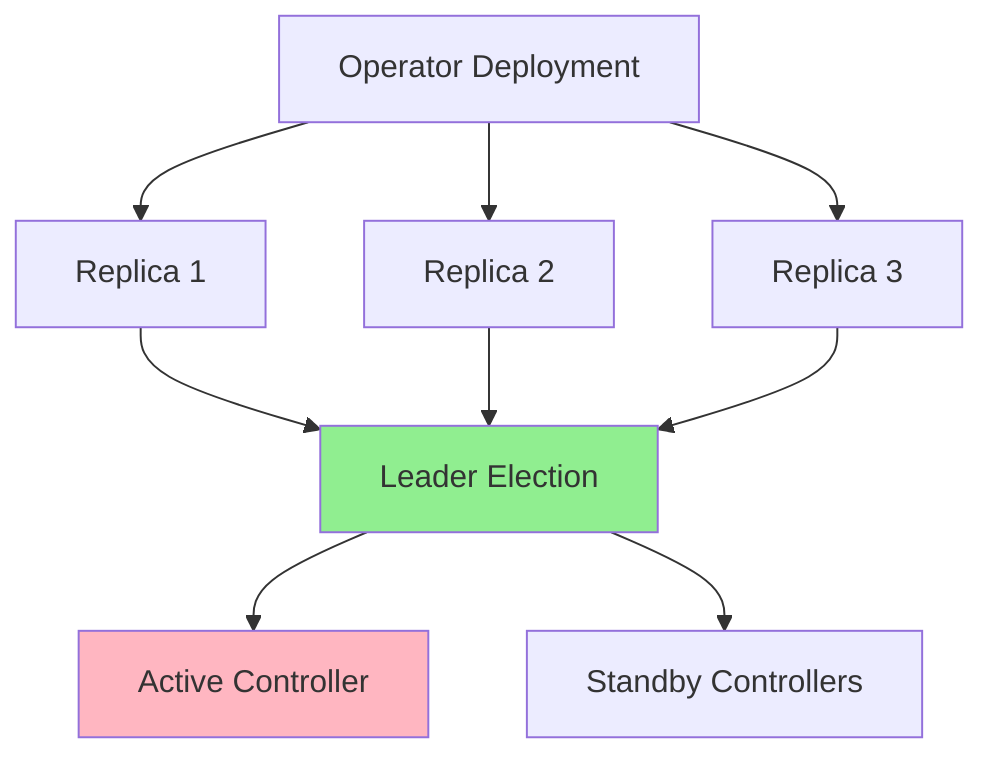
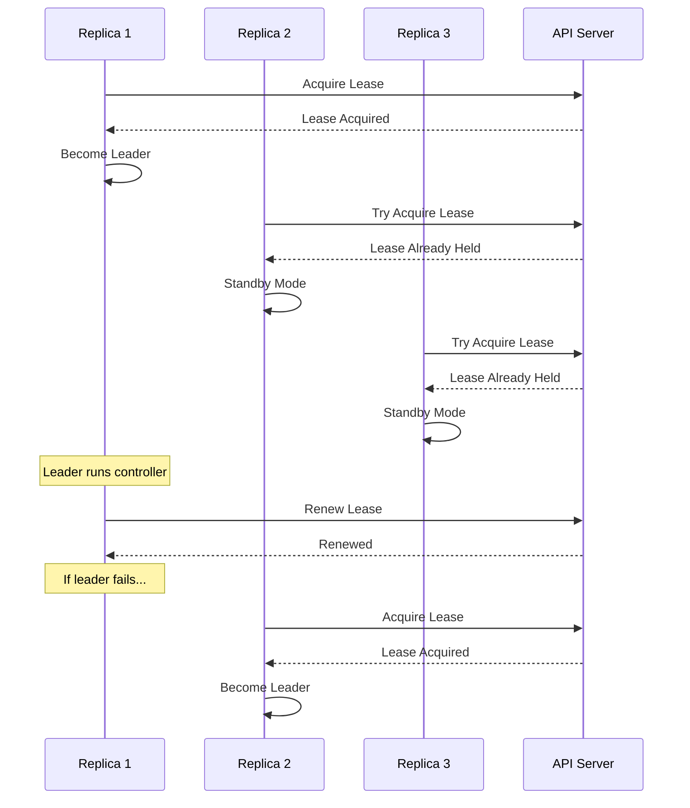
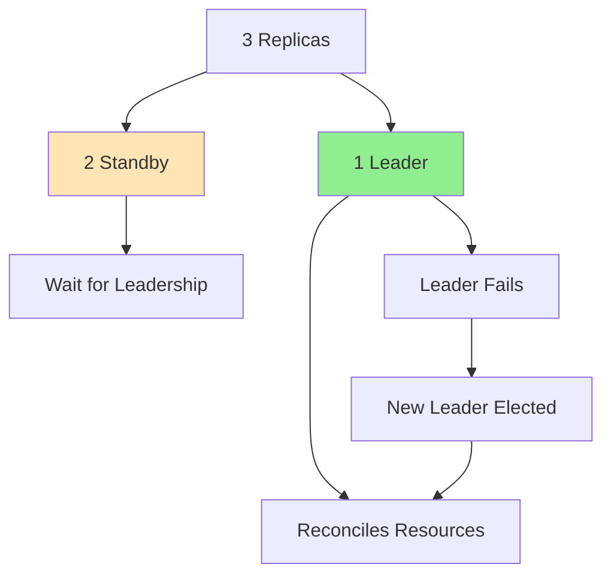
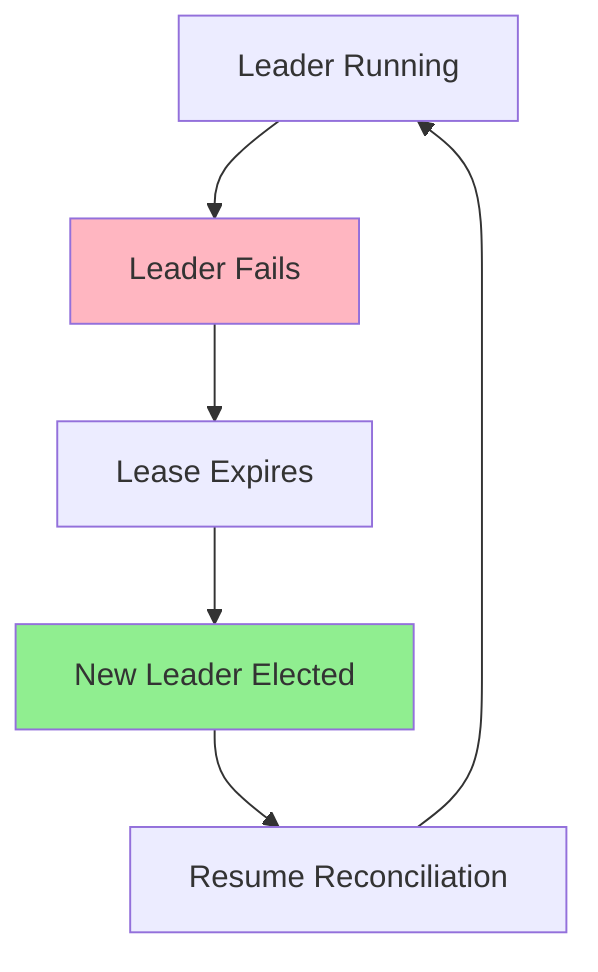
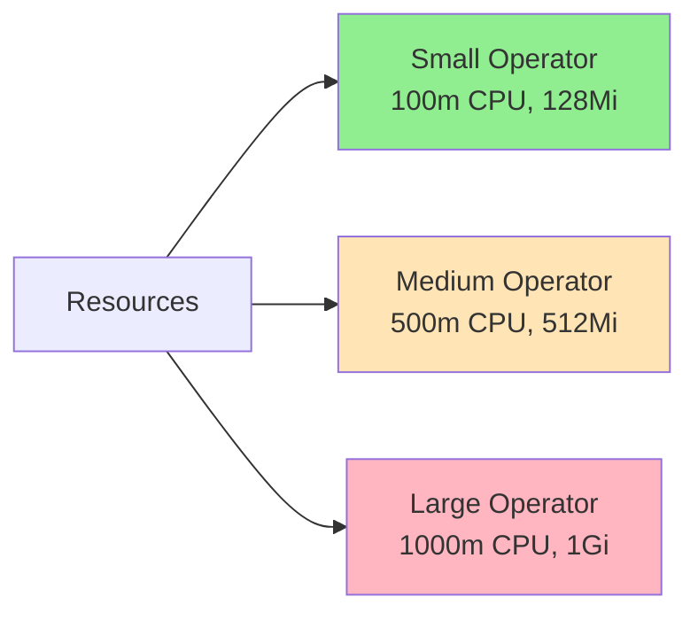
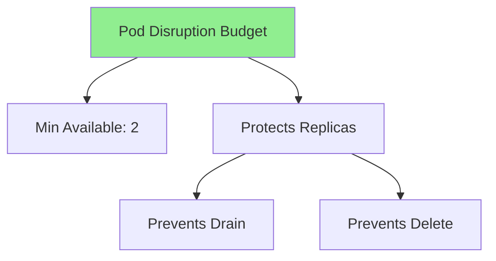

# Lesson 7.3: High Availability

**Navigation:** [← Previous: RBAC and Security](02-rbac-security.md) | [Module Overview](../README.md) | [Next: Performance and Scalability →](04-performance-scalability.md)

## Introduction

Production operators need to be highly available - they should continue operating even if individual pods fail. This lesson covers leader election, multiple replicas, failover handling, and resource management for high availability.

## Theory: High Availability

High availability ensures operators **continue operating** despite failures.

### Why High Availability?

**Reliability:**
- Operators manage critical workloads
- Single point of failure is unacceptable
- Redundancy prevents outages
- Failover ensures continuity

**Scalability:**
- Handle increased load
- Distribute work across replicas
- Scale horizontally
- Performance under load

**Resilience:**
- Survive pod failures
- Survive node failures
- Automatic recovery
- Zero-downtime deployments

### Leader Election

**Why Leader Election?**
- Controllers must not conflict
- Only one should reconcile at a time
- Prevents duplicate work
- Ensures consistency

**How It Works:**
- Controllers compete for lease
- Winner becomes leader
- Leader reconciles resources
- Others wait as standby

**Failover:**
- Leader renews lease periodically
- If leader fails, lease expires
- Another controller acquires lease
- New leader takes over

### Resource Management

**Resource Requests:**
- Guaranteed resources
- Scheduler uses for placement
- Ensures operator has resources

**Resource Limits:**
- Maximum resources
- Prevents resource exhaustion
- Protects other workloads
- Enables overcommitment

Understanding high availability helps you build reliable, production-ready operators.

## High Availability Architecture

Here's how HA works for operators:



## Leader Election

### How Leader Election Works



### Leader Election in Kubebuilder

Kubebuilder's generated `cmd/main.go` already includes leader election support via command-line flags:

```go
// In cmd/main.go (generated by kubebuilder)
var enableLeaderElection bool
flag.BoolVar(&enableLeaderElection, "leader-elect", false,
    "Enable leader election for controller manager. "+
    "Enabling this will ensure there is only one active controller manager.")

mgr, err := ctrl.NewManager(ctrl.GetConfigOrDie(), ctrl.Options{
    Scheme:                 scheme,
    Metrics:                metricsserver.Options{BindAddress: metricsAddr},
    HealthProbeBindAddress: probeAddr,
    LeaderElection:         enableLeaderElection,
    LeaderElectionID:       "postgres-operator.example.com",
    // LeaderElectionReleaseOnCancel defines if the leader should step down
    // when the Manager ends. This requires the binary to immediately end
    // when the Manager is stopped.
    LeaderElectionReleaseOnCancel: true,
})
```

To enable leader election when running your operator:

```bash
# Run with leader election enabled
./manager --leader-elect=true
```

For production deployments, update `config/manager/manager.yaml`:

```yaml
args:
- --leader-elect
```

## Multiple Replicas

### Kubebuilder Deployment Configuration

Update the replica count in `config/manager/manager.yaml`:

```yaml
apiVersion: apps/v1
kind: Deployment
metadata:
  name: controller-manager
  namespace: system
  labels:
    control-plane: controller-manager
spec:
  replicas: 3  # Increase from 1 to 3 for HA
  selector:
    matchLabels:
      control-plane: controller-manager
  template:
    metadata:
      labels:
        control-plane: controller-manager
    spec:
      containers:
      - name: manager
        image: controller:latest
        args:
        - --leader-elect  # Enable leader election for HA
```

Or use `kustomize` patches in `config/default/manager_config_patch.yaml`.

### Replica Coordination



## Failover Process

### Failover Flow



### Handling Failover

```go
// Leader election handles failover automatically
// When leader fails:
// 1. Lease expires (after LeaseDuration)
// 2. Another replica acquires lease
// 3. New leader starts reconciling
// 4. No reconciliation is lost (idempotent operations)
```

## Resource Management

### Resource Limits

```yaml
resources:
  requests:
    cpu: 100m
    memory: 128Mi
  limits:
    cpu: 500m
    memory: 512Mi
```

### Resource Sizing



## Pod Disruption Budget

### PDB Configuration

```yaml
apiVersion: policy/v1
kind: PodDisruptionBudget
metadata:
  name: postgres-operator-pdb
spec:
  minAvailable: 2
  selector:
    matchLabels:
      app: postgres-operator
```

### PDB Protection



## Health Checks

Kubebuilder's generated `cmd/main.go` automatically sets up health endpoints:

```go
// In cmd/main.go (generated by kubebuilder)
if err := mgr.AddHealthzCheck("healthz", healthz.Ping); err != nil {
    setupLog.Error(err, "unable to set up health check")
    os.Exit(1)
}
if err := mgr.AddReadyzCheck("readyz", healthz.Ping); err != nil {
    setupLog.Error(err, "unable to set up ready check")
    os.Exit(1)
}
```

### Liveness and Readiness in Deployment

The health probes are already configured in `config/manager/manager.yaml`:

```yaml
livenessProbe:
  httpGet:
    path: /healthz
    port: 8081
  initialDelaySeconds: 15
  periodSeconds: 20

readinessProbe:
  httpGet:
    path: /readyz
    port: 8081
  initialDelaySeconds: 5
  periodSeconds: 10
```

## Key Takeaways

- **Leader election** is built into kubebuilder via `--leader-elect` flag
- **Multiple replicas** provide redundancy (update `config/manager/manager.yaml`)
- **Failover** is automatic with leader election
- **Health checks** are pre-configured by kubebuilder (`/healthz`, `/readyz`)
- **Resource limits** prevent resource exhaustion
- **Pod Disruption Budgets** protect availability
- **Idempotent operations** handle failover gracefully

## Understanding for Building Operators

When implementing high availability with kubebuilder:
- Add `--leader-elect` to deployment args in `config/manager/manager.yaml`
- Increase `replicas` to 3 in the deployment
- Health probes are already configured by kubebuilder
- Set appropriate resource limits in the deployment
- Add Pod Disruption Budgets in `config/manager/`
- Ensure your reconciliation logic is idempotent
- Use `make deploy` to deploy with HA configuration

## Related Lab

- [Lab 7.3: Implementing HA](../labs/lab-03-high-availability.md) - Hands-on exercises for this lesson

## References

### Official Documentation
- [Leader Election](https://kubernetes.io/docs/concepts/architecture/leases/)
- [Pod Disruption Budgets](https://kubernetes.io/docs/concepts/workloads/pods/disruptions/#pod-disruption-budgets)
- [Resource Management](https://kubernetes.io/docs/concepts/configuration/manage-resources-containers/)

### Further Reading
- **Kubernetes Operators** by Jason Dobies and Joshua Wood - Chapter 14: High Availability
- **Kubernetes: Up and Running** by Kelsey Hightower, Brendan Burns, and Joe Beda - Chapter 12: Deploying Applications
- [Kubernetes High Availability](https://kubernetes.io/docs/setup/production-environment/tools/kubeadm/high-availability/)

### Related Topics
- [Leases API](https://kubernetes.io/docs/reference/kubernetes-api/cluster-resources/lease-v1/)
- [Health Checks](https://kubernetes.io/docs/tasks/configure-pod-container/configure-liveness-readiness-startup-probes/)
- [Resource Quotas](https://kubernetes.io/docs/concepts/policy/resource-quotas/)

## Next Steps

Now that you understand high availability, let's learn about performance optimization.

**Navigation:** [← Previous: RBAC and Security](02-rbac-security.md) | [Module Overview](../README.md) | [Next: Performance and Scalability →](04-performance-scalability.md)
