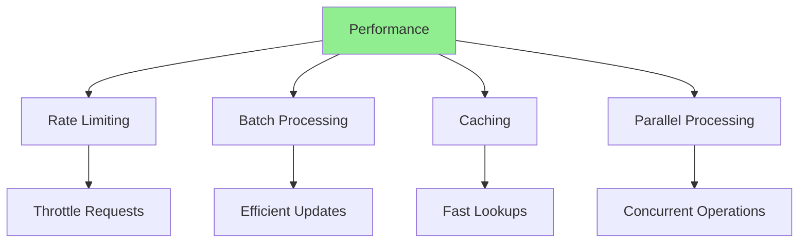
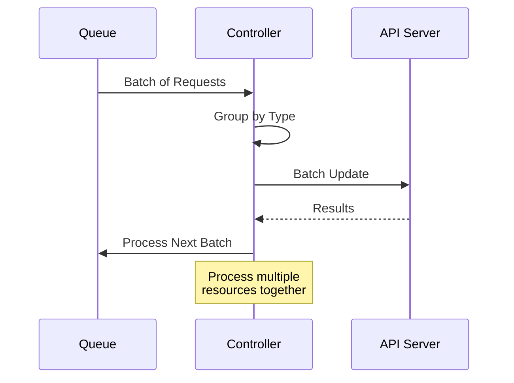
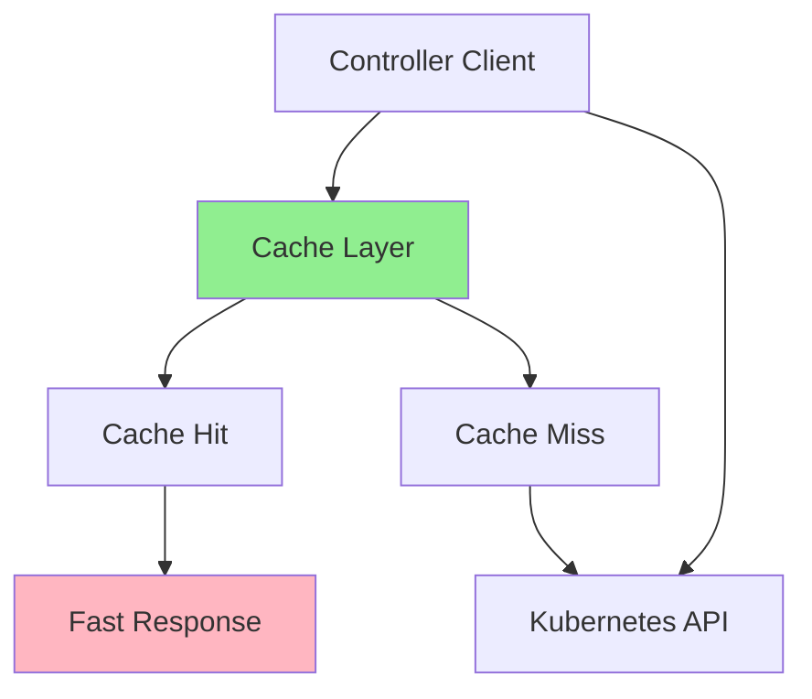
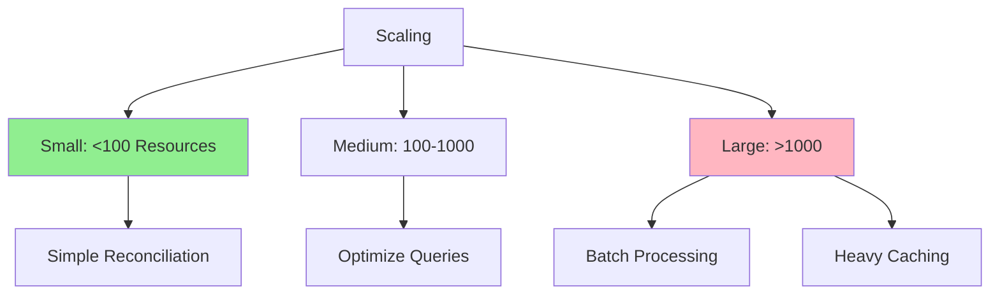
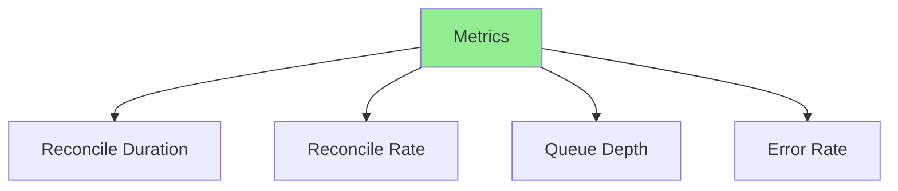

# Lesson 7.4: Performance and Scalability

**Navigation:** [← Previous: High Availability](03-high-availability.md) | [Module Overview](../README.md)

## Introduction

As operators manage more resources, performance becomes critical. This lesson covers rate limiting, batch reconciliation, caching strategies, and techniques for managing large-scale deployments efficiently.

## Theory: Performance and Scalability

Performance optimization ensures operators **scale efficiently** as they manage more resources.

### Why Performance Matters

**Scalability:**
- Operators must handle growth
- Performance degrades with scale
- Optimization enables scaling
- Cost efficiency

**User Experience:**
- Fast reconciliation
- Responsive status updates
- Low latency
- Better resource utilization

**Resource Efficiency:**
- Lower API server load
- Reduced network traffic
- Lower CPU/memory usage
- Cost savings

### Performance Bottlenecks

**API Server Load:**
- Too many API calls
- Inefficient queries
- No caching
- Rate limiting issues

**Reconciliation Overhead:**
- Inefficient reconciliation logic
- Unnecessary work
- No batching
- Sequential processing

**Memory Usage:**
- Large caches
- Memory leaks
- Inefficient data structures
- No cleanup

### Optimization Strategies

**Rate Limiting:**
- Control API call rate
- Prevent API server overload
- Respect API server limits
- Smooth traffic patterns

**Caching:**
- Cache frequently accessed data
- Reduce API calls
- Faster lookups
- Use informers

**Batch Processing:**
- Process multiple resources together
- Reduce overhead
- Improve efficiency
- Better resource utilization

**Parallel Processing:**
- Process independent work in parallel
- Utilize multiple cores
- Faster completion
- Careful with shared state

Understanding performance helps you build scalable, efficient operators.

## Performance Optimization Strategies



## Rate Limiting

### Why Rate Limit?

```mermaid
flowchart TD
    OPERATOR[Operator] --> API[Kubernetes API]
    API --> OVERLOAD{Too Many<br/>Requests?}
    OVERLOAD -->|Yes| THROTTLE[API Throttles]
    OVERLOAD -->|No| SUCCESS[Success]
    
    THROTTLE --> ERRORS[Errors]
    ERRORS --> RETRY[Retries]
    RETRY --> MORE[More Load]
    
    style THROTTLE fill:#FFB6C1
    style RATE[Rate Limit] fill:#90EE90
```

### Using Controller-Runtime's Built-in Rate Limiting

Controller-runtime (used by kubebuilder) includes built-in rate limiting. Configure it when setting up your controller:

```go
// In internal/controller/database_controller.go

func (r *DatabaseReconciler) SetupWithManager(mgr ctrl.Manager) error {
    return ctrl.NewControllerManagedBy(mgr).
        For(&databasev1.Database{}).
        Owns(&appsv1.StatefulSet{}).
        Owns(&corev1.Service{}).
        WithOptions(controller.Options{
            // MaxConcurrentReconciles limits parallel reconciliations
            MaxConcurrentReconciles: 2,
            // RateLimiter controls requeue rate
            RateLimiter: workqueue.NewItemExponentialFailureRateLimiter(
                5*time.Millisecond,  // Base delay
                1000*time.Second,    // Max delay
            ),
        }).
        Complete(r)
}
```

### Custom Rate Limiting for API Calls

For rate limiting external API calls within reconciliation:

```go
import (
    "golang.org/x/time/rate"
)

type DatabaseReconciler struct {
    client.Client
    Scheme      *runtime.Scheme
    apiLimiter  *rate.Limiter  // Rate limiter for external APIs
}

func NewDatabaseReconciler(mgr ctrl.Manager) *DatabaseReconciler {
    return &DatabaseReconciler{
        Client:     mgr.GetClient(),
        Scheme:     mgr.GetScheme(),
        apiLimiter: rate.NewLimiter(rate.Limit(10), 1), // 10 requests/second
    }
}

func (r *DatabaseReconciler) Reconcile(ctx context.Context, req ctrl.Request) (ctrl.Result, error) {
    // Wait for rate limiter before external API calls
    if err := r.apiLimiter.Wait(ctx); err != nil {
        return ctrl.Result{}, err
    }
    // ... reconciliation with external API calls ...
}
```

## Batch Reconciliation

### Batch Processing Flow



### Batch Reconciliation Example

```go
func (r *DatabaseReconciler) ReconcileBatch(ctx context.Context, requests []ctrl.Request) (ctrl.Result, error) {
    // Group requests by operation
    creates := []*databasev1.Database{}
    updates := []*databasev1.Database{}
    
    for _, req := range requests {
        db := &databasev1.Database{}
        if err := r.Get(ctx, req.NamespacedName, db); err != nil {
            if errors.IsNotFound(err) {
                continue
            }
            return ctrl.Result{}, err
        }
        
        if db.Status.Phase == "" {
            creates = append(creates, db)
        } else {
            updates = append(updates, db)
        }
    }
    
    // Batch create
    for _, db := range creates {
        r.reconcileDatabase(ctx, db)
    }
    
    // Batch update
    for _, db := range updates {
        r.reconcileDatabase(ctx, db)
    }
    
    return ctrl.Result{}, nil
}
```

## Caching Strategies

### Client Caching



### Kubebuilder's Built-in Caching

Controller-runtime (used by kubebuilder) provides automatic caching through the Manager's client. When you use `r.Get()` or `r.List()`, it reads from the cache, not directly from the API server:

```go
// In your controller - reads from cache by default
func (r *DatabaseReconciler) Reconcile(ctx context.Context, req ctrl.Request) (ctrl.Result, error) {
    db := &databasev1.Database{}
    // This reads from cache, NOT from API server
    if err := r.Get(ctx, req.NamespacedName, db); err != nil {
        return ctrl.Result{}, client.IgnoreNotFound(err)
    }
    
    // List also uses cache
    dbList := &databasev1.DatabaseList{}
    if err := r.List(ctx, dbList, client.InNamespace(req.Namespace)); err != nil {
        return ctrl.Result{}, err
    }
    
    return ctrl.Result{}, nil
}
```

### Custom Indexers for Fast Lookups

Add custom indexes in your controller setup to enable fast filtering:

```go
// In cmd/main.go or during controller setup
func SetupIndexes(mgr ctrl.Manager) error {
    // Index databases by their environment
    return mgr.GetFieldIndexer().IndexField(
        context.Background(),
        &databasev1.Database{},
        "spec.environment",
        func(obj client.Object) []string {
            db := obj.(*databasev1.Database)
            return []string{db.Spec.Environment}
        },
    )
}

// Then use in controller with MatchingFields
dbList := &databasev1.DatabaseList{}
err := r.List(ctx, dbList, client.MatchingFields{
    "spec.environment": "production",
})
```

## Parallel Processing

### Concurrent Reconciliation

```go
func (r *DatabaseReconciler) ReconcileParallel(ctx context.Context, requests []ctrl.Request) error {
    var wg sync.WaitGroup
    errChan := make(chan error, len(requests))
    
    for _, req := range requests {
        wg.Add(1)
        go func(request ctrl.Request) {
            defer wg.Done()
            _, err := r.Reconcile(ctx, request)
            if err != nil {
                errChan <- err
            }
        }(req)
    }
    
    wg.Wait()
    close(errChan)
    
    // Collect errors
    var errors []error
    for err := range errChan {
        errors = append(errors, err)
    }
    
    if len(errors) > 0 {
        return fmt.Errorf("reconciliation errors: %v", errors)
    }
    
    return nil
}
```

## Managing Large Clusters

### Scaling Considerations



### Optimization Techniques

1. **Use Field Selectors**
   ```go
   // Instead of listing all, use field selector
   databases := &databasev1.DatabaseList{}
   r.List(ctx, databases, client.MatchingFields{
       "spec.environment": "production",
   })
   ```

2. **Limit List Results**
   ```go
   databases := &databasev1.DatabaseList{}
   r.List(ctx, databases, &client.ListOptions{
       Limit: 100,
   })
   ```

3. **Use Indexes**
   ```go
   // Create index for frequent queries
   mgr.GetFieldIndexer().IndexField(ctx, &databasev1.Database{},
       "spec.environment", indexEnvironment)
   ```

## Performance Monitoring

### Key Metrics



### Monitoring Performance

```go
var (
    reconcileDuration = prometheus.NewHistogramVec(
        prometheus.HistogramOpts{
            Name: "database_reconcile_duration_seconds",
            Help: "Duration of reconciliations",
        },
        []string{"result"},
    )
    
    reconcileRate = prometheus.NewGauge(
        prometheus.GaugeOpts{
            Name: "database_reconcile_rate",
            Help: "Reconciliations per second",
        },
    )
)
```

## Key Takeaways

- **Controller-runtime caching** is automatic in kubebuilder
- **MaxConcurrentReconciles** controls parallel reconciliations
- **RateLimiter** in controller options manages requeue rates
- **Field indexes** enable fast filtered lookups
- **`client.MatchingFields`** optimizes queries
- **Metrics** are available at `:8080/metrics` by default
- **Scale strategies** depend on cluster size

## Understanding for Building Operators

When optimizing kubebuilder operators:
- Use controller-runtime's built-in caching (automatic)
- Configure `MaxConcurrentReconciles` in `SetupWithManager`
- Set up custom field indexes for frequent lookups
- Use `client.MatchingFields{}` for filtered queries
- Monitor metrics at the default metrics endpoint
- Use `rate.Limiter` for external API calls
- Increase replicas with leader election for scale
- Profile with `go tool pprof` if needed

## Related Lab

- [Lab 7.4: Optimizing Performance](../labs/lab-04-performance-scalability.md) - Hands-on exercises for this lesson

## References

### Official Documentation
- [Kubernetes API Rate Limiting](https://kubernetes.io/docs/concepts/cluster-administration/flow-control/)
- [Client-Go Performance](https://github.com/kubernetes/client-go/blob/master/docs/performance.md)
- [Controller Performance](https://kubernetes.io/docs/concepts/architecture/controller/#controller-performance)

### Further Reading
- **Kubernetes Operators** by Jason Dobies and Joshua Wood - Chapter 15: Performance
- **High Performance Go** by Ian Lance Taylor - Go performance optimization
- [Kubernetes Scalability](https://kubernetes.io/docs/concepts/cluster-administration/cluster-large/)

### Related Topics
- [API Priority and Fairness](https://kubernetes.io/docs/concepts/cluster-administration/flow-control/)
- [Profiling Go Programs](https://go.dev/blog/pprof)
- [Caching Strategies](https://kubernetes.io/docs/concepts/architecture/controller/#caching)

## Next Steps

Congratulations! You've completed Module 7. You now understand:
- Packaging and distribution
- RBAC and security
- High availability
- Performance optimization

In [Module 8](../../module-08/README.md), you'll learn about advanced topics and real-world patterns.

**Navigation:** [← Previous: High Availability](03-high-availability.md) | [Module Overview](../README.md) | [Next: Module 8 →](../../module-08/README.md)

