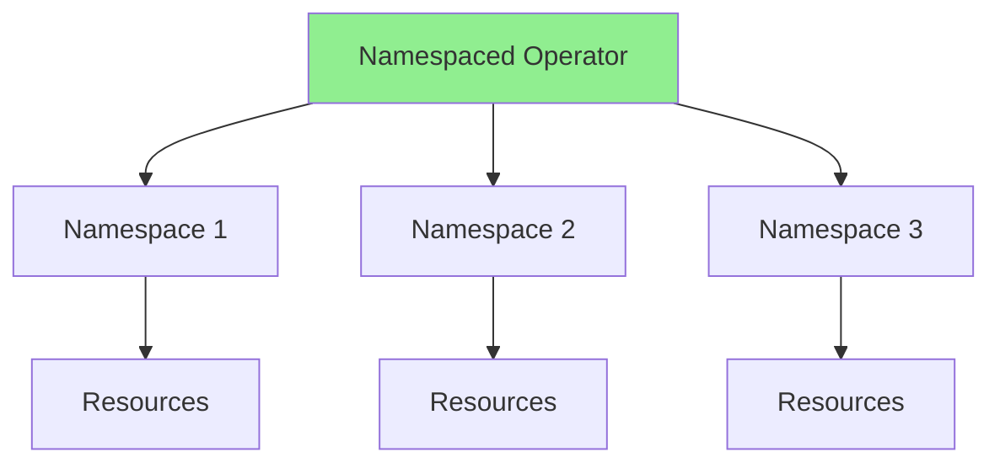
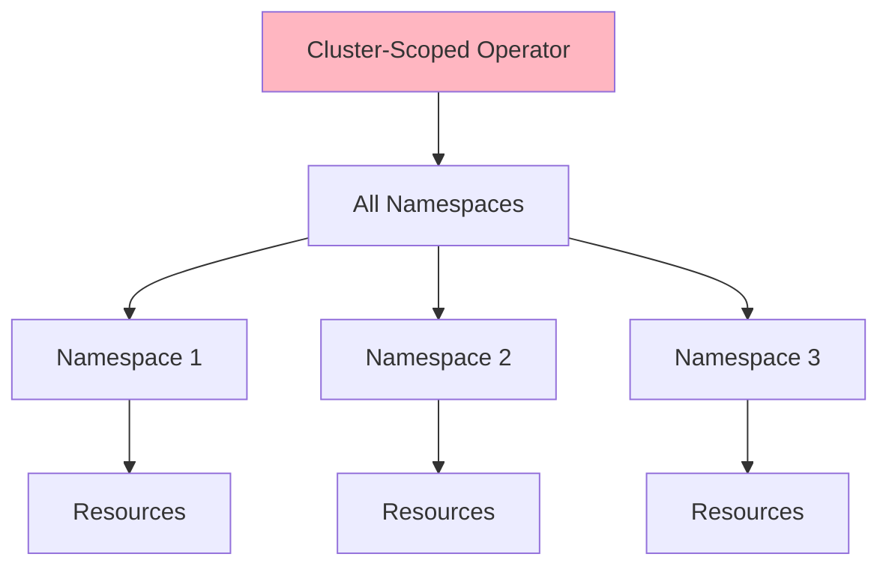
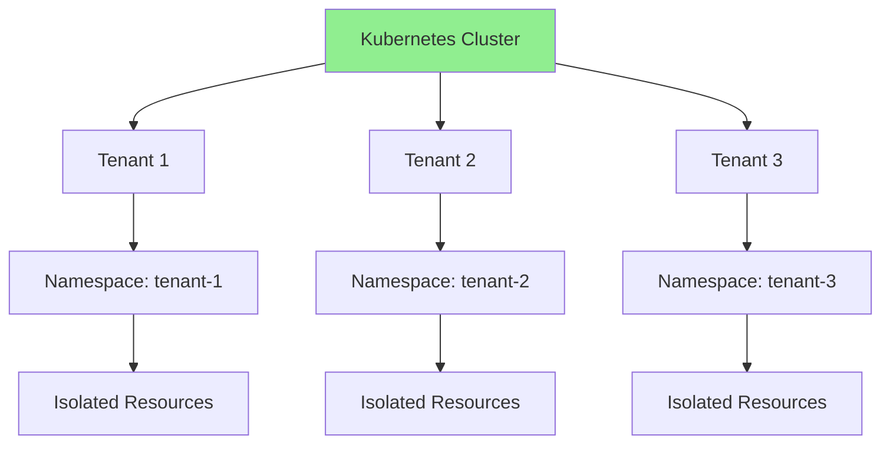
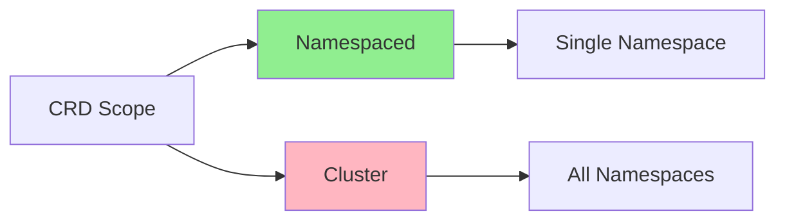
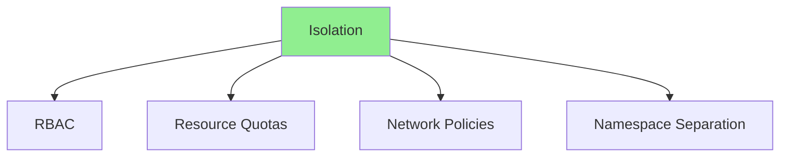

# Lesson 8.1: Multi-Tenancy and Namespace Isolation

**Navigation:** [Module Overview](../README.md) | [Next Lesson: Operator Composition →](02-operator-composition.md)

## Introduction

Production operators often need to support multiple tenants or work across namespaces. This lesson covers cluster-scoped operators, namespace isolation, resource quotas, and multi-tenant patterns that enable operators to manage resources across different namespaces or tenants.

## Cluster-Scoped vs Namespaced Operators

### Namespaced Operators



**Characteristics:**
- Deployed in specific namespace
- Manages resources in that namespace
- One instance per namespace
- Isolated per namespace

### Cluster-Scoped Operators



**Characteristics:**
- Deployed once for entire cluster
- Manages resources across all namespaces
- Single instance for entire cluster
- Can watch all namespaces

## Multi-Tenancy Architecture

### Multi-Tenant Model



## Creating Cluster-Scoped CRDs

### CRD Scope Configuration

```yaml
apiVersion: apiextensions.k8s.io/v1
kind: CustomResourceDefinition
metadata:
  name: databases.database.example.com
spec:
  group: database.example.com
  versions:
  - name: v1
    served: true
    storage: true
  scope: Cluster  # Cluster-scoped instead of Namespaced
  names:
    plural: databases
    singular: database
    kind: Database
```

### Scope Comparison



## Namespace Isolation

### Isolation Strategies



### Resource Quotas

```yaml
apiVersion: v1
kind: ResourceQuota
metadata:
  name: tenant-quota
  namespace: tenant-1
spec:
  hard:
    requests.cpu: "4"
    requests.memory: 8Gi
    limits.cpu: "8"
    limits.memory: 16Gi
    persistentvolumeclaims: "10"
    databases.database.example.com: "5"
```

## Multi-Tenant Operator Patterns

### Pattern 1: Namespace-Based Tenancy

```go
func (r *DatabaseReconciler) Reconcile(ctx context.Context, req ctrl.Request) (ctrl.Result, error) {
    // Get namespace
    namespace := req.Namespace
    
    // Apply tenant-specific logic
    if namespace == "production" {
        // Production tenant logic
    } else if namespace == "development" {
        // Development tenant logic
    }
    
    // ... reconciliation ...
}
```

### Pattern 2: Label-Based Tenancy

```go
// Database with tenant label
db := &databasev1.Database{
    ObjectMeta: metav1.ObjectMeta{
        Labels: map[string]string{
            "tenant": "tenant-1",
        },
    },
}

// Filter by tenant
databases := &databasev1.DatabaseList{}
r.List(ctx, databases, client.MatchingLabels{"tenant": "tenant-1"})
```

## Handling Resource Quotas

### Checking Quotas

```go
func (r *DatabaseReconciler) checkQuota(ctx context.Context, namespace string) error {
    quota := &corev1.ResourceQuota{}
    err := r.Get(ctx, client.ObjectKey{
        Name:      "database-quota",
        Namespace: namespace,
    }, quota)
    
    if errors.IsNotFound(err) {
        // No quota, proceed
        return nil
    }
    
    // Check if quota allows new database
    used := getUsedDatabases(ctx, namespace)
    hard := quota.Spec.Hard["databases.database.example.com"]
    
    if used >= hard {
        return fmt.Errorf("quota exceeded")
    }
    
    return nil
}
```

## Key Takeaways

- **Cluster-scoped operators** manage resources across all namespaces
- **Namespaced operators** manage resources in specific namespace
- **Multi-tenancy** isolates tenants using namespaces
- **Resource quotas** limit tenant resource usage
- **RBAC** enforces namespace isolation
- **Label-based tenancy** provides flexible tenant identification
- **Namespace-based tenancy** uses namespace as tenant boundary

## Understanding for Building Operators

When implementing multi-tenancy:
- Choose appropriate scope (cluster vs namespaced)
- Use namespaces for tenant isolation
- Apply resource quotas per tenant
- Use RBAC for access control
- Consider label-based tenancy for flexibility
- Handle quota limits gracefully

## Related Lab

- [Lab 8.1: Building Multi-Tenant Operator](../labs/lab-01-multi-tenancy.md) - Hands-on exercises for this lesson

## Next Steps

Now that you understand multi-tenancy, let's learn about operator composition.

**Navigation:** [← Module Overview](../README.md) | [Next: Operator Composition →](02-operator-composition.md)

