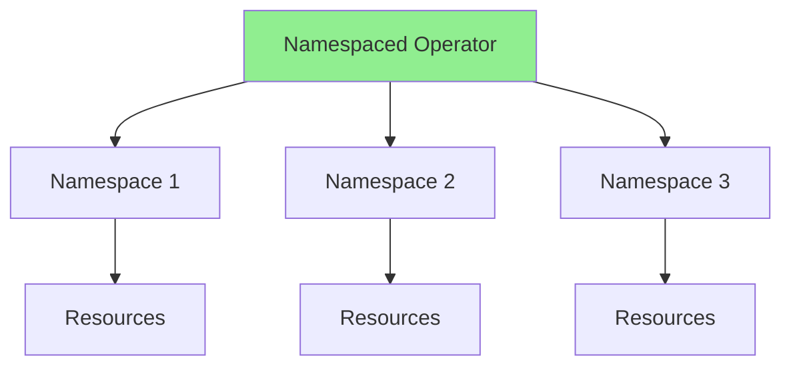
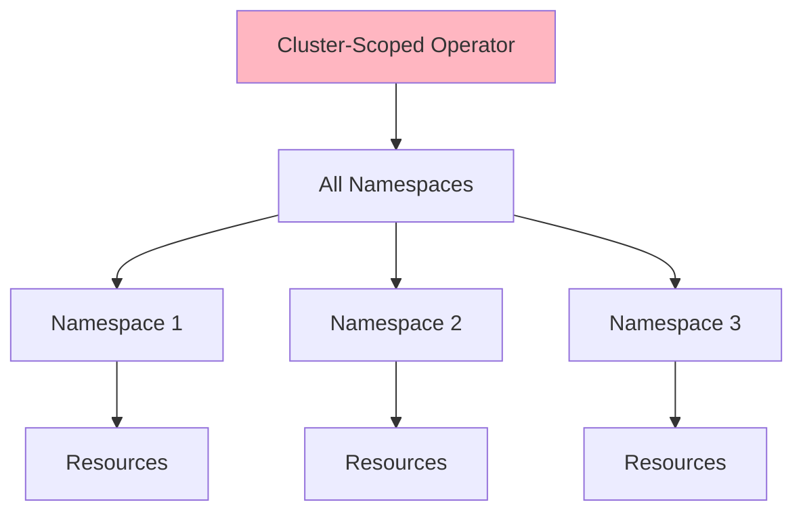
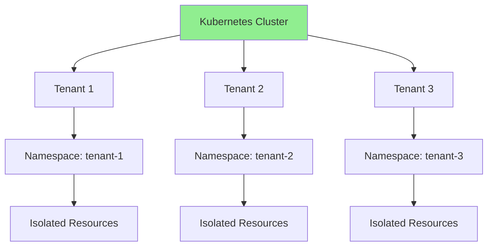
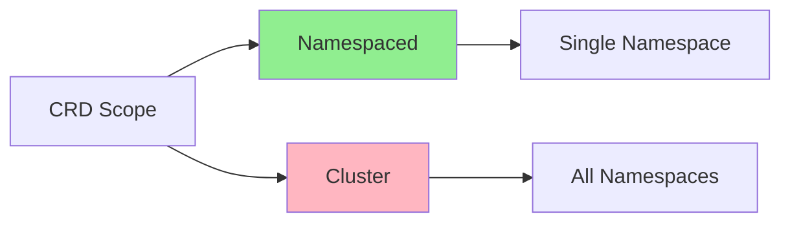
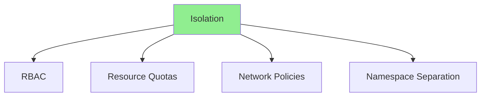

# Lesson 8.1: Multi-Tenancy and Namespace Isolation

**Navigation:** [Module Overview](../README.md) | [Next Lesson: Operator Composition →](02-operator-composition.md)

## Introduction

Production operators often need to support multiple tenants or work across namespaces. This lesson covers cluster-scoped operators, namespace isolation, resource quotas, and multi-tenant patterns that enable operators to manage resources across different namespaces or tenants.

## Theory: Multi-Tenancy

Multi-tenancy enables **isolated resource management** for different users or teams.

### Why Multi-Tenancy?

**Resource Isolation:**
- Separate tenants' resources
- Prevent interference
- Security boundaries
- Compliance requirements

**Resource Sharing:**
- Share cluster infrastructure
- Cost efficiency
- Centralized management
- Scalability

**Access Control:**
- Different permissions per tenant
- RBAC enforcement
- Network isolation
- Resource quotas

### Tenancy Models

**Namespace-Based:**
- Each tenant gets a namespace
- Simple isolation
- Easy to implement
- Kubernetes-native

**Label-Based:**
- Tenants identified by labels
- Flexible grouping
- Cross-namespace tenancy
- More complex

**Cluster-Scoped:**
- Single operator for all tenants
- Centralized management
- Efficient resource usage
- Requires careful isolation

### Isolation Mechanisms

**RBAC:**
- Role-based access control
- Limit tenant permissions
- Enforce boundaries
- Prevent cross-tenant access

**Resource Quotas:**
- Limit tenant resource usage
- Prevent resource exhaustion
- Fair resource distribution
- Cost control

**Network Policies:**
- Network isolation
- Control traffic flow
- Security boundaries
- Tenant isolation

Understanding multi-tenancy helps you build operators that support multiple users securely.

## Cluster-Scoped vs Namespaced Operators

### Namespaced Operators



**Characteristics:**
- Deployed in specific namespace
- Manages resources in that namespace
- One instance per namespace
- Isolated per namespace

### Cluster-Scoped Operators



**Characteristics:**
- Deployed once for entire cluster
- Manages resources across all namespaces
- Single instance for entire cluster
- Can watch all namespaces

## Multi-Tenancy Architecture

### Multi-Tenant Model



## Creating Cluster-Scoped CRDs with Kubebuilder

### Scaffolding a Cluster-Scoped API

Use kubebuilder to create a new cluster-scoped API:

```bash
# Create new cluster-scoped API
kubebuilder create api \
  --group database \
  --version v1 \
  --kind ClusterDatabase \
  --resource --controller
```

### Configuring Cluster Scope

Add the scope marker to your types file:

```go
// +kubebuilder:object:root=true
// +kubebuilder:subresource:status
// +kubebuilder:resource:scope=Cluster

// ClusterDatabase is the Schema for the clusterdatabases API
type ClusterDatabase struct {
    metav1.TypeMeta   `json:",inline"`
    metav1.ObjectMeta `json:"metadata,omitempty"`
    Spec              ClusterDatabaseSpec   `json:"spec,omitempty"`
    Status            ClusterDatabaseStatus `json:"status,omitempty"`
}
```

The key marker is `// +kubebuilder:resource:scope=Cluster`.

### Generating CRDs

```bash
# Generate CRD manifests from markers
make manifests

# The generated CRD will have:
#   scope: Cluster
```

### Scope Comparison



## Designing Cluster-Scoped APIs

### Key Design Consideration: Target Namespace

Cluster-scoped resources don't belong to a namespace, but they often need to create namespaced resources. Include a `targetNamespace` field:

```go
type ClusterDatabaseSpec struct {
    // TargetNamespace is where managed resources will be created
    // +kubebuilder:validation:Required
    TargetNamespace string `json:"targetNamespace"`

    // Tenant identifies which tenant owns this resource
    // +optional
    Tenant string `json:"tenant,omitempty"`

    // ... other fields
}
```

### Ownership Limitations

**Important:** Cluster-scoped resources cannot use `OwnerReferences` to own namespaced resources. Use labels instead:

```go
// Cannot do this for cluster-scoped owner:
// ctrl.SetControllerReference(clusterDatabase, statefulSet, scheme)

// Instead, use labels:
statefulSet.Labels["clusterdatabase"] = clusterDatabase.Name
statefulSet.Labels["tenant"] = clusterDatabase.Spec.Tenant
```

### Cleanup with Finalizers

Since automatic garbage collection doesn't work across scopes, use finalizers:

```go
const clusterDatabaseFinalizer = "database.example.com/finalizer"

func (r *ClusterDatabaseReconciler) Reconcile(ctx context.Context, req ctrl.Request) (ctrl.Result, error) {
    db := &databasev1.ClusterDatabase{}
    if err := r.Get(ctx, req.NamespacedName, db); err != nil {
        return ctrl.Result{}, client.IgnoreNotFound(err)
    }

    // Handle deletion
    if !db.DeletionTimestamp.IsZero() {
        if controllerutil.ContainsFinalizer(db, clusterDatabaseFinalizer) {
            if err := r.cleanupManagedResources(ctx, db); err != nil {
                return ctrl.Result{}, err
            }
            controllerutil.RemoveFinalizer(db, clusterDatabaseFinalizer)
            return ctrl.Result{}, r.Update(ctx, db)
        }
        return ctrl.Result{}, nil
    }

    // Add finalizer
    if !controllerutil.ContainsFinalizer(db, clusterDatabaseFinalizer) {
        controllerutil.AddFinalizer(db, clusterDatabaseFinalizer)
        return ctrl.Result{}, r.Update(ctx, db)
    }

    // ... reconciliation logic
}
```

## Namespace Isolation

### Isolation Strategies



### Resource Quotas

```yaml
apiVersion: v1
kind: ResourceQuota
metadata:
  name: tenant-quota
  namespace: tenant-1
spec:
  hard:
    requests.cpu: "4"
    requests.memory: 8Gi
    limits.cpu: "8"
    limits.memory: 16Gi
    persistentvolumeclaims: "10"
    clusterdatabases.database.example.com: "5"
```

## Multi-Tenant Operator Patterns

### Pattern 1: Namespace-Based Tenancy

Use namespaces as tenant boundaries with namespace-scoped resources:

```go
func (r *DatabaseReconciler) Reconcile(ctx context.Context, req ctrl.Request) (ctrl.Result, error) {
    // Namespace from request identifies the tenant
    namespace := req.Namespace
    
    // Apply tenant-specific logic based on namespace
    if namespace == "production" {
        // Production tenant logic
    } else if namespace == "development" {
        // Development tenant logic
    }
    
    // ... reconciliation ...
}
```

### Pattern 2: Cluster-Scoped with Target Namespace

Use cluster-scoped resources that deploy to specific namespaces:

```go
func (r *ClusterDatabaseReconciler) Reconcile(ctx context.Context, req ctrl.Request) (ctrl.Result, error) {
    db := &databasev1.ClusterDatabase{}
    if err := r.Get(ctx, req.NamespacedName, db); err != nil {
        return ctrl.Result{}, client.IgnoreNotFound(err)
    }

    // Deploy resources to the target namespace
    targetNamespace := db.Spec.TargetNamespace
    tenant := db.Spec.Tenant

    // Create resources in target namespace
    return r.reconcileInNamespace(ctx, db, targetNamespace, tenant)
}
```

### Pattern 3: Label-Based Tenancy

Use labels for flexible tenant identification:

```go
// ClusterDatabase with tenant label
db := &databasev1.ClusterDatabase{
    ObjectMeta: metav1.ObjectMeta{
        Labels: map[string]string{
            "tenant": "tenant-1",
        },
    },
    Spec: databasev1.ClusterDatabaseSpec{
        Tenant: "tenant-1",
    },
}

// Filter by tenant
databases := &databasev1.ClusterDatabaseList{}
r.List(ctx, databases, client.MatchingLabels{"tenant": "tenant-1"})
```

## Handling Resource Quotas

### Checking Quotas in Controller

```go
func (r *ClusterDatabaseReconciler) checkQuota(ctx context.Context, namespace string) error {
    quota := &corev1.ResourceQuota{}
    err := r.Get(ctx, client.ObjectKey{
        Name:      "database-quota",
        Namespace: namespace,
    }, quota)
    
    if errors.IsNotFound(err) {
        // No quota, proceed
        return nil
    }
    if err != nil {
        return err
    }
    
    // Count ClusterDatabases targeting this namespace
    databases := &databasev1.ClusterDatabaseList{}
    if err := r.List(ctx, databases); err != nil {
        return err
    }

    var count int64
    for _, db := range databases.Items {
        if db.Spec.TargetNamespace == namespace {
            count++
        }
    }

    hard := quota.Spec.Hard["clusterdatabases.database.example.com"]
    if count >= hard.Value() {
        return fmt.Errorf("quota exceeded: %d/%d", count, hard.Value())
    }
    
    return nil
}
```

## Both APIs Side by Side

Your operator can manage both namespace-scoped and cluster-scoped resources:

| API | Scope | Use Case |
|-----|-------|----------|
| `Database` | Namespaced | Team-level database management |
| `ClusterDatabase` | Cluster | Platform-level multi-tenant management |

```bash
# List namespace-scoped databases
kubectl get databases -n my-namespace

# List cluster-scoped databases
kubectl get clusterdatabases
```

## Key Takeaways

- **Use kubebuilder to scaffold cluster-scoped APIs** - `kubebuilder create api` + `scope=Cluster` marker
- **Cluster-scoped operators** manage resources across all namespaces
- **Namespaced operators** manage resources in specific namespace
- **Cluster-scoped resources need targetNamespace** for creating namespaced resources
- **Cannot use OwnerReferences across scopes** - use labels and finalizers
- **Resource quotas** limit tenant resource usage
- **RBAC** enforces namespace isolation
- **Both API types can coexist** in the same operator

## Understanding for Building Operators

When implementing multi-tenancy:
- Choose appropriate scope (cluster vs namespaced)
- Use kubebuilder to scaffold new APIs
- Add `targetNamespace` field for cluster-scoped resources
- Use labels instead of OwnerReferences for cross-scope ownership
- Implement finalizers for cleanup
- Apply resource quotas per tenant
- Use RBAC for access control

## Related Lab

- [Lab 8.1: Building Multi-Tenant Operator](../labs/lab-01-multi-tenancy.md) - Hands-on exercises for this lesson

## References

### Official Documentation
- [Namespaces](https://kubernetes.io/docs/concepts/overview/working-with-objects/namespaces/)
- [Resource Quotas](https://kubernetes.io/docs/concepts/policy/resource-quotas/)
- [Cluster-Scoped Resources](https://kubernetes.io/docs/concepts/overview/working-with-objects/namespaces/#not-all-objects-are-in-a-namespace)
- [Kubebuilder Markers](https://book.kubebuilder.io/reference/markers/crd.html)

### Further Reading
- **Kubernetes: Up and Running** by Kelsey Hightower, Brendan Burns, and Joe Beda - Chapter 13: ConfigMaps and Secrets (multi-tenancy concepts)
- **Kubernetes Security** by Andrew Martin and Michael Hausenblas - Multi-tenancy patterns
- [Kubernetes Multi-Tenancy](https://kubernetes.io/docs/concepts/security/multi-tenancy/)

### Related Topics
- [Namespace Best Practices](https://kubernetes.io/docs/concepts/overview/working-with-objects/namespaces/#working-with-namespaces)
- [Resource Quota Design](https://kubernetes.io/docs/concepts/policy/resource-quotas/#quota-scopes)
- [Network Policies for Isolation](https://kubernetes.io/docs/concepts/services-networking/network-policies/)

## Next Steps

Now that you understand multi-tenancy, let's learn about operator composition.

**Navigation:** [← Module Overview](../README.md) | [Next: Operator Composition →](02-operator-composition.md)
