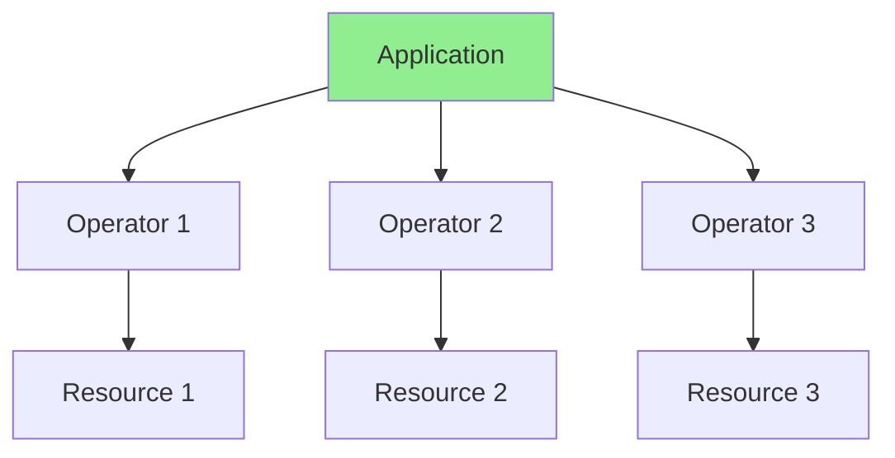
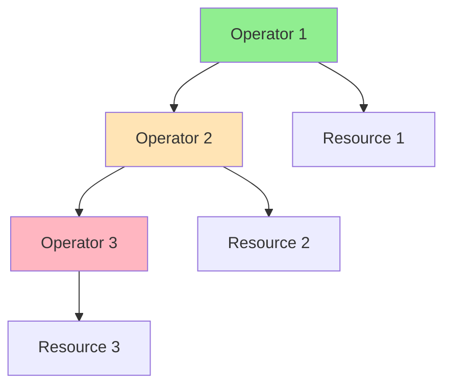
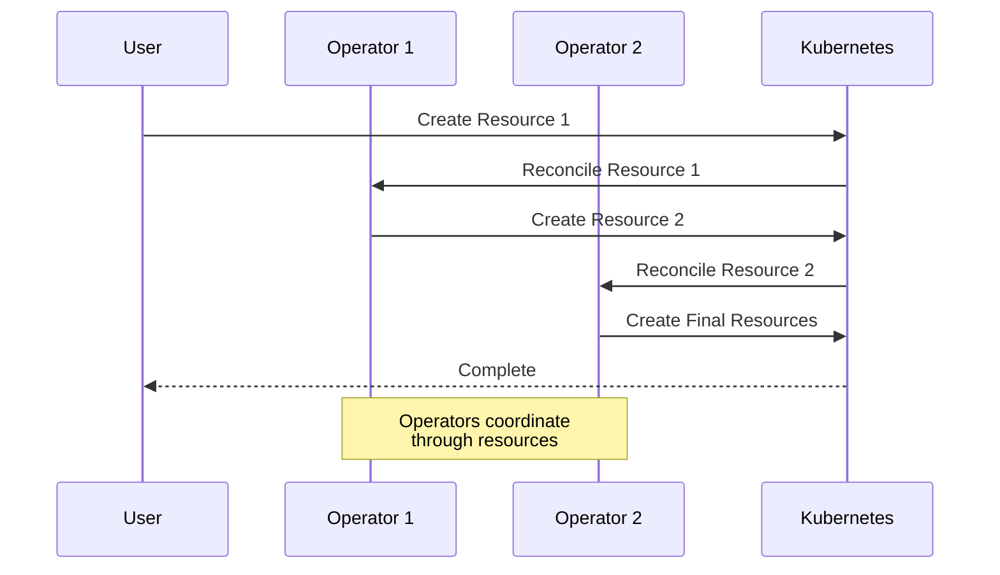
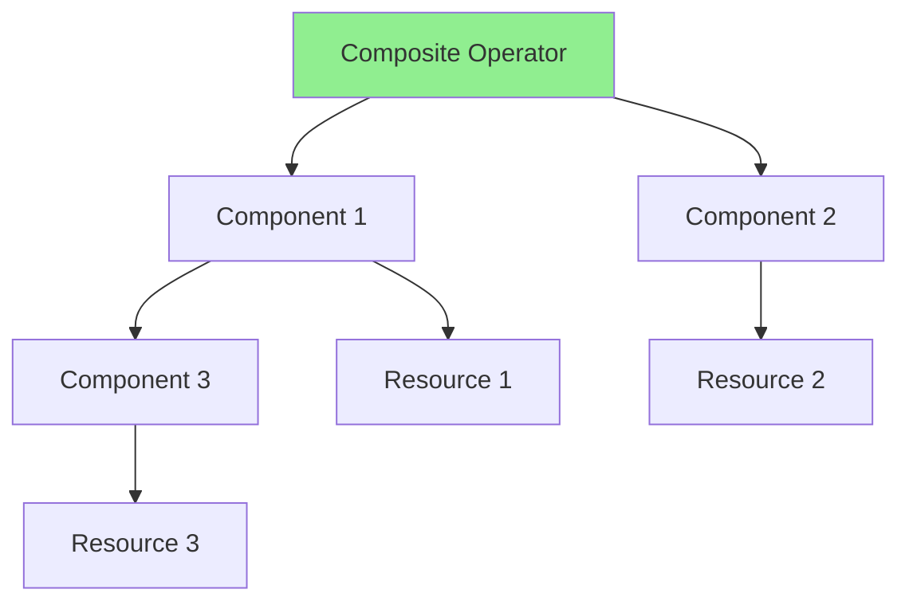

# Lesson 8.2: Operator Composition

**Navigation:** [← Previous: Multi-Tenancy](01-multi-tenancy.md) | [Module Overview](../README.md) | [Next: Stateful Applications →](03-stateful-applications.md)

## Introduction

Real-world applications often require multiple operators working together. This lesson covers operator composition patterns, dependency management, coordination strategies, and how to build operators that work well with others.

## Operator Composition Patterns

### Pattern 1: Independent Operators



**Characteristics:**
- Operators work independently
- No direct dependencies
- Each manages its own resources

### Pattern 2: Dependent Operators



**Characteristics:**
- Operators depend on each other
- Order matters
- Coordination needed

## Dependency Management

### Dependency Flow



### Managing Dependencies

```go
// Operator 1 creates resource that Operator 2 watches
func (r *DatabaseReconciler) Reconcile(ctx context.Context, req ctrl.Request) (ctrl.Result, error) {
    // Create Database
    db := &databasev1.Database{...}
    r.Create(ctx, db)
    
    // Create Backup resource (watched by Backup Operator)
    backup := &backupv1.Backup{
        ObjectMeta: metav1.ObjectMeta{
            Name:      db.Name + "-backup",
            Namespace: db.Namespace,
        },
        Spec: backupv1.BackupSpec{
            DatabaseRef: db.Name,
        },
    }
    r.Create(ctx, backup)
    
    // Backup Operator will reconcile backup
}
```

## Coordination Strategies

### Strategy 1: Resource References

```go
// Database references Backup
type DatabaseSpec struct {
    BackupRef *corev1.LocalObjectReference `json:"backupRef,omitempty"`
}

// Operator checks if backup exists
func (r *DatabaseReconciler) checkBackup(ctx context.Context, db *databasev1.Database) error {
    if db.Spec.BackupRef == nil {
        return nil
    }
    
    backup := &backupv1.Backup{}
    err := r.Get(ctx, client.ObjectKey{
        Name:      db.Spec.BackupRef.Name,
        Namespace: db.Namespace,
    }, backup)
    
    if errors.IsNotFound(err) {
        return fmt.Errorf("backup %s not found", db.Spec.BackupRef.Name)
    }
    
    // Wait for backup to be ready
    if backup.Status.Phase != "Ready" {
        return fmt.Errorf("backup not ready")
    }
    
    return nil
}
```

### Strategy 2: Status Conditions

```go
// Operator 1 sets condition
meta.SetStatusCondition(&db.Status.Conditions, metav1.Condition{
    Type:    "BackupReady",
    Status:  metav1.ConditionTrue,
    Reason:  "BackupCompleted",
    Message: "Backup is ready",
})

// Operator 2 checks condition
backupReady := meta.FindStatusCondition(db.Status.Conditions, "BackupReady")
if backupReady == nil || backupReady.Status != metav1.ConditionTrue {
    // Wait for backup
    return ctrl.Result{RequeueAfter: 10 * time.Second}, nil
}
```

### Strategy 3: Events

```go
// Operator 1 emits event
r.Recorder.Event(db, "Normal", "BackupCreated", "Backup created successfully")

// Operator 2 watches for events
// Can react to events from other operators
```

## Composite Operator Pattern

### Composite Operator Flow



### Example: Database with Backup

```go
type DatabaseReconciler struct {
    client.Client
    Scheme *runtime.Scheme
    BackupReconciler *BackupReconciler
}

func (r *DatabaseReconciler) Reconcile(ctx context.Context, req ctrl.Request) (ctrl.Result, error) {
    // Reconcile Database
    if err := r.reconcileDatabase(ctx, req); err != nil {
        return ctrl.Result{}, err
    }
    
    // Reconcile Backup (component)
    if err := r.BackupReconciler.Reconcile(ctx, req); err != nil {
        return ctrl.Result{}, err
    }
    
    return ctrl.Result{}, nil
}
```

## Key Takeaways

- **Operator composition** enables complex applications
- **Independent operators** work separately
- **Dependent operators** require coordination
- **Resource references** link operators
- **Status conditions** coordinate state
- **Events** enable communication
- **Composite operators** combine multiple components

## Understanding for Building Operators

When composing operators:
- Design for independence when possible
- Use resource references for dependencies
- Coordinate through status conditions
- Emit events for coordination
- Handle dependency failures gracefully
- Document dependencies clearly

## Related Lab

- [Lab 8.2: Composing Operators](../labs/lab-02-operator-composition.md) - Hands-on exercises for this lesson

## Next Steps

Now that you understand operator composition, let's learn about managing stateful applications.

**Navigation:** [← Previous: Multi-Tenancy](01-multi-tenancy.md) | [Module Overview](../README.md) | [Next: Stateful Applications →](03-stateful-applications.md)

