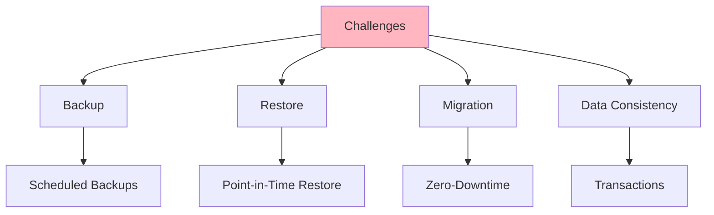
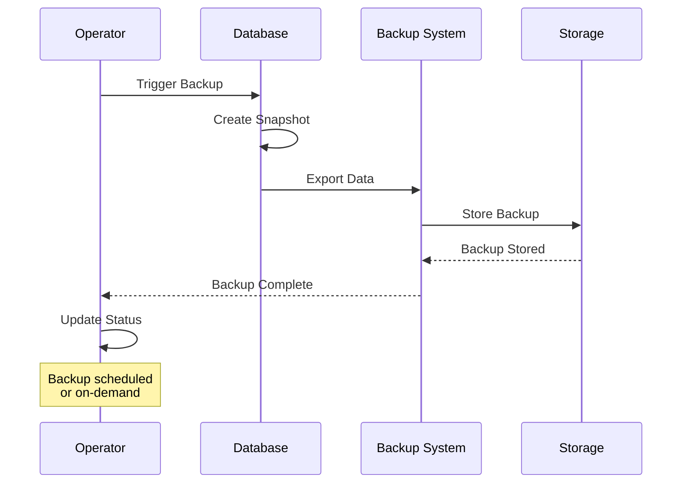
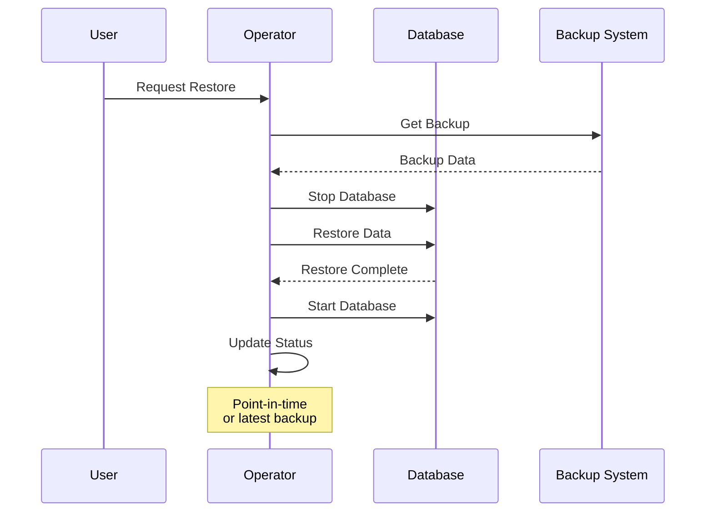
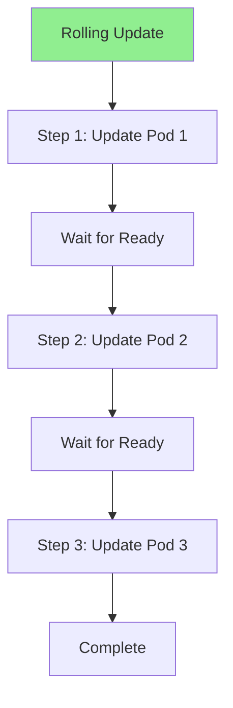
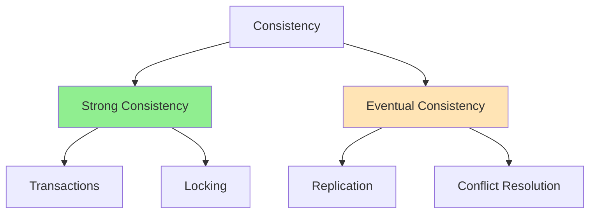

# Lesson 8.3: Stateful Application Management

**Navigation:** [← Previous: Operator Composition](02-operator-composition.md) | [Module Overview](../README.md) | [Next: Real-World Patterns →](04-real-world-patterns.md)

## Introduction

Stateful applications require special handling: backups, restores, migrations, and data consistency. This lesson covers patterns for managing stateful applications in operators, including backup/restore, rolling updates, and ensuring data consistency.

## Theory: Stateful Application Management

Stateful applications have **persistent data** that must be managed carefully.

### Why Stateful Applications Are Complex

**Data Persistence:**
- Data must survive pod restarts
- Data must be backed up
- Data must be restored
- Data consistency is critical

**Lifecycle Management:**
- Complex deployment procedures
- Ordered pod creation/deletion
- StatefulSet requirements
- Rolling update challenges

**Data Operations:**
- Backup and restore
- Data migration
- Version upgrades
- Disaster recovery

### StatefulSet Characteristics

**Pod Identity:**
- Stable network identity
- Stable storage
- Ordered creation/deletion
- Predictable naming

**Storage:**
- Persistent volumes
- Pod-specific storage
- Data survives pod restarts
- Storage class management

**Ordering:**
- Pods created in order
- Pods deleted in reverse order
- Enables initialization
- Supports stateful workloads

### Backup and Restore

**Backup Strategy:**
- Regular backups
- Point-in-time backups
- Incremental backups
- Backup validation

**Restore Strategy:**
- Restore from backup
- Point-in-time restore
- Data validation
- Rollback capability

**Consistency:**
- Ensure data consistency
- Transactional operations
- Quiesce before backup
- Verify after restore

Understanding stateful applications helps you build operators that manage data reliably.

## Stateful Application Challenges

### Key Challenges



## Backup and Restore Patterns

### Backup Flow



### Implementing Backups

```go
type BackupSpec struct {
    DatabaseRef corev1.LocalObjectReference `json:"databaseRef"`
    Schedule    string                      `json:"schedule,omitempty"` // Cron format
    Retention   int                         `json:"retention,omitempty"` // Days
}

type BackupStatus struct {
    Phase          string    `json:"phase,omitempty"`
    BackupTime     time.Time `json:"backupTime,omitempty"`
    BackupLocation string    `json:"backupLocation,omitempty"`
    Size           string    `json:"size,omitempty"`
}

func (r *BackupReconciler) Reconcile(ctx context.Context, req ctrl.Request) (ctrl.Result, error) {
    backup := &backupv1.Backup{}
    if err := r.Get(ctx, req.NamespacedName, backup); err != nil {
        return ctrl.Result{}, err
    }
    
    // Get Database
    db := &databasev1.Database{}
    err := r.Get(ctx, client.ObjectKey{
        Name:      backup.Spec.DatabaseRef.Name,
        Namespace: backup.Namespace,
    }, db)
    
    if err != nil {
        return ctrl.Result{}, err
    }
    
    // Perform backup
    if err := r.performBackup(ctx, db, backup); err != nil {
        backup.Status.Phase = "Failed"
        r.Status().Update(ctx, backup)
        return ctrl.Result{}, err
    }
    
    backup.Status.Phase = "Completed"
    backup.Status.BackupTime = metav1.Now()
    backup.Status.BackupLocation = r.getBackupLocation(backup)
    
    return ctrl.Result{}, r.Status().Update(ctx, backup)
}
```

## Restore Patterns

### Restore Flow



### Implementing Restores

```go
type RestoreSpec struct {
    BackupRef corev1.LocalObjectReference `json:"backupRef"`
    DatabaseRef corev1.LocalObjectReference `json:"databaseRef"`
    PointInTime *time.Time `json:"pointInTime,omitempty"`
}

func (r *RestoreReconciler) Reconcile(ctx context.Context, req ctrl.Request) (ctrl.Result, error) {
    restore := &restorev1.Restore{}
    if err := r.Get(ctx, req.NamespacedName, restore); err != nil {
        return ctrl.Result{}, err
    }
    
    // Get Backup
    backup := &backupv1.Backup{}
    err := r.Get(ctx, client.ObjectKey{
        Name:      restore.Spec.BackupRef.Name,
        Namespace: restore.Namespace,
    }, backup)
    
    if err != nil {
        return ctrl.Result{}, err
    }
    
    // Get Database
    db := &databasev1.Database{}
    err = r.Get(ctx, client.ObjectKey{
        Name:      restore.Spec.DatabaseRef.Name,
        Namespace: restore.Namespace,
    }, db)
    
    // Perform restore
    if err := r.performRestore(ctx, db, backup, restore); err != nil {
        restore.Status.Phase = "Failed"
        r.Status().Update(ctx, restore)
        return ctrl.Result{}, err
    }
    
    restore.Status.Phase = "Completed"
    restore.Status.RestoreTime = metav1.Now()
    
    return ctrl.Result{}, r.Status().Update(ctx, restore)
}
```

## Rolling Updates

### Rolling Update Strategy



### Managing Rolling Updates

```go
func (r *DatabaseReconciler) updateStatefulSet(ctx context.Context, db *databasev1.Database) error {
    statefulSet := &appsv1.StatefulSet{}
    err := r.Get(ctx, client.ObjectKey{
        Name:      db.Name,
        Namespace: db.Namespace,
    }, statefulSet)
    
    if err != nil {
        return err
    }
    
    // Check if update needed
    desiredImage := db.Spec.Image
    currentImage := statefulSet.Spec.Template.Spec.Containers[0].Image
    
    if desiredImage != currentImage {
        // Update image
        statefulSet.Spec.Template.Spec.Containers[0].Image = desiredImage
        
        // StatefulSet will perform rolling update automatically
        if err := r.Update(ctx, statefulSet); err != nil {
            return err
        }
        
        // Wait for update to complete
        return r.waitForRollingUpdate(ctx, statefulSet)
    }
    
    return nil
}

func (r *DatabaseReconciler) waitForRollingUpdate(ctx context.Context, ss *appsv1.StatefulSet) error {
    // Wait for all pods to be updated
    return wait.PollImmediate(5*time.Second, 5*time.Minute, func() (bool, error) {
        err := r.Get(ctx, client.ObjectKeyFromObject(ss), ss)
        if err != nil {
            return false, err
        }
        
        // Check if update complete
        return ss.Status.UpdatedReplicas == *ss.Spec.Replicas, nil
    })
}
```

## Data Consistency

### Consistency Guarantees



### Ensuring Consistency

```go
func (r *DatabaseReconciler) ensureDataConsistency(ctx context.Context, db *databasev1.Database) error {
    // For StatefulSets, consistency is handled by:
    // 1. Ordered pod creation
    // 2. Persistent volumes
    // 3. Pod identity
    
    // Check if all replicas are in sync
    statefulSet := &appsv1.StatefulSet{}
    err := r.Get(ctx, client.ObjectKey{
        Name:      db.Name,
        Namespace: db.Namespace,
    }, statefulSet)
    
    if err != nil {
        return err
    }
    
    // Verify all replicas are ready and consistent
    if statefulSet.Status.ReadyReplicas != *statefulSet.Spec.Replicas {
        return fmt.Errorf("not all replicas ready")
    }
    
    // Perform consistency check
    return r.performConsistencyCheck(ctx, db)
}
```

## Key Takeaways

- **Backups** protect data from loss
- **Restores** recover from backups
- **Rolling updates** update without downtime
- **Data consistency** ensures correctness
- **StatefulSets** provide ordered, stable pods
- **Persistent volumes** maintain data
- **Point-in-time restore** recovers to specific time

## Understanding for Building Operators

When managing stateful applications:
- Implement backup functionality
- Support restore operations
- Handle rolling updates carefully
- Ensure data consistency
- Use StatefulSets for stateful workloads
- Leverage persistent volumes
- Test backup/restore scenarios

## Related Lab

- [Lab 8.3: Managing Stateful Applications](../labs/lab-03-stateful-applications.md) - Hands-on exercises for this lesson

## References

### Official Documentation
- [StatefulSets](https://kubernetes.io/docs/concepts/workloads/controllers/statefulset/)
- [Persistent Volumes](https://kubernetes.io/docs/concepts/storage/persistent-volumes/)
- [Volume Snapshots](https://kubernetes.io/docs/concepts/storage/volume-snapshots/)

### Further Reading
- **Kubernetes: Up and Running** by Kelsey Hightower, Brendan Burns, and Joe Beda - Chapter 7: StatefulSets
- **Kubernetes Operators** by Jason Dobies and Joshua Wood - Chapter 17: Stateful Applications
- [StatefulSet Patterns](https://kubernetes.io/docs/tutorials/stateful-application/)

### Related Topics
- [StatefulSet Best Practices](https://kubernetes.io/docs/concepts/workloads/controllers/statefulset/#limitations)
- [Persistent Volume Claims](https://kubernetes.io/docs/concepts/storage/persistent-volumes/)
- [Data Backup Strategies](https://kubernetes.io/docs/concepts/storage/volume-snapshots/)

## Next Steps

Now that you understand stateful applications, let's learn about real-world patterns and best practices.

**Navigation:** [← Previous: Operator Composition](02-operator-composition.md) | [Module Overview](../README.md) | [Next: Real-World Patterns →](04-real-world-patterns.md)
