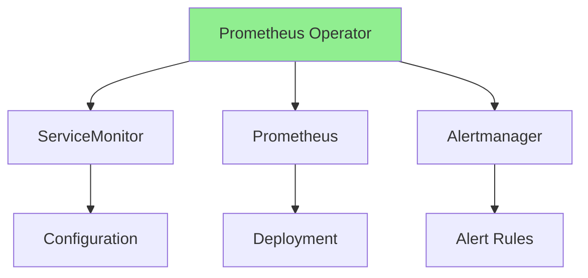
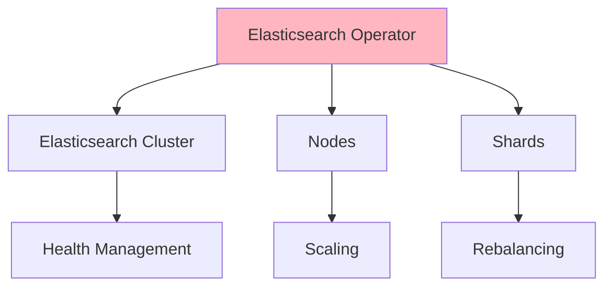
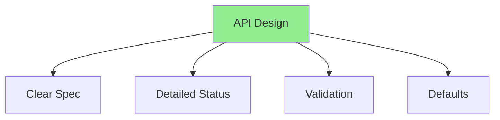
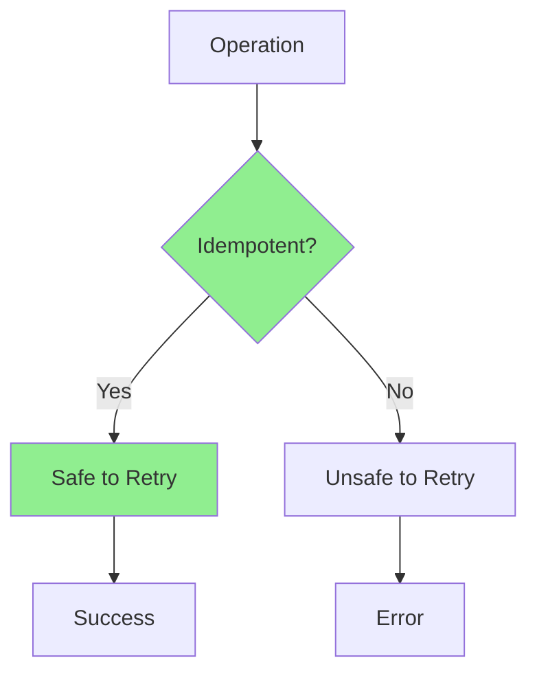
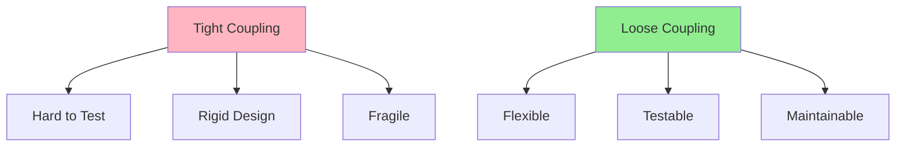
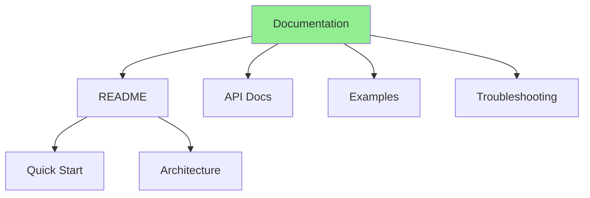
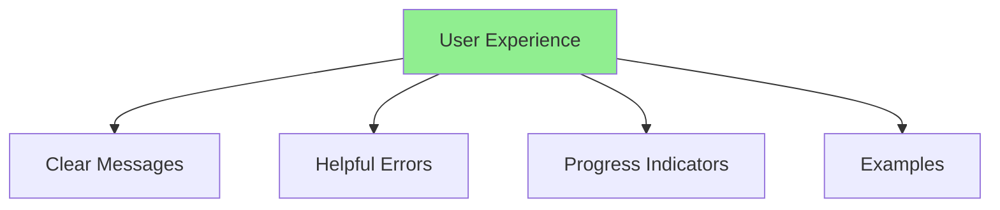

# Lesson 8.4: Real-World Patterns and Best Practices

**Navigation:** [← Previous: Stateful Applications](03-stateful-applications.md) | [Module Overview](../README.md)

## Introduction

This final lesson examines real-world operator patterns by analyzing popular operators, identifying best practices, and learning from common anti-patterns. You'll understand how production operators are built and what makes them successful.

## Popular Operator Patterns

### Prometheus Operator Pattern



**Key Patterns:**
- Declarative configuration
- Service discovery
- Multi-resource management
- Configuration validation

### Elasticsearch Operator Pattern



**Key Patterns:**
- Cluster management
- Node lifecycle
- Data sharding
- Health monitoring

## Best Practices

### Practice 1: Clear API Design



**Guidelines:**
- Use clear, descriptive field names
- Provide sensible defaults
- Validate at API level
- Document all fields

### Practice 2: Comprehensive Status

```go
type DatabaseStatus struct {
    // Conditions for state tracking
    Conditions []metav1.Condition `json:"conditions,omitempty"`
    
    // Phase for simple state
    Phase string `json:"phase,omitempty"`
    
    // Detailed status
    ReadyReplicas int32  `json:"readyReplicas,omitempty"`
    TotalReplicas int32  `json:"totalReplicas,omitempty"`
    Endpoint      string `json:"endpoint,omitempty"`
    
    // Observed generation
    ObservedGeneration int64 `json:"observedGeneration,omitempty"`
}
```

### Practice 3: Idempotent Operations



**All operations must be idempotent:**
- Creating resources: check if exists first
- Updating resources: compare before update
- Deleting resources: handle not found gracefully

## Common Anti-Patterns

### Anti-Pattern 1: Tight Coupling



**Avoid:**
- Hard-coded dependencies
- Direct API calls to external services
- Tight coupling between components

### Anti-Pattern 2: Ignoring Errors

```go
// BAD: Ignoring errors
r.Create(ctx, resource)  // Error ignored!

// GOOD: Handle errors
if err := r.Create(ctx, resource); err != nil {
    if !errors.IsAlreadyExists(err) {
        return ctrl.Result{}, err
    }
}
```

### Anti-Pattern 3: Blocking Operations

```go
// BAD: Blocking operation
time.Sleep(5 * time.Minute)

// GOOD: Requeue with delay
return ctrl.Result{RequeueAfter: 5 * time.Minute}, nil
```

## Documentation Best Practices

### Documentation Structure



### Essential Documentation

1. **README.md**
   - Quick start guide
   - Architecture overview
   - Installation instructions

2. **API Documentation**
   - Field descriptions
   - Example resources
   - Validation rules

3. **Examples**
   - Common use cases
   - Advanced scenarios
   - Best practices

4. **Troubleshooting**
   - Common issues
   - Debugging guides
   - FAQ

## User Experience

### UX Principles



### Error Messages

```go
// BAD: Generic error
return fmt.Errorf("error")

// GOOD: Specific, actionable error
return fmt.Errorf("spec.storage.size: must be >= 10Gi for replicas > 5, got %s", db.Spec.Storage.Size)
```

## Key Takeaways

- **Study popular operators** to learn patterns
- **Follow best practices** for maintainability
- **Avoid anti-patterns** that cause issues
- **Document thoroughly** for users
- **Design for UX** with clear messages
- **Make operations idempotent** for reliability
- **Provide comprehensive status** for observability
- **Test thoroughly** before release

## Understanding for Building Operators

When building production operators:
- Study successful operators
- Follow established patterns
- Avoid common anti-patterns
- Document comprehensively
- Focus on user experience
- Make everything idempotent
- Provide detailed status
- Test all scenarios

## Related Lab

- [Lab 8.4: Final Project](../labs/lab-04-final-project.md) - Build a complete operator

## Next Steps

Congratulations! You've completed the entire course! You now have the knowledge and skills to build production-ready Kubernetes operators.

**Navigation:** [← Previous: Stateful Applications](03-stateful-applications.md) | [Module Overview](../README.md) | [Course Overview](../../README.md)

