# Course Modules
{: .fs-9 }

The course is divided into 8 modules, each building on the previous.
{: .fs-6 .fw-300 }

---

## Module Overview

| Module | Topic | Duration |
|:-------|:------|:---------|
| [Module 1]({{ site.baseurl }}/module-01/) | Kubernetes Architecture Deep Dive | 5-6 hours |
| [Module 2]({{ site.baseurl }}/module-02/) | Introduction to Operators | 5-6 hours |
| [Module 3]({{ site.baseurl }}/module-03/) | Building Custom Controllers | 6-7 hours |
| [Module 4]({{ site.baseurl }}/module-04/) | Advanced Reconciliation Patterns | 6-7 hours |
| [Module 5]({{ site.baseurl }}/module-05/) | Webhooks and Admission Control | 6-7 hours |
| [Module 6]({{ site.baseurl }}/module-06/) | Testing and Debugging | 5-6 hours |
| [Module 7]({{ site.baseurl }}/module-07/) | Production Considerations | 5-6 hours |
| [Module 8]({{ site.baseurl }}/module-08/) | Advanced Topics and Real-World Patterns | 5-6 hours |

---

## Learning Path

```mermaid
graph LR
    M1[Module 1<br/>Architecture] --> M2[Module 2<br/>Operators Intro]
    M2 --> M3[Module 3<br/>Controllers]
    M3 --> M4[Module 4<br/>Advanced Patterns]
    M4 --> M5[Module 5<br/>Webhooks]
    M5 --> M6[Module 6<br/>Testing]
    M6 --> M7[Module 7<br/>Production]
    M7 --> M8[Module 8<br/>Advanced Topics]
    
    style M1 fill:#dbeafe,stroke:#2563eb,color:#1e40af
    style M2 fill:#dbeafe,stroke:#2563eb,color:#1e40af
    style M3 fill:#dbeafe,stroke:#2563eb,color:#1e40af
    style M4 fill:#dbeafe,stroke:#2563eb,color:#1e40af
    style M5 fill:#dbeafe,stroke:#2563eb,color:#1e40af
    style M6 fill:#dbeafe,stroke:#2563eb,color:#1e40af
    style M7 fill:#dbeafe,stroke:#2563eb,color:#1e40af
    style M8 fill:#dbeafe,stroke:#2563eb,color:#1e40af
```

---

## Module Details

### [Module 1: Kubernetes Architecture Deep Dive]({{ site.baseurl }}/module-01/)

Understand how Kubernetes works under the hood.

- Control plane components and their interactions
- API machinery and how it operates
- The controller pattern and reconciliation loops
- Custom Resource Definitions (CRDs)

---

### [Module 2: Introduction to Operators]({{ site.baseurl }}/module-02/)

Learn the operator pattern and build your first operator.

- What operators are and when to use them
- Kubebuilder fundamentals
- Setting up your development environment
- Building your first operator

---

### [Module 3: Building Custom Controllers]({{ site.baseurl }}/module-03/)

Master the controller-runtime library.

- Controller runtime deep dive
- Designing your API
- Reconciliation logic
- Client-go operations

---

### [Module 4: Advanced Reconciliation Patterns]({{ site.baseurl }}/module-04/)

Handle complex scenarios with advanced patterns.

- Conditions and status management
- Finalizers and cleanup
- Watching and indexing
- State machines and advanced patterns

---

### [Module 5: Webhooks and Admission Control]({{ site.baseurl }}/module-05/)

Implement admission and conversion webhooks.

- Admission control fundamentals
- Validating webhooks
- Mutating webhooks
- Webhook deployment
- Conversion webhooks for API versioning

---

### [Module 6: Testing and Debugging]({{ site.baseurl }}/module-06/)

Test and debug your operators.

- Testing fundamentals
- Unit testing with envtest
- Integration testing
- Debugging and observability

---

### [Module 7: Production Considerations]({{ site.baseurl }}/module-07/)

Prepare your operator for production.

- Packaging and distribution
- RBAC and security
- High availability
- Performance and scalability

---

### [Module 8: Advanced Topics and Real-World Patterns]({{ site.baseurl }}/module-08/)

Master advanced operator patterns.

- Multi-tenancy and namespace isolation
- Operator composition
- Stateful application management
- Real-world patterns and best practices

---

{: .note }
Each module includes lessons, hands-on labs, and complete solutions.

